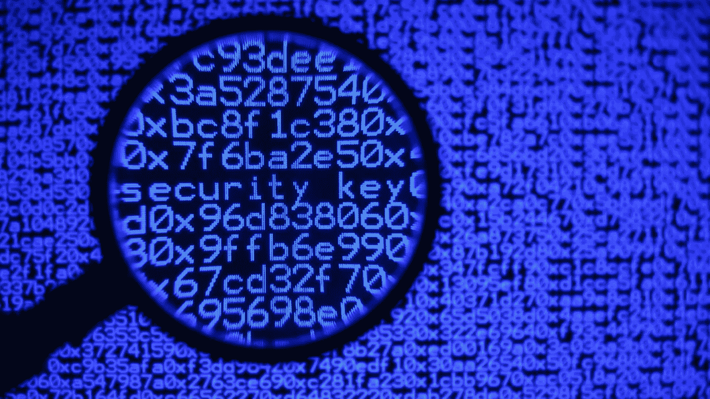
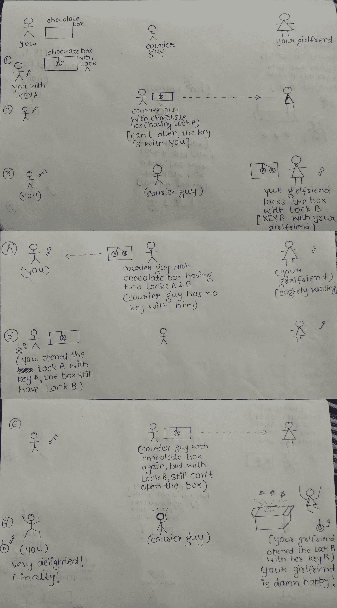

# 借助巧克力盒子解释不对称加密。

> 原文：<https://medium.com/hackernoon/asymmetric-encryption-explained-using-chocolate-boxes-5a329ea6813e>

> 今天是你女朋友的生日，你想送她一些特别的东西，你特意为她买了一些精美罕见的巧克力。因为她住在另一个城市，你需要把它们包起来(这些巧克力不会融化，这就是它们有趣的地方)。只有一家包裹公司，你不能把这么特殊的礼物托付给他们。你能做什么？

老实说，你没有太多的选择去探索 T2。快想想，时间不多了。你想到的第一个选择是-

> 你自己去送吧。

不，这次不行。如果这是我们得到的选择，那么我将写完这篇文章。接下来你能想到什么？

> 把巧克力放在盒子里，锁好盒子，包好。

似乎是合法的，但你的女朋友没有钥匙，显然你不能只是包裹的钥匙。你还能想到什么？

我现在要建议的解决方案需要你和你的女朋友在同一个巧克力盒子里来回数圈。让我们马上找到解决方案，不要浪费太多时间，因为现在“时间是最重要的”(你不能让你的女朋友等着)。

1.  你把巧克力放在一个盒子里，用锁 a 锁上盒子。
2.  你要把钥匙 A 带在身边。
3.  通过快递公司把盒子包好。(箱子被锁 A 锁住，打开箱子的钥匙，即钥匙 A 只在你身上)。
4.  盒子到了你女朋友手里(她激动了！)
5.  你打电话给你女朋友，让她用自己的锁把箱子锁上。
6.  她用锁 b 锁上了箱子。
7.  她随身带着钥匙 B。
8.  这个箱子现在已经由同一家快递公司包裹给你了。
9.  箱子目前有两把锁(锁 A 和锁 B)，快递公司无法打开它们，因为他们没有任何钥匙。
10.  盒子到了你手里，你用钥匙 A 打开了锁 A。盒子上仍然有锁 B(锁 B 的钥匙 B 在你的女朋友那里，这个世界上没有其他人)。
11.  你又把盒子打包还给你的女朋友(记住，盒子是用锁 B 锁着的，打开盒子的钥匙，即钥匙 B，只能由你的女朋友使用)。
12.  箱子到达你的女朋友那里，里面只有一把锁，即锁 b。
13.  你女朋友用钥匙 b 打开了盒子。
14.  Tada！她可以享受所有的巧克力，并偷偷送你吻！
15.  快递男孩被留下挠头。

Explaining the concept with the help of a flow diagram (apologies for the messy parts).

# **继续一些严肃的话题**

加密和上面的例子没什么区别，其实我刚才解释的是对**非对称加密**技术的类比。正如 [https://crptography.io](https://crptography.io) 解释的那样-

> 非对称加密是密码学的一个分支，其中密钥可以分为两部分，一个[公钥](https://cryptography.io/en/latest/glossary/#term-public-key)和一个[私钥](https://cryptography.io/en/latest/glossary/#term-private-key)。公钥可以给任何人，信任与否，而私钥必须保密。

让我们试着用通俗的语言解释一下-

1.  你和你女朋友都有自己的私钥(KEY A & KEY B)。
2.  你和你的女朋友都没有通过任何媒介交换过那些钥匙。
3.  你用自己的私钥 A 保护了数据，你的女朋友用她的私钥 b 做了同样的事情。
4.  你通过不可信的渠道(快递员)发送数据。
5.  窃听者弄不清数据(它总是用锁 A/锁 B/两者来保护)。
6.  目标接收者最终得到了数据。

这就是加密的本质。上面的例子或多或少解释了这一点。

# **不对称加密中到底发生了什么？**

让我们考虑一个假设的情况，有三个用户，用户 A，用户 B 和用户 c。

用户 A 将使用某种数学运算生成一对公钥和私钥。让我们称这一对为 PUB-A(A 的公钥)和 PRI-A(A 的私钥)。类似地，用户 B 将生成另一对 PUB-B 和 PRI-B，而用户 C 将生成 PUB-C 和 PRI-C。

> 关于密钥对的一点介绍——公钥-私钥对意味着，如果我们用其中一个密钥对数据进行锁定(加密),那么只能用另一个密钥对数据进行解锁(解密)。也就是说，如果我们用私钥对数据进行加密，那么只能用配对的公钥对数据进行解密。同样，如果我们用公钥加密数据，只能用相应的私钥解密。

用户 A 将随身携带 PRI-A 并向全世界广播 PUB-A，用户 B 和 C 都将接收到它，类似地，用户 B 将随身携带 PRI-B 并向全世界广播 PUB-B。用户 C 不会做任何不同的事情。

现在用户 A 有- PUB-A，PUB-B，PUB-C，PRI-A

用户 B 有- PUB-A，PUB-B，PUB-C，PRI-B

用户 C 有- PUB-A，PUB-B，PUB-C，PRI-C

用户 A 想要发送一些数据给用户 C，但是不希望用户 B 看到这些数据，现在下面的事件链将确保这一点

1.  用户 A 将使用 PRI-A(只能使用 PUB-A 解密)锁定(加密)数据。
2.  但是由于 PUB-A 也与用户 B 在一起，所以数据需要更安全地加密。
3.  然后，用户 A 将使用 PUB-C 再次加密数据(这只能使用 PRI-C 解密/打开)。而 PRI-C 只和用户 C 在一起。
4.  数据现在由 PRI-A 和 PUB-C 保护(只能使用 PUB-A 和 PRI-C 打开)。
5.  用户 B 在偷听，发现了数据，并试图用他可用的密钥打开数据，即 PUB-A、PUB-B、PUB-C、PRI-B。他有 PUB-A，但他仍然需要 PRI-C 来理解数据)。幸运的是他没有。
6.  数据到达用户 C，他有下面的键 PUB-A，PUB-B，PUB-C，PRI-C，他需要 PUB-A 和 PRI-C 来打开数据。幸运的是他有，他可以打开数据，这一切对他来说都有意义。

好奇的读者会问，用户 A 可以用 PUB-C 锁定数据，然后只有用户 C 可以用 PRI-C 打开它。正确！但是，用户 C 永远无法确定是不是用户 A 发送了数据。因此，用户 C 试图用 PUB-A 打开数据，而 PUB-A 只能用 PRI-A 锁定，由于 PRI-A 只与用户 A 在一起，用户 C 可以确定这实际上来自用户 A，而不是来自任何模仿者。使用签名证书也可以做到这一点，如果我们使用签名证书并依赖第三方让我们知道数据的真实来源，那么用户 A 只需用 PUB-C 加密数据，并联系第三方用声明数据来源是用户 A 的证书签署数据。当用户 C 收到数据时，它检查证书并验证其真实来源，只有在这之后它才会用 PRI-C 打开数据。

简而言之，这就是不对称加密技术的真正本质。将撰写本密码学系列的另一篇文章。在那之前，记住-

> 在拉斯维加斯发生的事情会被上传到 YouTube 上。— Tim Leberecht
> 所以请注意安全！

PS:希望大家喜欢我的文章，如果我哪里说错了请指正。