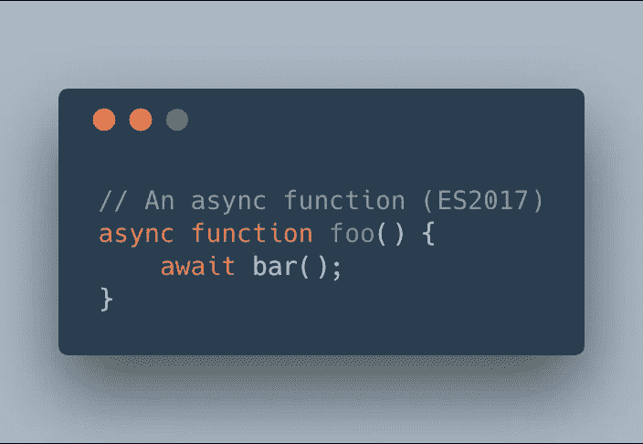
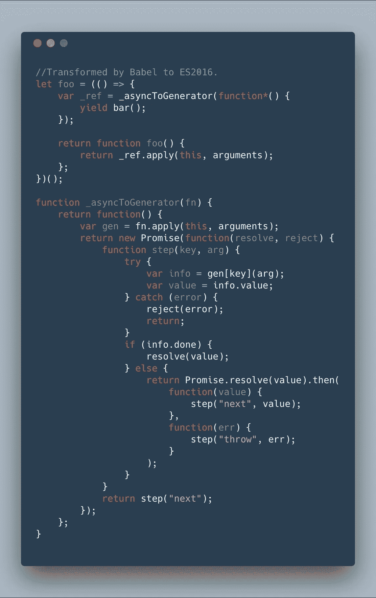
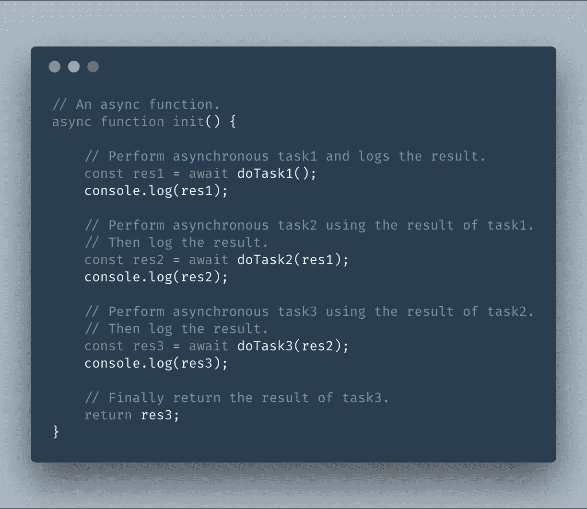
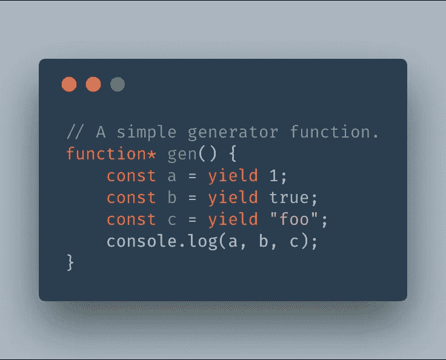
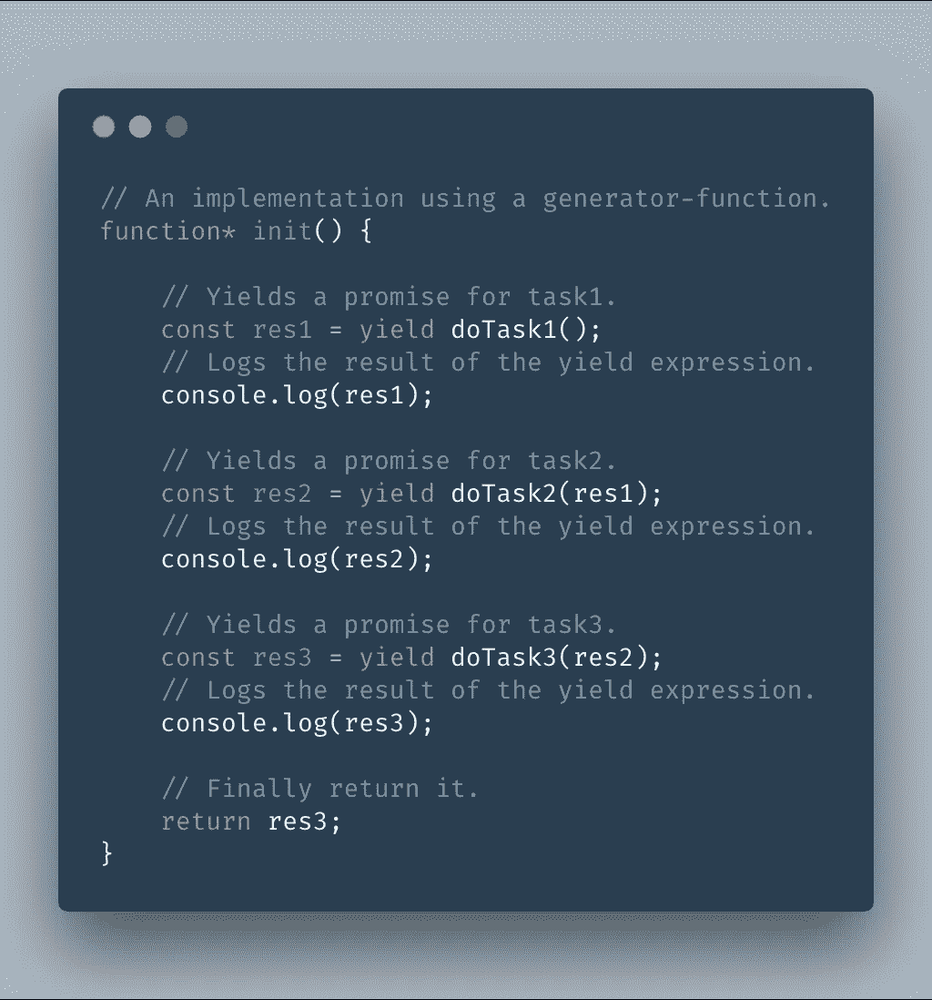
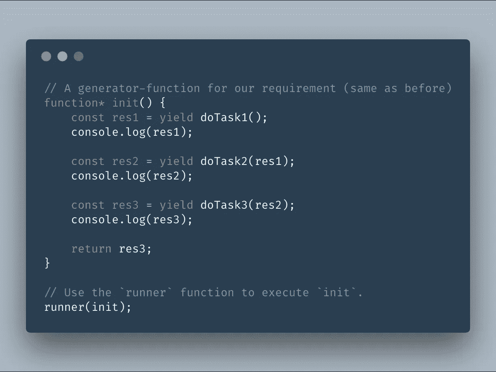
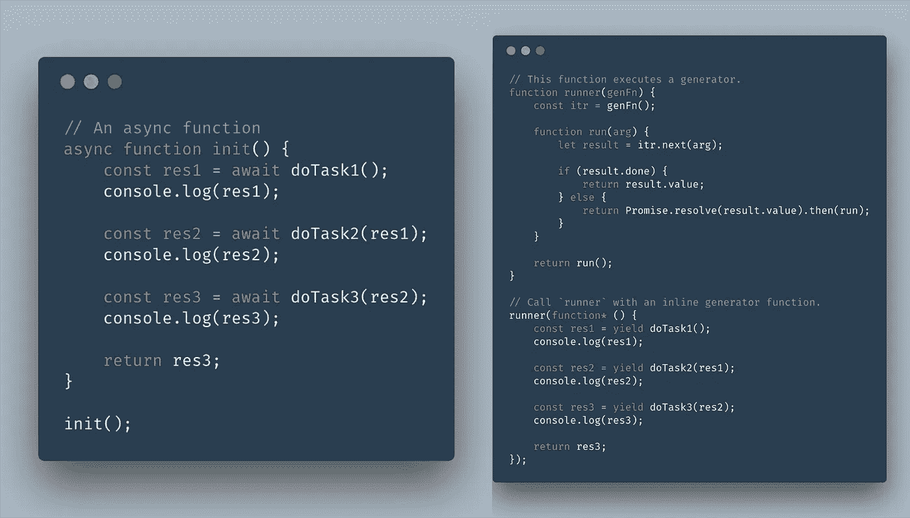

# 异步等待≈发电机+承诺

> 原文：<https://medium.com/hackernoon/async-await-generators-promises-51f1a6ceede2>

在本文中，我将描述 ES2017 `async`函数本质上是两个旧的 [JavaScript](https://hackernoon.com/tagged/javascript) 特性:`generators`和`promises`之间的游戏，这两个特性都是在 ES2016 规范中较早添加到语言中的。

## 在你开始阅读之前..

*   本文**不是**对`promises`、`generators`或`async`功能的介绍。
*   这篇文章的唯一目标是描述如何使用`promises`和`generators`实现`async`功能。
*   它不**也不**提供任何关于`async`函数比其他方法更好还是更差的意见。
*   为了便于解释，本文中使用的代码示例设计得非常巧妙。它们不是用于任何严肃用途的。

## 但是为什么呢..？

既然`async`函数现在已经被本地支持，那么理解它们是如何工作的又有什么必要呢？

嗯，除了 ***好奇心*** 这个明显的原因外，一个重要的原因就是支持更老的平台。如果您想让使用这些新特性的代码在旧版本的浏览器或旧版本的 Node.js 上运行，您需要使用[工具](https://hackernoon.com/tagged/tools)，如 [Babel](https://babeljs.io/) 来将这些新特性转换成旧特性。

因此，对`async`函数如何分解成`generators`和`promises`的透彻理解在阅读/调试转换后的代码时会派上用场。例如，下面是一个简单的`async`函数示例:

An async function (ES2017)

这个函数被 Babel 转换成下面的 ES2016 代码(现在不要担心理解它，我们稍后会介绍它) :

Babel output for the previous async function (ES2016)

他们看起来真的不一样！然而，如果您理解`async`函数实际上是如何工作的，那么这种转换是相当明显的。

另一个有趣的事实是，浏览器也以类似的方式实现`async`功能，即它们[转换](https://www.reddit.com/r/javascript/comments/44b6y9/question_how_are_generators_and_asyncawait/czp1lxr/)代码以使用`generators`和`promises`非常类似于巴别塔。

# 好吧，那它是怎么发生的？

有时候为了理解某样东西是如何工作的，最好的方法是自己动手制作。所以让我们来翻转这个问题:

> 想象一下，给我们一段使用`async`函数的代码，我们如何只用`promises`和`generator`函数重写它？

这里有一个`async`函数:

它执行三个异步任务，一个接一个，每个任务依赖于前一个任务的完成。最后，它返回上一个任务的结果。

## 我们如何使用生成器来编写它？

[发电机是可以退出并在以后重新进入的功能。让我们快速回顾一下它们是如何工作的。下面是一个简单的生成器函数:](https://developer.mozilla.org/en-US/docs/Web/JavaScript/Reference/Statements/function%2A)

这个生成器函数`gen`有一些有趣的方面(摘自 [MDN](https://developer.mozilla.org/en-US/docs/Web/JavaScript/Reference/Statements/function*) 文档) :

1.  当一个生成器函数被调用时，它的主体不会被立即执行。相反，它返回一个遵循[迭代器协议](https://developer.mozilla.org/en-US/docs/Web/JavaScript/Reference/Iteration_protocols#The_iterator_protocol)的迭代器对象，即它有一个`next`方法。
2.  执行`gen`主体的唯一方法是调用迭代器对象上的`next`方法。每次调用`next`方法时，都会执行其主体，直到下一个`[yield](https://developer.mozilla.org/en-US/docs/Web/JavaScript/Reference/Operators/yield)`表达式。这个表达式的值从迭代器返回。
3.  这个`next`方法也接受一个参数。用参数调用它会用参数替换当前的`yield`表达式，并继续执行，直到下一个`yield`表达式。

## 阐明(非常、非常粗略地)..

*   生成器函数通过其迭代器(`next`方法)执行`yield-by-yield`(即一次一个产出表达式)。
*   每一个`yield` 都有一个*给予* → *停止* → *采取*的行为，可以这么说。
*   它*向迭代器给出*当前 yield 表达式的值。
*   然后*在这一点上停止*，直到迭代器的`next`方法被再次调用。
*   当再次调用`next`方法时，它*从它那里获取*参数，并用它替换当前暂停的 yield-expression。然后移动到下一个`yield`。

*你可能想再读一遍上面的总结或者参考一下* [*百变 MDN 文档*](https://developer.mozilla.org/en-US/docs/Web/JavaScript/Reference/Statements/function*) *！*

## 但是这对我们有什么帮助呢？

现在你可能会想，生成器函数对我们的情况有什么帮助？我们需要建模一个异步流，在这个异步流中，我们必须等待某些任务完成，然后才能继续。但到目前为止，在我们的讨论中，一切都是同步的。我们如何做到这一点？

> 这里最重要的一点是，生成函数也可以产生`promises`。

一个`generator`函数可以`yield`一个`promise`(例如一个异步任务)，并且它的迭代器可以被控制为 *halt* 以便这个`promise`解析(或拒绝)，然后继续解析(或拒绝)的值。这种用 yielded `promises`编织迭代器的模式允许我们像这样建模我们的需求:

*(注意这个生成器函数与我们的* `*async*` *函数多么相似！)*

但这只是故事的一半。现在我们需要一种方法来执行它的身体。我们需要一个函数，它可以控制这个`generator`函数的迭代器在每次产生一个`promise`时*停止*并在它解决(或拒绝)时继续。这听起来很复杂，但实现起来非常简单，如下所示:

A function that executes a generator function. (Only for explanation, **do not use it !**)

现在我们可以使用这个`runner`函数来执行我们的`generator`函数`init`，如下所示:

Use `runner` to execute the body of `init`.

就是这样！这个`runner`函数和我们的`generator`函数的组合实现了与原始`async`函数相似的结果。

*请注意，此* `runner` *功能仅用于演示概念。是* ***不是*** *适合任何正经使用。如果你正在寻找一个合适的实现，你可以在这里找到***。**

# *总结一下*

*我们从一个`async`函数开始，然后使用`generators`和`promises`编写了一个相同的实现。也就是说，下面两段代码将具有类似的效果:*

**

## *进一步练习*

*   *在本文的开头，我们看了 Babel 如何使用`generators`和`promises`将`async`代码转换成 ES2016 代码。您现在可以重新访问转换后的代码，并比较我们的`runner`函数与`_asyncToGenerator`函数是如何相似的。事实上，`_asyncToGenerator`函数是我们极其简单的`runner`函数的简单版本。*
*   *如果您仍然感兴趣，您可以更进一步，即将`async`功能转换为 ES2015 代码，即没有`generators`。为此，您必须模拟`generators`本身(使用带有`switch`情况的有状态繁忙循环，例如参见[再生器项目](http://facebook.github.io/regenerator/))。*

*我希望这个解释能解开`async`函数背后的谜团。它们提供了更简单的语法，因此代码噪音更少。关于`async`功能的建议指出:*

> *ECMAScript 中承诺和生成器的引入提供了一个机会，可以极大地改进在 ECMAScript 中编写异步代码的语言级模型。*

*感谢[阿科斯](https://github.com/kittaakos)、[亚里沙](https://github.com/alisa-lisovskaya) & [克里斯蒂安](https://twitter.com/kristianduske)为改进本文提供反馈。*