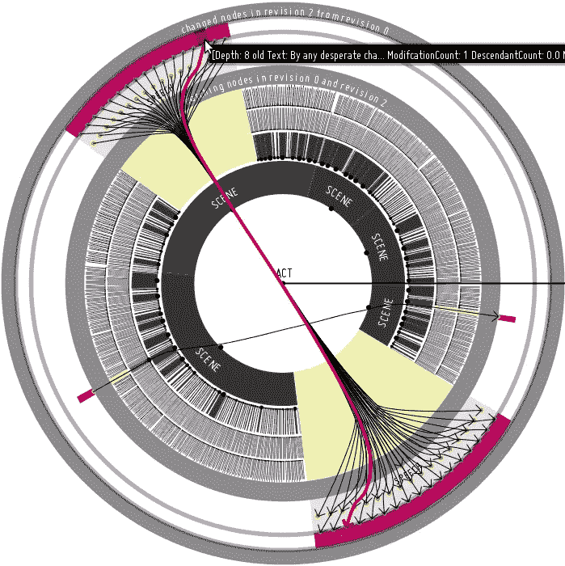

# 使用 Vert.x、Keycloak 和 Kotlin 协同程序的异步临时 REST

> 原文：<https://medium.com/hackernoon/asynchronous-temporal-rest-with-vert-x-keycloak-and-kotlin-coroutines-217b25756314>

## 我们如何为一个日志结构的、时态的、版本化的 NoSQL 文档库——sirix . io(开源且免费)构建一个异步的、RESTful API



Interactive Visualization — Uses Hierarchical Edge Bundles to visualize moved nodes.

# 为什么现在保留旧版本/修订版的数据变得可行

生命受制于不断的进化。我们的数据也是如此，无论是研究、商业还是个人信息管理。因此，令人惊讶的是，数据库通常只保持当前状态。然而，随着闪存驱动器(例如固态硬盘)的出现，与旋转磁盘形成鲜明对比的是，固态硬盘在随机访问数据方面要快得多，并且不太擅长擦除或覆盖数据，我们现在能够开发智能的版本控制算法和存储系统来保持过去的状态，同时不影响效率/性能。因此，搜索/插入/删除操作应该是对数时间的( *O(log(n))* )，以便与常用的索引结构竞争。

# 进化的、时间的 NoSQL 商店 Sirix.io

> ***Sirix*** *是一个版本化的时态存储系统，其核心是日志结构。*

我们支持 **N 个只读**事务，这些事务被绑定到一个**单一修订**(每个事务可以在任何过去的修订上开始)*并发*到**一个写**事务。因此，我们的系统基于**快照隔离**。写事务可以将最近的修订恢复到任何过去的修订。然后，可以提交对此过去修订的更改，以创建新的快照，从而创建新的修订。

> *在事务提交期间，在内部索引树结构的后序遍历中，写入被批处理并同步到磁盘。因此，我们将随机写入 I/O 转换为顺序写入。此外，我们能够在父指针中存储页面的哈希，就像****【ZFS】用于将来的完整性检查(Merkle-Tree)*** *。优步页是资源的根页，最后写入。因此，我们的存储总是一致的，不需要预写日志(WAL)。我们没有持久日志和数据存储，而是只有日志结构的索引(和一个轻量级缓冲区管理器)。*


Sunburst View of a file system import

快照，即在每次提交期间创建的新修订。除了数字的*修订号*之外，*时间戳*被序列化。随后可以通过指定 ID 或时间戳来打开修订。使用时间戳需要对时间戳数组进行二进制搜索，时间戳数组持久存储在第二个文件中，并在启动时加载到内存中。如果找到准确的时间戳或与给定时间点最接近的修订，则搜索结束。数据永远不会写回同一个位置，因此不会就地修改。**取而代之的是，Sirix 在记录层使用写时复制(COW)语义(创建页面片段，通常不复制整页)。每当一个页面必须被修改时，那些已经改变的记录以及一些未改变的记录都被写入一个新的位置。具体复制哪些记录取决于使用的版本控制算法**。因此，它特别适合固态硬盘等基于闪存的驱动器。对数据库中资源的更改发生在上述资源绑定的单次写事务中。因此，首先必须在特定资源上打开资源管理器，以启动单个资源范围的事务(类似于资源范围的会话)。请注意，我们已经开始处理数据库范围的事务:-)

我们最近写了另一篇[文章](https://hackernoon.com/sirix-io-why-copy-on-write-semantics-and-node-level-versioning-are-key-to-efficient-snapshots-754ba834d3bb)，提供了更多关于 Sirix 背后原理的背景信息。

# 简单的、基于事务游标的 API

下面显示了一个简单的 Java 代码，用于创建数据库、数据库中的资源以及 JSON 文档的导入。它将被分解成我们内部的二进制表示。

# 用于 JSON 和 XML 的强大 XQuery API

基于 XQuery 处理器( **Brackit** )的强大查询 API 可用于处理本地存储的 XML 和 JSON，并可用于 **HTTP POST-** 和 **GET-requests** (后者用于简单查询):

该查询基本上基于时间戳(*2019–04–13t 16:24:27Z*)打开特定修订版中的数据库/资源，并搜索所有具有 **created_at** 时间戳的状态，该时间戳必须大于 2018 年 2 月 1 日，并且在先前的修订版中不存在。 **= >** 是一个解引用操作符，用于解引用 JSON 对象中的键，数组值可以通过函数 **bit:array-values** 或者通过指定一个索引来访问，从零开始: **array[[0]]** 例如指定数组的第一个值。XQuery 最初是为查询 XML 数据而设计的，类似于查询关系数据的 SQL(但是功能更强大)，但它也是查询其他树结构数据的完美候选，例如稍加调整的 JSON。

我们还支持具有几乎相同的 API 的本地 XML 存储。一般来说，每种类型的数据都可以存储在 Sirix 中，只要它可以由生成的顺序的、稳定的记录标识符获取，该标识符由 Sirix 在插入期间分配，并且只要插入了定制的串行器/解串器。

# Vert.x、Kotlin/Coroutines 和 Keycloak

**Vert.x** 是在 **Node.js** 的基础上，为 **JVM** 设计的。Vert.x 中的一切都应该是非阻塞的。因此，一个称为事件循环的线程可以处理大量的请求。阻塞调用必须在一个特殊的线程池上处理。默认情况下，每个 CPU 有两个事件循环(多反应器模式)。

我们使用 **Kotlin** ，因为它简单明了。其中一个非常有趣的特性是协程。从概念上讲，它们就像非常轻量级的线程。虽然创建线程非常昂贵，但创建协程并不昂贵。协同程序允许像顺序代码一样编写并发代码。每当协程由于阻塞调用或长时间运行的任务而被挂起时，底层线程不会被阻塞，并且可以被重用。在幕后，每个挂起的函数通过 Kotlin 编译器获得另一个参数，一个 continuation，它存储在哪里恢复函数(正常恢复，异常恢复)。

Keycloak 通过 OAuth2(密码凭证流)用作授权服务器，因为我们决定不自己实现授权。

# 构建服务器时需要考虑的事项

首先，我们必须决定哪一个流程最适合我们的需求。因为我们构建了一个通常不被用户代理/浏览器使用的 REST-API，所以我们决定使用**密码凭证流。事情就这么简单:首先获取一个访问令牌，然后在授权头中随每个请求一起发送。**

为了获得访问令牌，首先必须对一个 **POST /login —** route 发出一个请求，在请求体中以 JSON-object 的形式发送用户名/密码凭证。

实现如下所示:

协程处理程序是一个简单的扩展函数:

协程在 Vert.x 事件循环(调度程序)上启动。

为了执行一个运行时间更长的处理程序，我们使用

对于这些任务，Vert.x 使用不同的线程池。因此，任务在另一个线程中执行。注意，事件循环不会被阻塞，协程会被挂起。

API 的每个端点都受到授权处理程序的保护，该处理程序与 Keycloak 实例通信并检查授权:

因此，我们的路线看起来像这样:

基本上，这是 HTTP GET-Requests 的一个端点，它产生“application/json”内容并检索数据库中的资源。可选地，可以使用一个**查询**参数来深入存储的 JSON 或 XML 资源的内部树形结构。端点受到上述身份验证处理程序的保护，因此只有授权用户才能查看资源。

# 通过示例进行 API 设计

*现在我们再次将焦点转移到我们的 API 上，并通过例子展示它是如何设计的*。我们首先需要设置我们的服务器和 Keycloak(阅读 [https://sirix.io](http://sirix.io) 如何做这件事)。

一旦两台服务器都启动并运行，我们就能够编写一个简单的 HTTP-Client。我们首先必须用给定的“用户名/密码”JSON-Object 从`/login`端点获得一个令牌。在 Kotlin 中使用异步 HTTP-Client(来自 Vert.x ),看起来像这样:

然后，这个访问令牌必须在每个后续请求的授权 HTTP 头中发送。存储第一个资源如下所示(简单的 HTTP PUT-Request):

`$server`定义为“*协议://主机:端口/* ”(例如`[https://localhost:9443/](https://localhost:9443/)`)。首先，创建一个名为`database`的带有一些元数据的空数据库，其次，以我们内部的二进制格式存储名为`resource1`的 JSON 片段。`PUT HTTP-Request`是等幂的。具有相同 URL 端点的另一个 PUT 请求将删除以前的数据库和资源，并重新创建数据库/资源。注意，我们使用 HTTP 头“Content-Type”来指定它是哪种资源类型，因为我们当前允许创建 XML 和 JSON 数据库以及“Accept-Header ”,这是我们期望检索的资源类型(如果有的话)。

HTTP 响应代码应该是 200(一切正常)，在这种情况下，HTTP 主体产生存储的资源。

通过一个`GET HTTP-Request`到`https://localhost:9443/database/resource1`，我们也能够再次检索存储的资源。

然而，到目前为止，这并不真正有趣。我们可以通过`POST HTTP-Request`更新资源。首先，我们需要获得节点的内部的、惟一的 node-ID，在这里我们要插入新的 JSON-data:

我们可以使用 POST-或 GET HTTP-请求，查询 URL 编码。查询参数允许直接在 URI 中指定简单的查询:

```
**$server$serverPath?query=let%20%24nodeKey%20%3A%3D%20sdb%3Anodekey(.%3D%3Efoo%5B%5B2%5D%5D)%0Areturn%20%7B%22nodeKey%22%3A%20%24nodeKey%7D**
```

然而，正如我们所看到的，查询很快变得不可读。

请记住，我们在数据库中存储了以下 JSON 文档:

例如，在上面的查询中，我们选择了“foo”，然后选择了数组中的第三个项目(2.33)，然后检索了它的节点键。

在这个例子中得到的节点密钥/节点标识符是 6。假设我们像以前一样检索了访问令牌，我们可以简单地做一个后请求，并使用我们以前收集的关于节点密钥的信息:

有趣的部分是我们用作端点的 URL。我们简单地说，选择 ID 为 6 的节点，然后插入给定的 JSON-data 作为该节点的右兄弟，这是通过它的节点键选择的。这会产生以下序列化的 JSON-document(注意，我们尽可能压缩 JSON 字符串，因此，这里漂亮的打印只是为了可读性):

每个 PUT-以及 POST HTTP-请求都隐式地`commits`底层事务，并因此创建一个新的修订。将一堆请求捆绑到单个事务中的想法是将事务公开为资源，例如，将它的 ID 与每个请求一起发送，并通过对特定“提交”资源/ GET 端点的请求来提交资源。

请记住，在我们最近提交之前，资源的第一个版本很容易被重建。因此，我们现在能够发送第一个 GET-request 来再次检索整个资源的内容，例如通过指定一个简单的查询，在所有修订中选择根 JSON 对象(在我们的例子中，到目前为止只存在两个修订)。因此，执行一个`GET https://localhost:9443/database/resource1?query=jn:all-times(.)`请求并得到以下结果:

请注意，我们在 query-parameter 中使用了时间旅行函数。一般来说，我们支持几个额外的时间旅行函数: *jn:未来，jn:过去，jn:上一个，jn:下一个，jn:第一个，jn:最后一个和 jn:所有时间*正如我们所看到的。我们还支持其变体，而当前上下文项也在结果集中(特别是过去或自己、未来或自己…)。

当然，通常的方法是，导航到您感兴趣的节点，添加谓词，然后及时导航，观察一个节点或整个子树是如何变化的。这是一个令人难以置信的强大特性，可能是未来文章的主题。注意，目前唯一值得注意的例外是空节点，它不能在时间轴上查询，因为我们的查询编译器 Brackit 目前为空项发出空序列。我们可能会在未来的版本中改变这一点。请注意，在未来的版本中，我们可能还会在查询编译器中为 JSON 部分实现更新原语，这样就有可能避免首先检索节点键，然后再发送另一个查询。我们可能会简单地添加 XQuery 函数作为第一步。

通过在 GET-request 中指定要序列化的修订范围(开始和结束修订参数),也可以达到同样的目的:

`GET [https://localhost:9443/database/resource1?start-revision=1&end-revision=2](https://localhost:9443/database/resource1?start-revision=1&end-revision=2)`

或者通过时间戳:

`GET [https://localhost:9443/database/resource1?start-revision-timestamp=2019-04-20T18:00:00Z&end-revision-timestamp=2019-14-20T19:00:00](https://localhost:9443/database/resource1?start-revision-timestamp=2018-12-20T18:00:00&end-revision-timestamp=2018-12-20T19:00:00)Z`

但是，如果我们首先打开一个资源，然后通过一个查询选择单个节点，那么使用时间轴会更快，否则必须对每个打开的修订执行相同的查询(解析、编译、执行……)。

我们当然也能够通过一个简单的`DELETE` HTTP-request 删除资源或其中的任何子树:

这将删除节点键/ID 为 7 的节点——在我们的例子中，它是整个子树的记录键节点(运行示例中的对象键“bar”)。当然，变更是作为修订版 3 提交的。如果在 URL 中省略 nodeId 参数，资源将被删除。如果您还忽略了资源名称，那么可能包含大量资源的整个数据库都将被删除。

因此，在事务提交期间，仍然可以查询整个子树的所有旧修订，这使它成为审计、纠正人为或应用程序错误的理想候选。

## 注意，我们也有复杂的区分能力，但是现在缺少一个合适的 JSON 序列化格式。关于 XML，我们目前发出 XQuery Update 语句。此外，我们希望重新启用一个过时的图形用户界面的基础上(仍然；-))用于比较树结构的新的可视化方法:[https://www.youtube.com/watch?v=l9CXXBkl5vI&t = 26s](https://www.youtube.com/watch?v=l9CXXBkl5vI&t=26s)

接下来，预编译的用户定义的 XQuery 脚本也应该可以存储在应用服务器上。

# 支持我

如果你喜欢这样，不如来点掌声让更多的人看到，或者来点 [**Github**](https://github.com/sirixdb/sirix) 上的明星？🙂👏最重要的是，请检查并让我知道，因为目前我是唯一一个在 Sirix 上工作的人，现在比以往任何时候都更渴望提出一个版本化的、安全的时态分析平台作为开源社区的愿景(**我很乐意听到任何建议、反馈、对未来工作的建议，例如关于云中水平扩展(即复制/分区)的工作、bug 报告；-)，只是一切…请联系** ) :-)

## 开源库:[https://github.com/sirixdb/sirix](https://github.com/sirixdb/sirix)

## Sirix 网址: [https://sirix.io](https://sirix.io)

## 新社区论坛:[https://sirix . discourse . group](https://sirix.discourse.group)