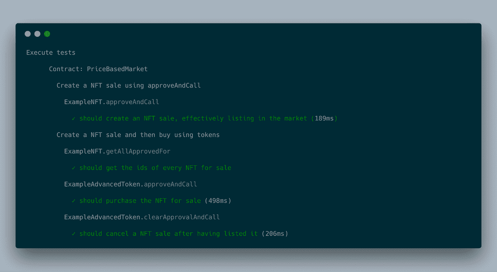
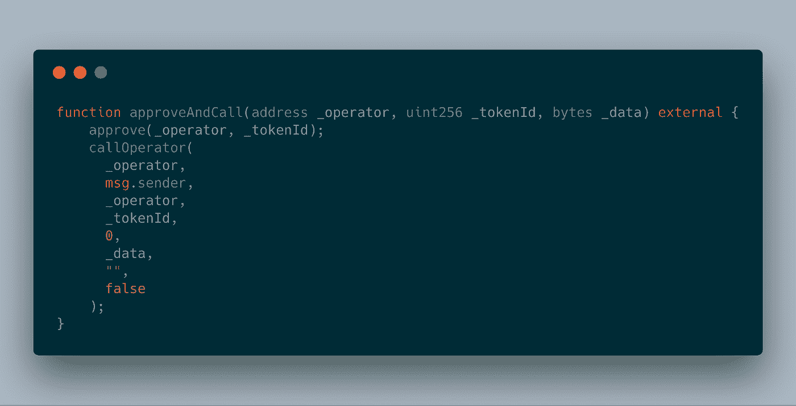
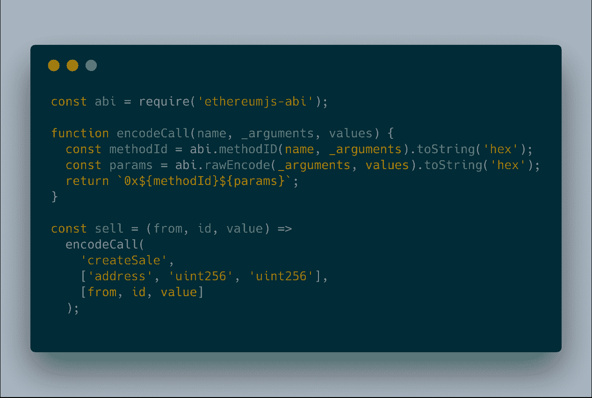
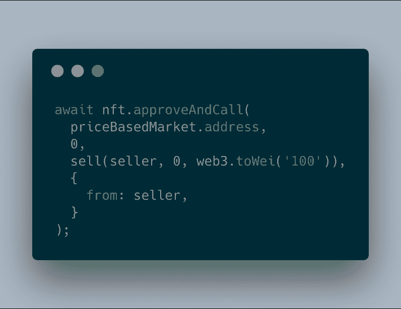
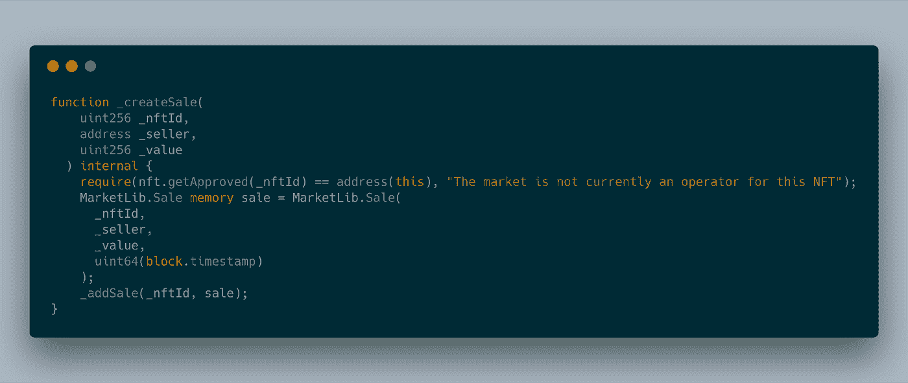
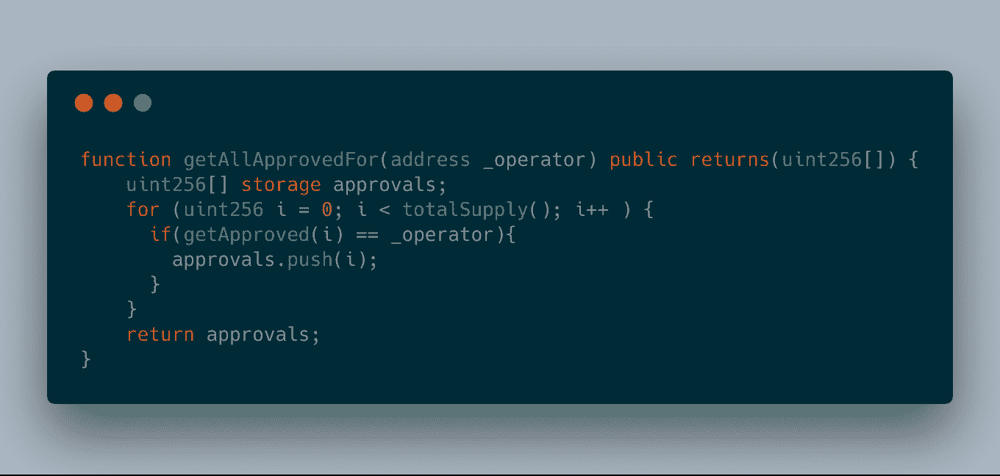
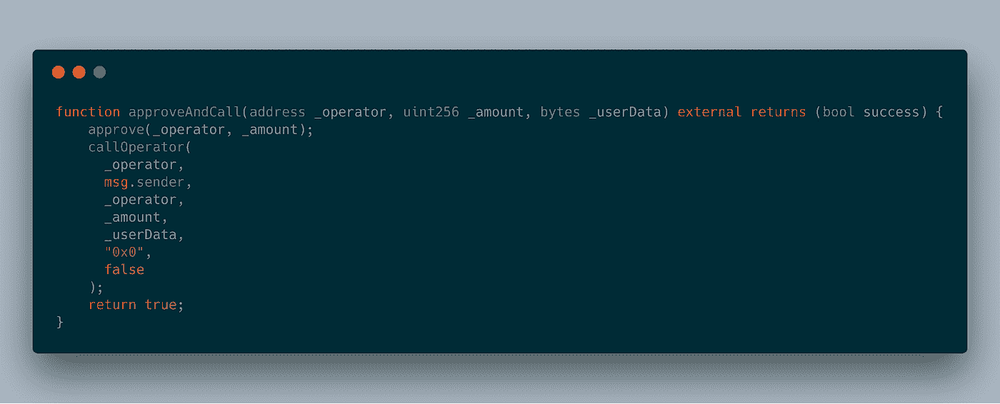
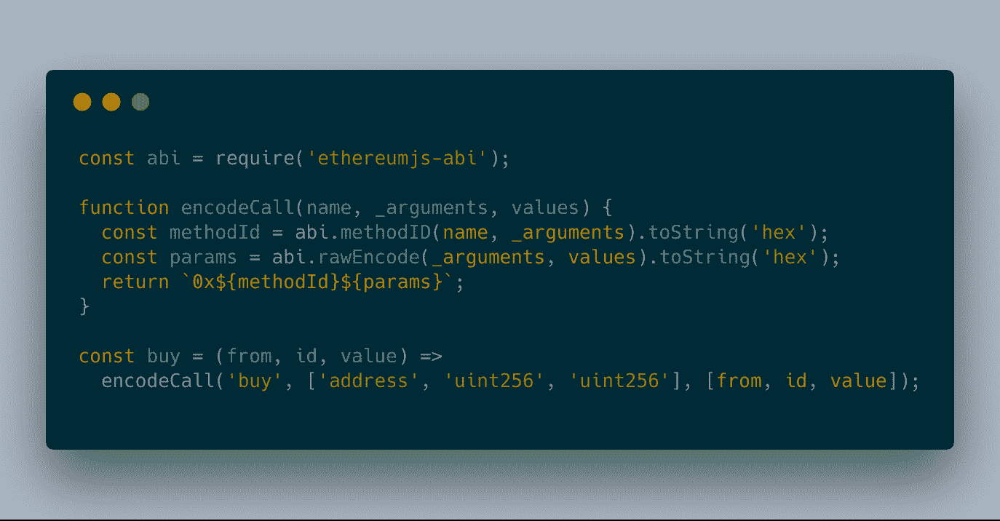
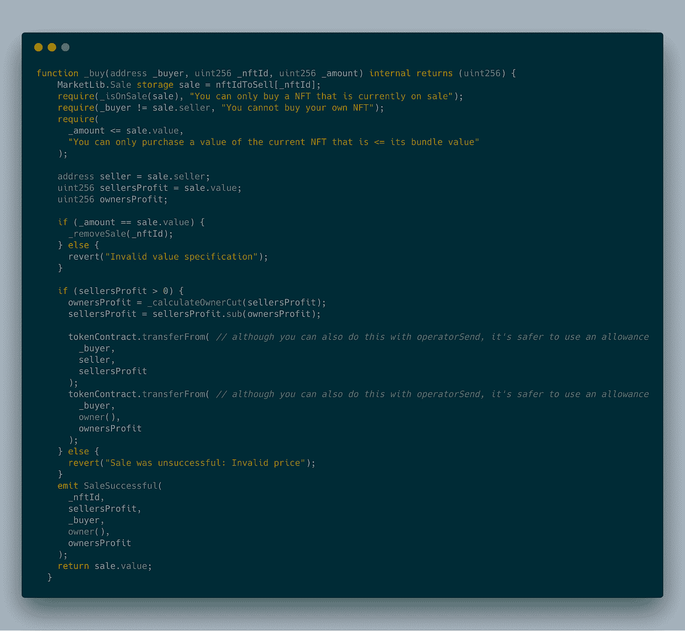
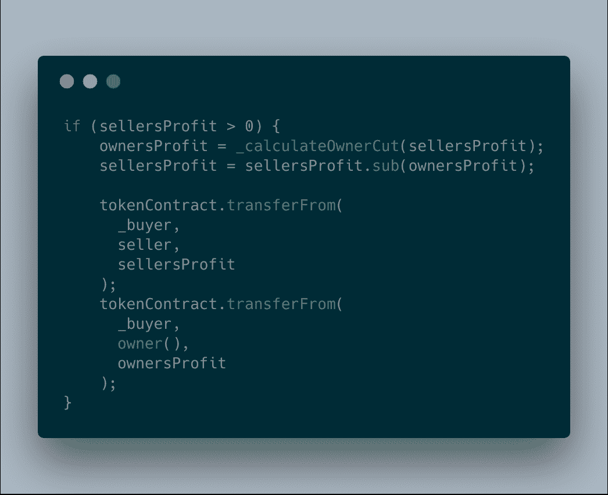

# 不可替代和可替代代币的原子市场

> 原文：<https://medium.com/hackernoon/atomic-markets-for-both-non-fungible-and-fungible-tokens-part-1-whats-in-the-box-baefebfefdb0>

## 第一部分:盒子里是什么？

一个通用的工具集，用于建立你自己的基于原子价格的现货市场

一年多来，我一直在努力为 Nori 的碳市场设计一些市场智能合同、基础设施和用户界面。我不时尝试公开记录一些进展。在[之前的](https://hackernoon.com/test-bd14e0e1170d?gi=154ee02c7ea8)帖子中，我介绍了不可替代代币(**NFT**)和可替代代币的[原子市场](https://www.investopedia.com/terms/a/atomic-swaps.asp)的想法。虽然在以前的帖子中，我对其他密集的主题采取了更轻松、更幽默的方式，但这篇帖子会感觉很不一样，因为内容最好以类似教程的形式提供。

自从我的上一篇文章以来，我已经发布了一个[松露盒](https://github.com/nori-dot-eco/atomic-markets)，它可以让任何人很容易地试验和建立他们自己的市场。现在，在一系列的文章中，我将更深入地研究这些代码，调查不同的市场类型以及如何使用它们。本系列接下来几篇文章的概要如下:

*   第一部分:盒子里是什么:“基于价格的现货市场”
*   第二部分:盒子里有什么:“先进先出[单一价格市场”](https://www.investopedia.com/terms/f/fifo.asp)
*   第三部分:盒子里是什么:“远期市场”
*   第四部分:瑙鲁海洋资源公司如何利用先进先出和远期市场最终颠覆传统碳市场的运作方式

现在，正如我在看大纲时可能很明显的那样，这个版本的块菌盒子旨在成为 **BYOUI** (自带 UI)。尽管这个盒子里装着创建简单原子市场的肉，但建造一个与此兼容的 UX 是否是真正的鱼钩，这一点也许并不明显。不把最好的留到最后，我算哪门子作家？

为了使这篇文章简单明了(并且只关注前三部分的功能)，我们将忘记用户界面的存在，而只关注功能。现在，如果你渴望构建一个 UI，这个盒子的设计理念是你可以用你自己的方式使用它，不依赖于预先存在的用户界面或框架。也就是说，如果您想要一种简单的交互方式，我建议您从解包该代码的位置运行 all-to-magic[create-react-app](https://github.com/facebook/create-react-app)命令，您可以快速开始编写 UI，作为本系列任何部分的分支。对于那些不太喜欢触发的人，请等到本系列的后半部分，我们将向您展示 [Nori](http://nori.com) 是如何将可扩展的 UI 与这些市场合同挂钩的。

> 只对代码感兴趣而对演练不感兴趣？[点击这里](https://github.com/nori-dot-eco/atomic-markets)

# 原子市场盒入门

开始很容易，简单，只需运行以下命令(确保您已经安装了 [truffle](https://truffleframework.com/) ):


truffle unbox nori-dot-eco/atomic-markets

现在您已经有了本地代码，您可以运行测试命令了:

```
truffle test
```

运行之后，您将看到测试输出结果，并确信一切正常:



See what happened there? You un-boxed the the market contracts and from there executed the tests to see the basic functionality printed out.

上面的每个步骤都可以分解为代码支持的功能的描述:

1.  第一次测试表明，你可以在市场上创造销售
2.  然后，它显示您可以获得当前销售的所有 NFT 的 id
3.  然后，它显示您可以购买之前上市出售的 NFT
4.  最后，它执行一个测试，显示您可以取消现有的 NFT 销售

现在，让我们后退一点，讨论一下你刚刚打开的允许这些通过测试用例的黑盒里面到底有什么。

1.  市场契约:这些基础契约允许创建各种类型的市场。出于本文的目的，我们将只检查基于价格的现货市场合约。
2.  [可替换的 ERC-777 令牌契约](https://github.com/nori-dot-eco/atomic-markets/tree/master/contracts/eip777):这些契约给你创建一个[高级可替换令牌](https://eips.ethereum.org/EIPS/eip-777)所需的所有基础契约。
3.  不可替代的 ERC-721 合同:不可替代的代币合同允许你快速开始创建你自己的[不可替代的](https://github.com/ethereum/EIPs/blob/master/EIPS/eip-721.md)资产或商品。
4.  [ERC-820](https://github.com/jbaylina/ERC820) 注册管理机构合同:该注册管理机构合同是高级可替换令牌类型不可分割的一部分，也是不可替换令牌使用的事实上的 [ERC-165](https://github.com/ethereum/EIPs/blob/master/EIPS/eip-165.md) 注册管理机构的替代方案。这个合同的工作原理值得一文讨论，因为我之前已经在这个[文章](https://hackernoon.com/test-bd14e0e1170d?gi=154ee02c7ea8)中介绍过了，所以我不打算在这里详细介绍它是如何工作的。

有了这四个组件，您就拥有了构建一个全功能原子市场所需的一切。

原子市场邮报很好地描述了这些合同之间的沟通方式。总之，在你的指尖，你有一个可替代的买方工具(可替代的代币)，一个不可替代的卖方工具(NFTs)，一个市场合同(代币和 NFTs 交换的媒介)，和一个注册中心(允许真正原子交换的必要机制)。

# 什么是现货市场？

> *现货市场是金融工具(如商品和证券)进行即时交割交易的地方。—*[*Investopedia*](https://www.investopedia.com/terms/s/spotmarket.asp)

如果你曾经使用过集中交易，那么很有可能，默认的交易类似于现货市场。现在，你在那里看到的和你在这里看到的唯一大的区别是，在这些合同中，资产交换发生在可替代资产和不可替代资产之间。此外，这些合同可以被视为这种集中交易的免许可替代方案。

# 剖析基于价格的市场合同

现货市场合同逻辑可以通过检查其中代码的逻辑来最好地分解。市场首先需要的是创造销售的方法。现在，与传统的智能合约不同，原子市场可以利用代币合约本身与市场互动。在这种情况下，今天当大多数人与交换合同交互时，他们所做的是将代币存入交换合同，然后向同一合同发送第二个连续的交易，告诉它用存入的代币创建销售。

但是那很讨厌！对一个人来说意味着更多的交易，对两个人来说意味着将资产的托管权交给这个合同，直到你把它收回。取而代之的是，使用对 NFT 合同的扩展，我们定义了一个函数，该函数授予合同地址将指定的 NFT 交换为卖方期望价格的能力:



上面的函数是我们用来为 NFTs 创建销售列表的。现在，它究竟是如何做到这一点的可能并不明显。您在哪里定义资产的价格，此外，NFT 合同如何知道如何告诉市场这是为了创建市场销售列表，而不是仅仅批准一些随机的第三方津贴(这是此类津贴功能的传统用例)？那最好分成两部分。

首先，价格在函数的 _data 参数中指定。我们通过对市场的“createSale”函数(稍后定义)的函数调用数据进行编码来实现这一点。为了对它进行编码，我们可以使用下面的代码片段:



正如您可能在上面看到的，我们通过传递要出售的 NFT、卖方的地址和卖方要求的价值(以可替换令牌的形式)来为 NFT 设定价格。最后，我们使用类似下面的方法将这些数据直接传递给“approveAndCall”函数:



上述内容有效地授权市场合约在满足匹配购买订单的情况下交换资产(并且这样做时不会释放资产本身的托管权)！

现在，满足这种销售创建形式所需的“approveAndCall”函数的第二部分是一个名为“callOperator”的函数。由于该函数内部发生的事情在另一篇文章中有更详细的解释，简单的总结是，它用于查找被授予该批准的地址是否定义了 NFT 在被授予批准后应该调用的后续函数。在这种情况下，收件人地址确实定义了这样一个功能。



当我们批准市场合同地址时，它能够使用指定的地址参数从注册中心查找，作为回报，注册中心能够有效地告诉 NFT 合同它下一步需要做什么。在这种情况下，除了批准市场，NFT 还需要在同一个收件人地址中调用创建销售功能。瞧啊。这种看似复杂的逻辑流程允许在现货市场的订单簿中创建销售。

接下来，我们定义一个额外的函数，这样我们就可以检索现货市场中当前列出的所有 NFT:



综上所述，该函数返回当前市场上被批准用于原子交换的所有 id。

如果你所能做的就是列出一个销售清单，那么没有一个市场是完整的！我们还需要一种方法来购买上市销售的 NFT。为此，我们定义了一个与创建销售非常相似的函数，但这一次我们是在可替换的令牌契约中定义的:



该功能允许市场满足现有的销售列表。由于这个函数从根本上类似于 NFT 的销售创造函数，我们不需要分解其中包含的逻辑是如何工作的。然而，不同的是当注册中心契约响应可替换令牌契约时的逻辑，以及“_userData”参数要求。对于这个参数，我们需要将采购数据作为编码参数传递给它。我们可以通过以下方式实现(然后将数据传递给该函数，就像我们通过 NFT 审批函数所做的那样):



此外，由于我们没有使用可替换的令牌创建销售，而是将它们作为购买工具，注册管理机构合同将使用用于购买指定 NFT(令牌合同将连续使用)的逻辑来响应“callOperator”调用:



总结一下这个看起来比较奇怪的逻辑，当市场被给予批准一定数量的代币，以及可以被解码以找到买方想要购买的指定销售的编码数据时，可替换代币将启动卖方的 NFT 的交换。

现在，虽然这概括了这些合同的大部分工作方式，但这个盒子中包含了一个额外的功能，作为蛋糕上的糖衣:



没有给市场的经营者获取一点点利润的能力，哪个市场是完整的？！上面描述的是这样的逻辑，当 buy 函数被调用时，销售的一部分利润被分配给市场的所有者。这种特殊的切割方式可以根据你自己的心意进行定制和改变。

就是这样！然而，可能还不明显的是，为什么这个系列没有结束。不要跳得太远，现货市场并不是完美的解决方案。许多情况需要最终改变交易行为，以满足市场复杂性的约束，或者扰乱所述市场的用户经常利用的行为类型。但这将是下一篇文章的主题。

# 想再来点紫菜吗？

*   [收听](http://nori.com/podcast)我们的播客。
*   [回顾](https://nori.com/webinars)我们关于市场设计不同元素的网络研讨会。
*   [阅读](https://nori.com/white-paper)我们的白皮书了解技术细节。
*   [在推特上关注我](https://twitter.com/jaycenhorton)
*   不是认证投资人，但还是想支持？[投资](https://republic.co/nori)共和国的公共运动。

# 鳍。