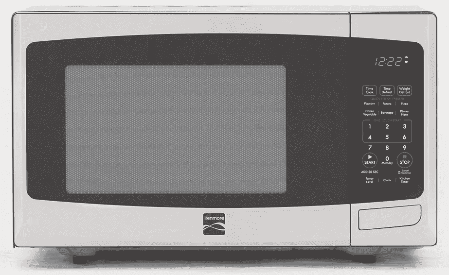
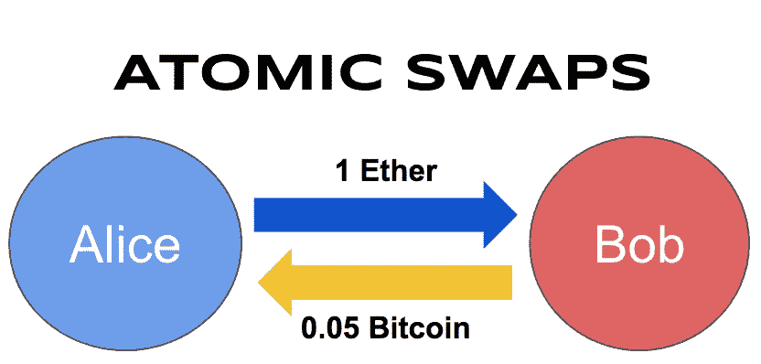
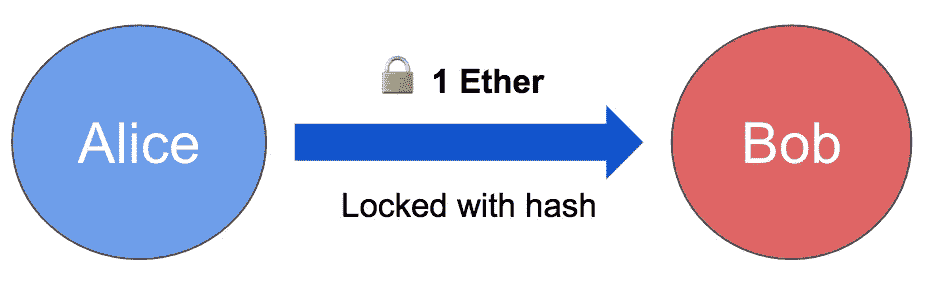
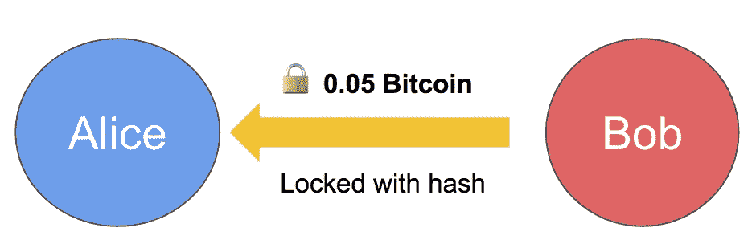
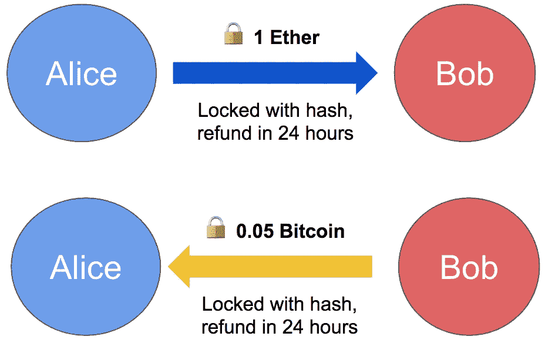
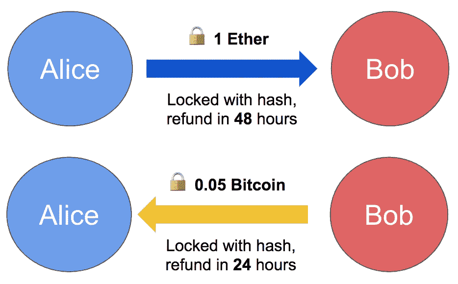

# 原子互换简单地解释了:如何在没有中间人的情况下交换加密货币

> 原文：<https://medium.com/hackernoon/atomic-swaps-simply-explained-how-to-swap-cryptocurrencies-without-a-middleman-6cd29680c32e>

如果你想买卖[加密货币](https://hackernoon.com/tagged/cryptocurrency)，目前你只有一个好的选择:使用集中交易所。

出于这个原因，我们制作了 [HodlBot，这是一个算法机器人，可以自动多样化为前 20 种加密货币](https://www.hodlbot.io/?utm_source=medium&utm_medium=blog&utm_campaign=atomic-swaps)，与币安等交易所兼容。

但是当然有更好的方法来交换加密货币。集中式交易所存在一些大问题。首先，就在过去的几个月里，我们经历了两次交易所黑客攻击，黑客偷走了价值 5 亿美元的 NEM 币和 1.7 亿美元的纳米币。而且不仅仅是黑客。交易所收取高额的取款费和交易费，让密码交易员损失惨重。

最具讽刺意味的是，加密货币给了我们一种点对点的货币交易方式，但我们仍然需要通过第三方进行交易。

crypto 的思想家们一直在努力解决这个问题。在他们别出心裁的解决方案中，最有前途的一个被称为原子交换。

## 什么是原子交换？

原子互换是不同加密货币之间的点对点互换，不需要中间人。单词“[原子](https://en.wikipedia.org/wiki/Atomicity_(database_systems))”是一个奇特的计算机科学术语，意思是它们要么完全发生，要么根本不发生。

令人惊讶的是，原子性允许人们在不信任对方的情况下进行交换。让我们通过一个真实的故事来探索它是如何工作的。

## 用美钞兑换金币

鲍勃的祖父去世了，他继承了一小袋 24 克拉的金币。他在网上查了一下，发现它们可能价值 3 万美元。他决定卖掉它们。

在第一次尝试中，他把他们带到了一个昏暗的当铺。可以预见的是，店主给他报了一个可怕的价格，这将使桌子上剩下几千美元。

Oh Rick

经过一番考虑，他认为直接卖给另一个人比通过商店或经纪人要好得多。

他在一个在线论坛上点击了一会儿，接触到一个名叫爱丽丝的女人，她想以 27，000 美元的现金购买他的硬币。得分！但是经过一番反复之后，事情变得很明显:他们都不信任对方，不会先把自己的份额寄出去。

那么他们会怎么做呢？他们在这个虚构的世界里使用了一种新发明，叫做超级安全互换。这些利用了一种叫做超级保险箱的东西，一种看起来像微波炉的保险箱。每个都有一扇门，一扇窗和一个开门的按钮，两个连在一起做超级安全的交换。

## 超级安全的互换是如何运作的

爱丽丝和鲍勃都把他们的超级保险箱从家里拿出来，搬到街上。

Warning: Super Safes do not have the ability to heat up food.

他们把它们连接在一起。从此时起，只有同时按下两个保险箱上的按钮，它们的门才会打开。

Alice 和 Bob 将他们的物品(分别是现金和硬币)放入保险箱，然后关上。他们分享自己的位置，然后找到通往对方保险箱的路。到达后，他们从保险箱的窗口偷看，检查里面是否有正确的物品。如果他们对内容满意，他们就按下按钮。

如果他们都按下按钮，表明他们同意交换，两个安全门都会弹出。爱丽丝可以拿走鲍勃的金币，鲍勃可以拿走爱丽丝的现金，他们都可以开心地离开。

但是如果爱丽丝或鲍勃不想再进行交换，他们就不会按下按钮。两个保险箱都不会打开，两个人都拿不到对方的东西。

没有人能偷，因为交换要么完全发生，要么根本不发生。有了超级保险箱，他们就可以进行交易，不需要中间人，也不需要互相信任。

## 原子交换，解释

假设鲍勃有 0.05 个比特币，他想和爱丽丝交换 1 个以太。让我们看看如何使用原子交换来实现这一点。

回想一下超级安全的互换，我们需要一个容器来装钱并上锁。为此，我们使用一种特殊类型的[智能契约](https://blockgeeks.com/guides/smart-contracts/)，称为*锁*。

## 爱丽丝做了一个锁

hashlock 是一种智能合约，它锁定硬币，直到某个“秘密密码”被揭示。

Alice 使用以下步骤制作一个:

1.  选择一个叫做*原像*的大随机数。这是“秘密密码”。
2.  使用这个原像计算另一个数，称为*散列*。
3.  创建一个智能协定来发送 Bob 1 Ether，用这个哈希锁定。只有当 Bob 能够展示映射到 hash 的原像时，硬币才会被释放。

在步骤 2 中从原映像计算散列很容易，但是在给定散列的情况下计算原映像几乎是不可能的。这意味着鲍勃不能解开硬币，除非爱丽丝给他原像。

这类似于把现金锁在超级保险箱里。

Initial transaction

## 鲍勃回报

Bob 检查 Alice 是否发送了一个以太网的 hashlock 契约。他可以通过观察公众[区块链](https://hackernoon.com/tagged/blockchain)来证实这一点。此后，Bob 向 Alice 发送了一份价值 0.05 比特币的 hashlock 合同，该合同由 Alice 使用的 hash 锁定。这将两个交易锁定在一起，类似于超级安全交换中的链接保险箱。

Reciprocal transaction

## 解开硬币

当爱丽丝想要解锁鲍勃发给她的[比特币](https://hackernoon.com/tagged/bitcoin)时，她需要使用原像(秘密密码)来解锁。

但是当她这么做的时候，这个原像就会出现在[区块链](https://hackernoon.com/tagged/blockchain)上，成为公共信息。然后，Bob 可以用它来解锁 Alice 的以太，因为锁定两个合同使用的是同一个哈希。

所以你可以看到，就像在超级安全的交换中一样，这种交换是自动发生的。要么交易对双方都成功执行，要么根本不成交。

但是有一个很大的问题我们没有考虑到:如果爱丽丝从来没有展示过解锁鲍勃比特币的原像呢？那么这两份合同将永远锁定。

## 为失败的交换退款

发生这个问题是因为我们没有办法在失败的情况下回滚交换。

所以让我们加上一条:如果 24 小时后爱丽丝还没有显示原图像，那么退还两个合同。这被称为*时间锁*。

Hashlocked transactions with timelock

现在，如果爱丽丝在 24 小时内没有显示出原像，鲍勃可以拿回他的 0.05 比特币，爱丽丝可以拿回她的 1 以太。

听起来不错，对吧？但爱丽丝仍有可能造成危险。

## 给爱丽丝更长的时间锁

假设 Alice 等待了 23 小时 55 分钟，直到她使用原像解锁 Bob 的合同。那么 Bob 只有 5 分钟来解锁 Alice 的合同。如果互联网连接(或其他)问题阻止 Bob 这样做，那么 Alice 的合同将被退还。爱丽丝偷了鲍勃的比特币。

解决办法？将爱丽丝合同的退款延迟加倍至 48 小时。如果爱丽丝等 24 小时，鲍勃还有 24 小时解锁。

The final product

这就是:一个全功能的原子交换！

## 缺点

原子交换有很大的潜力，但也有问题:

1.  它们很慢(除非你用类似[闪电网](http://lightning.network)的东西)。
2.  主流钱包或交易所尚不支持它们。
3.  它们不适用于不支持智能合约的加密货币。

然而，这些问题将随着时间的推移而得到解决。随着他们这样做，通过中介交换密码将成为过去。

## 未来

原子互换只是交换问题解决方案的一部分。我们还需要分散的交易所:交易所不是由一个人拥有，而是由一个网络拥有，从而防止单点故障。

作为一家公司，我们的使命是让每个人都能轻松管理加密组合。因此，我们目前只支持大众交易所，因为大多数人都在那里。

然而，我们认为，在向去中心化的世界转变的过程中，原子掉期等去中心化的交易技术将变得越来越重要。