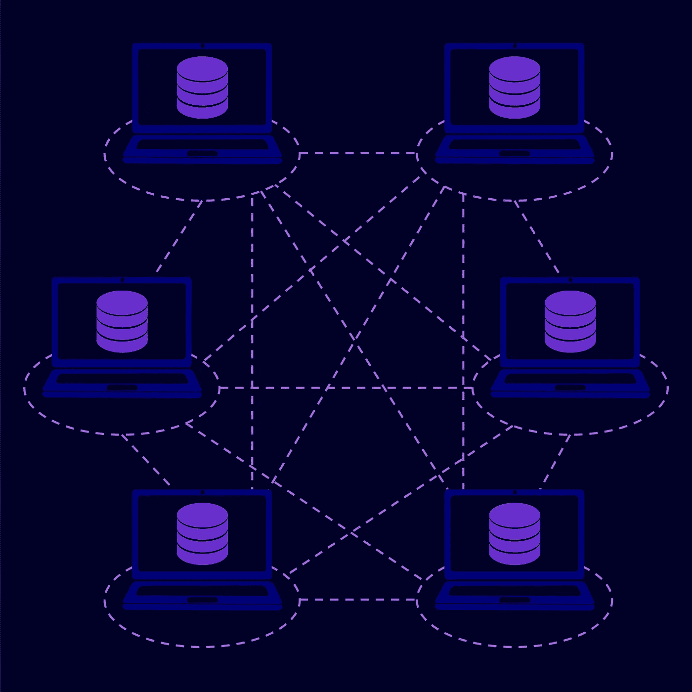

# 尝试用区块链改革全球养老金体系

> 原文：<https://medium.com/hackernoon/attempting-to-reform-the-global-pension-system-with-blockchain-21e0ab9b51d9>

image source: depositphotos.com

今天，我们有望比以往任何时候都长寿。坏消息是——根据世界经济论坛的一份报告，管理老龄化人口的费用可能会有巨大的赤字。

基于目前工作人口的贡献被用于资助老年人的养老金，以及出生率的下降，现有的制度正面临着严峻的挑战。通常被称为另一种形式的[庞氏骗局](https://www.investopedia.com/terms/p/ponzischeme.asp)，其工作原理是“拆东墙补西墙”，当前的养老金体系需要一个根本性的改革。即使在政府宣称拥有高效养老金体系的发达国家，获得你应得的金额通常也很复杂。

## 当今养老金和福利制度面临的挑战

许多现在的工人要么缺乏获得养老金计划的便利，要么他们放弃购买现有的计划。随着越来越多的个体经营者、零工经济和非正规部门的工人几乎不考虑退休规划，这个问题变得更加复杂。管理养老金账户和运营的间接费用以及通货膨胀压力进一步减少了有限的养老金计划投资者的回报。非法挪用养老基金的欺诈和诈骗也是一个令人头疼的问题。同一份 WEF 报告估计，全球养老金储蓄缺口将以每年 5%的速度增长，从 2015 年的 70 万亿美元增长到 2050 年的 400 万亿美元，约为全球 GDP 的五倍，导致高度扭曲、高成本、管理不善的养老金体系，这也将导致赤字。

## 区块链能提供替代方案吗？

image source: depositphotos.com

虽然很难改变个人的储蓄习惯，但围绕养老金生态系统的基础设施可以进行彻底改革，不仅解决现有的缺点，还可以促进个人的积极参与。

为了满足受益人的需求，增加参与，并简化复杂的遗留养老金基础设施，一些区块链的养老金系统正试图使养老金基础设施重新专注于其最初的目标，即成为“保证安全可靠的金融未来的简单而必要的媒介”

这种基于区块链的养老金解决方案提供了低成本、精简、高效且几乎无欺诈的运营、个人交易的可审计跟踪、完全透明以及用户资料的轻松转移等诸多优势。

## 基于区块链的养老金系统将如何运作？

尽管每个这样的系统都有自己的机制，但基本的基础设施有许多相似之处。例如，所有利益相关方和实体，如消费者、机构、开发者社区、行业顾问和服务提供商，都将作为参与者加入区块链，每个人都被赋予执行必要任务的能力。所有交易和资产都将被标记化，以保持透明度和可靠的不可变审计跟踪。为投资付款的个人、投资证券的养老基金或取款都将在区块链上得到认证和记录，并得到其本地加密令牌的帮助。

根据不同的配置，所有的资产，比如用户资料、资金和投资，都可以根据需要从一个链转移到另一个链。这种系统将允许用户完全自主地选择如何投资不同的资产以及投资比例。

## 区块链解决方案

在许多国家，政府贡献一部分退休储蓄，雇主贡献另一部分，个人贡献其余部分。区块链为用户打开了进行额外投资的大门，这些投资可能会扩展到加密令牌和数字资产，从而允许一种新的多样化形式。例如，由荷兰最大的养老基金 APG 支持的 NestEgg 的区块链养老金计划允许参与者拥有未来基础设施 T3。

该系统将激励网络参与者以有益于最终用户和养老金生态系统的方式做出贡献。许多此类解决方案将使用智能联系人，这是预定义的自动执行协议，构成了基于区块链的商业交易的基础。

另一个致力于养老金行业解决方案的项目是 [Akropolis](https://akropolis.io/) 。该公司正在建立一个基于区块链的平台，允许用户有效地建立和管理退休投资组合。

Akropolis 提供了一个分散的养老金市场，让用户可以访问各种养老金产品。这使工人能够根据自己的需求灵活选择最合适的养老金产品，而传统的养老金计划通常是为他们选择的。区块链的使用也使得交易安全透明。如果用户愿意，他们将能够随时跟踪基金业绩，审计自己的投资组合。

根据设想，该项目将成为一个高效交付养老金和退休福利的多辖区国际平台。在 crypto luminary 和前雷曼兄弟分析师 Anastasia Andrianova 的领导下，该团队计划在 2019 年前发布该平台的第一个版本、外部 API 和专用硬件钱包。它最初将使用以太坊区块链，但计划在更长的时间内成为区块链不可知论者。

由于持续的挑战和低效率，养老基金的内部运作在全球范围内一再受到质疑。区块链和分布式账本技术可能为改善养老金流程、管理、工作流程和基础设施提供所需的解决方案。此外，它可能有助于增加用户对养老金行业的参与，这也是造成巨额赤字的主要原因。然而，用户采用和必要的遵守当地法规将是所有此类项目成功的关键。