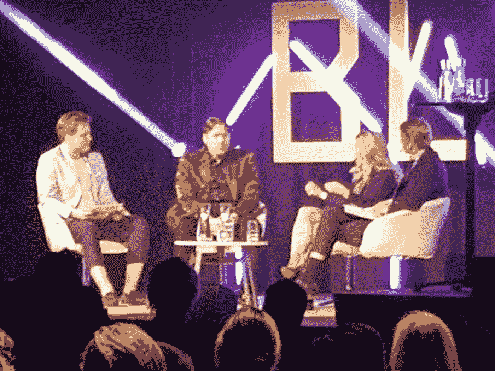
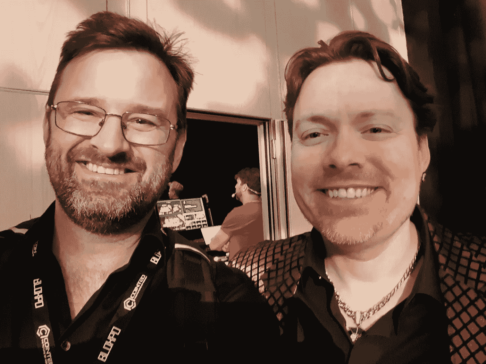
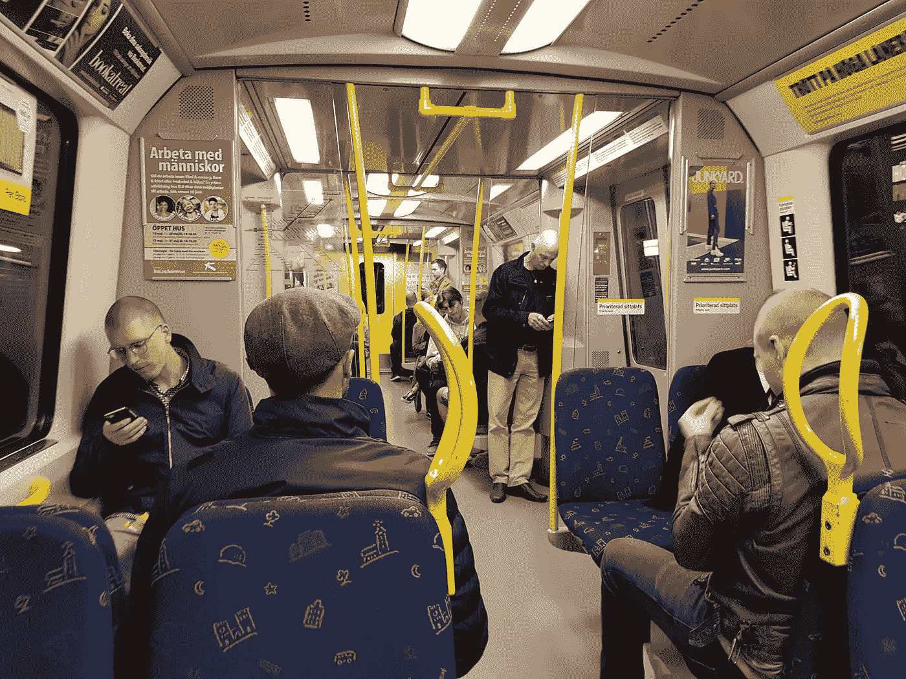

# 参加 BLOXPO

> 原文：<https://medium.com/hackernoon/attending-bloxpo-44750d98dd04>

Spot the dinosaurs

现在，我已经写了一年关于比特币的文章，我的书《比特币三分钟读后感》也写完了【https://www.amazon.com/dp/1718610351/】T2 还有什么比参加活动更好的方式来开始比特币新的一年呢？当我写下这些文字的时候，我正在去斯德哥尔摩参加 BLOXPO 大会的路上，在那里我将会见到一些 crypto 界的大腕。大约在去年的同一时间，我决定开始写作，这是多么美好的一年啊！如今，一些人认为我是一个“有影响力的人”和“比特币专家”，我打算至少不辜负这些善意话语所暗示的期望。希望明天我能和其他一些热心者联系起来，并得到一个急需的鼓舞，进入一个新的、更有成效的一年。

对！半个会议之后，我正在听克里斯蒂安·安德的演讲，他是瑞典交易所 BTCX 的创始人。到目前为止，我和很多人相处得很愉快。我从这次活动中得到的总体感觉是，这仍是一个处于发展初期、濒临爆发的行业。我遇到了一个我在大船时代的老朋友，她认识活动背后一半的人，她给我介绍了很多人。理查德·哈特和两个瑞典政客的辩论是我很久以来所见过的最史诗般的事情。他们吹嘘国家支付的数字化，并被理查兹支持实物现金和反对通货膨胀的观点生吞活剥。很棒的东西。另一个高峰是 Eric Wall 光荣地揭穿了一个针对区块链据说存在的可扩展性问题的建议分片“解决方案”。我仍然感到困惑的是，这些自称的专家(比如金融市场部长)似乎对这些主题知之甚少。感觉很浅薄。话又说回来，互联网的大部分内容都是关于关注和只关注。有些与会者，比如伊莎贝拉·勒文格里普，真的掌握了吸引人们注意力的技巧。就我个人而言，我更喜欢更书呆子气、更微妙的阵容。我很想听听约翰·诺伯格对此的看法，他可能是米尔顿·弗里德曼世界观的唯一瑞典旗手。

Me and Richard

好了，现在在 svaevgen 的疯马歌舞秀享受一杯当之无愧的啤酒，是一位老朋友推荐给我的。关注推特上的事件。试着让我的脑袋适应这一切。加密货币的状态。斯德哥尔摩州。我自己的状态。这件事将走向何方，谁的想法相关，谁的不相关。在活动中遇到几个乙醚爱好者。还是不太相信。似乎很脆弱。参加一个非常关注 ICOs 的活动似乎很快就要到 2017 年了。很多关于“效用”和比特币“没有真正被使用”的谈论，好像霍德林没有使用。很多人似乎还不明白这一点。比特币是一个具体的基础，目光短浅的人可以在上面建造纸牌房子。

走出酒吧，我意识到我发现附近的一条小巷非常熟悉。回到斯韦阿根，我注意到了当地的大剧院，我突然意识到这就是瑞典前首相奥尔夫·帕尔梅 1986 年遇刺的地方。那时我十岁，那天早上我父母很早就把我叫醒去看新闻。从那以后发生了很多事情。今天参加会议的大多数人都出生在那个时代，对他们来说，那一定像是古老的历史。我记得它以及它对当时国家的影响。我们在学校进行了一分钟的默哀，每个人都显得非常不安和不安。我不禁想到，政治家在人们的生活中似乎不再那么重要了。好像每个人都认为我们当前的政治制度是理所当然的，任何人对此都无能为力。他们是对的*和*他们错了。你对现存的制度无能为力，但你*可以*选择绕过它们。反正在一定程度上。

Beautiful Stockholm

在之后的派对上，我遇到了一个古怪的孤独者，一个显然对加密货币一无所知的英国人。尽管如此，他还是四处旅行，参观不同的区块链活动，比如这次，只是为了了解更多。在这一点上，我有点厌倦了交往，但我们仍然设法再次与理查德交谈了一会儿，还有拉里·桑格，维基百科的联合创始人，他正试图建立一个基于区块链的版本，名为 Everipedia。当我问他他们将如何实现去中心化，以及这样一个维基怎么可能永远不变时，他承认这是一个艰难的挑战。当整个聚会移到楼下时，我把我的书的最后一份校样给了几个年轻的爱好者，之后我决定马上离开。在我错过了一些桌舞和过多小费的第二天，我从推特上读到了关于派对的消息。真扫兴。

Taking the tube back

我希望我参加的下一个活动将更多地以比特币为导向，届时该领域一些更有问题的参与者将被淘汰出局。不过总的来说，我玩得很开心，我想祝贺活动组织者的出色工作。