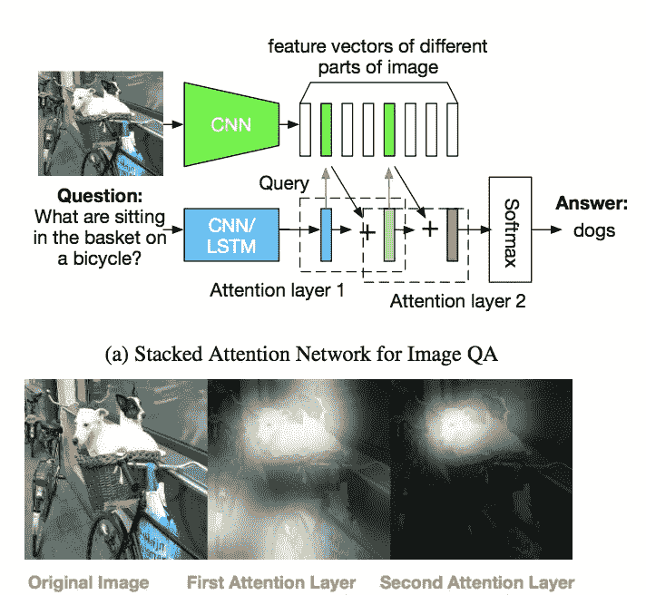
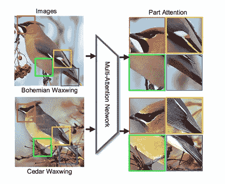

# 注意力模型:放大机器学习对企业的益处

> 原文：<https://medium.com/hackernoon/attention-models-amplifying-machine-learning-benefits-for-enterprise-456e4fb84fa1>

我们强调了机器学习在企业层面提供的难以置信的好处。在零售和农业等不同领域，机器学习可以提高效率和盈利能力。然而，机器学习正在不断发展。在这篇文章中，我们展示了注意力模型对于处于计算技术前沿的企业来说是多么有前途。

机器学习经常从人类思维的工作方式中获得灵感。神经网络在处理自然语言和图像的方式上取得了巨大进步，注意力模型——在一定程度上模拟了人类行为——正变得越来越突出。

简而言之，注意力模型通过关注最重要的数据部分或片段来选择性地处理数据。正如人类在评估情况时关注重要事实一样，注意力模型通过关注最相关的部分来加速大量数据的处理。

# 注意力模型的实际例子

注意力模型的数据科学应用非常广泛，并且发展迅速。注意力模型变得非常实用。在这里，我们概述了注意力模型可以改善数据处理的许多方式，以及商业利益是什么。

# 互动聊天机器人

自动化客户交互消除了客户服务人员的压力，降低了成本，如果操作得当，还能改善客户体验。[自然语言处理(NLP)很难实现](https://labs.eleks.com/2018/02/how-to-build-nlp-engine-that-wont-screw-up.html?utm_source=medium&utm_medium=refferal&utm_campaign=Republ-NeuralAttention-Blog)但是在注意力机制的显著辅助下。注意力模型可以挑出最重要的单词，即使句子又长又复杂。

Stacked Attention Networks for Image Question Answering

因此，企业可以[部署自动聊天机器人](https://labs.eleks.com/2018/05/how-to-create-chatbot-for-your-business.html?utm_source=medium&utm_medium=refferal&utm_campaign=Republ-NeuralAttention-Blog)，利用神经网络结合公共知识库，在没有人类参与者参与的情况下交互式地解决客户问题。

# 图像处理

通过专注于图像中最重要的对象，神经网络可以通过跟踪来自这些重要区域的信息流来快速[解释图像的真正含义](https://labs.eleks.com/2016/07/deep-learning-can-offer-businesses.html?utm_source=medium&utm_medium=refferal&utm_campaign=Republ-NeuralAttention-Blog)。与人类大脑的工作方式没有什么不同，神经网络可以专注于场景中最重要的区域并得出结论。

Neural Network for Fine-Grained Image Recognition

因此，注意力模型可以更容易地基于图像创建标签——这对活跃在社交媒体上的企业非常有用——同时通过例如为盲人创建描述来自动提高可访问性。注意力模型甚至可以提高自动化系统为保安人员生成日常监控报告的便利性。

已经有大量出版的书面内容，并且文本的山正在快速增长。雇佣人类来创建用于编目和审查目的的概要并不总是现实的。相反，注意力模型能够准确定位书面内容中最重要的部分，并得出能够自动引导读者的摘要。

Text summarization with TensorFlow

注意力模型可以快速分析文本，并检测哪些部分是最重要的。反过来，由注意力模型支持的算法可以快速生成可以引导读者的标题或摘要，提供书面内容的相关性和重要性的清晰指示。

# 注意力模型的作用

尽管注意力模型可以实现以前不可能实现的功能，但它们甚至更适合于加速现有的过程。企业算法可以改进，提供更高的性能和更好的结果。这些改进并没有以增加处理能力或更高的计算复杂度为代价。

注意力模型为企业提供了[从机器学习和自动化中挖掘更多的手段](https://eleks.com/whitepapers/artificial-intelligence-can-make-life-easier-youre-prepared/?utm_source=medium&utm_medium=refferal&utm_campaign=Republ-NeuralAttention-Blog)。不确定机器学习、神经网络和注意力模型如何使您的企业受益？

我们的[数据科学团队](https://eleks.com/expertise/data-science/?utm_source=medium&utm_medium=refferal&utm_campaign=Republ-NeuralAttention-Blog)在部署最新的人工智能方面拥有丰富的经验。[联系我们](https://eleks.com/contact-us/?utm_source=medium&utm_medium=refferal&utm_campaign=Republ-NeuralAttention-Blog)了解如何在客户服务、产品开发和运营效率等领域为企业带来好处。

*原载于 2018 年 9 月 27 日*[*eleks.com*](https://eleks.com/blog/attention-models-amplifying-machine-learning-benefits/?utm_source=medium&utm_medium=refferal&utm_campaign=Republ-NeuralAttention-Blog)*。*