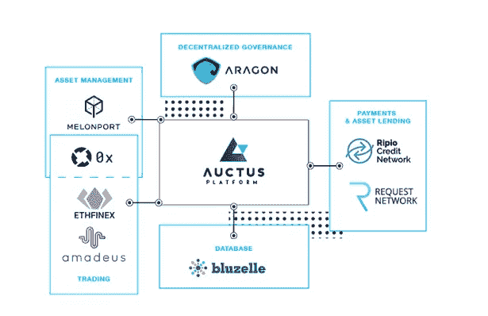

# auctus Labs——通过去中心化赋予社区力量

> 原文：<https://medium.com/hackernoon/auctus-labs-empowering-the-community-through-decentralization-13d908716c61>

在忙碌了几天之后，我很高兴能回来分享新的东西。Auctus 已经在我的*“加密货币的真实世界应用”*系列中有所介绍，你可以在这里找到，在这篇博客文章中，我将进一步了解 **Auctus 实验室**——这是 Auctus 团队在 3 月 27 日举行[**I**initial**C**O**O**offering](https://auctus.org/tokensale/)(**ICO**之前发起的一项倡议。

在这篇文章中，我将谈论**AUC tus Labs**—**AUC tus**团队的一项新举措，该举措将社区与他们的专家资源(开发人员、开发人员、UX/UI 设计师等)结合在一起，为社区提供支持。)以及其他项目的代表。 **Auctus Labs** 积极主动，旨在用分散的组件替换 **Auctus 平台**中的集中组件(我将在下面讨论)。他们的愿景是“创建一个尽可能由社区运营、为社区服务的平台”。

**Auctus 平台**运行所需的集中式组件的一些缺点包括:

*   集中交易要求平台的每一个用户注册并验证他们的账户。这个过程需要时间，并增加了工作流程的摩擦。
*   像 SQL Server 或 MongoDB 这样的集中式数据库系统不如分散式系统安全、可靠、易访问。
*   集中式组织不如分散式组织透明，在分散式组织中，一切都记录在区块链上。此外，社区在由中央权力机构做出决策的中央组织中投入较少。
*   集中式支付系统(如 PayPal 或 Stripe)更贵，更不安全，而且他们有权(根据他们的条款)出售你的习惯和数据。

作为 **Auctus Labs** 计划的一部分，将整合到 **Auctus 平台**中的初始(分散)项目有:

## [Amadeus](https://amadeusrelay.org/)**&**[Ethfinex](https://www.ethfinex.com/)—交易&流动性

> Amadeus 是寻找流动性来兑换 ERC20 代币的 dApps 的答案。
> 
> Ethfinex 是一个社区中心，开发者、爱好者和交易者可以在这里分享、讨论和众包来自分散生态系统的信息。该平台允许交易和讨论 ERC20 兼容代币和基于以太坊的众筹销售。
> 
> **0x** 是一个开放的、无许可的协议，允许在以太坊区块链上交易 ERC20 令牌。

**Amadeus** 和 **Ethfinex** 是 [**D** 去中心化 **Ex** 变更](https://www.investopedia.com/news/what-are-decentralized-cryptocurrency-exchanges/) ( **DEX** )利用 **0x 协议**提供“带链上结算的链外订单中继”(更多信息请参见 0x 的[白皮书](https://0xproject.com/pdfs/0x_white_paper.pdf))。

**Amadeus** 和 **Ethfinex** 如何与 **Auctus 平台**和 **Auctus 实验室**配合？Auctus 平台的第一次迭代将通过智能合约接受以太坊( **ETH** )或[**ERC 20 token**](https://www.investopedia.com/news/what-erc20-and-what-does-it-mean-ethereum/)中的存款。存款收取后， **Auctus 平台**将代表客户(在 **Amadeus** 和 **Ethfinex** 上)交易组成养老基金投资组合的令牌化资产。

## [**【阿拉贡(蚂蚁)**](https://aragon.one/)**——**组织

> Aragon 的诞生是为了将透明度和独立治理带到管理组织的前沿。我们想给用户他们应得的自由来管理他们的生活。

阿拉贡正在建立一个平台，在这里任何人都可以发起一个 [**D** 去中心化 **A** 自治化 **O** 组织化](https://www.coindesk.com/information/what-is-a-dao-ethereum/) ( **道**)。简而言之，在一把**刀**上记录了区块链的一切。这包括公司的结构、投票权、角色、会计等等——这使得组织完全透明。此外，决策会被记录下来，财务报告也不会改变。

**奥库斯**的目标是通过利用**阿拉贡**成为**道**。这将*“保护 Auctus 及其社区免受任何试图滥用其权力的中介机构的侵害”*。它将允许 Auctus 把权力还给社区，这将推动组织向前发展。要了解更多，你可以查看 Auctus 关于成为一个去中心化组织的博客文章，这里是。

## **数据存储—**[**Bluzelle(BLZ)**](https://bluzelle.com/)

> 分布式互联网的下一代数据库协议。Bluzelle 将共享经济与令牌经济结合在一起——租用个人的计算机存储空间来赚取令牌，而 dApp 开发者使用令牌来存储和管理他们的 dApp 数据。

虽然有一些项目在解决分散存储问题(Sia、Storj 等)。)， [**Bluzelle**](https://bluzelle.com/) 是专门针对分散数据库空间的。这将为以太坊 dApps(以及更多)提供一种分散的、安全的、廉价的、易于访问的存储和检索数据的方式。

**Auctus** 与 **Bluzelle** 整合的好处？很简单——安全性、可访问性、可靠性和成本效益。

## 资产管理— [甜瓜(MLN)](https://melonport.com/)

> Melon 可以被认为是一个工具系统，它使参与者能够设置、管理和投资数字资产，并在可定制的预定义规则集中拥有管理策略。系统本身是分散的，并且最小化了对信任的要求。你可以把它想象成任何有权访问需要管理的数字资产的人的工具箱。

如交易和流动性部分所述， **Auctus 平台**需要能够投资构成特定投资组合的令牌化资产。由于**甜瓜**提供了所有必要的工具，这将允许轻松的资产管理，而且还提供了购买和出售超越 **ETH** 和 **ERC-20** 令牌 **0x 协议**的当前限制】的资产的能力。

Melon Integration

## **付款—** [**请求。**网络(请求)](https://request.network/)

> Request 是一个分散的网络，允许任何人请求付款(请求发票),接收者可以以安全的方式支付。所有信息都存储在分散的真实分类账中。这导致更便宜、更容易和更安全的支付，并且它允许大范围的自动化可能性。

**请求网络**已经在我的博客上出现了两次；在我的“加密货币的真实世界应用”中，你可以在这里找到，以及“2018 年值得关注的 3 种硬币”，你可以在这里找到。我很高兴 Auctus 与请求网络合作开发他们的支付系统。

通过与**请求网络**、 **Auctus** 合作，Auctus**、**将能够轻松建立定期和连续支付，以方便 Auctus 的客户在平台上进行每月存款。

Request Network Integration

## **借款&借贷—** [**Ripio 信用网**](https://ripiocredit.network/)

> RCN 是基于联合签署的智能合同和区块链技术的点对点全球信用网络协议。它提供了一个真正的全球信贷选择，超越了大多数银行和点对点贷款解决方案。RCN 协议通过 RCN 令牌以任何货币连接世界各地的贷款人和借款人。

通过将 **Ripio 信用网络**纳入进来， **Auctus 平台**将使储户能够借入和借出他们的资产，并以此赚取利息。此外， **Ripio 信用网络**已经与**请求网络**合作，这使得 **Auctus 平台**的一切都井井有条。您可以在此处找到关于这一合作关系[的更多信息。](https://blog.request.network/request-network-project-update-february-2nd-2018-tech-development-rcn-partnership-b26b8f949cb4)

The (initial) Decentralized Components of the Auctus Platform

总之，Auctus 试图实现的目标是值得称赞的。他们的目标是通过启动 Auctus Labs 来完全去中心化和开源他们的平台。通过这样做，他们正在创建一个社区，直接参与平台在各个领域的进程和进展。

一定要给帖子一个👏**拍手**👏如果你喜欢这篇文章并想看更多，请关注。

您也可以通过向以下地址捐款来表达您的支持:

**BTC**:395 jpxqaqlvyp 2 CP 4 uvmdbppartdkbfzk
**BCH**:181 fsplrfwvk 3 tpfmev 678 plrua 2 kpeofh
**LTC**:lgj w5 vjo 2 exxftqawuljvbrtqdiscxng 7 u
**ETH**(以及前述所有令牌):0x4c7195E07

免责声明:这篇博文中的所有信息和数据仅供参考。我的观点是我自己的。我对任何信息的准确性、完整性、适用性或有效性不做任何陈述。我将不对任何错误，遗漏，或任何损失，或因其展示或使用引起的损害负责。所有信息均按原样提供，不含任何担保，也不授予任何权利。