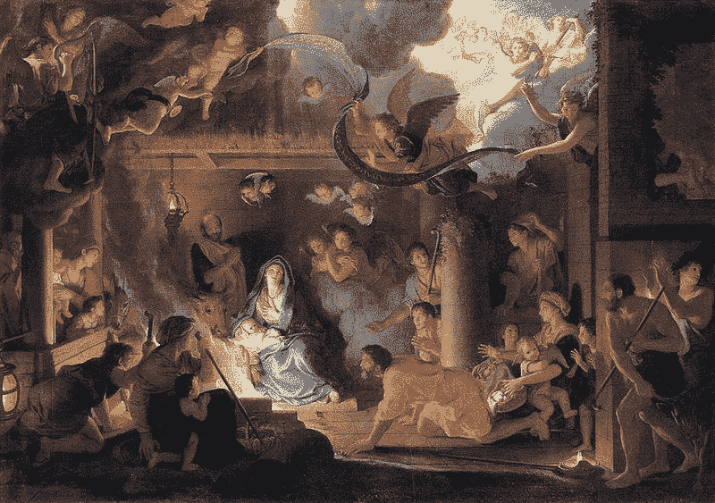
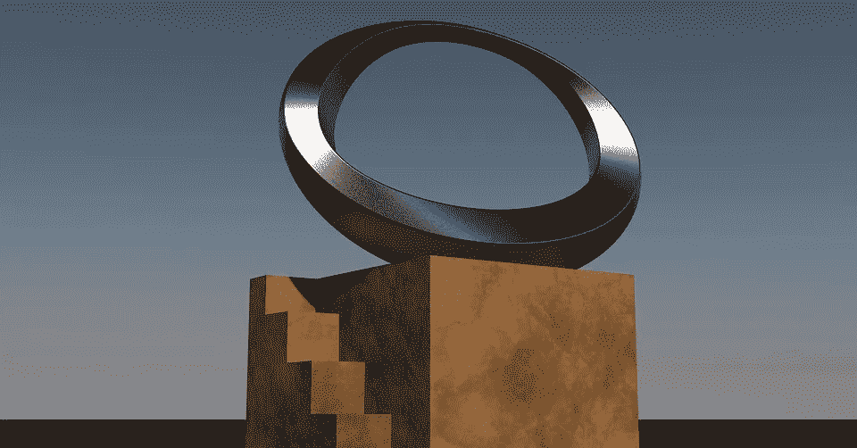
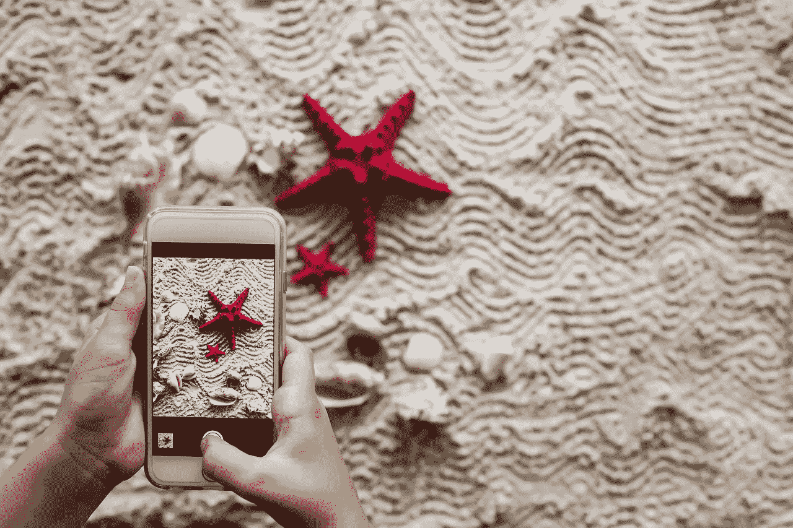

# 增强你的艺术游戏

> 原文：<https://medium.com/hackernoon/augment-your-artistic-game-783555c62da3>

增强现实作为一种教育工具和娱乐方式正在获得越来越多的关注，但在另一个行业，增强现实能够实现一些全新的东西:艺术。

艺术家们将永远站在[技术](https://hackernoon.com/tagged/technology)的最前沿，即使他们使用数千年前开创的相同技术手工研磨颜料来创作油画。事实上，艺术的美妙之处在于它能够跨越时代。一幅印象派画作可以在虚拟现实中栩栩如生；无声电影可以被着色和配音；艺术可以在智能手机和平板电脑上实现。

这里只是一些使用 AR 为现代人创造新的和有思想的艺术作品的项目。

# 增强古典艺术

这是我们看到美术馆和博物馆拥抱 AR 最常见的方式之一。在其最无聊的形式中，博物馆创建了简单的 AR 标签，可以对智能手机或平板电脑做出反应，显示视觉或听觉信息来响应标签(或绘画本身)，有点像简单的导游。然而，更具创新性的版本将这一想法推向了一个新的高度，创造了静态艺术的回应版本。这方面的一个很好的例子是安大略省的[美术馆](http://www.cbc.ca/news/canada/toronto/art-exhibit-combines-augmented-reality-and-classic-paintings-1.4452158)，其 ReBlink 展览展示了由平板电脑触发的经典艺术的动画版本。肖像的主题栩栩如生，最大限度地减少了与客人的互动。

AR 之旅是对 AR 的一种简单但有效的使用。像 ReBlink 这样的东西将这种标准体验提升到一个新的水平，创造出引人入胜的艺术(字面意思！)，带着经典美术的骨头。

# 增强现代艺术

经典艺术是博物馆和城市画廊的权限，但是在城市周围的共享空间和小工作室创作的艺术呢？越来越多的艺术家将 AR 作为一种手段来提升他们的艺术水平，他们在世界各地都这样做。以乔苏·亚伯拉罕的“虚拟世界”为例，当设备指向他的原始雕塑时，神秘的生物出现在 ar 中。在这种情况下，艺术家创造了一个新的物理作品，专门与新的数字作品互动。

这是艺术家探索的一个很好的途径，因为它给了他们在拥挤的空间里一个独特的元素。它还为非技术用户提供“基本体验”，同时为那些希望获得额外体验的用户添加内容。

# 增强艺术

上述硬币的另一面是仅仅为了增加艺术而创造艺术的想法。想象一下你为你的房子买的一幅画，然后你可以举起你的手机，这幅画就变成了一个动画。这是一个很好的利基市场，但是 EyeJack 认为它有前途。他们也举办画廊展览，但他们的重点似乎是销售具有增强功能的实物。如果你想知道海报放大后会是什么样子，你可以下载手机上的应用程序，然后把它举到电脑屏幕上海报的数字副本[面前，来玩这个系统。这样你就可以决定你是否想在墙上挂这个动画。漫画书是 AR 的一个特别令人兴奋的应用，我们在过去的一年中越来越多地看到它。](https://eyejackapp.com/products/cat-wall-by-ori-toor)

# 增加空白空间

如果你不能进入上面提到的空间怎么办？也许你住在一个小镇，那里没有实验性的前沿画廊。也许你的室友不希望你贴一张奇怪的猫海报，这样你就可以对着它闪手机来扩大它。别担心！像 Art.com[这样的公司给你带来了在完全空白的墙上悬挂艺术品的能力。你再也不会和你的配偶争论你的天鹅绒小丑画是“复古”还是“噩梦的素材”！虚拟挂起来就行了，通过 AR 的魔力来享受。诚然，像 Art.com 这样的服务机构更有兴趣帮助你决定一件作品是否适合你房间的范围和大小，这样你就可以买下它并挂上实物版，但不要让他们告诉你该怎么做！](https://techcrunch.com/2018/02/01/art-com-adds-augmented-reality-art-viewing-to-its-ios-app/)

*由雷恩·汉德曼为*[*www.hammerandtusk.com*](http://www.hammerandtusk.com/blog/article/augment-your-artistic-game)*所写。*