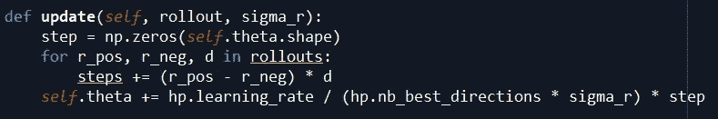

# 增强随机搜索——最好的 RL 算法之一+我构建的东西

> 原文：<https://medium.com/hackernoon/augmented-random-search-one-of-the-best-rl-algs-what-i-built-e0e3e765808a>

增强随机搜索确实是我在强化学习研究中遇到的最令人兴奋的算法之一。

增强随机搜索(ARS)实际上比其他算法快 **15 倍**，在特定应用中回报更高！这太疯狂了。

ARS 能够如此快速的方式之一是，与许多使用具有许多隐藏层的深度学习的强化学习算法不同，增强随机搜索使用感知器！需要调整和学习的权重更少，但同时 ARS 在具体应用中设法获得更高的奖励！

> 所以，更高的奖励和更快的训练时间！

使用 ARS 我对一个项目的结果非常好奇，所以我决定用 ARS 训练一只半猎豹行走。

这是人工智能学会走路的最终结果！

我只是在我的普通笔记本电脑上训练这个代理…想象一下我们可以用数百个 GPU 和计算能力做什么！其含义令人震惊！

# 有限差分法

强化[学习](https://hackernoon.com/tagged/learning)的目标是让代理学习一些东西，类似于深度强化学习算法如何使用梯度下降来优化权重和降低成本函数，ARS 使用有限差分的方法来调整其权重，*学习*如何执行任务。

## 该过程

为了有效地更新权重，代理采用微小值的**随机矩阵，并将它们添加到权重中。然后，人工智能添加完全相同的矩阵，但是这些相同的值，但是这次具有负权重。然后重复多次，最终结果是一个代理试图用稍微不同的权重执行一个任务。**

我们从环境中获得每种重量配置的奖励，有些比其他的更高。它**根据它给出最佳奖励**的权重配置来调整那些权重。奖励越高，权重调整越多，奖励越低，权重调整越少。

这个等式有助于计算。

这张图片显示了 4 种不同的重量配置，系数是该重量的正配置和负配置之间的差异。奖励之间的差异越大，换句话说，奖励越好，特定权重配置的系数就越大，这意味着它对权重的影响越大。

对上述等式的另一个修正是，研究人员立即放弃了低奖励。他们只使用奖励最高的前 k 个配置。直觉上这是有道理的，因为为什么我们要继续追求和实验低回报的重量呢？通过去掉它们，我们节省了时间和计算能力！

ARS 还通过探索策略空间而不是动作空间来做一些与其他算法不同的事情。基本上，这意味着**不是分析每次行动后得到的奖励，而是分析一系列行动**后的奖励，以确定那组行动是否导致更高的奖励。

## 总结一下主要观点:

1.  ARS 使用感知器，而不是深度神经网络。
2.  ARS 随机地给权重加上很小的值以及该值的负值，以计算出它们是否能帮助代理人获得更大的奖励。
3.  来自特定权重配置的奖励越大，其对权重调整的影响就越大。

总而言之，这是一个不可思议的强化学习算法，结果非常惊人！

## **代码&演示**

上面的这段代码非常重要，因为这是我在上面展示的等式实现的地方！这就是权重是如何根据哪个权重配置导致最大奖励而更新的！

这部分展示了如何在剧集中使用权重的正负配置来判断它们是否给出了更高的奖励。这两段代码的唯一区别是，一段指向一个带加号的正配置方程，另一段指向一个带减号的负配置方程。

现在让我们来看看一些训练视频吧！

所以一开始，你可以看到药剂在倒下前只能坚持几秒钟，然后这一集就结束了。

过了一会儿，它能够平衡了，但是它不太明白如何用腿走路。

终于在训练接近尾声时，代理人明白了如何保持平衡，并使用双腿推动自己前进。

尽管这些只是对代理正在做的事情的短暂窥视，但您可以清楚地看到从不能平衡到不能移动，再到最终平衡并移动以行走的过程！

就是这样的事情让我对强化学习如此兴奋。对于田地来说，现在还为时过早。我们可以训练代理人玩游戏，让他们像人类一样移动，甚至了解有机化学来生成新的药物！

随着指数级技术的进步，越来越多的人开始研究它们，我甚至无法想象我们将能够开发出一些独特的应用程序！

## 在你离开之前:

> ***1。* *拍拍这个帖子。***
> 
> ***2。与您的网络共享！***
> 
> ***3。跟我连上***[***LinkedIn***](https://www.linkedin.com/in/anish-phadnis-ab3149149/)***！***
> 
> ***4。查看我的网站:***[***www.anishphadnis.com***](http://www.anishphadnis.com)