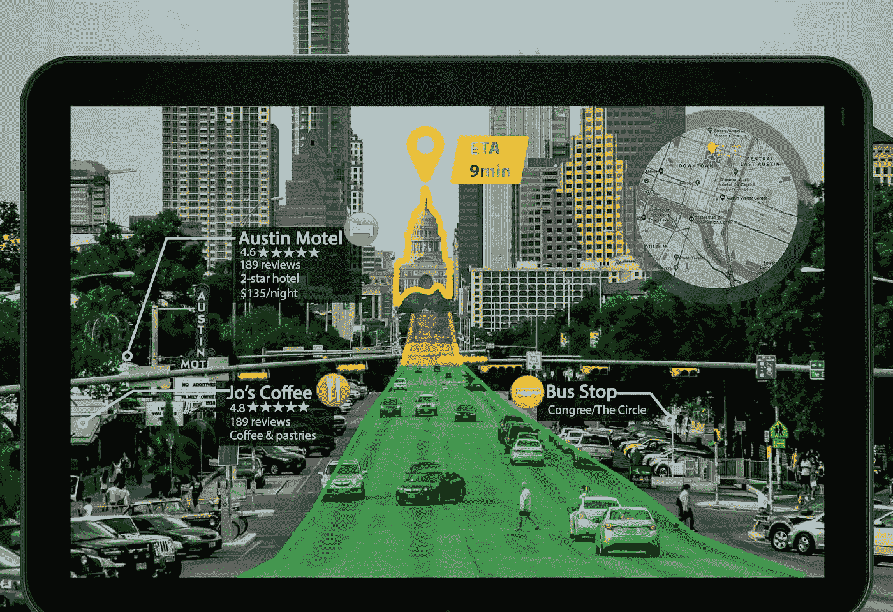

# 增强现实综述:过去六个月的新鲜 AR 视觉糖果和技术里程碑

> 原文：<https://medium.com/hackernoon/augmented-reality-ar-app-development-accelerates-as-amazon-apple-google-other-leaders-boldly-1caa9cb7f619>

就在两年前，[虚拟现实](https://hackernoon.com/tagged/virtual-reality) (VR)是 VR/AR 技术配对中被选中的一个，而 Pokémon Go 只不过是低语和安全守护的知识产权。当时，似乎只有未来学家看好[增强现实](https://hackernoon.com/tagged/augmenter-reality) (AR)，这是虚拟现实的分支，将虚拟物体置于真实环境中。

天哪，时代变了。

快进到今天，在现实世界的可用性和接受度方面，AR 现在似乎有望超过 VR。

以下是 IDC 高级研究分析师 Jitesh Ubrani 对 AR 耳机市场增长前景的看法——请记住，今天大多数消费者 AR 应用程序都是使用智能手机体验的:

“到 2021 年，AR 耳机的收入也有望超过 300 亿美元，几乎是 VR 的两倍，因为大多数 AR 耳机的平均售价都要高得多，早期采用者是商业细分市场。与此同时，大多数消费者将在移动设备上体验 AR，尽管苹果的 ARKit 和谷歌的 ARCore 应用程序进入消费级耳机只是时间问题。”

如果分析师的预测不能说服你，也许一只巨大的 AR 长老龙会:(来自去年 11 月的英雄联盟世界 2017 年总决赛)

仅在过去的六个月里，我们已经看到了一系列基于 ar 的公告和应用程序发布，它们共同预示着 AR 发展的巨大一年。

以下是硬件、电子商务、商业和娱乐领域的一些最新 AR 发展和里程碑:

# 丰富的 Android 和 iOS 对 AR 应用程序开发的支持在这里

谷歌的 [ARCore](https://developers.google.com/ar/) ，它的第二代用于 Android 设备和应用的 AR 框架[于上个月正式推出](http://variety.com/2018/digital/news/google-arcore-launch-ghostbusters-world-1202708916/)。新框架支持高级 AR 功能，以实现更加身临其境的移动 AR 体验，包括:

*   平面检测
*   真实世界的闪电
*   场景深度识别

根据谷歌关于其 1.0 版本的官方博客文章[，ARCore 目前由 13 种不同型号的 Android 手机支持，谷歌将与制造商合作，在未来一年中实现更广泛的支持。](https://www.blog.google/products/google-vr/announcing-arcore-10-and-new-updates-google-lens/)

在 iOS 方面，苹果的 [ARKit](https://developer.apple.com/arkit/) 自 2017 年下半年开始向 AR 开发者提供，为 iPhones 和 iPads 提供丰富的沉浸式移动 AR 体验。苹果在过去的一年里一直是 ar 的最大支持者之一，它早期热情地支持 AR 应用程序开发。

# 三星 Galaxy S9 新闻发布会

在上个月的三星“Unpacked 2018”活动中，该公司首次发布了 Galaxy S9 手机的官方预览，三星在演示中融入了一种俏皮的 AR 体验。活动参与者能够见证他们的姓名徽章转变为三星 Galaxy S9，能够实际上(拿着姓名徽章)翻转手机，并从不同角度检查它。

此外，三星 Galaxy S9 将允许用户创建个性化的“AR 表情符号”(类似于 iPhone X 的 Animoji，但也许[有点“恐怖谷”](https://www.theverge.com/2018/2/26/17052754/samsung-galaxy-s9-ar-emoji-mwc-2018))——这一举措，是的，让三星跟上了邻居的步伐——但也让该公司在未来扩展其基于 AR 的功能。

# 亚马逊推出基于 AR 的购物体验

亚马逊[刚刚在其亚马逊应用](https://lifehacker.com/how-to-use-the-amazon-apps-ar-shopping-feature-1823362595)的安卓版本中添加了 AR 功能，这是几个月前为 iOS 用户做的。AR 应用程序更新允许使用智能手机的亚马逊购物者将虚拟家具和数以千计的其他家居物品放入他们的真实环境中——以了解他们是否会在这种环境中摇摆。鉴于它是由亚马逊建造的，可以在附近方便地找到“立即购买”按钮。亚马逊的 AR 更新紧随宜家在 2017 年推出的[类似功能](https://www.theverge.com/2017/9/20/16339006/apple-ios-11-arkit-ikea-place-ar-app)之后。

基于 AR 的在线购物体验被认为有许多好处，包括更高的购物者参与度和购买可能性，以及降低产品退货的可能性(由于能够提前“试用”产品)。

# 英伟达推出支持下一代智能汽车增强现实的超级计算机

在 1 月份的 CES 2018 上，Nvidia [展示了其新的驱动平台](https://www.slashgear.com/meet-nvidia-xavier-a-new-brain-for-self-driving-ai-and-ar-cars-07513987/)，这是一台基于 Xavier 片上系统的超级计算机，旨在为下一代汽车添加智能，包括自动驾驶汽车。

Drive AR 是 Drive 平台的一部分，为驾驶时的 AR 体验提供软件支持(通过 SDK)。想象一下，开车穿过一个不熟悉的城市，看到一个挡风玻璃覆盖物告诉你，你正在接近的一家餐馆有这个城市顶级的周日早午餐。(只是不要在无尽的含羞草上烧坏你的刹车！)

# 未来学家认为，谷歌可以重振其处于半休眠状态的谷歌眼镜项目，将其作为一款专注于增强现实的设备。

有传言称，即使是谷歌眼镜项目谢尔盖·布林(Sergey Brin)和他的团队在几年前毫不客气地中断了(如果不算高度定制和无聊的“企业版”)[也可能在应对最近 AR 兴趣和活动激增的情况下取得胜利。可穿戴 AR 设备存在重大机遇，因为通过手持设备体验增强现实的新鲜感迟早会消失。到那个时候，像谷歌眼镜这样的轻量级可穿戴设备就可以投入使用了。](https://www.forbes.com/sites/paullamkin/2018/02/26/google-glass-could-make-comeback-in-ar-revolution/#1c1e606323a6)

说到谷歌，我们来看看它的 [AR 贴纸项目](https://arstechnica.com/gadgets/2017/12/googles-ar-stickers-app-launches-puts-star-wars-characters-in-your-camera/)(使用谷歌 ARCore)已经可以让谷歌 Pixel 2 用户做些什么:

# 像 Augmen.tv 这样的公司即将为主流电视观看带来 AR 体验。

[Augmen.tv](https://augmen.tv/) 是一家德国初创公司，正在努力创造交互式 AR 体验，以补充和补充传统的电视观看体验。该公司设想电视体验，即编程的 AR 内容将不仅为现有节目提供赏心悦目的视觉效果，还提供有用的信息。

# AR 继续在游戏和娱乐领域表现强劲

两年前，基于 AR 的手机游戏《精灵宝可梦 Go》曾是神奇宝贝公司任天堂(Nintendo)和 Niantic 的热门产品，仅在游戏的前三个月就带来了超过 6 亿美元的收入。该游戏继续表现良好，终身收入估计接近 20 亿美元。最近的一次更新增加了一个名为 AR+的新功能，使 AR 方面更加逼真。

Pokemon Go 开发商 Niantic 现在正在积极开发一款基于 AR 的哈利波特游戏，名为 Wizards Unite。据报道，该游戏还将从 Niantic 早期的 AR 游戏 [Ingress](https://www.ingress.com/) 中汲取关键元素。

# AR 活动的突然激增对其他科技公司意味着什么？

如果你不是亚马逊(Amazon)、谷歌(Google)或英伟达(Nvidia)，并且你所在的领域已经开始展示有意义的增值用例，那么你可能正在考虑一些严肃的战略决策。

如果市场领导者正在积极地将有意义的 AR 体验部署到他们的核心产品中，那么可以肯定的是，中端市场和较小的参与者也会这样做，以保持相关性甚至偿付能力。

但是，如果你不是一个科技巨头，比如说，拥有一两家 AR 公司，你如何进入 AR 应用程序呢？

对于那些没有数十亿美元 R&D 预算的公司来说，好消息是，有 [ar/VR 开发商](https://citrusbits.com/)和技术公司正在降低那些希望使用 AR 保持相关性或加速增长的较小公司的准入门槛。

# AR 真的会超越 VR 吗？

科技界的一个大腕似乎也这么认为。

去年年底，苹果发布 ARKit 后，苹果首席执行官蒂姆·库克(Tim Cook)说了以下话:

“AR 让我非常兴奋，因为我可以在任何地方看到它的用途。我可以看到它在教育、消费、娱乐和体育方面的用途。在我所了解的每一个行业中，我都能看到这一点。我也喜欢[AR]不孤立。我不喜欢我们的产品被大量使用。我喜欢我们的产品放大我们。我认为 AR 可以帮助扩大人类的联系。我从来不是这样的虚拟现实粉丝，因为我认为它恰恰相反。虚拟现实显然有一些很酷的利基类的东西。但在我看来并不深刻。AR 是深刻的。”

而且，最近:

> “简而言之，我们相信增强现实将永远改变我们使用技术的方式，”库克在几个月前苹果第四季度财报电话会议上说。“我们已经看到了改变您工作、娱乐、联系和学习方式的事物。”

鉴于最近重大 AR 项目的激增，苹果公司的首席执行官似乎开始展现出他的前任曾经闻名的一些先见之明。这对于我们这些准备充实现实的人来说无疑是个好兆头。