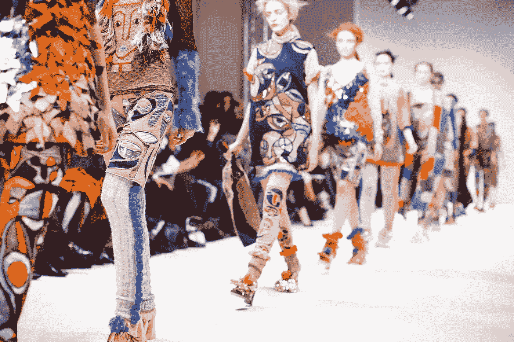
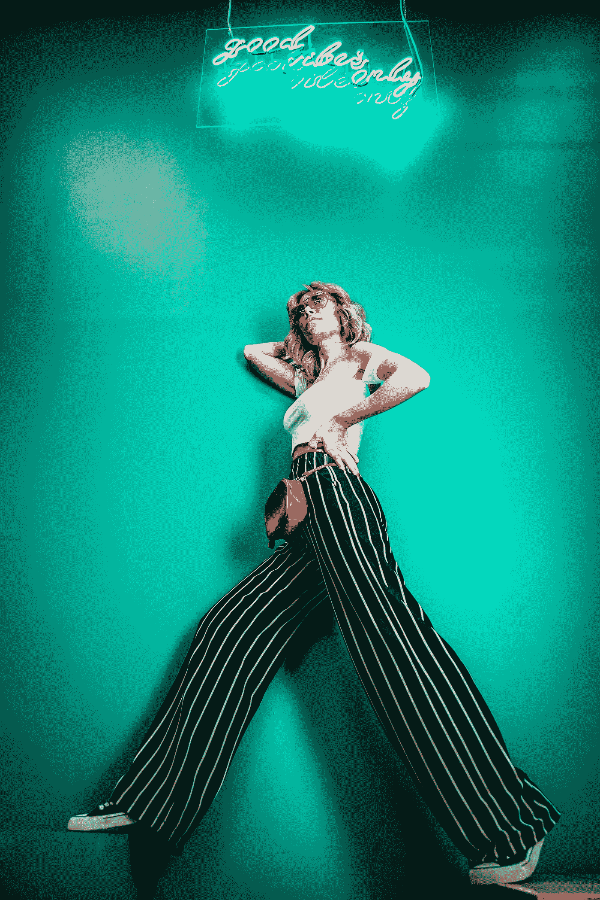

# 增强现实(AR)——时尚品牌为“数字化改造”做好准备

> 原文：<https://medium.com/hackernoon/augmented-reality-ar-fashion-brands-gear-up-for-a-digital-makeover-eb57cc738686>

Photo by [Kris Atomic](https://unsplash.com/photos/VqGtCkWIflQ?utm_source=unsplash&utm_medium=referral&utm_content=creditCopyText) on [Unsplash](https://unsplash.com/search/photos/fashion?utm_source=unsplash&utm_medium=referral&utm_content=creditCopyText)

随着时尚品牌准备进行数字化改造，我们的下一次购物体验可能由增强现实(AR)驱动。

在 2018 年的一项综合研究中，由**麦肯锡&公司**和**时尚产业** (BoF)进行的“ [*时尚状态*](https://cdn.businessoffashion.com/reports/The_State_of_Fashion_2018_v2.pdf) ”中，领先的创新者将揭示人工智能在时尚价值链所有部分的可能性，探索为时尚产业从业者创造价值的新方法。研究显示，超过 75%的时尚零售商计划在 2018/2019 年投资 AI。

最近，Zara 的母公司 Inditex SA 宣布将重心转向在线业务。运营其[“全球商店和在线平台”](https://elpais.com/elpais/2016/11/24/inenglish/1480003644_777589.html)所需的技术已经吸引了约 22 亿美元的创纪录投资。

时装业被认为是全球经济中最大的产业之一，是一个价值约 2.4 万亿美元的产业。因此，对时装业来说，持续创新的需求至关重要。除了将业务转移到网上，时尚品牌还在不断推出富有创意和吸引力的方式来吸引眼球。从为时尚趋势部署预测分析到雇用缝纫和裁剪面料的机器人，时尚行业的人工智能增强正在超越传统的自动化任务。最新的是增强现实(AR ),它被部署在商店和网上。

最近， [**古驰**](https://thecurrentdaily.com/2018/03/01/gucci-spring2018-vr-ar-campaign/) 为其 2018 年春季广告，[古驰幻觉](https://www.facebook.com/GUCCI/videos/10155925288641013/)透露了其可扫描广告、VR 和 AR。

Video Credit — Gucci

在古驰的 52 家精选商店，顾客购买后可以获得虚拟现实设备门票形式的西班牙艺术家伊纳西·蒙雷亚尔的作品。这展示了蒙雷亚尔竞选艺术作品的 360 度全景。通过古驰应用程序的可扫描广告也可以在 20 个印刷广告中的 15 个中找到，并允许消费者在 AR 中发现广告。

为了吸引千禧一代，从 2018 年 4 月 18 日起， [**Zara**](https://www.reuters.com/article/us-inditex-zara-technology/zara-to-lure-millennials-with-augmented-reality-displays-idUSKCN1GP2TC) 将在全球 120 家商店使用 AR 展示。AR 功能允许客户将他们的手机放在商店或指定橱窗内展示的模型的传感器前。只需点击一下，购物者就能立即买到精选的款式。

公平地说，通过苹果的 [ARKit](https://developer.apple.com/arkit/) 和谷歌的 [ARcore](https://developers.googleblog.com/2018/02/announcing-arcore-10-and-new-updates-to.html) ，AR 在时尚行业的引入变得更加容易，后者允许智能手机集成。

苹果的 AR 开发者平台为时尚品牌利用 iPhones 和 iPads 吸引观众铺平了道路。依靠苹果 ARKit 的一些领先品牌有**和 [**Vogue**](https://www.mobilemarketer.com/news/vogue-partners-with-apple-on-ar-powered-ugc/510700/) 。总部位于伦敦的奢侈品牌博柏利于 2017 年 9 月转向 ARKit，以“数字方式影响”购买。该功能允许通过摄像头进行更多的客户互动。利用这些，周围的环境被艺术家丹尼·桑格拉以博柏利为灵感的画作数字化重现。用户还可以使用博柏利相框在社交媒体平台上创作涂鸦，分享和导出。**

**通过苹果的 ARKit，康泰纳仕的 **Vogue** AR 体验允许用户在当前环境下创建一个分层图像，就像“[21 世纪迪斯科魅力旋转](https://www.vogue.com/article/vogue-apple-augmented-reality-experience)”。前置摄像头的 Face ID 创建了一个多维过滤器，这是 iMessage 的扩展，被称为“时尚效应”。创建的 AR 图像可以下载，并可以作为消息发送。**

****

**Photo by [Ahmed Carter](https://unsplash.com/photos/tiWcNvpQF4E?utm_source=unsplash&utm_medium=referral&utm_content=creditCopyText) on [Unsplash](https://unsplash.com/search/photos/fashion?utm_source=unsplash&utm_medium=referral&utm_content=creditCopyText)**

**给 Android 用户带来 AR 体验的是拥有 Pottery Barn 和 Gap 这样用户的 Google。**

**2017 年， **Gap** 透露了其建造增强现实“[试衣间](https://adressed.gapinc.com/blog/gap-ces-announcement-2017-dressingroom-app)”的计划，供用户在家试穿衣服。[与谷歌](https://blog.google/products/google-vr/welcoming-more-devices-daydream-ready-family/)和初创公司 [Avametric](https://www.avametric.com/) 合作开发的这款应用程序允许用户在更衣室添加体重和身高等信息，之后一个 3D 模型就会出现在用户面前。用户可以看到和尝试不同的外观，以决定在通过应用程序购买之前选择什么样的服装。2013 年，总部位于日本的零售商 [**优衣库**](https://www.youtube.com/watch?v=oUD57MpHAE8) 推出了 AR 更衣室，允许客户通过滑动手机的触摸屏来尝试不同的颜色，看看他们在魔镜中的样子。**

****但有趣的是，时尚中的 AR 体验并不仅限于衣服。****

**鞋子、珠宝和化妆品品牌越来越多地投资于 AR。2017 年， [**MAC**](https://www.cnet.com/products/modiface-mirror/preview/) 安装了带虚拟试衣镜的 AR。该镜子由 Modiface 提供支持，依靠面部识别并通过实时视频绘制面部地图，以实现准确的外观。然后，用户在脸上涂上化妆品，以便做出决定。2017 年推出的 [**丝芙兰**](https://www.theverge.com/2017/3/16/14946086/sephora-virtual-assistant-ios-app-update-ar-makeup) 的 AR 体验，“丝芙兰的虚拟艺术家”也是由 Modiface 打造。通过面部扫描，该应用程序可以识别出嘴唇和眼睛，并允许用户尝试不同的唇色、眼影和假睫毛风格。**

## ****底线****

**为了成功采用技术，时尚品牌需要设计有效的营销策略，并与谷歌、脸书、苹果和 Instagram 等在线平台合作，以应对不断变化的消费者需求。**

**简言之，时尚品牌越快理解技术创新的需求和重要性，就越容易实现数字化转型。**

****

**Clap below to recommend this article to others!**