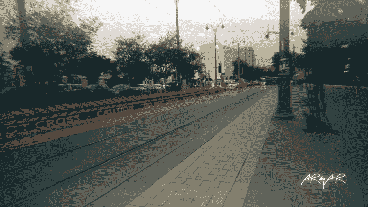

# 增强现实全息屏障

> 原文：<https://medium.com/hackernoon/augmented-reality-holographic-barriers-5d94f7c4105b>

## 以及它们如何让我们的街道变得更安全

2025 | YouTube

# 这是怎么回事？

当有轨电车/轻轨接近时，一个增强的现实全息屏障会沿着电车的路线出现，让行人和汽车更容易看到，让我们有更多的时间去注意和反应。

# 这是什么意思？

有一天，当我走在耶路撒冷的一条主要街道上时，这种情况发生在我身上，行人和电车共用这条街道。

*我以前走过这条街很多次，我知道有轨电车在那里。但这一天是周五，出于对安息日的尊重，电车提前结束运行。他们不该出现在街上。就这样，我戴着耳机听着播客，走在铁轨上，这时我注意到有人从眼角向我打手势。他们告诉我要看后面。我摘下耳机，转过身，迎面而来的是一辆几英寸外的电车，疯狂地发出嘟嘟声。我很尴尬，赶紧离开铁轨，就在这时，我注意到在电车上，用鲜橙色的字母写着一个词——****Depot****。*

人类有向前看的眼睛，除非我们中的一些人承担了某些教育角色，否则我们不会有第二副眼镜。我们已经非常关注眼前的事情了。加上我们耳朵里的耳机，(并且一天中越来越多)，我们真的开始失去那些通知我们周围环境的感觉。

Earlier concept for visualising a tram approaching from behind

这些技术正在慢慢地阻挡我们的自然感觉和我们的周围，这是一个问题。我们正在失去与周围世界和谐相处的能力。

这就是**增强现实**与众不同的地方。它增强了我们的现实，即我们的五种感官。它让我们既能生活在我们的世界里，与它互动，同时又能与数字世界相连。

你可以明白我的意思…如果我们能做到，为什么不扩大我们的视野呢？添加一些东西，让我们能够意识到我们身后正在发生的事情，以及可能即将发生的事情。

Another concept, from above

> 这就是增强现实。它增强了我们的现实，即我们的五种感官。

那天，全息屏障或某种视觉投影肯定会救了我。从我两侧的地面升起，让我知道有一辆电车从后面驶来。加个计时器怎么样，告诉我电车什么时候会经过这个地方。)

# 我为什么要在乎？

很像发生在我身上的事，我敢肯定你以前没有采取任何预防措施就走上了这条路。我们每个人都经历过。

我的观点是，我们都知道，当我们走在路上或过马路时，我们需要意识到我们的周围，但有时我们会非常专注于那一刻发生的事情，而没有注意到。我们变得自满。这是我们每天都在做的事情，我们认为我们已经掌握了。我们不会出事故的——除非我们出了事故。

这个障碍绝不是停止警惕的理由。它在这里起辅助作用，很像我们晚上穿反光背心或者学校附近有学校路口的时候。这应该被看作是帮助我们的一种方式，给我们额外的时间，做好准备。它应该被看作是我们感官的增强，而不是替代。

希望这样做可以拯救生命。

## 2025 是什么？

> 增强现实的日常使用案例。太多时候，人们要么将 AR 与一个噱头游戏(Pokemon Go)或一个与他们或现实世界无关的幻想科幻世界(钢铁侠)联系在一起。通过《2025》，我想改变这种看法。

## 2025 系列的其他故事

 [## 增强现实将如何拯救生命

### 注意看路

hackernoon.com](https://hackernoon.com/how-augmented-reality-will-save-lives-8d90d1281b05)  [## 增强现实扬声器

### 音乐能不能变得更刺激，更有个性？

medium.com](/@avrahamraskin/augmented-reality-speakers-d7345d660d3d)  [## 通过增强现实将任何哑扬声器变成智能扬声器

### 我想展示增强现实的日常使用案例。太多时候，人们要么将 AR 与噱头游戏联系在一起…

medium.com](/@avrahamraskin/turn-any-dumb-speaker-into-a-smart-speaker-with-augmented-reality-433fd4d5af9c) 

You can find ‘2025’ on [Instagram](http://instagram.com/avrahamraskin) | [Youtube](https://go.avrahamrask.in/2025) | [LinkedIn](http://linkedin.com/in/misterar) | [Facebook](http://facebook.com/ayraskin)

## 还有一点

我 2018 年的目标是粉丝达到 500 人。所以如果你喜欢我关于 AR 的文章，并且你喜欢这种方法，请关注并与你最好的朋友分享！