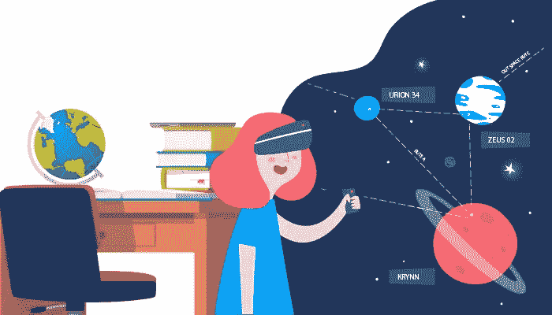
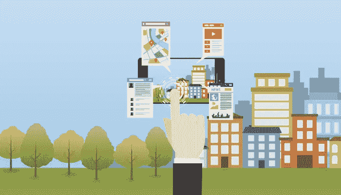
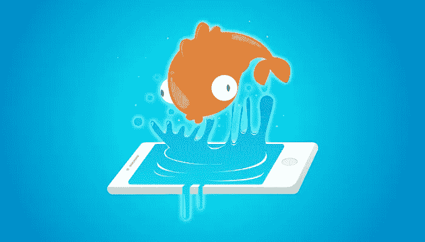

# 增强现实出版解决方案:从印刷到数字的最快途径

> 原文：<https://medium.com/hackernoon/augmented-reality-publishing-solution-the-fastest-way-from-print-to-digital-8c5436126fa2>

## 增强现实是一种新兴技术，是教育图书出版的新方向，旨在为生活带来交互式学习体验。用户可以在出版物中探索一种新的应用程序，通过应用增强现实技术，将书籍上的印刷图像提升到一个新的水平。

AR Publication solutions

这些应用程序为移动设备上的读者提供了独特的迷人体验。增强现实(AR)技术俱乐部动画具有实时性，给书籍和杂志的读者带来新的数字娱乐体验。出版物中的 AR 技术显示 3D 模型、3D 动画、视频播放、网站和 web 服务器连接，让孩子们以一种全新的方式接受教育。

**出版商如何在现实生活场景中应用增强现实**

增强现实与视觉对象跟踪设备一起使用，以帮助用户了解和体验更多。[出版物中的增强现实](http://www.quytech.com/augmented-reality-in-publication.php)允许用户查看叠加了虚拟物体的真实世界。它帮助用户感受现实中从未探索过的事物。因此，虚拟对象与真实世界的组合将用户体验带到了另一个层次。

AR 技术补充了现实，使读者完全融入模拟环境。通过使用 AR 应用程序，读者可以在设备上的同一个屏幕中查看共存的虚拟和现实对象。

该出版物中的增强现实(AR)是一个广阔的领域，包括精确跟踪视频对象的运动和位置的技术任务。除此之外，使用实时背景环境的阴影和颜色无缝地渲染虚拟图像。

AR 通过教育书籍在出版中的创新应用吸引用户，为孩子们创造数字娱乐。

**出版物 AR 特色列表**

[AR 应用](http://www.quytech.com/augmented-reality-apps.php)只需在用户的设备屏幕上点击几下，就能创造出高质量的体验。AR 功能将为用户提供完整的体验，帮助他们测试、播放和交付完全沉浸式的用户体验。增强现实功能包括 ***视频、音频、动作按钮(CTA)、图像、文本、3D 模型*** 甚至是出版物领域的附加事实。

Add Virtual elements in static content

AR 用于吸引新用户，同时推出新产品或将该技术引入现有产品。

它可以用于广告牌，提高消费者的品牌意识，改善目标受众的品牌认知。

出版物中的 AR 可以通过宣传品牌及其产品的属性来增加产品的使用频率。

AR 用于通过将印刷广告活动转化为真正吸引人的活动来建立产品的形象。

通过交互式 AR 体验，用户可以通过添加丰富而迷人的内容来可视化超出想象的世界。

广告公司可以在印刷广告和纸质出版物中寻找新的生命。

AR 功能使品牌(酒精和烟草)能够向其客户发送隐藏的信息，而他们的直接广告可能会受到限制。

读者可以直接从 AR 广告、AR 标志或 AR 广告牌上预订或购买不同的产品或服务。

AR 提供了一个机会来解锁在线销售，并比以前更好地推动营销活动。

高质量的 AR 体验可以创造产品的病毒效应，使您的产品更容易识别。

**商业前景的最终决定**

结果表明，具有交互式 3D 动画和自我评估功能的 AR 显著支持学生改善他们的学习体验。当谈到品牌市场时，它可以改善公司的形象，也可以促进销售。

AR 技术的关键特征是，它在没有人类干预的情况下，在与打印在纸上的对象相同的领域中呈现辅助信息。从商业角度来看，AR 在数字出版领域创造了一个新的商业营销维度，并增加了出版业务的销售利润。

感谢您阅读我的文章。

如果你有任何问题，请随时给我发电子邮件。你也可以通过 Linkedin 联系我。你也可以在推特上关注我。

阅读更多:[增强现实如何影响广告业](http://www.quytech.com/blog/augmented-reality-for-advertising/)