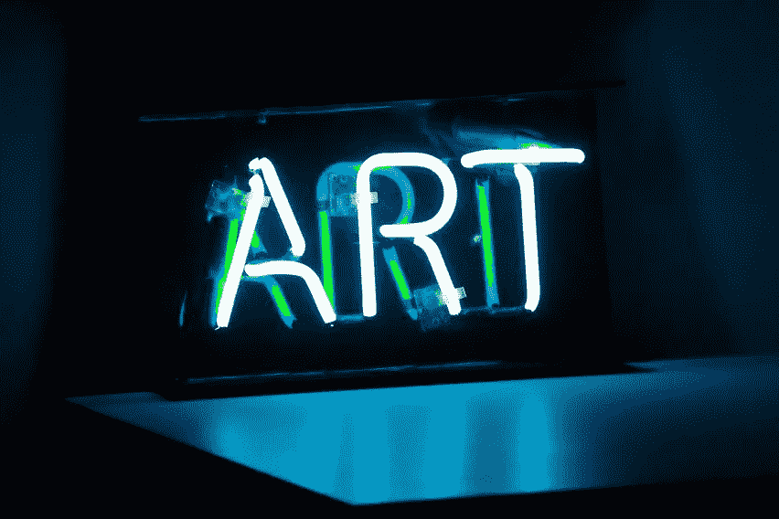

# 通过区块链鉴定艺术品

> 原文：<https://medium.com/hackernoon/authenticating-artwork-through-blockchain-f6376363ba93>

> 以太坊艺术集体的执行董事杰奎琳·奥尼尔。[原载](https://www.quora.com/How-are-art-and-new-technology-connected/answer/Jacqueline-ONeill-14)于 [Quora](http://quora.com/?ref=hackernoon) 。

赝品一直是艺术界不可回避的问题。据估计，国际市场上流通的艺术品中大约有一半是赝品。

问题是，目前的认证方法在系统中留下了许多漏洞。艺术品消失了，然后又神秘地出现在市场上。有才华的伪造者用赝品冒充真品。收藏家们开始怀疑他们购买的昂贵艺术品是否真的物有所值。

有一个解决方案可以真正鉴定艺术品并填补系统中的空白——区块链。

以下是如何在艺术界产生影响:

# **我们现在的认证方式并不有效。**

对大多数人来说，鉴定艺术品是极其昂贵的。你可以很容易地花 2000 美元来鉴定一件作品。

这个过程已经把这个行业变成了富人的俱乐部。如果你想让他们认真对待你和你潜在的有价值的艺术作品，你必须属于某个特定的群体。他们根本不会相信一个他们从未听说过的人拥有莫迪里阿尼——历史上最伪造的艺术家之一。

即使你真的闯入俱乐部，花了钱去鉴定你的作品，然后呢？如果你的作品是原创的，如何证明呢？一般来说，有一张证明你的作品是真品的实物证书。

不幸的是，一张纸上说你的作品是真实的并不意味着什么。它可能会丢失、被盗、被破坏。一旦它与艺术品分离，它就变得毫无意义。

而且那些实体的纸片可能没有你想象的那么真实。看看埃里克·伊恩·霍纳克·博兹的故事就知道了，他是一名艺术品经销商，也专门伪造真品证书。他在被捕前诈骗了艺术收藏家 145 万美元。

# 人们试图解决这个问题——但是缺少了一些东西。

目前有许多公司致力于解决这个问题。但是他们中的大多数都缺少物理-数字链接。

实物资产与其在区块链上的身份之间的一对一联系对于安全鉴定艺术品至关重要。这是因为网上流传的数字身份不能提供同样的安全性。它不会给出交易或位置的实时信息。

如果没有一对一的联系，系统中就会出现漏洞，让人们可以插入伪造品或更改数据。即使一件作品或艺术品在网上注册了，也不能阻止有人用赝品替换掉它，冒充真品。

唯一能够提供真正安全、经得起时间考验的身份认证的方法是将实物艺术品与数字记录一对一地联系起来。

科技公司 Chronicled 开发了一种防篡改的加密印章，贴在艺术品上，在实物和区块链的数字身份之间建立了一对一的联系。随着技术的进步，除了防篡改封条之外，将有更多的选择来[将物理作品与数字世界](https://www.artsy.net/article/artsy-editorial-these-four-technologies-may-finally-put-an-end-to-art-forgery)联系起来。

今天，这些技术包括复杂的肽质量指纹(PMF)，嵌入式合成 DNA，以及可以识别个人笔迹的机器技术。

# **在区块链注册资产提供了一个与艺术品不可改变的链接。**

目前，加密印章是实物艺术和数字记录之间缺失的一环。

很容易应用于艺术品，它不需要电池，并保持无限期固定在艺术品上。试图删除它就像删除一个艺术家的签名。

有人问我，“我们怎么知道这个系统会在 20 年后出现？”

这是一个很好的问题，但你必须明白，区块链会留在这里。人们已经向它注册了如此多的数据，我们已经走过了不归路。预计交易量最终将超过 Visa 网络。

如果有人在 20 年内拥有一件带有隐印的艺术品，这个人仍然可以在 Chronicled 的基础设施支持的网站上验证它。

区块链不会去任何地方。也不是验证艺术品的印章。

# 我们仍然需要专家和拍卖行。这个系统只是提供支持。

有两种可能的方法来实现这种区块链解决方案。

一种是草根的、自下而上的方法，从艺术家和较小的画廊开始。另一种是自上而下的方法，从艺术界的机构开始。

事实上，我们需要这两种方法的结合。

一个基于区块链的艺术品鉴定系统并不意味着要取代艺术界现有的结构。

我们还需要有人来鉴定这些作品，然后才能给它们盖章。总会有一个地方给那些已经建立了声誉并磨练了辨别赝品和真品能力的人。这些技能非常有价值。这项技术不是为了颠覆艺术界，而是为了与艺术界并肩工作。

在以太坊艺术中心，我们已经开始与艺术博览会、画廊和拍卖行讨论区块链。我们对他们的回应很满意。人们知道当前的身份认证过程存在重大问题，他们愿意使用新技术来寻找解决方案。

最终，这将有助于整个艺术界——艺术家、收藏家和买家——并有望从赝品市场上分一杯羹。

> 以太坊艺术集体的执行董事杰奎琳·奥尼尔。[原载](https://www.quora.com/How-are-art-and-new-technology-connected/answer/Jacqueline-ONeill-14)于 [Quora](http://quora.com/?ref=hackernoon) 。
> 
> 更多来自 Quora 的趋势科技答案，请访问[HackerNoon.com/quora](https://hackernoon.com/quora/home)。