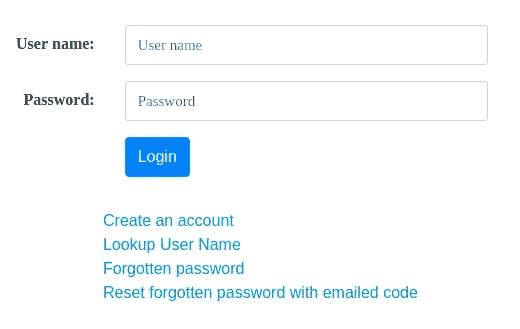

# 使用 AWS Cognito 进行身份验证

> 原文：<https://medium.com/hackernoon/authentication-with-aws-cognito-bc8d1484600b>

Authentication is the gateway for your application (iron gate by A. Gaudi)

# 介绍

登录页面是大多数 web 应用程序用户遇到的第一件事。帐户创建是所有新应用程序用户在使用 web 应用程序之前必须通过的关口。这意味着身份验证(帐户创建、登录和用户数据管理)是大多数 web 应用程序的关键组件。

本文讨论了 Amazon Web Services (AWS) Cognito 服务，以及如何使用它为使用 [Spring framework](https://spring.io/) 构建的 Java web 应用程序构建服务器端认证。

本文中描述的演示应用程序的 Java 源代码可以在 Apache 2 软件许可下从 [GitHub](https://github.com/IanLKaplan/CognitoDemo) 上获得。

创建能够抵御密码攻击的强大身份验证软件需要谨慎、明智的设计。身份验证需要持久存储用户信息(密码和用户帐户信息)。这通常由一个每周 7 天、每天 24 小时可用的数据库来支持。无论使用多少，该数据库都会产生运行成本。

对于 [*地下*](http://www.nderground.net/) 社交网络，Topstone Software 开发了一个使用 RDS/Postgres 数据库的定制认证基础设施。除了加密的密码和唯一的[“salt”值](https://en.wikipedia.org/wiki/Salt_(cryptography))之外，对于每个用户，该数据库还保存有地下组织(地下卡拉斯)使用的访问和安全信息。选择 RDS/Postgres 数据库而不是像 Amazon 的 DynamoDB 这样的 NoSQL 数据库来存储关键用户信息，因为 Postgres 是一个事务安全的 SQL 数据库。

AWS Cognito 通过提供认证服务简化了应用程序开发。除了存储密码和电子邮件信息，Cognito 还可以存储标准和定制的用户帐户值。Cognito 是一种“无服务器”服务，不需要部署 RDS/Postgres 这样的全天候数据库服务器。Cognito 的成本模型是“现收现付”。目前，前 50，000 名月用户(每月至少登录一次的用户)是免费的。

为*under ground*开发的定制认证软件可以集成到新的 Topstone Software web 应用程序中。但是，这将产生一台 24/7 RDS/Postgres 服务器的成本。

Topstone Software 设计和构建的 Web 应用程序的架构目标之一是成本随用户数量的增加而增加。只有几个用户的应用程序应该具有较低的成本，随着用户群和性能需求的增加，成本也会增加。使用 AWS Cognito 有助于满足这一架构目标，因为它不再需要数据库服务器来存储用户认证信息。

# 了解 AWS 认知

Cognito 是为各种应用用例而设计的。Cognito 可用于移动设备的客户端认证、客户端 web 应用程序(使用 JavaScript)和服务器端认证(本文讨论的应用程序)。Cognito 基础设施甚至可以为各种身份验证任务提供网页。

Cognito 的不同应用方式会使 Amazon 文档难以理解。描述身份验证任务(例如，通过电子邮件或 SMS 文本消息创建和验证帐户)的文档在同一部分描述了许多不同的使用情形。

在撰写本文时，Amazon 还没有为 Cognito 服务器端认证提供 Java 参考代码。Cognito API 的 AWS Java SDK 文档只有很少的文档，很难理解如何应用该 API。

本文和相关的 [GitHub](https://github.com/IanLKaplan/CognitoDemo) Java 源代码旨在帮助 Java 软件工程师理解如何将 Cognito 集成到 Java Web 应用程序中。

# 认知用户池

Cognito 可以支持多一个“用户池”。每个“池”包含一组用户的登录和用户信息。可以创建生产和测试用户池，以便应用程序测试不会影响认知生产用户信息。

Cognito 还提供了一个用户界面，允许管理特定池中的用户。该用户界面可通过 AWS 控制台登录获得，可以通过双因素身份验证进行保护。

# 认知认证支持

AWS Cognito 服务提供了对各种身份验证特性的支持，其中许多特性在这个演示应用程序中没有使用。例如，Cognito 可以支持高安全性应用的双因素认证和 [OAuth](https://oauth.net/) ，后者允许应用使用 OAuth 提供商(如 Google、脸书或 Twitter)进行认证。

Cognito 支持安全创建应用程序帐户所需的步骤。这包括向用户的电子邮件发送临时密码，并使用该密码进行临时身份验证，从而允许用户创建永久密码。

Cognito 还支持在用户忘记密码的情况下重置现有帐户的密码。Cognito 将通过电子邮件向用户发送一个代码，该代码可用于创建新密码。

下图显示了新帐户和忘记密码的网页流程。在这个演示应用程序中，Spring 代码通过 Spring 控制器对象支持控制流。

# Cognito 演示应用程序概述

Cognito 演示应用程序包含应用程序身份验证和用户管理的基本组件。这包括使用 Cognito 的服务器 Java 代码和与身份验证相关的 web 页面。代码和网页都是开源的，以 [Apache 2 软件许可](https://www.apache.org/licenses/LICENSE-2.0)发布

Cognito 演示应用程序可以从 [GitHub 库](https://github.com/IanLKaplan/CognitoDemo)中“克隆”出来。该应用程序是使用 [Spring 框架](https://spring.io/)构建的，利用了 Spring Boot 和 Spring MVC 组件。

基于 Eclipse 的 Spring 工具套件(3.9.4 版)用于开发应用程序。项目文件包含在 GitHub 存储库中。

应用程序网页是使用 [Java Server Pages](https://en.wikipedia.org/wiki/JavaServer_Pages) (JSP)构建的，这是一种用于构建 Java web 应用程序的服务器端渲染技术。页面使用 [Bootstrap](https://getbootstrap.com/) 和 [Kube](https://imperavi.com/kube/) 用于设备无关的格式和字体。

## 应用程序组件

*   **控制器**
    Spring 控制器为网页提供服务器端逻辑(例如，表单输入验证和处理)。大多数控制器都有处理 HTTP GET 和 POST 操作的独立函数。
*   **视图**视图
    视图包含了 Java Server Pages (JSP)网页。每个网页对应一个控制器类。
*   **服务**
    服务包包含支持控制器的代码。在这个演示应用程序中，核心类是 AuthenticationService，它实现了 AuthenticationInterface。AuthenticationService 类包含与 Cognito 交互的代码。

# 入门指南

本文假设读者已经拥有一个 Amazon Web Services 帐户，并且有使用其他 Amazon 服务的经验。

## 获取认知 IAM ID 和密钥

Amazon 服务的推荐方法是，应用程序应该使用尽可能少的权限。这划分了访问和安全性。例如，要使用 DynamoDB，您需要使用 DynamoDB 权限，对于 Cognito，您需要使用 Cognito 权限。

我使用以下步骤创建了在 Cognito 演示应用程序中使用的 IAM 权限。

*   创建一个名为 cognitoPowerUser 的 IAM 组。这个组只有一组权限:AmazonCognitoPowerUser
*   创建一个与 cognitoPowerUser 组相关联的 IAM 用户(我将这个用户命名为 cognitoPowerUser)。
*   单击 IAM 用户部分中用户的链接。然后转到 Security Credentials 选项卡，获取 Cognito ID 和密钥。
*   在可以从 GitHub 克隆的源代码中的 cogn ITO _ demo . services . cognitoresources . Java 接口中填写 ID 和密钥。

## 构建认知用户池

创建演示应用程序使用的 Cognito 用户池所需的步骤在[这里](http://topstonesoftware.com/publications/creating_a_cognito_user_pool.html)描述。

# Cognito 演示应用程序

身份验证不仅仅包括对登录的支持。登录页面的屏幕显示如下:

用户通过输入他们建议的用户名、电子邮件地址和位置来创建帐户。位置是可以与用户的认知信息相关联的任意信息的示例。

当这些信息提交给 Cognito 时，用户将收到一封临时密码的电子邮件。这确保了用户输入的电子邮件地址是有效的。

当用户使用临时电子邮件地址登录时，页面控制器中的 Java 软件可以检查登录是否使用了临时密码。如果是这种情况，可以将用户转到一个页面，允许他们使用自己选择的密码重置密码。

如上面的屏幕截图所示，用户还可以恢复忘记的用户名或重置忘记的密码。忘记密码重置通过电子邮件发送给用户的代码进行。

身份验证软件还必须支持登录用户的密码和用户信息更改。演示*应用*页面如下所示。该网页是应用程序主页的代理。

# Java 认证 API

该应用程序中用于身份验证的 Java API 概述如下:

*   changeEmail(字符串 userName，字符串 newEmailAddr)
*   changeFromTemporaryPassword(最终密码请求密码请求)
*   更改密码(密码请求密码请求)
*   createNewUser(UserInfo 用户信息)
*   deleteUser(字符串用户名，字符串密码)
*   findUserByEmailAddr(最终字符串电子邮件)
*   forgotPassword(最终字符串用户名)
*   getUserInfo(字符串用户名)
*   hasUser(字符串用户名)
*   resetPassword(重置密码请求重置请求)
*   update user attributes(UserInfo newInfo)
*   userLogin(字符串用户名，字符串密码)
*   用户注销(字符串用户名)

这个 API 抽象了 Cognito 操作，这样就不会在 AuthenticationService 类之外引入 Cognito 依赖项。理论上，AuthenticationService 类可以由使用另一个认证基础设施的另一个类代替(例如，为*地下*社交网络开发的 RDS/Postgres 认证基础设施)。

实际上，一旦采用 Cognito，从 cogn ITO 迁移会有问题，因为应用程序用户将不得不使用新的基础设施重新创建他们的帐户。

*这篇文章的原文可以在* [*这里找到*](http://topstonesoftware.com/publications/authentication_with_aws_cognito.html) *，在* [*托普斯通软件咨询*](http://topstonesoftware.com/index.html) *。*