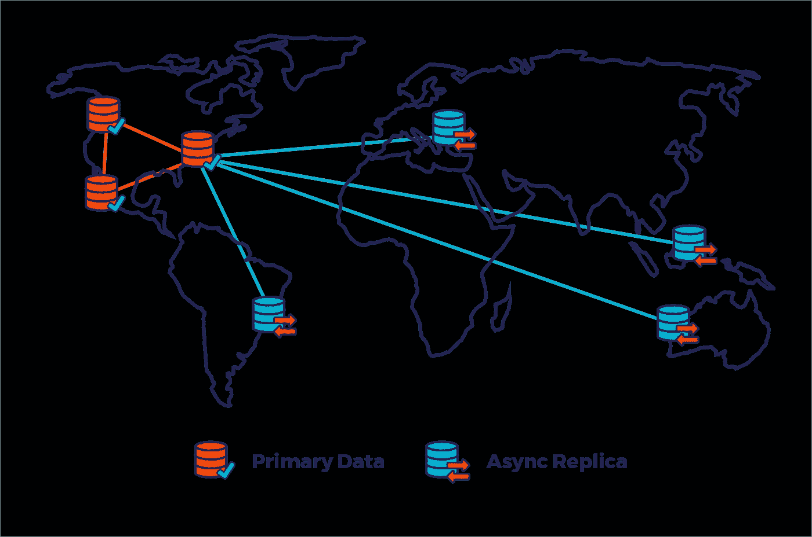
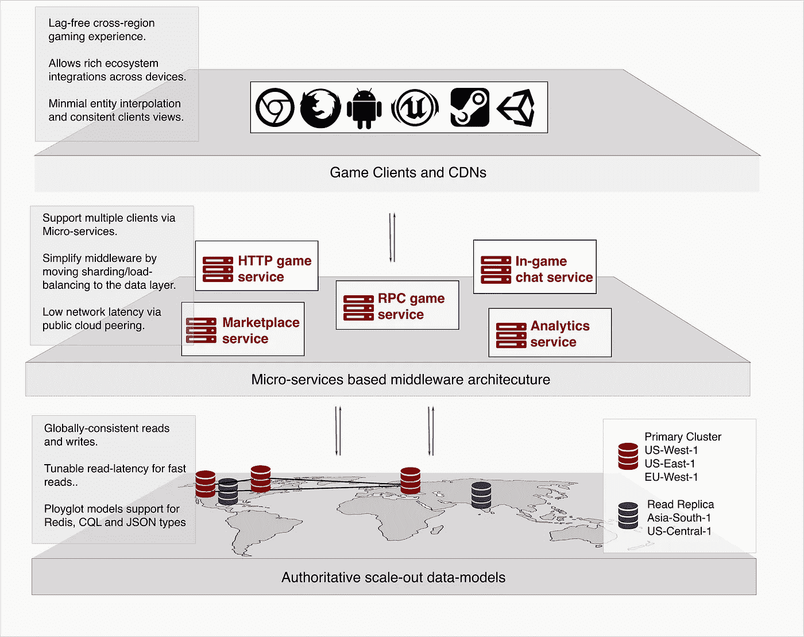
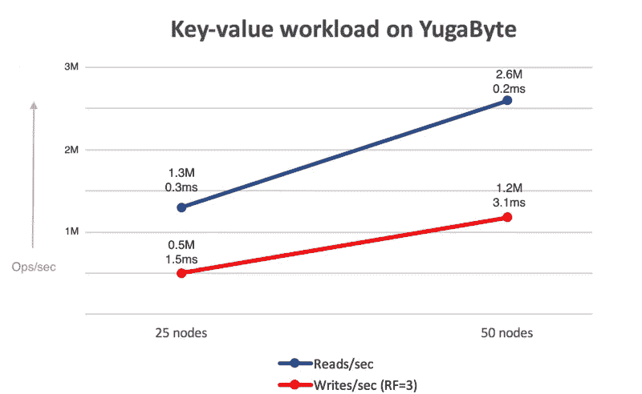
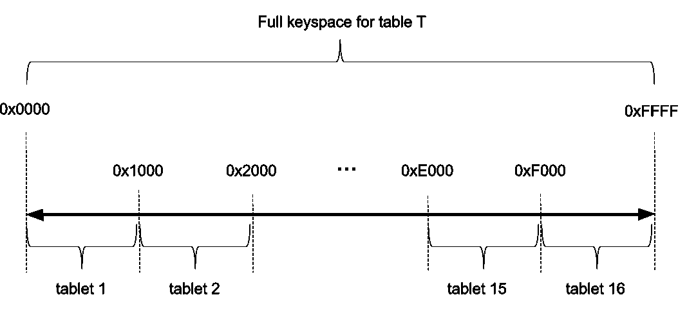

# 快节奏的权威 MMO 数据模型

> 原文：<https://medium.com/hackernoon/authoritative-mmo-data-models-5dc4c1aa30fa>

## 连接虚拟世界的状态同步

多人沉浸式游戏开发是独立创作者和团队最感兴趣的项目之一，挑战涵盖从用户体验到分布式计算的广泛领域。从《《我的世界》》到《魔兽世界》，开放式网络游戏《T2》娱乐和教育了我们，为游戏玩家和巨魔创建了社区，也拓展了我们集体创造力的边界。

King’s landing recreated in Minecraft [[Source](https://imgur.com/a/XfCkQ)]

近年来，MMO 游戏开发公司见证了从通过成千上万行代码创建的复杂世界到玩家定义的世界的转变，玩家定义的世界为创建持久的人工制品和体验提供了构建模块。随着游戏经济、存储和 UX 技术的尖端技术冲击主流应用，我们在未来的时间里会看到一些真正令人惊叹的 MMO 游戏和身临其境的虚拟世界，这并不乐观..

从某种角度来看，WoW 在巅峰时期每月有 1200 万活跃玩家。LoL 是最大的在线多人游戏，每月活跃玩家超过 1 亿(虽然它不是真正的 MMO，在一个碎片上有 10 个玩家的房间)。相比之下，Youtube 拥有 15 亿月活跃用户，脸书拥有 22 亿月活跃用户。去年在 Oculus 大会上，马克·扎克伯格给出了一个关于未来的预告…

**为什么你 s̶h̶o̶u̶l̶d̶n̶'̶t̶绝对应该创造一个 MMO —**

客户端 SDK、游戏网络和云原生数据库堆栈为最常见的访问模式提供了标准化的解决方案。对于有创造力的专业人士和程序员来说，这是一个前所未有的好时机，他们可以聚在一起为新兴客户创造 MMO 原型。众筹基金和 ico 经常为独立游戏开发者和小团队从原型到产品消除障碍。这里有一些主要的技术和社会因素将推动沉浸式世界应用程序走向未来。

## 1.现实世界中游戏代币的流动性

Liquid game tokens can be created on the blockchain

长期以来，大型制作工作室之外唯一赚钱的多人游戏是那些提供扑克或博彩游戏等法定服务的游戏..游戏货币，如[林登币](https://en.wikipedia.org/wiki/Economy_of_Second_Life)(第二人生的货币)，在开创之时努力赢得信誉和接受度..主要是因为它们是由游戏工作室凭空创造出来的……许多最近发布的白皮书和概念验证都表明，游戏代币和[虚拟世界货币](https://blog.enjincoin.io/12-ways-blockchain-will-disrupt-the-video-game-industry-5b9a4adb2f58)是区块链最自然的用例之一。例如，如果在虚拟世界中通过工业赚取的货币可以在现实世界中使用，反之亦然，我们将在沉浸式大型多人游戏中看到更多有趣的艺术品和开发。想象一下，你能够用游戏代币拍卖你在《我的世界》建造的房子或桥梁，并且能够立即将游戏代币转换成[菲亚特](https://en.wikipedia.org/wiki/Fiat_money)。

## 2.生产就绪型 VR SDKs

Good news everyone ..and not just through [netsuits](https://theinfosphere.org/File:Netsuits.png)

虚拟现实和增强现实终于越过了膨胀的期望的顶峰，并且几乎越过了 G [artner 炒作周期](http://phase of the gartner cycle and we are almost halfway through the disappointment phase)的幻灭低谷，因为真实世界的使用正在得到测试，工厂正在建立生产线。从 Unity 和 Unreal Engine 开始，主要的游戏引擎正在原生地提供 VR 应用客户端 SDK，供应商已经在为利基用例生产 VR 设备。

## 3.微服务支持跨客户端的无缝游戏

The most played MMOs will provide cross-client experiences

当应用程序中间件被构建为微服务时，它允许游戏开发者支持多个游戏客户端的游戏性，并逐步增强更高级客户端的游戏性。想象一下，在一个 MMO 中，玩家可以通过 oculus rift 客户端进行全方位的操作，例如参与战斗，但也可以通过 android 客户端与其他玩家聊天或给他们的花园浇水。

## 4.云原生、自动分片的分布式存储引擎

Cloud native databases provide consistent low latency reads and writes across regions and zones

网络延迟一直是玩在线游戏的问题，即使在中等高的 FPS 下。这是因为公共互联网上的任何网络流量都会产生延迟，导致相当大的滞后。使用云服务提供商提供的专用网络，我们可以将与公共互联网的交互限制在最后几跳，从而大幅改善大量读写的 P99 延迟。支持多种访问模式并提供快速读写的分布式数据库技术的进步意味着许多游戏网络和负载平衡逻辑可以从中间件向下移动到数据层。

# 游戏中间件架构

## 1.权威服务器和哑客户端

对于用户来说，客户端就是游戏，客户端将渲染所有的图形并允许用户操作，游戏客户端可以像 [Runescape](https://www.runescape.com/splash) 或 [WoW](https://worldofwarcraft.com/en-us/) 一样丰富，也可以像 [slitherio](http://slither.io/) 一样简单。然而，客户端不应该基于用户动作来权威性地执行任何逻辑，而必须根据服务器提供的值来操作。这样做的原因是，在多人游戏环境中开发游戏时，我们必须始终假设客户端是攻击者。例如，如果允许客户端指定其位置并将其传播给其他客户端，那么恶意玩家就可以轻而易举地破解其坐标并将其设置在敌方旗帜上，然后将其位置传播给其他非常困惑的客户端。也很容易看出权威的服务器架构如何比权威的客户端架构更好地扩展。

相反，对于每个用户动作，客户端必须将状态编码成数据结构，并将其传递给服务器，然后服务器根据游戏规则对其进行解释，以查看该动作是否有意义，然后将该位置发送回客户端，客户端将该位置视为其最终位置。此外，服务器可能会接收一批这样的输入，并根据分析和推理引擎来运行它，以验证玩家的动作。例如，玩家在最后的 10 次射击中只击中了 10 次，鼠标在屏幕上的点击与输入的坐标不同吗？

## 2.网络延迟和状态传播

拥有权威的服务器意味着客户端不能作弊，但这也意味着当你按下 W 键时，客户端发送请求并等待服务器的响应来告诉它前进，当这发生在互联网上时，它将明显导致游戏体验的滞后。为了克服这个游戏，客户端使用了一些平滑技术，如客户端预测，服务器协调和插值。这篇文章不涉及客户端补偿技术的细节，你可以在这里查看这个[精彩的解释](http://www.gabrielgambetta.com/client-server-game-architecture.html)，其中也包括这个[演示](http://www.gabrielgambetta.com/client-side-prediction-live-demo.html)。

在服务器端，我们可以通过限制公共互联网上的跳数以及尽可能使用 IaaS 提供商提供的高速网络对等来减少网络延迟。 [YugaByte](https://github.com/YugaByte/yugabyte-db) 支持在 AWS 和 GCP 的主节点上单击部署和扩展/缩减操作，并读取副本，同时利用 VPC 对等支持跨区域和数据中心的高速网络和专用流量。

## 3.服务器延迟和线性扩展模型

*那么，为什么我们可以让数百万人浏览同一个网页，而在 MMO 的同一个碎片上却只有数千人呢？*

在标题为 [MMO 人口问题](http://shamusyoung.com/twentysidedtale/?p=6185)的文章中，作者解释了网络和服务器负载如何在 MMO 碎片上成倍增长，以及在应用层处理状态一致性的问题。

Scaling out from 25 to 50 nodes doubles read and write throughput [Source](https://blog.yugabyte.com/scaling-yugabyte-db-to-millions-of-reads-and-writes-fb86cea5ff15)

[YugaByte](https://github.com/YugaByte/yugabyte-db) DB 通过提供线性横向扩展而不是纵向扩展的模型来解决规模问题。例如，将 25 个节点的集群规模翻倍至 50 个节点会导致性能和吞吐量翻倍。你在这里阅读基准详情[。](https://blog.yugabyte.com/scaling-yugabyte-db-to-millions-of-reads-and-writes-fb86cea5ff15)

## 4.自动分片和负载平衡

当创建游戏数据库时，团队经常面临关于数据服务器的物理和逻辑分区的棘手问题，比如——每个节点应该有多少个数据库？我应该如何决定哪些节点需要比其他节点扩展得更快。这就产生了一个先有鸡还是先有蛋的问题，在你真正构建游戏之前，你需要知道游戏交互的访问模式。YugaByte 从一开始就提供了自动分片数据模型，让您可以随着游戏的增长灵活地扩展集群，从而为游戏开发者简化了这一过程。

游戏服务器可以简单地坐在哑负载平衡器的后面，服务来自最近客户端的请求，这将依次返回通过 [MVCC](https://docs.yugabyte.com/architecture/transactions/single-row-transactions/) 维护的数据的最近一致的快照。负载平衡是通过[自动分片](https://docs.yugabyte.com/explore/auto-sharding/)在数据层处理的，它会自动将基于游戏模型的表分成多个分片。这使得你的团队不必在应用层管理负载平衡，你的架构看起来越来越像是在开发一个单人游戏。

Sharding of data into tablets. [Source](https://docs.yugabyte.com/architecture/concepts/sharding/)

## 5.高速读取访问模式的读取副本

MMOs 访问模式通常遵循频繁读取(对于网格中的所有参与者)和不频繁写入(对于玩家动作)
在许多访问模式中，参与者不是写入而是读取，从异步副本进行时间轴一致的读取可以提供更低的延迟。例如，如果玩家不做任何事情，只需要读取他们参考网格中所有演员的数据，他们可以从读取副本中获得时间线一致的副本。读取副本还可以用于对实时数据运行集群感知分析作业，以从玩家动作中推断实时情报，而不会使主节点紧张。

# API 建模的效率

游戏是计算繁重的应用程序，经常测试客户端、网络和服务器的极限(在一定范围内)，这也是为什么效率最重要的原因，不仅在于它存储脏状态所需的空间，还在于序列化/反序列化它所需的代码。大多数 MMO 游戏遵循这样的访问模式:当玩家做一个动作时，快速读取玩家网格中所有对象的状态，快速写入玩家的信息。Redis API 提供了简单的结构来存储游戏状态对象，以最小的序列化/反序列化成本来构建更复杂的结构。通常在浏览器游戏中，游戏状态通过 HTTP 以 JSON 文档的形式传递。

## 1.Redis 建模

Redis API 为开发人员提供了一组非常有用的数据结构，如集合、排序集合和哈希映射，这些数据结构可用于构建更高级的结构，这些结构可以有效地模拟 MMO 对象中的大多数状态转换。

然而，作为纯内存缓存的传统 Redis 实现有其自身的局限性，首先是整个数据集需要适合内存，这对于在单个碎片中具有高用户活动的游戏服务器来说可能是一个挑战。另一层复杂性是实现 Redis + DB 模型需要进一步将访问模式逻辑集成到应用层。 [YugaByte](https://github.com/YugaByte/yugabyte-db) 通过为持久 Redis 提供块缓存来服务热读取，同时为[不适合缓存的工作负载提供亚毫秒级延迟](https://blog.yugabyte.com/achieving-sub-ms-latencies-on-large-data-sets-in-public-clouds-bf38d13ac42d)，从而解决了这个问题。你可以阅读更多关于 [YugaByte Redis](https://docs.yugabyte.com/latest/api/redis/) 实现[这里](https://blog.yugabyte.com/using-redis-as-a-true-distributed-fault-tolerant-database-8504a924a3f7)。

## 2.CQL 造型

大型数据集的快速访问模式或那些需要高度一致的分布式事务(如市场事务)可以通过 CQL API 进行建模。此外，需要范围扫描或查询的访问模式可以通过 DocDB 存储引擎上的 CQL API 对列族结构进行直观建模。YugaByte 还通过用于时序指标的 [Janusgraph](https://docs.yugabyte.com/develop/ecosystem-integrations/janusgraph/) 和[KairosDB](https://docs.yugabyte.com/develop/ecosystem-integrations/kairosdb/)API 支持图形 API 访问模式。

## 3.JSON 建模

MMO 游戏状态，尤其是基于网络的游戏，也经常被直观地建模为 JSON 文档，对 JSON 类型和 Postgres API 兼容性的支持正在进行中。你可以在这里找到关于公关[的细节](https://github.com/YugaByte/yugabyte-db/issues/26)。

# 游戏状态的实时分析

任何商业上可行的虚拟世界都将对游戏数据进行实时分析，以收集关于游戏改进、定向广告、作弊检测等方面的情报。你可能会问的一些问题的例子是—

1.  红娘服务是根据玩家的技能水平来匹配玩家的吗？
2.  有玩家作弊吗？如果是，他们是如何作弊的？
3.  我能推断出玩家喜欢/不喜欢的东西吗？从游戏模式？
4.  玩家在点击游戏内广告吗？

使用 [SKY stack](https://www.yugabyte.com/solutions/use-cases/fast-data/) 的实时分析允许在数据层之上设计服务，这让你可以从玩家的动作中推断出有意义的知识。

# 简化 MMO 数据和运营体系

多人游戏网络和状态传播很难，绝对不是你的团队想要关注的事情。在可行的范围内，您希望通过提供最佳用户体验来定义您的模型，而不一定是为了最小化数据包。 [YugaByte](https://github.com/YugaByte/yugabyte-db) DB 可以通过将缓存和持久层合二为一来简化游戏引擎服务器堆栈，将负载平衡和分片逻辑从应用层推至数据层，并使用 Redis 的速度和持久保证来实现游戏内状态，以及 CQL API 来实现玩家数据和网络服务模型。

## 关于我—

我是 [YugaByte](https://www.yugabyte.com/) 的一名开发人员，我们在那里为分布式、高密度的应用程序和游戏构建数据解决方案。如果你或你的团队正在构建身临其境的虚拟世界体验，探索横向扩展的数据模型，你可以在这里查看文档。

**与此同时，您可以前往** [**Github 项目**](https://github.com/YugaByte/yugabyte-db) **深入研究代码库。**