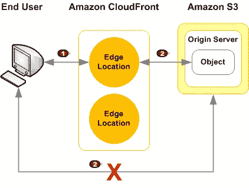

# 向 S3·比提的授权请求

> 原文：<https://medium.com/hackernoon/authorized-requests-to-s3-bucket-6c64ba02f60c>

## 受保护的 S3 存储桶，受保护的文件



本笔记本展示了向 S3 存储桶添加基本权限的成品

我们使用基本身份验证，这是一种 HTTP 协议，用于对 web 可访问的文件进行简单身份验证。[https://en.wikipedia.org/wiki/Basic_access_authentication](https://en.wikipedia.org/wiki/Basic_access_authentication)

*基本身份验证不是很安全——然而，我们将它与 HTTPS 配对，并限制对 s3 存储桶的访问。*

## 设置一些 python 的东西

在[1]中:

```
import requests; import json
```

# 无需授权即可访问安全端点

首先，我们试图在没有任何凭证的情况下访问这个文件

在[2]中:

```
url = 'https://d17nii79zr8aom.cloudfront.net/success.json'
resp = requests.get(url)
resp.content
```

Out[2]:

```
'Unauthorized'
```

接下来，我们添加基本的身份验证参数

# 使用 auth 访问安全端点！

在[3]中:

```
user, password = 'user', 'pass'
resp = requests.get(url, auth=(user, password))
data = json.loads(resp.content)
**print** json.dumps(data, indent=4)
```

Out [3]:

```
{
    "status": "success", 
    "secret": "yay now we can lockdown s3 files!"
}
```

好吧，酷，黑客不关心前门。让我们尝试访问 S3 对象的直接 url

# 直接 S3 桶访问

在[4]中:

```
direct_url = 'https://s3.amazonaws.com/locked-box/success.json'
resp = requests.get(direct_url)
**print** resp.content
```

Out [4]:

```
<?xml version="1.0" encoding="UTF-8"?>
<Error><Code>AccessDenied</Code><Message>Access Denied</Message><RequestId>58277072A5A1F927</RequestId><HostId>2CmgTzauvXbV0+bf9jMKvlXj3ViMNw4bUL1JMnu4L1QqHfOu0/eHJfG0cxunR0nq7hrVJb8HpQ0=</HostId></Error>
```

好吧，显然这没用——我们甚至没有使用凭证。让我们假设我们知道登录凭证，但是直接在 S3 桶而不是安全端点上使用它们。

在[5]中:

```
user, password = 'user', 'pass'
resp = requests.get(direct_url, auth=(user, password))
**print** resp.content
```

Out [5]:

```
<?xml version="1.0" encoding="UTF-8"?>
<Error><Code>InvalidArgument</Code><Message>Unsupported Authorization Type</Message><ArgumentName>Authorization</ArgumentName><ArgumentValue>Basic dXNlcjpwYXNz</ArgumentValue><RequestId>97760837E823C675</RequestId><HostId>MaKcLnOik5Bq4zV+2v9fNzKqikz7JEHdEIv7TJYUP+67jJmdU4w9ekOr9jaZIbGHj+Wz68M4RcI=</HostId></Error>
```

没有访问它！呜！

> 成功🤘🏽

## 我们可以使用 Lambda 函数进行身份验证来锁定 S3 文件——使用 Cloudfront HTTPS 端点作为访问点