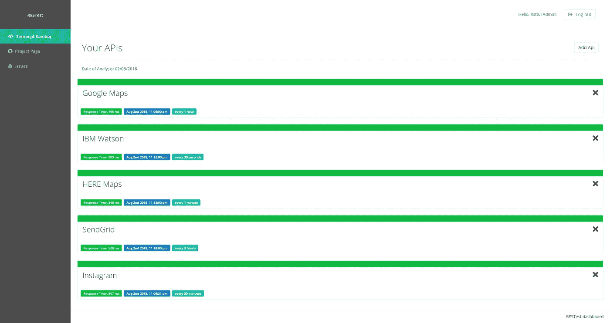
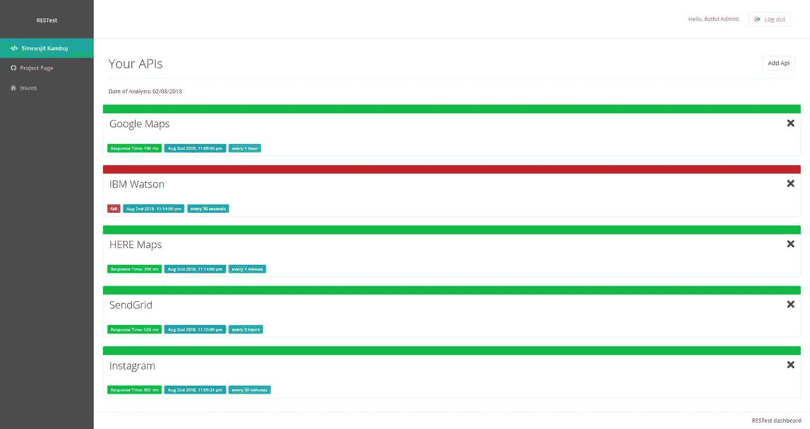
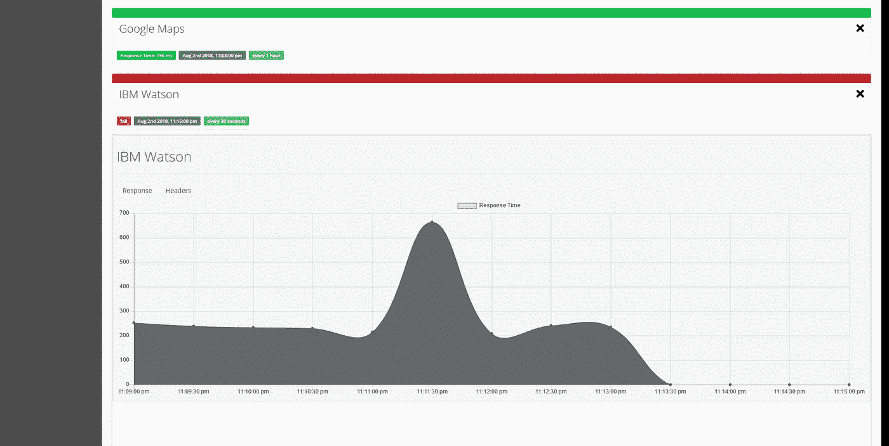
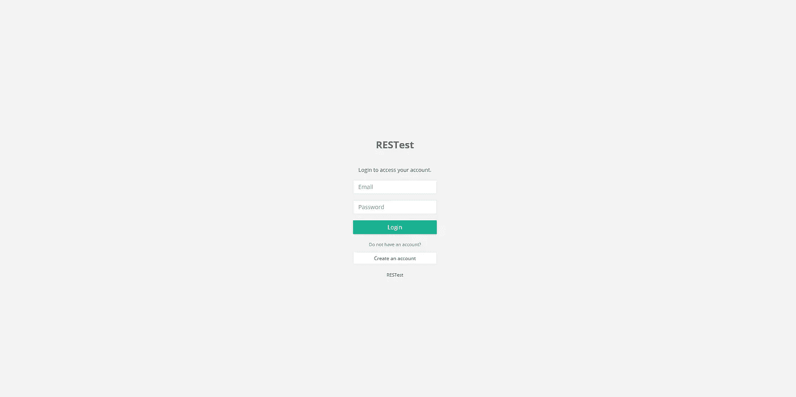

# 使用这个开源软件自动监控 API

> 原文：<https://medium.com/hackernoon/automate-api-monitoring-with-this-open-source-software-707cdb187eca>

如今，许多软件应用程序依赖第三方服务来增强其功能。例如，一个应用程序可以使用 [Google](https://hackernoon.com/tagged/google) Maps API 在地图上的不同位置放置标记，或者通过 Instagram 或 Twitter API 发布到社交媒体。跟踪不同的 API 以确保它们发挥应有的功能并不总是容易的，而且有些浪费时间。

RESTest 是我为了解决这个问题而做的一个开源程序。我倾向于使用来自诸如 HERE Maps、Slack、IBM Watson 等服务的 API。有时，这些 API 会宕机，需要一些时间来找出到底是什么问题，只有当使用应用程序的人告诉你或者你正在运行测试时，你才会发现。RESTest 允许您设置您使用的 API，选择测试间隔，并让它运行。它将继续监控 API，并在 API 没有正常响应时通过电子邮件和/或 Slack 消息通知您，以便您可以立即采取措施。

该应用程序建立在 Meteor 之上，这是一个 [Javascript](https://hackernoon.com/tagged/javascript) 框架。数据库是 MongoDB。

 [## Simranjitk/restest

### 自动化 API 状态监控

github.com](https://github.com/simranjitk/restest) 

RESTest dashboard to monitor the API’s

有一个简单的仪表板向您显示 API 的概要(测试完成的时间、测试的频率以及最近的响应时间)。如果任何 API 失败，它们会自动变红，并通过电子邮件或 Slack 消息通知您。

When an API fails the test, it turns red

You can view past history regarding the API’s response time

您可以通过单击每个 API 来展开列表，从而获得关于它们的更多信息。它将向您显示过去一天的响应率及其波动情况。它还显示了 API 响应、标题，并提供了更改测试频率的能力。

Login page within RESTest

我还合并了帐户，以便在多人团队中工作时更容易！

您可以在 https://github.com/simranjitk/restest 的[找到安装和设置指南。一切都是可定制的，你可以在文档中找到一些相关信息。您可以创建自定义时间间隔，更改通知方法，等等。](https://github.com/simranjitk/restest.)

如果你发现了错误或者有功能需求，你可以在[https://github.com/simranjitk/restest/issues](https://github.com/simranjitk/restest/issues)发表。如果你想在你自己的服务器上安装软件，定制外观，添加新功能，或者其他任何事情，并希望尽快完成，给我发电子邮件到[restestapp@gmail.com](http://restestapp@gmail.com)，我们可以聊天！

如果您有任何问题或意见，请告诉我！自动化快乐！

Simranjit Kamboj