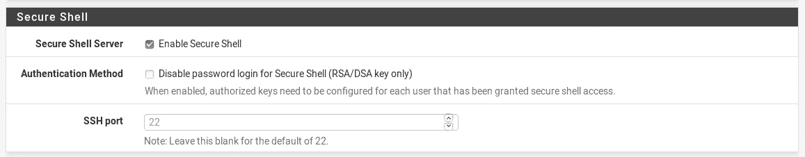
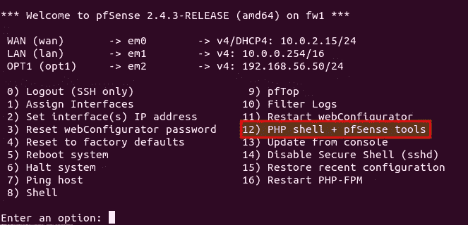

# 通过 pfSsh.php 实现 pfSense 自动化

> 原文：<https://medium.com/hackernoon/automate-pfsense-with-pfssh-php-737856e906c>


从几个版本开始，pfSense 拥有完全重新设计的用户界面。所有设置都可以通过这个界面轻松实现和调整。可自由配置的仪表板也是一个好东西。但是，有时您可能希望通过 API 或命令行进行设置。pfSense 目前没有 API，这将只在一个即将推出的版本中可用。在那之前，你可以使用 pfSense 开发者外壳，也称为[pfSsh.php](https://www.netgate.com/docs/pfsense/development/using-the-php-pfsense-shell.html)。

# 访问 pfSsh.php

到达开发人员 shell 的最快方法是通过 SSH 连接到 pfSense，或者直接将一个屏幕连接到防火墙。如果 SSH 尚未激活，您可以在 web 界面中的**系统→高级**下执行此操作。



最好禁止使用密码登录，只允许使用证书登录。

如果 SSH 访问已激活，您现在可以使用 admin 用户登录(调整 IP):

```
$ ssh admin@192.168.1.254
```



在第 12 点下你会发现开发者外壳，它基本上是一个 PHP 外壳。

# pfSsh.php 的命令示例

下面是一些示例命令，向您展示如何使用 shell。每个输入都是正常的 PHP 代码，必须用`exec;`来完成。

## 显示 DHCP 设置

```
pfSense shell: print_r($config["dhcpd"]);
pfSense shell: exec;
Array
(
    [lan] => Array
        (
            [range] => Array
                (
                    [from] => 10.0.1.7
                    [to] => 10.0.255.245
                )))
```

## 设置域

```
pfSense shell: $config[‘system’][‘domain’] = ‘mydomain.com’;
pfSense shell: write_config();
pfSense shell: exec;
```

## 执行常规 shell 命令

在 PHP shell 中，您还可以通过放置“！”来执行普通的 shell 命令在它面前:

```
pfSense shell: ! cat /etc/version 
pfSense shell: exec; 
2.4.3-RELEASE
```

## “录制”和“回放”命令

有了 pfSsh.php，你还可以“记录”几个命令，以后再“回放”它们。这些所谓的会话对于重复性任务非常有用。一个例子:

```
pfSense shell: record echoTest 
Recording of echoTest started. 
pfSense shell: echo “This\n”; 
pfSense shell: echo “is\n”; 
pfSense shell: echo “a\n”; 
pfSense shell: ! echo “test\n” 
pfSense shell: exec; 
pfSense shell: stoprecording 
Recording stopped.
```

这些条目保存在 */etc/phpshellsessions/* 下，如果需要，可以在那里进行编辑。

“录音”现在可以按如下方式播放:

```
pfSense shell: playback echoTest 
Playback of file echoTest started. 
The
is 
a 
testpfSense shell:
```

或者直接从根外壳:

```
$ pfSsh.php playback echoTest
```

# 结论

pfSsh.php 是一个使用脚本自动化 pfSense 或进行定制的有用工具。特别是如果你管理多个实例或者需要一次又一次的设置，pfSsh.php 是一个很大的帮助。例如，您可以将所有设置(即 PHP 代码)打包到一个文件中，保存在 */etc/phpshellsessions/* 下并执行它们，或者将输出直接转发到 pfSsh.php:

```
$ ssh admin@192.168.1.254 '/usr/local/sbin/pfSsh.php' < MyConfig.txt
```

*原载于*[*openschoolsolutions.org*](https://openschoolsolutions.org/automate-pfsense-with-pfssh-php/)*。*