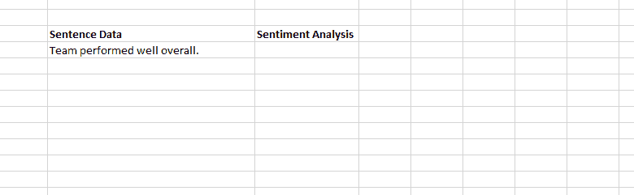
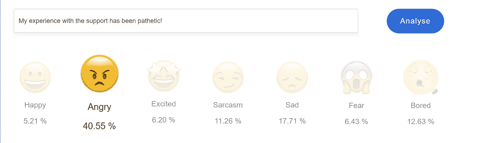
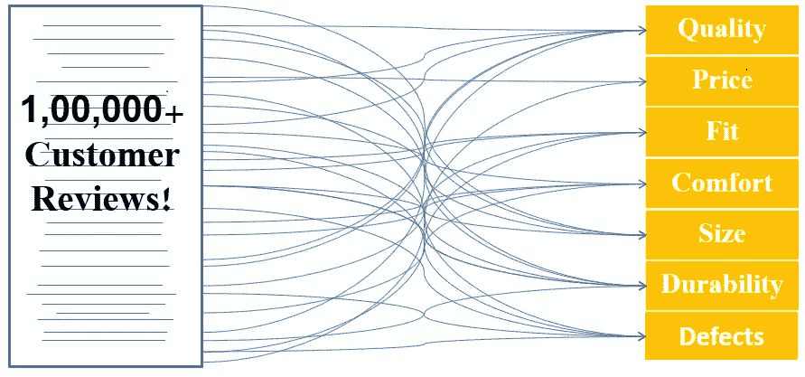

# 电子表格中的自动化客户调查分析

> 原文：<https://medium.com/hackernoon/automated-customer-survey-analysis-in-your-spreadsheet-17c29c575750>

检查你的业务脉搏的第一步是向现有客户提出正确的问题。

*大多数企业都明白这一点。*

*正是他们对这些数据所做的一切让一切变得不同。*

定性的答案既有丰富的洞察力，也很难人工挖掘。幸运的是，人工智能的最新进展让几乎任何人都有可能快速分析大型开放式响应。一个这样的工具是由 ParallelDots **提供的 [Google Sheets 插件](https://www.paralleldots.com/google-sheet-add-on)。它让您可以在自己的电子表格中执行调查分析，并且应用起来非常简单。**

这些工具可用于对信息进行多层次的探索，否则这些信息很容易被忽略。

# 第 1 级——寻找情感

在进行调查分析时，需要区分正反馈和负反馈。负面反馈是潜在产品改进的金矿，正面反馈告诉你你在哪里给你的客户增加了最大的价值。使用该插件可以非常轻松地使用人工智能，并一口气找出数千篇文本背后的潜在情绪。

# 第二级——理解情绪

情感比情绪更进一步。情绪分析揭示了客户的反应是高兴、悲伤、讽刺、生气、厌烦、恐惧还是兴奋。想象一下一个客户的反馈是 0.95 分，他会有多生气。使用情感分析评分对用户的投诉进行优先排序可以帮助您快速采取行动。

# 级别 3 —查找关键字

当您需要从任何文本语料库中生成标签和元数据以快速检索重要信息时，可以使用关键字生成器。关键短语类似于关键字，应该在您想要分析文本语料库以找到人们在语料库中谈论的主要话题时使用。

例如:考虑像**“这家餐馆总是很拥挤”这样的文本。**

[关键字 API](https://www.paralleldots.com/keyword-extractor) 将给出“餐馆”作为关键字，可用于标记此反馈，而关键短语 API 将给出“总是拥挤”作为短语。对于教育内容提供商来说，他已经意识到课程将频繁出现在用户反馈中的事实，但是像“太长”这样的短语对于他了解真实的反馈是重要的。

# 级别 4 —将数据分类到最适合的主题中

在分类场景中，我们对一小组带标签的训练数据运行模式发现算法，以计算与特定标签的出现高度相关的文本模式(即，如果模式出现，那么标签也很可能出现)。分类器识别单词之间的关系，并存储它们用于分析看不见的未来文档。

考虑将发送给一家大公司的用户反馈电子邮件分类为表达积极和消极情绪的电子邮件的任务。在这种情况下，与负面标签高度相关的常见文本模式可能是“我将转投 XYZCorp”，其中 XYZCorp 是竞争对手的名称。一旦分类器学会了这一点，它就能够像人类一样将其他新文档分类到标签中。

**具体到客户调查，让我们考虑下面的例子。**

一个国际运动服装品牌新推出的 t 恤收到了 10，000 条评论。下面是 ParallelDots 如何使用其自定义分类器来研究这些数据的总结。

第一步——我们根据这些评论训练我们的算法。该模型学习评论的句子结构和上下文。

第二步——我们确定了顾客评论中出现的 7 大关注主题——合身、价格、质量、舒适度、尺寸、耐用性、缺陷。每个主题都有副标题。

步骤 3-自定义分类器自动分析每个评论，并将它们分类到相关主题中。

通过分析谈话中的情绪和推动情绪的话题，零售银行可能会发现，客户的批评、排队长度和等待时间是最重要的。

一家快餐连锁店可能有兴趣知道，相对于他们最接近的竞争对手，许多人认为他们的份额太小，尽管他们友好的客户服务是一个优势。

**ParallelDots 推出了一个简化的 SaaS 解决方案，你可以一口气完成所有这些工作！你所要做的就是在 Excel 中上传你的调查回答，然后等待人工智能完成它的工作。在这里注册******加入 SmartReader 社区。你的第一次分析是免费的！****

**在 [ParallelDots](https://www.paralleldots.com/) ，我们正在让我们的用户非常容易地使用基于机器学习的文本分类解决方案，而无需数据科学背景。**

**您可以使用我们现成的文本分类解决方案，如情感分析和[情感分析](https://www.paralleldots.com/emotion-detection)，或者使用[定制分类器 API](https://www.paralleldots.com/custom-classifier) 构建自己的分类器。所有的 API 都可以在 [Excel 插件](https://www.paralleldots.com/excel-plugin)和 [Google Sheets 插件](https://www.paralleldots.com/google-sheet-add-on)中找到，以便从你舒适的电子表格中进行文本挖掘。**

**对于企业而言，文本分类模型可以获得内部或私有云部署许可，以确保低延迟和遵守隐私法。**

**您还可以在此了解更多我们的文本分类解决方案[。](https://www.paralleldots.com/text-analysis-apis)**

**你可以在这里阅读[关于文本分类的应用和用例](https://blog.paralleldots.com/product/text-analytics/text-classification-applications-use-cases/)。**

**我们希望你喜欢这篇文章。请[注册](http://user.apis.paralleldots.com/signing-up?utm_source=blog&utm_medium=banner&utm_campaign=paralleldots_blog)一个免费的 ParallelDots 账户，开始你的 AI 之旅。你也可以在这里查看 parallel dots AI API[的演示。](https://www.paralleldots.com/text-analysis-apis)**

**这里可以阅读原文[。](https://blog.paralleldots.com/product/customer-survey-analysis-without-any-coding/)**