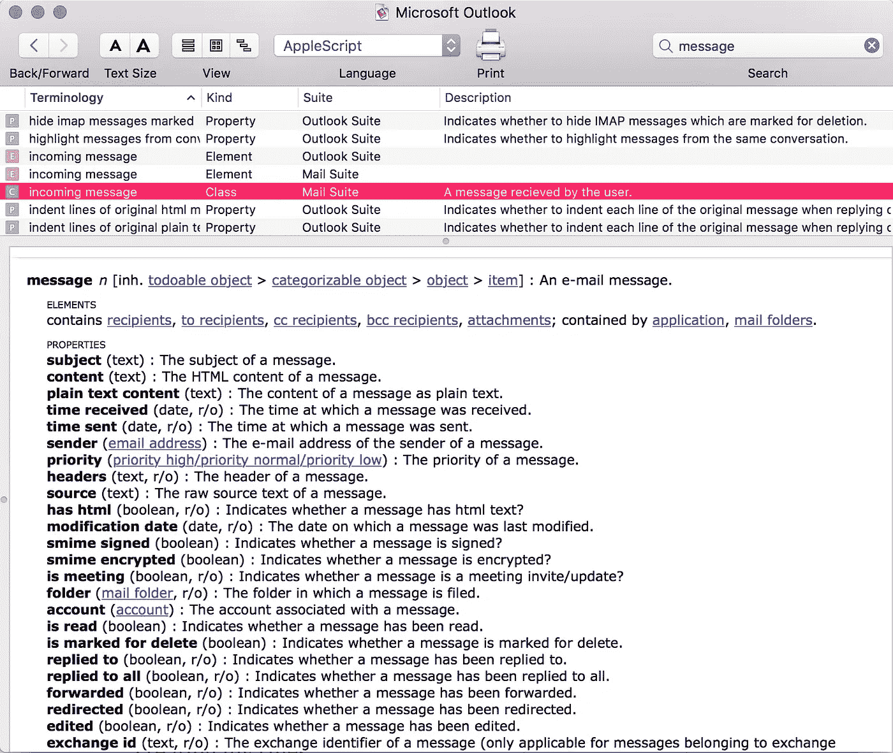

# 使用 Outlook 2016 和 AppleScript 自动清理收件箱

> 原文：<https://medium.com/hackernoon/automated-inbox-cleansing-with-outlook-2016-and-applescript-49cf4c4422fa>

在网络世界工作的最大好处之一就是我会收到大量的电子邮件。早上没有什么比 3 位数的未读邮件数更能激励人了…不，不尽然


对于我的个人电子邮件，我使用带有复杂过滤器阵列的 Gmail，在邮件到达时将它们过滤到不同的文件夹中。在很大程度上，这是可行的，尽管其中一些文件夹实际上是垃圾箱的代理，但我不能让自己承认这一点。不过，对于我的工作电子邮件，我使用 Mac 版 Outlook 2016。它确实支持规则，但我发现它们有些欠缺。设置它们的 UI 是一项艰巨的工作，测试它们是否如预期那样工作也是如此。因此，除了制定一些基本规则之外，我从来没有放弃过，这些规则对阻止电子邮件的泛滥没有什么作用。

最近，我决定尝试彻底解决这个问题。一旦我完成了我必须做的“规则肯定能做到这一点…哦，上帝，我现在想起来了…是的，这些真的没用…”例行公事，我开始寻找更好的解决方案。

这次我也有一类特殊的电子邮件需要处理。我收到很多来自我们工作中使用的应用程序的通知。例如吉拉更新的通知；通过和未通过 CI 构建；部署通知等等。这些电子邮件非常有用，但是寿命也很短。例如，CI 构建通知电子邮件可以方便地捕捉意外故障或了解运行已完成。我也尽量避免经常查看电子邮件，而是更喜欢定期查看我的收件箱，这样通知就很好，可以看到自从我上次查看以来发生了什么。但是它们很快就会变得陈旧，如果我在它们到达几个小时后还没有看到它们，我可能永远也不会去读它们。我的目标是让这类邮件在被阅读后或超过几个小时后自动存档或删除，以先发生的为准。

很明显，我不可能用规则来让它工作。我已经在一天开始时使用 Automator 来启动我的工作环境，所以 [AppleScript](https://hackernoon.com/tagged/applescript) 似乎是开始尝试实施我的规则的好地方。在大量的谷歌搜索、文档阅读和高于平均水平的咒骂之后，我设法找到了正确的咒语，让我能够轻松地操作我的收件箱。

首先，你需要写剧本。OSX 有一个内置的脚本编辑器来编辑 AppleScript——巧妙地命名为*脚本编辑器—* ,它还可以让你访问超级方便的字典，所以就这一点而言，它是值得掌握的。首先启动脚本编辑器。它会要求您选择或创建一个脚本。我创建了一个新的空白脚本，并将其命名为 *outlook-cleanup.scpt* 。现在，如果你去文件菜单，你会看到一个“打开字典…”菜单项。点击这个，你会看到一个已安装应用程序的列表。找到并选择 Microsoft Outlook。然后，您将能够浏览描述所有可用于 Microsoft Outlook 的元素、类和属性的字典。我发现最方便的是邮件套件中的 message 类，因为它描述了创建规则时可以测试的消息属性。



Message reference for Outlook 2016

在我开始编写单独的规则之前，有必要编写一些初始代码来遍历收件箱中的消息。看起来像这样

Outer loop for processing Outlook mails in AppleScript

然后，我将想要测试的属性提取到单独的变量中。因为我的主要目标是测试消息的年龄，所以我还将当前日期和两个截止时间间隔隐藏在一个变量中，我将根据消息的类型在这两个时间间隔之间切换。

最后，我添加了一点日志，这样我就可以看到事情按预期发生了。

把所有这些放在一起看起来像这样。我添加了几个示例规则，这样您就可以看到它们的样子。

Complete script for cleaning up Email message

有了脚本，下一步就是弄清楚如何在日常基础上运行它。我选定的解决方案是使用 launchd 每 5 分钟运行一次脚本。

为此，我首先需要创建一个启动代理或守护进程。根据[文档](https://developer.apple.com/library/content/documentation/MacOSX/Conceptual/BPSystemStartup/Chapters/CreatingLaunchdJobs.html)，启动代理将在特定用户登录时运行，而守护进程是系统级的，在特定用户会话之外运行。对我来说，启动代理似乎更合适，因为所有这些规则都是针对我的 Outlook 账户的。

然后我需要在 *~/Library/LaunchAgents* 中创建一个属性列表文件。这是它的样子。在 *~/Library/LaunchAgents* 中的所有其他文件都被限定在一个特定的域中，所以我决定对我的文件做同样的事情。

launchd plist to run cleanup every 5 minutes

然后，我使用以下命令从 *~/Library/LaunchAgents* 加载脚本

```
cd ~/Library/LaunchAgents
launchctl load -w uk.co.29ways.outlook-cleanup.plist
```

加载后，我使用

```
launchctl start uk.co.29ways.outlook-cleanup
```

为了判断脚本是否正确运行，我使用了

```
launchctl list | grep outlook
```

第二列表示代理最后一次运行的返回代码，如果一切正常，将为 0。如果有问题，那么这将是非零的，并且希望在日志中有一个指示出哪里出错了

所以我们有它。我现在有了一个自我整理的收件箱，它基于一套可编程的过滤器，灵活、易于更新、版本可控并自动运行。

一切就绪后，我从使用脚本编辑器切换到使用普通的 Atom 编辑器。因为 AppleScript 是一种编译语言，你需要在编辑前反编译它，然后重新编译。幸运的是，有一个[方便的 Atom 包](https://atom.io/packages/language-applescript)可以帮你解决这个问题。

我还将脚本和 plist 移到了我的[点文件](https://dotfiles.github.io/) repo 中，并为 plist 创建了一个从~/Library/LaunchAgents 到我的点文件中的文件的符号链接。这样，每当我换到一台新的 Mac 电脑时，我的收件箱清理就会和我的其他配置一起进行。