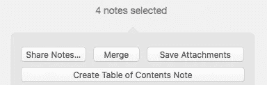
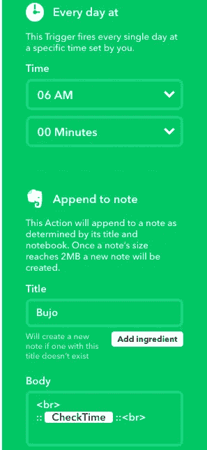
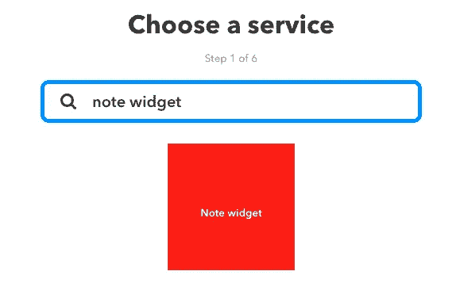
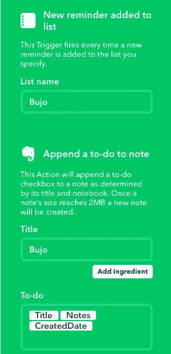

# 用 Evernote 和 IFTTT 自动化子弹日记

> 原文：<https://medium.com/hackernoon/automating-a-bullet-journal-with-evernote-and-ifttt-fe83a8ad36f4>

"子弹杂志是数字时代的模拟系统."这太棒了，但对于知识工作者来说，有时我们只是需要一个数字时代的数字系统。我已经随身携带了 6 年多的鼹鼠皮，这些笔记本能够很好地记下事情并把想法从我的脑海中抹去。然后，我开始严重依赖 Evernote，并停止写东西和使用鼹鼠皮。Evernote 也很棒，因为我大部分时间都在电脑前度过，能够复制、粘贴和添加到我的笔记中非常棒。此外，他们的 web clipper 扩展是一个令人震惊的工具。然后，我偶然发现了一种叫做子弹日记的方法，这种方法让我把所有的想法都抛到脑后，整理成一个列表。[http://bulletjournal.com/](http://bulletjournal.com/)它给了我指导方针，帮助它保持混乱良好，有条理。对我来说，失败是模拟的局限性。模拟和写下事情背后的想法是，笔记的理解更好，整个过程旨在成为正念的练习。许多研究文章和博客文章都证明了这一点。[https://www . scientific American . com/article/a-learning-secret-don-t-take-notes-with-a-laptop/](https://www.scientificamerican.com/article/a-learning-secret-don-t-take-notes-with-a-laptop/)

子弹杂志意味着是一个模拟系统，它意味着削减数字鸿沟。我用这个系统用了 6 个月，效果很好。我总觉得它有局限性。对我来说，一个主要的缺点是我需要携带另一个笔记本和我的笔记本电脑。如果我整天都在办公桌前工作，这没什么大不了的，但是当我不得不四处走动，和其他人一起解决问题时，这很快就成了一个麻烦。我以为我可以融合两个世界。原来 Cal Newport 也有类似的想法。

[http://cal newport . com/blog/2017/12/15/bujo pro-thoughts-on-adapting-bullet-journal-to-a-hyper-connected-world/](http://calnewport.com/blog/2017/12/15/bujopro-thoughts-on-adapting-bullet-journal-to-a-hyper-connected-world/)

有大量的生产力系统存在，这些年来，我得出的结论是，从许多系统中提取一些小的部分，并将其融入到我自己的工作流程中，这确实是最好的选择。我们将从 GtD、Cal、传统的 bullet journaling 和我自己的自动拼接中吸取一些东西。

让我们从 Evernote 的基本设置开始，然后我们将深入探讨自动化。
第一阶段，Evernote:创建一个名为 bullet journal 的笔记本，并创建一些摄取笔记。我喜欢把工作和家庭分开，我有一个“bujo”和一个“bujo 生活”。这些将是肉和土豆，所有的东西都将在这里被消化和加工。接下来，我会有一个月跟踪器，它会保存重要的日期和长期的待办事项。
便签本，我有一个专用于“笔记”的便签，还有一个专用于“回忆”。这些用于随机思考，然后在一天中重要的事件和情况展开，我会添加到记忆中。回忆帮助我结束一天的日志，但这是另一天的主题。只能说每天写日记很重要[https://medium . com/the-mission/why-keeping-a daily-journal-can-change-your-life-9 a4c 11 f1 a 475](/the-mission/why-keeping-a-daily-journal-could-change-your-life-9a4c11f1a475)。

太好了，这些笔记太棒了，但是它们会很快在我的 Evernote 的混乱中丢失，保持大量的快捷方式永远不会起作用。输入索引注释。这将子弹日志带到了 Evernote 领域。我在这篇文章的结尾找到了这个提示。

[http://theinvisibleauthor . com/tutorial/create-digital-bullet-journal-evernote/](http://theinvisibleauthor.com/tutorial/create-digital-bullet-journal-evernote/)。

这个想法是，我可以选择一个完整的笔记列表，然后使用 Evernote 客户端在桌面上右键单击，它将创建一个目录

厉害！自动索引。这将在一个新笔记中创建目录，其中包含指向我所有其他笔记的链接。我喜欢成为多余的人，坦白地说，我以前花了一些时间建立这个索引笔记，只是不小心把它弄乱了，并且失去了我索引的笔记的轨迹。因此，每当我在我的 bullet journal 笔记本上创建一个我想要索引的新笔记时，我都会给它添加一个标签“bujo”。这使我能够在弄乱索引时运行一个快速标记列表，轻松选择所有笔记，并重新创建目录。此外，我可以添加一个新的注释，然后右键单击列表中的注释并单击“复制注释链接”，而不是每次都创建一个完整的目录。然后，将它粘贴到索引中，我们就可以开始了。

太好了，我们现在有了模拟子弹杂志的数字模型。对于一些人来说，这就是他们所需要的，但是对我来说，我喜欢自动化。输入 IFTTT 和“magic”。[https://ifttt.com](https://ifttt.com)

第二阶段，我将创建一个小程序，每天都将在我的 Bujo 中添加日期和一些中断文本。这是 bullet journal 系统的所有部分，该系统声明前一天遗留的任何任务都需要手动带到第二天。对我来说，当我打开便笺并开始新的一天时，我需要复制粘贴或重写剩余的任务。此外，自动断点迫使我进入这个迁移过程。有些人认为这是不必要的，但如果我要利用子弹日志的好处，那么我想把模拟世界的有益方面带到数字世界。

阶段 2.5 摄入！
对我来说，数字子弹日记最难的一个方面是让我的思想融入其中。Evernote 很棒，但在移动平台上切换笔记和快速交互是一件非常痛苦的事情。如果我想确保我在努力模仿随身携带一个简单的笔记本来随时记下想法，那么我想让输入尽可能透明。IFTTT widgets 来拯救。如果 TTT 最近有了一个小部件的想法，这是一个快捷方式，可以让我快速简单地做事情。“笔记小部件”是我在这里要滥用的小部件。

这个小部件绝对是子弹日志的金矿。之前我们创建了那些摄取笔记“bujo”、“memories”、“ideas”。利用注释小部件，我们可以设置一整队小部件，它们将简单地附加到每个摄取注释上。对于“bujo 和 bujo life”笔记，这些通常以“附加待办事项”的形式出现，或者在“回忆”和“想法”的情况下，直接附加到笔记上。使用这些小工具，我们可以有效地避免摄入食物。当我点击快捷方式时，会弹出一个提示框，这样我就可以把这个想法从脑子里赶出去了。然后我可以回头再列表阐述。这里真正的优势是快速地将想法表达出来，因为如果我必须打开 evernote 应用程序，然后导航到笔记，编辑笔记，然后添加想法。在我有机会写下来之前，我早就忘记了我想添加的想法。当我组合 6 或 7 个部件时，我可以快速方便地将数据添加到我所有的基本笔记中。用 IFTTT 连接小部件的一个主要好处是跨平台。widget 功能可以在 iOS 和 android 上运行，只需创建一次 widget，就可以随处使用

*   额外收获:Siri
    将 iOS 中的提醒列表直接绑定到 evernote base note 也非常容易。进入 IFTTT 并创建一个小部件，每当一个新的提醒被添加到一个列表中时，这个小部件就会追加到一个注释中。这将让我使用 Siri 听写来“将我对一篇博客文章的绝妙想法添加到我的 Bujo 列表中”。这个问题是，我需要定期删除 iOS 提醒应用程序中的额外提醒，但我可以免费获得听写功能。这在我四处走动或做家务时很有帮助。
    * *提示亚马逊 alexa 对 todos 有一个相同的 IF 触发器。

最后，按照模拟表格中所有相同的项目符号日志规则，我们将复习和更新笔记。我还保存了一个存档笔记本，可以把笔记转移到上面。一旦任务变得不再相关，我也会将它们存档，但也许有一天我会想引用它们。无论你想在白天还是晚上检查和回顾笔记，在任何提醒系统中添加一些提醒也是有用的。

这绝不是一个完整的系统，我也不指望它能解决所有的问题。我知道，我的大部分工作流程的自动化极大地提高了数字系统的有用性。把路障移开，让思想和信息的自由流动汇集成一个令人敬畏的宝库。