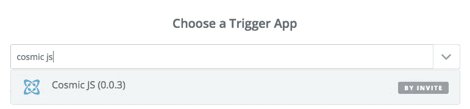
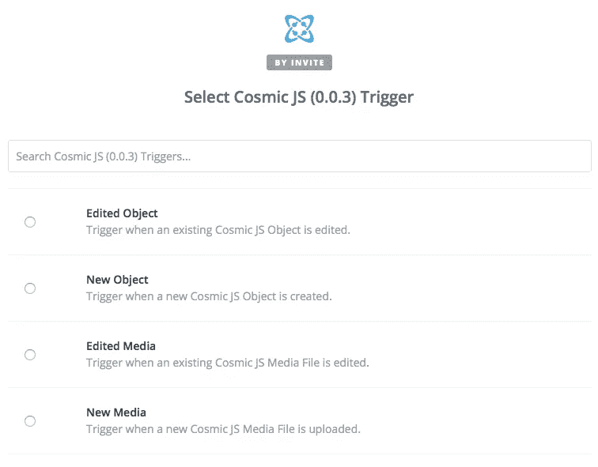
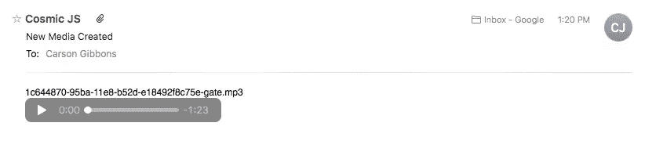
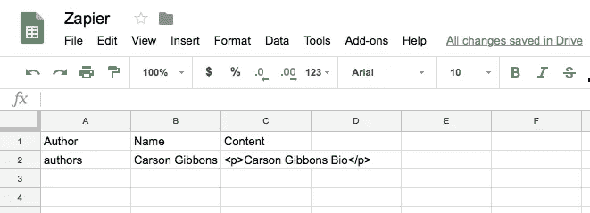
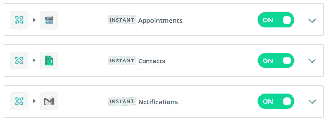

# 通过 Gmail、Google Sheets 和 Google Calendar 实现内容工作流程自动化

> 原文：<https://medium.com/hackernoon/automating-content-workflows-with-gmail-google-sheets-and-google-calendar-a3cc2c5a6266>

管理内容 API-first 的主要好处是，您的内容被转换为可移植和可伸缩的内容对象，可通过 API endpoint 使用您的团队使用的第三方应用程序创建工作流。我们最近发布了[Cosmic JS Zapier Integration](https://zapier.com/platform/public-invite/5784/d94417b158f78245932516dc472dbfbe/)，它允许用户将 za pier 添加到他们的桶中，以选择在第三方系统中提示某个操作的触发器。为了演示，我把我的 Cosmic JS 内容连接到 [Gmail](https://gmail.com) 、 [Google Sheets](https://www.google.com/sheets/about/) 和 [Google Calendar 的几个工作流放在一起。](https://www.google.com/sheets/about/)

## 进行宇宙 JS Zap

**我想创建三个示例工作流:**

发布新媒体=通过 Gmail 接收电子邮件
发布新作者=将作者信息添加到谷歌表单
起草新约会=将约会添加到谷歌日历

我想使用 Cosmic JS Zapier 集成来自动化这些过程。为此，请转到 Cosmic JS [集成页面](https://cosmicjs.com/integrations)并[将 Zapier](https://zapier.com/platform/public-invite/5784/d94417b158f78245932516dc472dbfbe/) 添加到您的桶中。

**选择一个触发 App:搜索“宇宙 JS”**

**选择你的宇宙 JS 触发器**

**媒体更新**:我为我的 zap 选择了“**新媒体**”，并选择了我想接收 Gmail 更新的桶。我连接了我的 Gmail 帐户，并澄清了我希望谁接收邮件，以什么格式接收，以及包括哪些来自上传到我的桶中的新的 Cosmic JS 媒体对象的内容。现在，当我将新媒体添加到我的桶中时，我会收到一封自动发送的电子邮件，其中包含供我审阅的媒体文件。

**新媒体对象发布**

**新媒体对象邮件通知**

**新作者更新**:我为我的 zap 选择了“**新对象**”，并选择了我希望从哪个桶接收我对 Google Sheets 的更新。我在 Zapier 内部澄清，我正在寻找拉**发布对象**类型来更新 Google Sheets。我连接了我的 Google Sheets 账户，明确了当新的作者在 Cosmic JS 系统中发表时，我希望看到哪个电子表格和部分被更新。

**新作者发表**

**新作者加入谷歌表单**

**新约会更新:**我为我的 zap 选择了“**新对象**，并选择了我想从哪个桶接收我对谷歌日历的更新。我在 Zapier 内部澄清，我正在寻找拉**草稿对象**类型来更新 Google 日历，因为我的工作流要求贡献者为仍然需要确认的约会起草内容。现在，当我的约会对象类型设置为草稿时，它会添加一个 Google 日历约会。

**新任命起草完毕**

**谷歌日历新增约会**

# 结论

使用[Cosmic JS Zapier Integration](https://zapier.com/platform/public-invite/5784/d94417b158f78245932516dc472dbfbe/)可以轻松实现数百个简单任务的自动化。一旦您将您的 Cosmic JS Buckets 连接到 Zapier，您就能够创建各种 zap，从而加快您团队的上市时间，并无缝管理其各种工作流。

如果您对使用 Zapier 将您的宇宙 JS 对象集成到其他应用程序的工作流中有任何意见或问题，[请在 Twitter 上联系我们](https://twitter.com/cosmic_js)和[加入 Slack 上的对话](https://cosmicjs.com/community)。