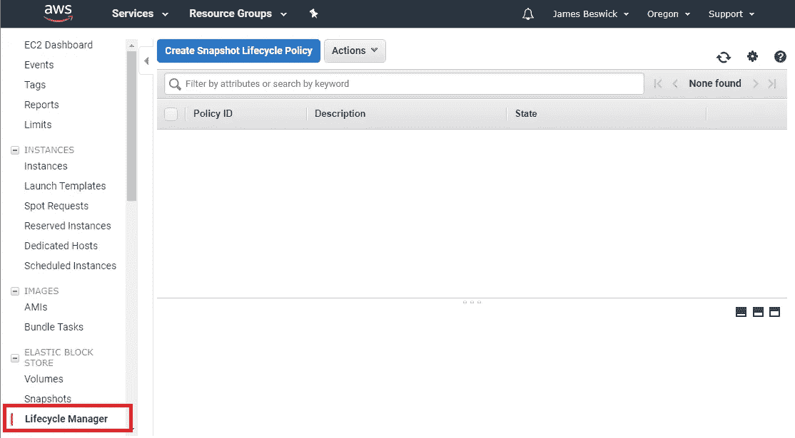
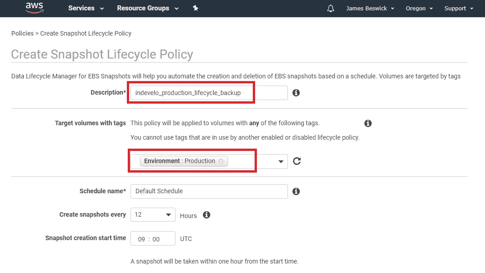
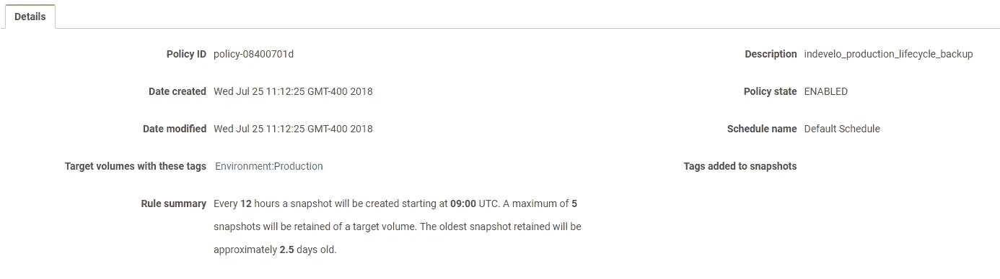

# 在 AWS 中自动化 EBS 快照

> 原文：<https://medium.com/hackernoon/automating-ebs-snapshots-in-aws-b8401fe40353>

AWS 控制台中的一项新功能让您可以在 5 分钟内自动备份所有重要的卷。这是你怎么做的。

正如 S3 存储区无意中向世界敞开大门一样，有大量生产 EBS 卷没有备份策略。许多较新的 AWS 用户惊讶地发现 EBS 没有自动备份，不幸的是，当他们意外丢失一个卷时，第一场灾难就发生了。

不久前，创建 EBS 备份(即快照)的简单方法是在每个实例上使用一个带有 cron 作业的小 Python 脚本。生命周期管理需要更多的准备工作，并且确保每个实例都包含在内需要一些协调的努力。

好消息是 AWS 让这变得简单多了。在您的 EC2 仪表板上，您会看到一个新选项“生命周期管理器”，它最近出现在左下角:

## 为什么您需要快照的生命周期管理？

快照是增量备份，仅保存备份状态之间的差异，这使得创建快照比执行完整备份更快。

问题是，AWS 限制每个帐户最多 10，000 个快照，虽然这已经很慷慨了，但如果您在一个实例群中运行每日快照，就有可能达到上限。此外，根据您的备份需求，您可能不需要为每个实例保留多个快照，因此删除较旧的快照是有意义的。

## 开始前做好准备。

令人欣慰的是，AWS 使这变得非常容易，因为您可以通过使用标记来创建针对您的整个卷清单的策略。例如，您可以创建一个名为“Environment”且值为“Production”的标记，并确保您的所有生产卷都包括在备份策略中。

或者，你可以按项目、客户、部门或任何其他对你的业务有意义的分组进行标记。将标记添加到卷后，就可以开始下一步了。

## 创建生命周期策略。

在 Lifecycle Manager 屏幕中，您只需提供策略描述、目标卷标记的名称以及备份时间表。您还可以包括每个卷保留多少快照:

准备好后，点击“创建”按钮，您的策略就生效了。该策略不会立即运行，您必须等到规则中定义的第一个窗口。

回到 Lifecycle Manager 主窗口，您可以看到策略摘要:

除了存储之外，这项服务不收取任何费用，尽管备份期间实例负载和 IO 使用量会增加，但如果确实需要的话，每小时运行一次快照是没有问题的。

*请记住:Lifecycle Manager 是针对每个地区的服务，在一个地区设置的策略不会备份另一个地区的卷。*

## 今天就做！

如果您的生产中有 EBS 卷，请检查备份计划中包括了多少个。在我见过的每个生产环境中，总有一小部分被排除在外(意外地)，当出现故障或意外的实例终止时，这可能是灾难性的。

您还可以通过使用 AWS Config 来强制实施标记规则，以帮助在将来监视任何缺少标记的生产卷。这是管理大量 EBS 卷或更复杂的 AWS 环境的一种更简单的方法，并确保您的所有生产卷总是得到备份。Config 还使向审计人员证明备份确实在发生变得很容易。