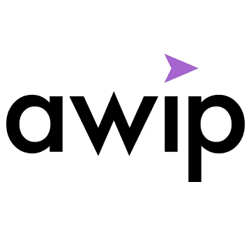
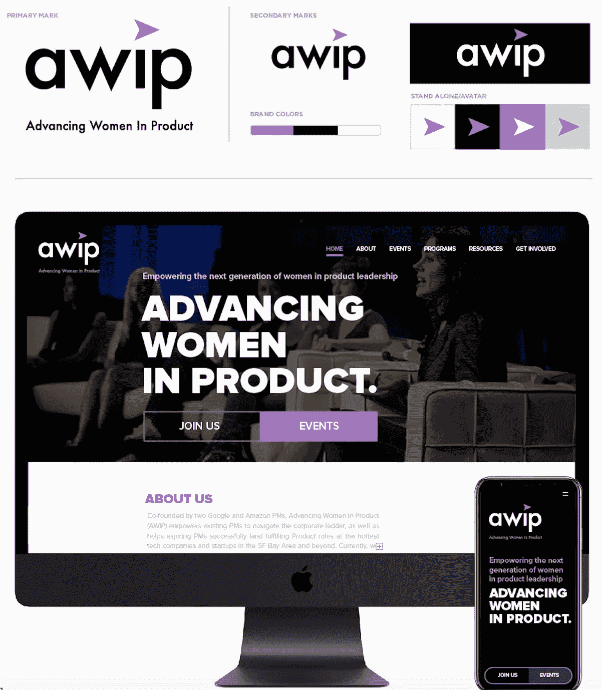

# AWIP 勇往直前！

> 原文：<https://medium.com/hackernoon/awip-moves-forward-boldly-b32e67860adf>

> 由 [Roshni Uppala](https://www.linkedin.com/in/roshni-uppala/) (运营总监&营销)发布。演职员表:[约书亚·墨菲](https://www.linkedin.com/in/joshuamurphy-ux/)(设计经理)。

作为“提高女性产品地位”的运营和营销总监，今天我非常自豪地与大家分享一些激动人心的消息！今年，我们的重点是为我们的社区带来最好的活动和资源，并帮助塑造下一代女性产品领导者。我们已经采取的步骤之一是更新我们的品牌，使其具有更大胆和领先的外观，这将有助于推动我们的战略。我们将很快宣布新的计划，如指导计划和我们的伙伴关系和计划的新闻。

# 新的品牌标识

自成立以来,“产品中的女性”不仅在社区成员方面，而且在参与度、合作伙伴关系和各种顶级技术公司的参与方面都有所增长。今年，我们还自豪地将我们的使命扩展到了 DC、波斯顿和西雅图。随着我们继续壮大我们的 AWIP 家族，扩展我们的产品，我们希望我们的品牌能够最好地反映我们的使命、信念和未来。

新 AWIP 品牌设计是身份和品牌系统的提升。新的身份反映了 AWIP 使命在前进，现在以一种大胆的方式。设计外观自信而富于表现力，拥有充满活力的调色板、大胆、现代的字体和许多组织渴望获得的专业水准。新的外观不仅会增加品牌的合法性和信任度，还将有助于保持行业内的领先地位。

AWIP 品牌标志主要是一个带有方向箭头图形的文字标志。word mark 使用了一种经过修改的字体(基于 Futura ),使用小写格式，给人一种平易近人、友好的感觉。品牌颜色(黑色、白色和紫色)与友好的字体并列，给它一种大胆而令人兴奋的冲击力。箭头图形(基于指南针箭头)告诉查看者组织正在前进。从图形上看，它被定位为出现在 **awip** 中的 **i** 上方的标题(点),并与 **w** 对齐，以提供视觉上的和谐。支持品牌标志-AWIP 的新身份利用比邻星黑色粗体标题。黑白字体的鲜明将进一步强化该组织前进的大胆/自豪的方向。

在接下来的几个月里，我们将更新我们与新品牌的所有通信。敬请关注更多更新！

> 请给我们写信，info@advancingwomeninproduct.org 的评论或更多信息。