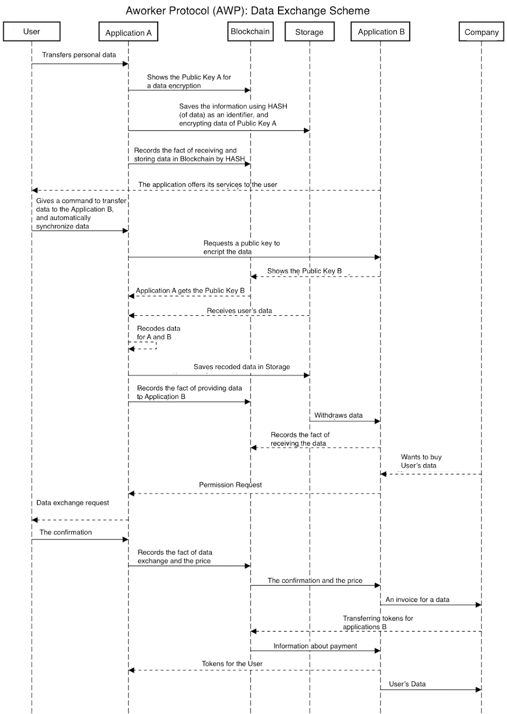

# 工作协议(AWP):数据交换将如何工作？

> 原文：<https://medium.com/hackernoon/aworker-protocol-awp-how-will-data-exchange-work-d0f5cc42cd74>

从 [Unsplash](https://unsplash.com/photos/mrIaqKh9050)

# 工作协议

一家公司将能够通过与[工作人员](https://hackernoon.com/tagged/aworker)协议相连的应用程序来测试候选人。公司打开一个连接到 Aworker 协议的站点或应用程序，并检查存储在分布式分类帐中的所有信息。

工作协议会在公司雇佣员工时提供完整的信息。缺乏可核实的申请人信息是当今人力资源领域的一个重大问题。一个具有集中式服务器的应用程序几乎不可能解决这个问题。

该协议将联合应用程序开发人员的努力，并收集关于申请人的完整信息。

从另一个角度来说，人们可以证明自己的能力，而无需冗长的检查和信息收集。在这种情况下，申请人将能够管理他们的数据，并在必要时将其货币化。

# 人力资源应用程序开发人员使用 Aworker 协议的优势

*   访问他们的客户(公司)可能感兴趣的用户数据库。
*   Devs 可以立即访问人的数据的数据库。他们不需要从零开始聚集观众。
*   开发者将通过他们的应用程序从出售的数据中获得佣金形式的额外收入。

总而言之，**应用程序开发人员可以从以多种不同方式使用工作协议**中受益，这有助于他们更快地用经过验证的数据创建高质量的应用程序，并且费用更低。

你是开发者，想了解更多？给我写信，地址是 [anton@aworker.io](http://anton@aworker.io)