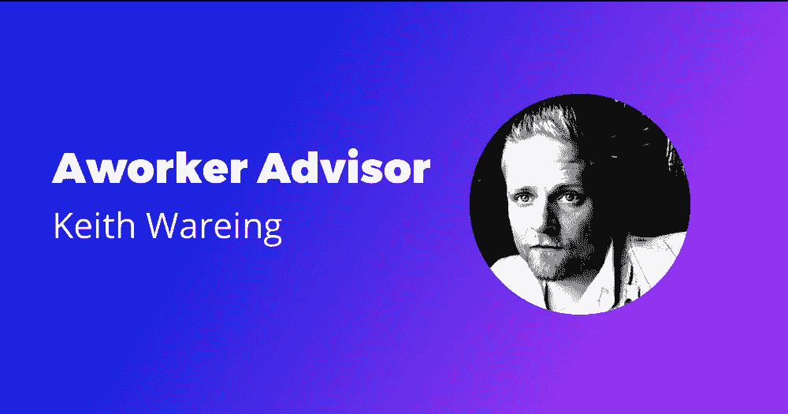

# 一名工人欢迎基思·韦林加入顾问委员会

> 原文：<https://medium.com/hackernoon/aworker-welcomes-keith-wareing-in-the-advisory-board-60d9735aba46>

Aworker 团队很高兴地宣布，Keith Wareing，一位成功的企业家和受欢迎的 Youtube 频道的[密码爱好者](https://hackernoon.com/tagged/crypto-enthusiast)，成为 Aworker 顾问委员会的一员，帮助该项目建立招聘行业最强大的生态系统。

[Keith Wareing](https://www.linkedin.com/in/keith-wareing-b16a74162/) 在招聘行业拥有超过五年的经验，他拥有一个关于加密货币行业和最有前途的区块链项目的成功的 Youtube 频道。他是 ERA Media Online agency 的首席执行官，该机构旨在将社交媒体管理方面的专业知识带给世界各地的客户。

凭借 Keith 的专业知识，工作人员可以提高项目的在线表现，并在招聘、数字营销和项目开发的其他方面获得宝贵的建议。

Aworker 是一个基于区块链的下一代招聘平台，其突出目的是颠覆人力资源行业。我们努力为求职和职业发展创造新的机会。Aworker 通过将区块链驱动的技术置于 Work 2.0 的核心来开发颠覆性的解决方案。现在每个人都会因为他的工作相关的推荐而获得奖励。在智能合同的帮助下，薪酬会自动支付给招聘过程中的所有参与者。创造工作者是为了解决问题:1)人们会找到一份心理上更适合他们的工作 2)降低雇佣成本 3)控制个人数据