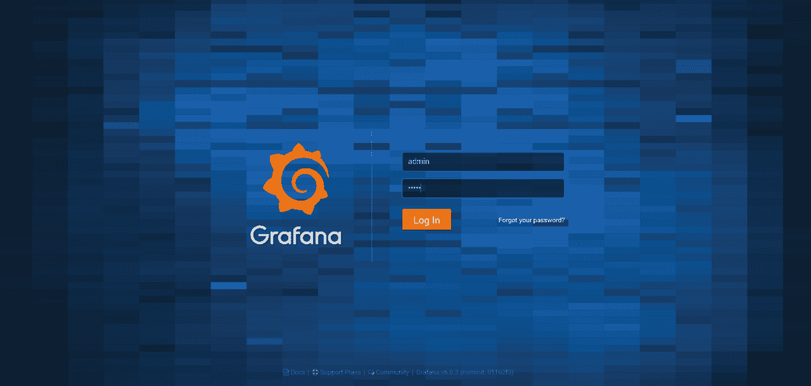

# 使用 Grafana 进行 AWS CloudWatch 监控

> 原文：<https://medium.com/hackernoon/aws-cloudwatch-monitoring-with-grafana-ace63e1ab507>

**混合云**是新的现实。因此，对于您的全球基础设施，您将需要一个单一的工具、通用仪表板和图形编辑器。这就是**格拉夫纳**发挥作用的地方。由于它的可插拔架构，您可以访问许多小部件和插件来创建交互式&用户友好的仪表板。在这篇文章中，我将带您了解如何在 Grafana 中创建仪表板，以根据在 **AWS CloudWatch** 中收集的指标实时监控您的 **EC2** 实例。

首先，使用以下 **IAM 策略**创建一个 **IAM 角色**:

使用下面的*用户数据*脚本启动一个 **EC2** 实例。确保将我们之前创建的角色与实例相关联:

在安全组部分，允许端口 **3000** 上的入站流量(Grafana 仪表板)。

创建完成后，将您的浏览器指向[http://instance _ DNS _ name:3000](http://instance_dns_name:3000/)，您应该会看到 **Grafana 登录**页面(默认凭证: *admin/admin* ):

Grafana 附带了对 CloudWatch 的内置支持，因此添加了一个新的数据源:

注意:如果您使用的是 *IAM 角色*(推荐)，如上所述将其他字段留空，否则，在 *~/处创建一个新文件。aws/凭证*与您自己的 AWS 访问密钥&密钥。

创建一个新的仪表板，并向面板添加新图形，选择 **AWS/EC2** 作为*名称空间*，选择 **CPUUtilization** 作为*度量*，并在*维度*字段中选择您想要监控的实例的**实例 id** :

太好了！

我们可以使用 Grafana 中一个名为“**查询变量**的特性，而不是在查询中硬编码 *InstanceId* 。创建一个新变量来保存 AWS 支持的区域列表:

并且，创建第二个变量来存储每个选定 AWS 区域的实例 id 列表:

现在，返回到您的图表并更新查询，如下所示:

就这样，继续创建其他小部件:

注意:你可以从 [GitHub](https://github.com/mlabouardy/grafana-dashboards) 下载仪表盘。

现在，您已经准备好为您的 **CloudWatch** 指标构建交互式动态仪表盘了。