# ELK 的 AWS 事件分析

> 原文：<https://medium.com/hackernoon/aws-events-analysis-with-elk-4a2d9ee9232f>

记录您的 AWS 环境活动是必须的。它可以帮助您持续监控环境的安全性，并实时检测可疑或不良活动。因此，节省了数千美元。幸运的是，AWS 提供了一个名为 **CloudTrail** 的解决方案，可以让你实现这一点。它记录所有 AWS 区域中的所有事件，并在单个 S3 存储桶中记录每个 API 调用。

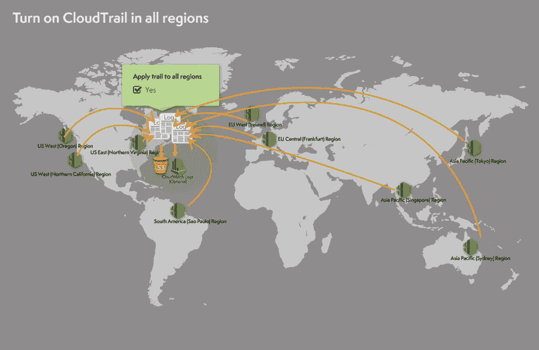

从那里，您可以使用流行的日志堆栈 ELK ( **Elasticsearch** 、**Logstash**&**Kibana**)来设置分析管道，以便在单个动态仪表板中读取、解析、索引和可视化这些日志，甚至采取相应的行动:

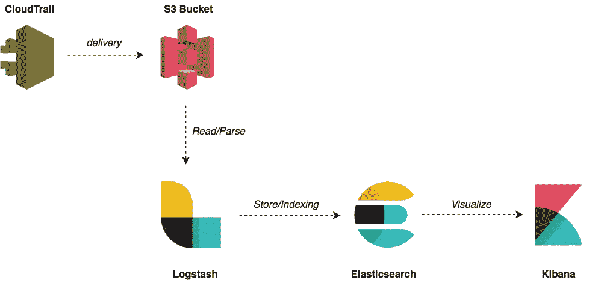

首先，创建一个安装并预配置了 ELK 组件的 AMI。AMI 将基于 Ubuntu 映像:

为了提供 AMI，我们将使用以下 shell 脚本:

现在模板定义好了，用 **Packer** 烘焙一个新的 AMI:

一旦创建了 AMI，使用 **Terraform** 基于 AMI 创建一个新的 EC2 实例。确保向实例授予 S3 权限，以便能够从 bucket 中读取 CloudTrail 日志:

发出以下命令来配置基础架构:

返回 AWS 管理控制台，导航到 CloudTrail，并单击“**创建踪迹**”按钮:

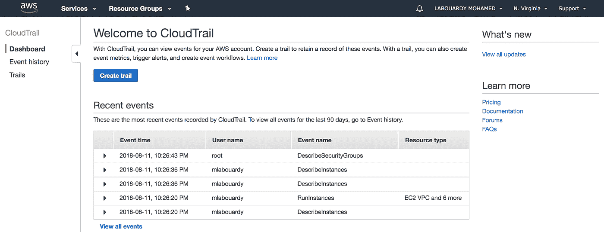

为其命名，并将踪迹应用于所有 AWS 区域:

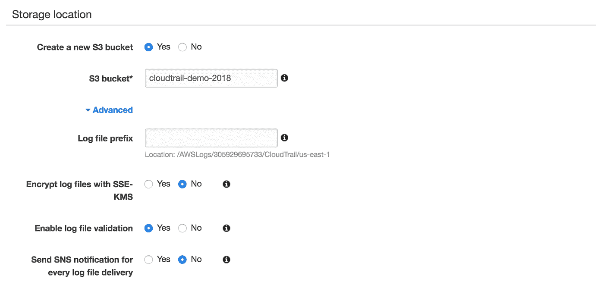

点击“**创建**”，轨迹应创建如下:

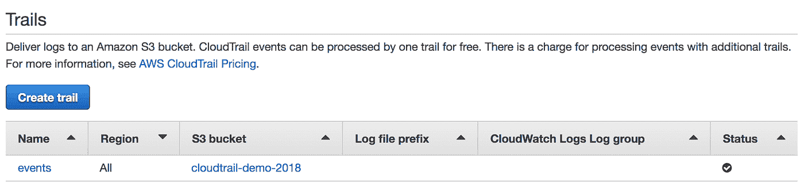

接下来，将 Logstash 配置为定期读取 CloudTrail 日志。 **geoip** 过滤器根据 *sourceipAddress* 字段添加 IP 地址的地理位置信息。然后，它会自动将日志存储到 Elasticsearch:

为了使更改生效，使用下面的命令重新启动 Logstash:

应该在 elastic search([*http://IP:9200/_ cat/indexes)上创建一个新的索引？v*](http://ip:9200/_cat/indices?v)

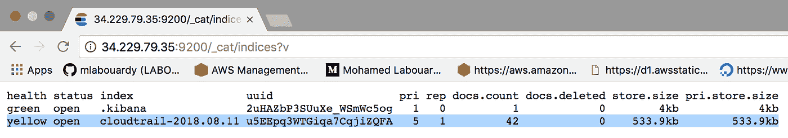

在 Kibana 上，创建一个与用于存储日志的索引格式相匹配的新索引模式:

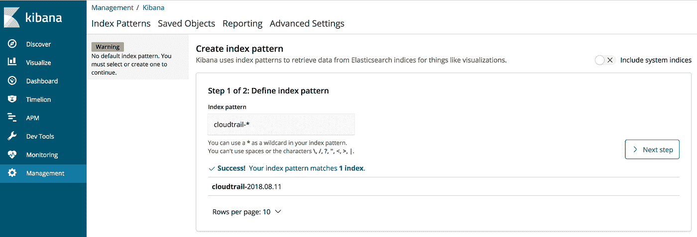

创建索引后，我们可以开始探索我们的 CloudTrail 事件:

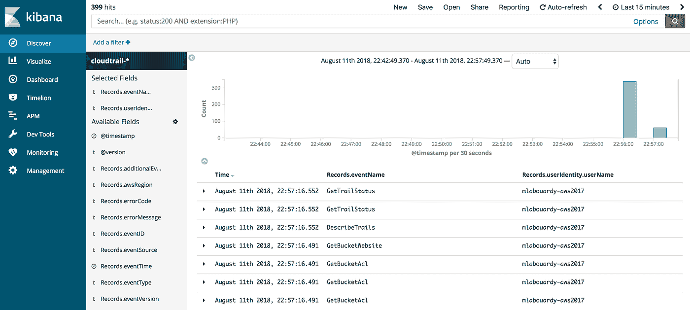

现在我们已经在 Elasticsearch 内部处理了数据，让我们构建一些图表。我们将使用 Kibana 中的地图可视化来监控对 AWS 环境的地理访问:

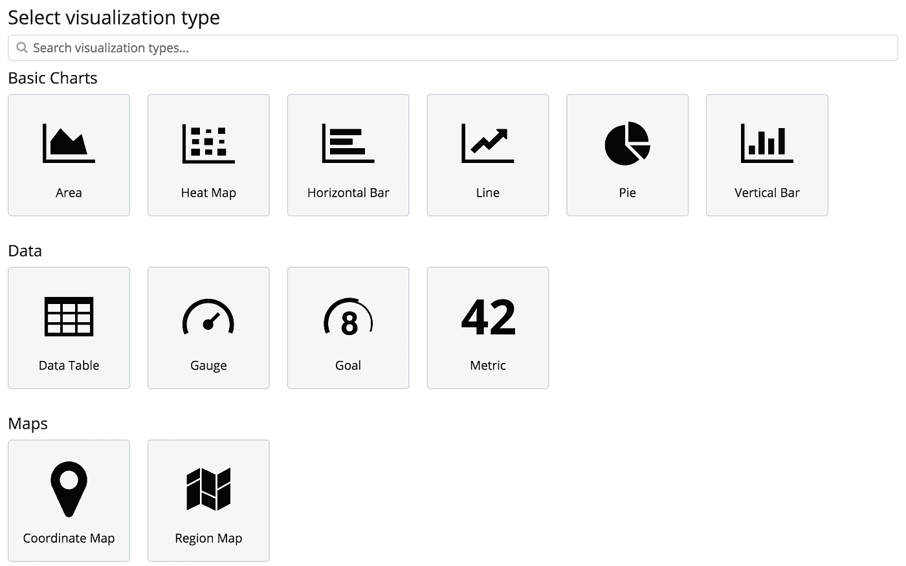

现在，您可以看到从何处访问环境:

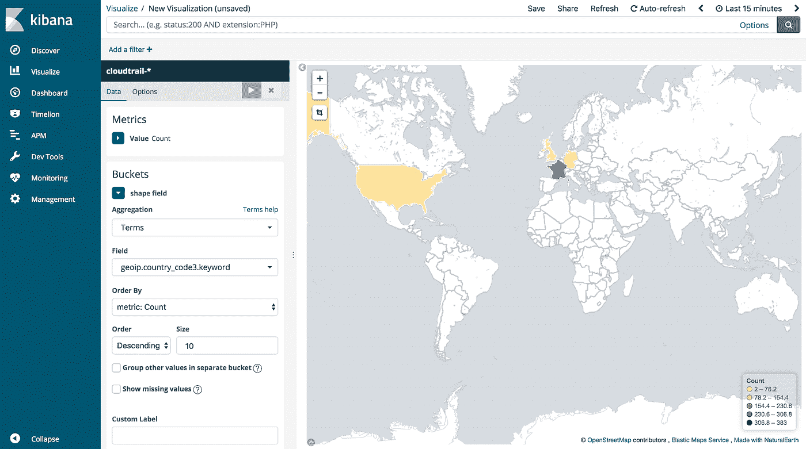

接下来，创建更多小部件来显示关于用户身份、用户代理和用户采取的操作的信息。大概是这样的:

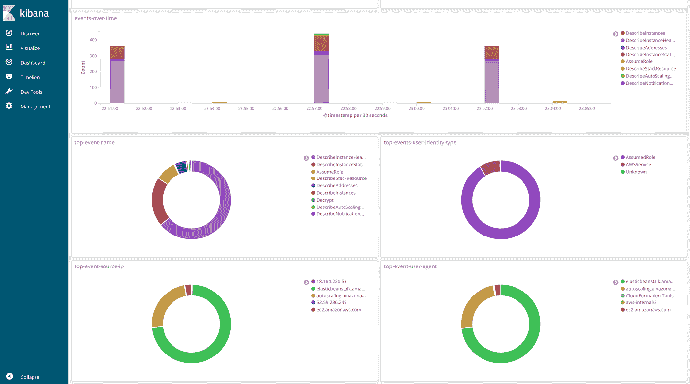

您可以更进一步，根据特定事件(有人从未定义的位置访问您的环境)设置警报，以便接近实时地发出警报。

*完整代码可以在我的* [*GitHub*](https://github.com/mlabouardy/lambda-oneshot-container) *上找到。请务必在下面留下您的评论、反馈或建议，或者直接在 Twitter 上与我联系*[***@****mlabouardy*](https://twitter.com/mlabouardy)*。*