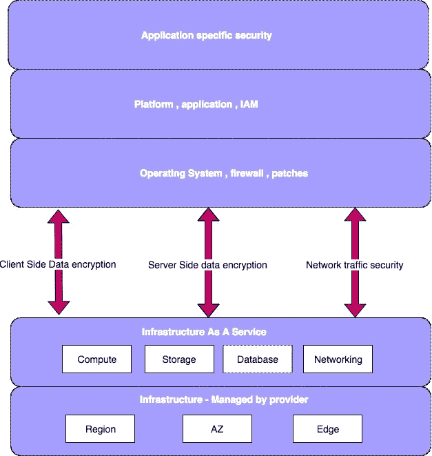
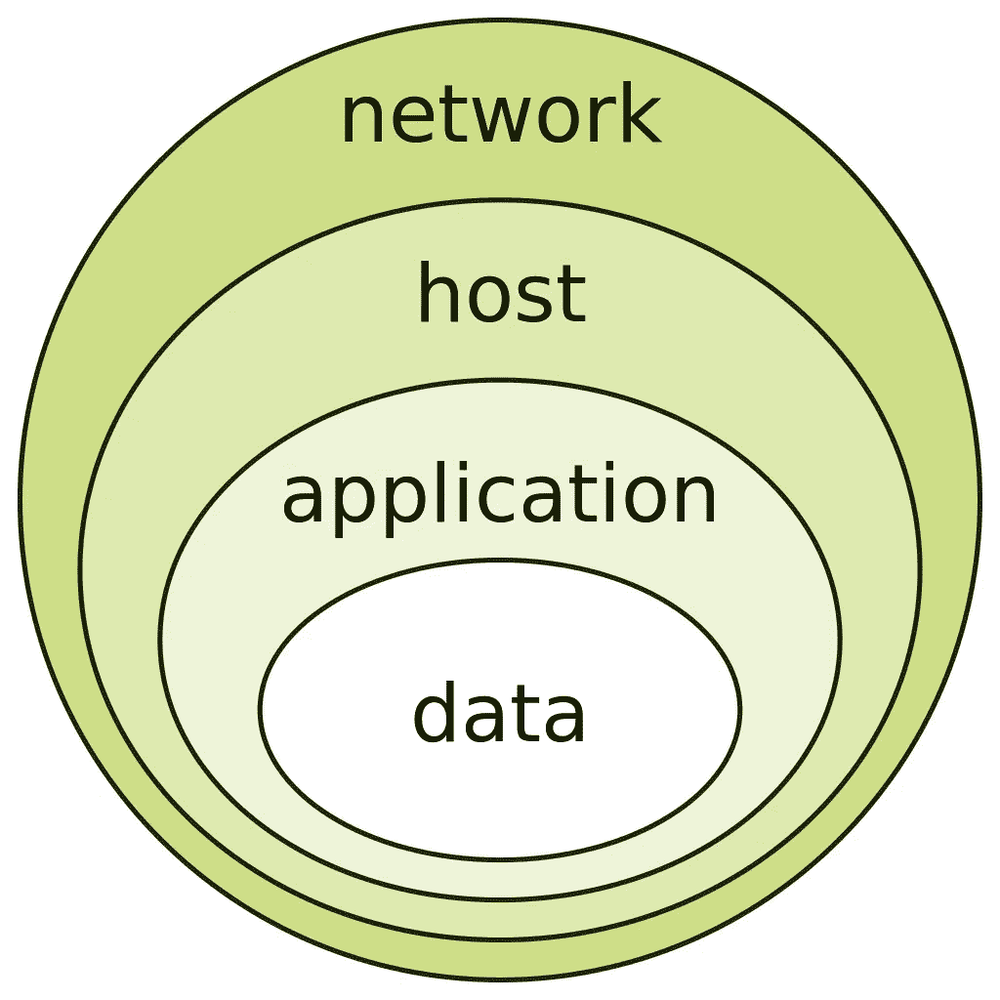
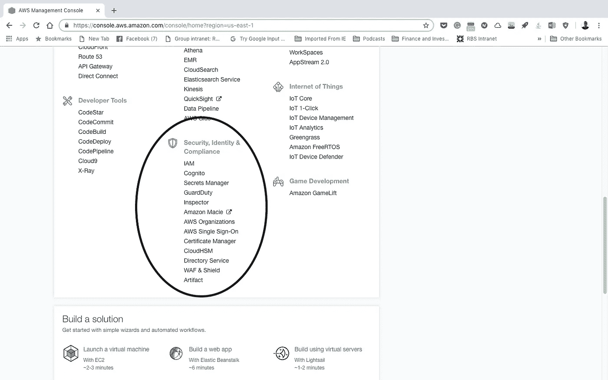

# CISO AWS—您一直想问但又害怕问的问题

> 原文：<https://medium.com/hackernoon/aws-for-the-ciso-what-you-always-wanted-to-ask-but-were-too-afraid-of-eb1bac2acf47>

> 我们生活在一个有围墙的世界，这些围墙需要持枪的人来守卫。—阿伦·索尔金

如果你曾经热爱技术，但是现在由于管理责任而无法跟上技术的发展-

如果“云”这个词(严格地说是指计算)让你对安全方面产生了一些偏执-

如果您正在评估云提议，但对安全影响仍有一丝疑虑-

Alone and scared — what lies ahead !!!!!

# 然后

> 保持冷静，继续读下去

在我任职期间，我参与了一家全球银行巨头的解决方案供应商的云迁移提案的评估，我注意到高级管理人员对云计算仍有一丝不安全感。首先，从过去的计算方式来看，云计算并没有什么本质上的新东西。按照 NIST 的说法—

> 云计算是一种模式，支持对可配置计算资源(例如网络、服务器、存储、应用程序和服务)的共享池进行便捷的按需网络访问，只需最少的管理工作或服务提供商干预，即可快速调配和释放这些资源。五个主要属性定义了基于云的系统，即
> 
> a)按需自助服务
> 
> b)广泛的网络接入
> 
> c)资源共享
> 
> d)快速弹性
> 
> e)服务的衡量

因此，正如我们可以从上面被广泛接受的定义中看到的，云计算在技术上没有什么不同，这使它从根本上区别于它的前身，本地计算。换句话说，云计算并不像量子计算那样根本不同。因此，一个自然的问题是，在公共云(如 AWS)上托管的工作负载与本地托管的工作负载相比的情况下，我们是否应该更担心安全性？像所有这类问题一样，回答也很标准——视情况而定。其原因在于，即使底层技术没有太大变化，但使用的工具链相当新，影响范围(尽管不是由于云)相当大。此外，在社交媒体和高度普及的时代，任何业务中断都被放大了许多倍，这使得安全性变得更加重要。和往常一样，在街区里挑新来的孩子很容易。然而，另一方面，像 AWS 这样的提供商有专门的安全团队，他们在信息安全方面非常专业。所以作为云服务用户，你并不孤单。

在我们进一步讨论 AWS 堆栈之前，让我们先了解一些概念。

# 分担责任模式

I provide the resources , you do the job !!!

AWS 在安全方面遵循一个名为“[共担责任原则](https://aws.amazon.com/compliance/shared-responsibility-model/)的概念，该原则实质上划分了 AWS 和客户之间的责任归属。本质上它意味着-

我们(AWS)负责云的安全。

你(客户)负责云上**的安全。**

上述理念的一个自然延伸是，客户在 AWS 堆栈中对托管服务的级别越高，更多的安全方面将由 AWS 负责(显然会涉及更多成本)。因此，在 IaaS 产品(例如 EC2)的情况下，用户将负责操作系统升级和安全补丁，而对于 FaaS(例如 Lambda)，他不需要担心这些问题。

Levels of management in AWS

在所有场景中，AWS 始终具有最低限度的安全性。这包括基础 AWS 托管基础设施的物理安全等方面，免受自然灾害、人为事故、技术故障等威胁。从数据中心选址(读取区域/可用性区域)到员工访问的权利由 AWS 通过明确定义的[政策](https://aws.amazon.com/compliance/data-center/controls/)进行控制。

# 最小特权原则

安全性的一个重要原则是将执行给定任务所需的尽可能少的特权授予任何用户/进程/任务。

AWS 通过身份和访问管理( [IAM](https://aws.amazon.com/iam/?hp=tile&so-exp=below) )服务以非常优雅的方式实现了这一原则。

# 检测控件

这些控制用于识别体系结构中的各种漏洞。它涉及账户中所有活跃/不活跃资产的库存管理。使用的一些常见机制包括日志分析、将审计控制与日常工作流相集成。AWS 为检测架构中的潜在安全弱点提供了一系列服务。AWS 还为客户提供集中[审核](https://docs.aws.amazon.com/general/latest/gr/aws-security-audit-guide.html)的指南。

# 纵深防御

顾名思义，深度防御是一个 IT 安全概念，其中部署了多个安全层来保护资产。

# 渗透测试

AWS 允许客户进行渗透测试。然而，它希望事先通知，以确保不会对可能共享资源的其他客户造成意外影响。可以通过 root 帐户登录来提出相同的请求。

## 加密

根据维基百科

> **加密**是对消息或信息进行编码的过程，只有授权方才能访问，未经授权方不能访问。加密本身并不能防止干扰，但会阻止潜在的拦截者获取可理解的内容。在加密方案中，被称为[明文](https://en.wikipedia.org/wiki/Plaintext)的预期信息或消息使用一种加密算法——一种[密码](https://en.wikipedia.org/wiki/Cipher)——进行加密，生成[密文](https://en.wikipedia.org/wiki/Ciphertext)，只有解密后才能读取。

随着如此多的数据在云中传递和存储，加密的重要性再怎么强调也不为过。

# 这些是我最喜欢的一些东西…

🎶🎶🎶 Controlled security groups, sensible IAM use. MFA on root account and CloudTrail logging — These are a few of my favourite things 🎶🎶🎶

基于上面提到的通用安全概念，下一个自然的问题是——这些在 AWS 中是如何实现的？答案就像所有的科技产品一样，非常全面。AWS 有一系列服务可用于确保安全性和合规性。下面是对其中几个**的简要介绍，以及它们在保护您的架构中所扮演的角色。鉴于云计算快速创新的方式，未来更多更好的服务是不可避免的。**

AWS 控制台有一个专门的安全和合规部分。然而，在其他标题下有一些服务特别引起我对安全处理的兴趣。

Security services umbrella of AWS

## 身份和访问管理

该服务用于创建用户、组、策略和角色，通过它们可以访问 AWS 帐户。在开户时，有一个全能的根用户帐户，作为一种最佳做法，不应用于日常目的。有了这个约束，我们如何让更多的用户按需访问帐户呢？嗯，我是你做这项工作的合适人选。从 IAM 创建的用户可以根据需要获得对各种 AWS 服务的细粒度访问控制。**用户**可以基于公共属性聚合到**组**中。这简化了访问权限的管理。可以创建用户定义的策略来创建微调的特定策略。**角色**是唯一的 IAM 实体，用于授予对其他 AWS 实体的访问权限。例如，如果 EC2 实例需要访问 S3，那么可以调用 EC2 实例映射到具有 S3 访问权限的特定角色。角色也可用于提供跨帐户访问。还可以通过联合的方式使用现有的内部凭据。

## VPC(虚拟专用云)

尽管在所有 AWS 参考文献中，VPC(及其相关功能)都被标记在网络标题下，但它却是控制对房地产的访问的一种非常强大的方法。通过有效的**子网划分**,人们可以根据处理的敏感性划分 IT 资源。VPC 不仅涵盖安全的预防方面，还通过流量日志涵盖检测措施。**流量日志**用于捕捉 VPC 的任何进出流量。**安全组**用于在协议、端口和源 IP 级别控制对资源的访问。这些只是 VPC 提供的安全保障的几个方面。难怪这是一个最常用的服务，以确保房地产。

## 云的形成

CloudFormation 是 AWS 对基础设施作为代码的解释。批评者可能会说，这属于管理工具的范畴，但一个制作精良的安全模板肯定是可复制的安全架构的成功秘诀。自动化的版本控制环境也减少了由于人工疏忽而导致的漏洞。

## Web 应用防火墙和屏蔽

安全组是前面提到的控制系统访问的一个特性。然而，安全组不做任何数据包检查。因此，安全组会让恶意数据包进入系统，只要它来自许可的 IP 地址，并通过可接受的协议进入。WAF 提供了下一个安全级别(深度防御任何人),它检查传入的包中是否有恶意内容。它提供各种方面的保护，例如源 IP、数据包内容(SQL 注入、跨站点脚本)等等。

Shield 用于保护帐户免受 DDoS 攻击。AWS Shield 有两种变体—标准版和高级版。默认情况下，向所有客户提供标准版本。高级变体可以按需调用。

## CloudHSM

由业务或监管机构驱动的具有严格安全需求的组织使用硬件安全模块来管理他们的加密密钥。顾名思义，硬件安全模块是用于提供额外安全性的专用硬件。因为它是一个专用的硬件，它处理安全相关方面的效率非常高。CloudHSM 为在 AWS 平面中操作的用户提供了相同的功能。安全性需求不太严格的用户可以选择多租户的 KMS(密钥管理服务)。

## 值得信赖的顾问

AWS 提供了一种资源，可用于对 AWS 账户进行测试，以根据**成本优化、性能、安全性、容错和服务限制**对账户进行评估。这些测试查找常见问题并通知客户。

## CloudTrail 和 CloudWatch

CloudTrail 用于监控所有 API 调用，以便可以标记出任何可疑的调用。此服务完成的日志记录可用于审计/合规性目的。

如果有一个强大的通知系统，任何活动记录都会变得更加有用。CloudWatch 泰然自若地履行这一职责，让用户能够访问整个 AWS 帐户的仪表盘、计费警报、日志和指标。

## 配置

Config 允许跟踪给定 AWS 帐户中所有资源的配置。它还允许跟踪帐户中的任何变化。通过 AWS Lambda(无服务器服务),可以根据合规性需求检查配置中的任何更改，以确保它们是有序的。

总而言之，AWS 有一系列旨在为客户提供安全保障的服务。上面提到的列表只是其中的一小部分。计算范式在发展，服务也在发展(它的特性集和价格)。客户不应该站在一旁无休止地恐慌，而是应该采取小措施来获得云的巨大好处。