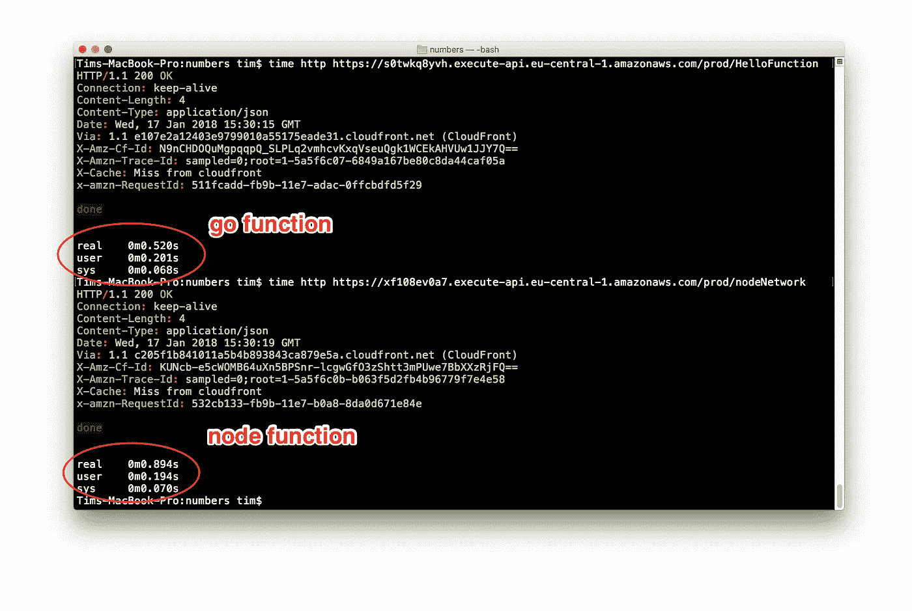
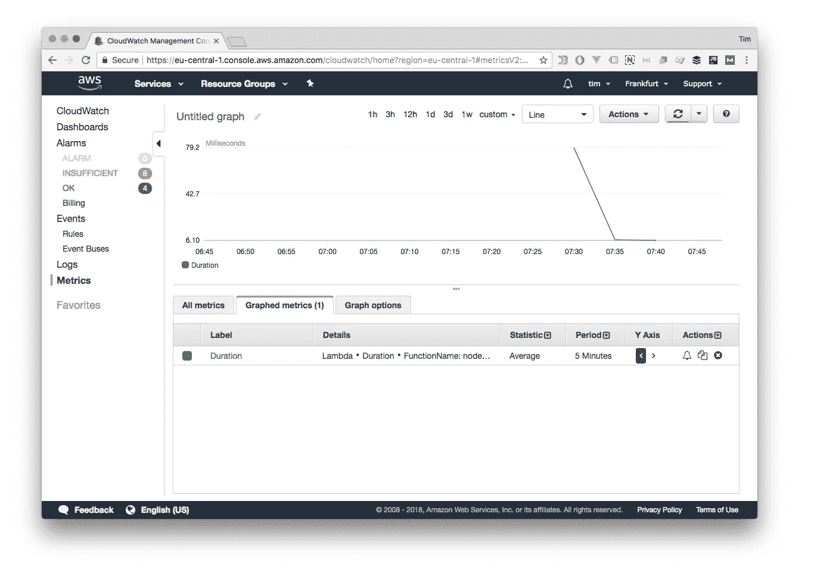
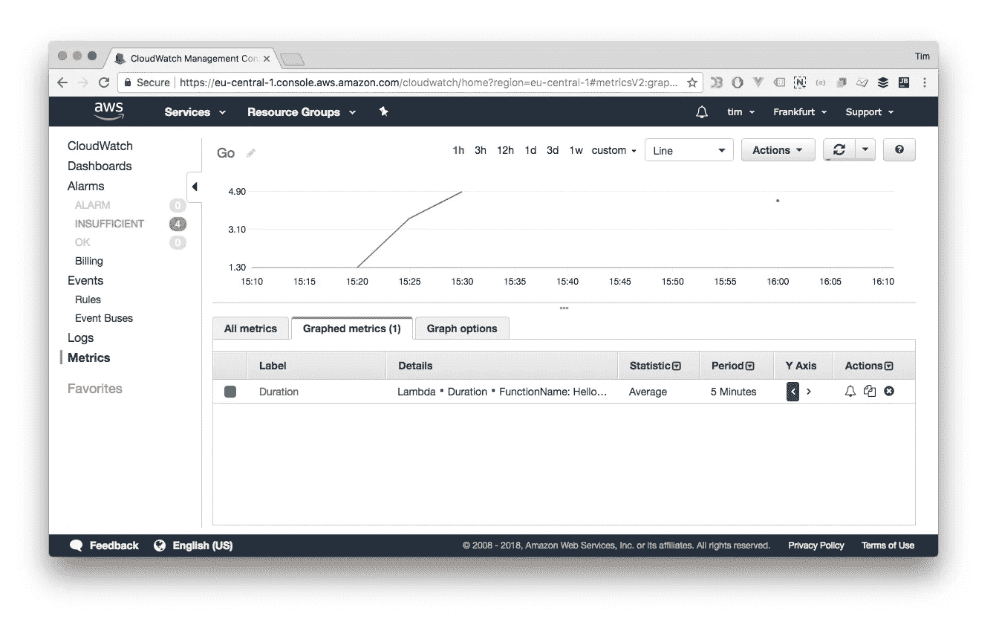
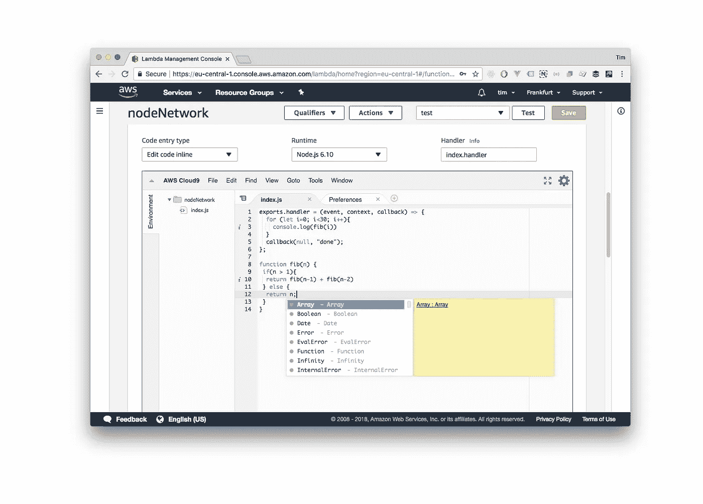

# AWS Lambda Go 与 Node.js 性能指标评测:更新🔥

> 原文：<https://medium.com/hackernoon/aws-lambda-go-vs-node-js-performance-benchmark-1c8898341982>


Horse Racing Neck & Neck. [http://www.publicdomainpictures.net/](http://www.publicdomainpictures.net/)

就在本周，AWS 宣布为他们的 Lambda 服务发布 Go。这非常令人兴奋，因为 Go 跨越了 Java 和 Node 之间的一个很大的缝隙。JS 在类型安全、编程模型和性能方面的优势。

围绕 Lambda 和无服务器/FaaS 计算的社区已经创建了库和框架来使用 Node.js“填充”Go 应用程序，但现在正式提供了支持。

# 测试代码:斐波那契数列

我们准备了两个非常简单的 Lambda 函数。两者都计算 30 个数字的斐波纳契数列。就是这样。是的，这是一个非常简单的测试，但这是重点。我明确地不想通过一些第三方库来整合任何 web 框架或数据库交互性。这些类型的基准都很棒，也非常相关，但是这一个是基本的。

*注意:正如评论中指出的，最初的 Node.js 代码使用递归来计算斐波那契数列，而 Go 代码没有。*

*这会影响调用堆栈，这可能不是一个公平的比较。有了这些优秀的众包知识，我在适用的地方更新了这篇文章。在* [*中找到老 Node.js 代码这个要诀*](https://gist.github.com/tnolet/9432f1f39890a22bfb9195e5adeb3eca) *。*

节点代码:

Node.js code

Go 代码:

Go code

这两个函数都不接受输入，只是将斐波那契数列记录到标准输出中。打印 30 个数字后，输出是字符串“done ”,并以 AWS API Gateway 理解的格式传递。

# 测试设置

我用 128MB 内存的完全标准的资源配置文件部署了这两个功能。每个函数都有一个 API 网关，没有身份验证，不会给请求/响应周期增加任何开销。对两个端点的快速冒烟测试 HTTP 调用显示一切都在工作，并且已经可以注意到大约 340 毫秒的响应时间差异。



然而，这些请求没有考虑 Lambda 容器的任何“预热”。为此，我们使用 [loadtest](https://github.com/alexfernandez/loadtest) 运行了一个更长的测试，使用五个并发工作器以每秒 10 个请求的速度发送了总共 1000 个请求。我们打开了 keepalive。

```
$ loadtest -c 5 -k -n 1000 --rps 10 https://<api-endpoint>
```

# 测试结果:斐波那契

在这项计算密集型测试中，Node.js 和 Go 之间的差异几乎为零。有趣的是，递归版本向我们展示了 Node 中的递归调用对总体性能的影响。Node.js 递归函数的执行持续时间几乎是 Go 函数的 10 倍。

*调整递归 Node.js 代码后文本更新*

```
**Max requests:**        1000
**Concurrency level:**   5
**Agent:**               keepalive
**Requests per second:** 10 **Node.js     Node.js (rec.)  Go**
**Mean latency:**     76.9 ms     407.8 ms       75.3 ms
 **50%**             73          392            67  
 **90%**             95          492            91 
 **95%**             101          526           109
 **99%**             201          709           226
**100%**             630          814           562 (longest request)
```

对于递归版本(标有 rec。)AWS Cloudwatch metrics 给出了类似的图，其中 Node.js 代码几乎慢了 10 倍。但是，如前所述，非递归版本不是这种情况。



Node.js execution duration



Go execution duration

# 测试代码:S3 和迪纳摩互动

正如评论中提到的，斐波那契数列作为一个开始是不错的，但并不真正代表真实世界的场景。所以我举了一个额外的例子。这个λ函数

1.  从 S3 抓取了一个大约 50kb 的图像。
2.  将其 LastModified 时间戳写入 DynamoDB 表。

这类似于上传网站或一般文件处理的典型场景。测试设置与斐波那契测试完全相同，只是增加了 S3 桶和发电机表。两个版本分别为每种语言使用标准的 AWS SDK。Dynamo 表的写入容量高达 1000 个单位，以提供足够的吞吐量。

**Node.js**

**Go** 代码:

# 测试结果:S3 和迪纳摩互动

这是一个比前一个测试更清晰的结果，只是在 99%的百分位数上，两个测试有些相等，但仍然相差很远。低于该阈值的所有值都支持 Go。这是拥有高容量 AWS 功能的用户在切换到 Go 时可以真正省钱的地方，因为他们的账单可以有效地减少约 40%。

```
**Max requests:**        1000
**Concurrency level:**   5
**Agent:**               keepalive
**Requests per second:** 10 **Node.js    Go**
**Mean latency:**    252.2 ms   109.7 ms
 **50%**            203        91
 **90%**            384        151
 **95%**             478        197
 **99%**             894        435
**100%**            8103       1133(longest request)
```

*注:在给 io 增加一个阅读器后更新。按照注释部分的注释，在 Go 代码中使用 Reader 主体。这实际上对结果没有影响，可能是由于过度的 S3 缓存。不是期望，但是嘿，是什么？*

# 动态与编译

在任何 AWS 营销广告中不明显的是，你实际上为 AWS Lambda 提供了预编译的 Go 二进制文件。AWS 不会为您编译 Go 源文件，这会产生一些后果。

首先，AWS Lambda 实际上并没有“真正”运行 Go 代码。相反，它运行一个二进制程序，监听一个特定的端口，并以特定的网络格式传递一条消息。这实际上非常好，因为它为 AWS 在未来添加其他编译语言如 Rust 或 C++开辟了可能性，建立在他们当前的 Go 引擎上。

其次，从一个不太积极的方面来说，拥有预编译的二进制文件意味着您不能使用相当优秀的内置代码编辑器。AWS 最近收购的 Cloud9 提供的这个迷你 IDE 是同类产品中的佼佼者，它确实让 Lambda 服务页面感觉有点像 JsFiddle 或 CodePen，但对于后端代码来说，只需按一下按钮就可以在生产中运行。我是 IntelliJ / WebStorm 的忠实用户，但 Cloud9 的东西真的真的很好。👍



AWS Lambda built in code editor

# 结论

对 AWS Lambda 的 Go 支持为那些在 Lambda 上运行工作负载的人带来了非常显著的成本节约和性能优势。令人兴奋的事情将会发生！

如果你喜欢这篇文章，请用**鼓掌**来表达你的欣赏👏下面！

蒂姆是 https://vamp . io(T1)的产品倡导者，这是为现代云平台发布的智能&无压力应用程序。

[](https://vamp.io?utm_campaign=govsnode&utm_source=Hackernoon)