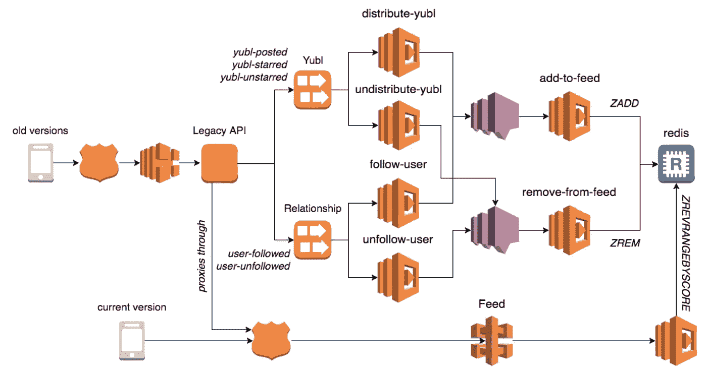
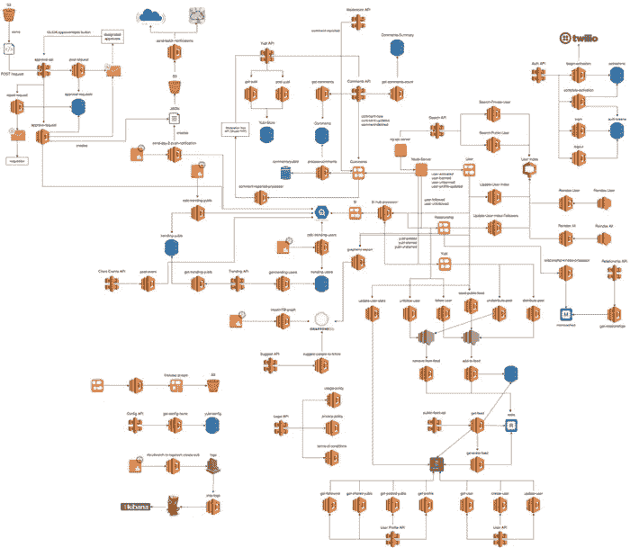
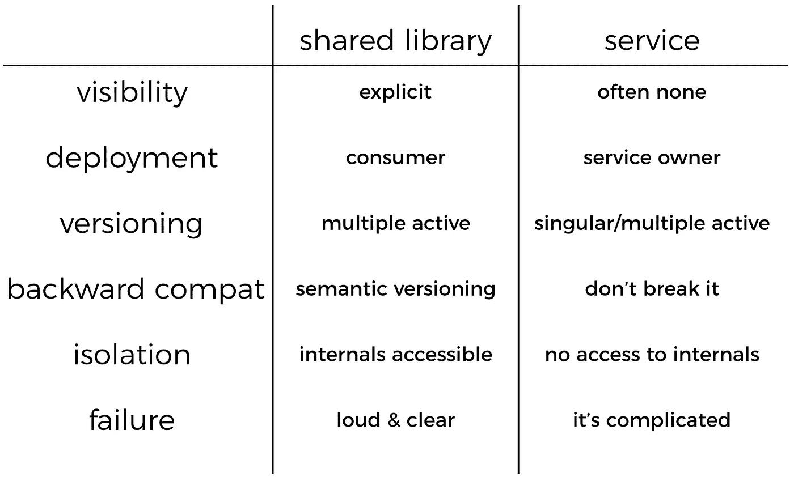
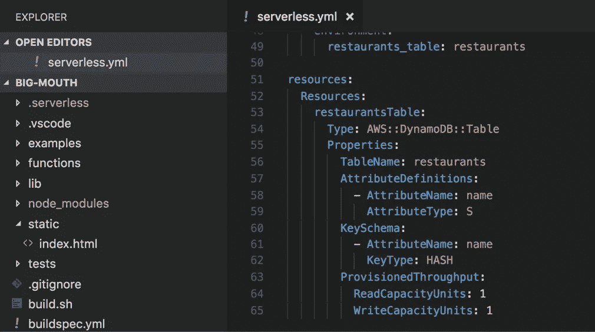
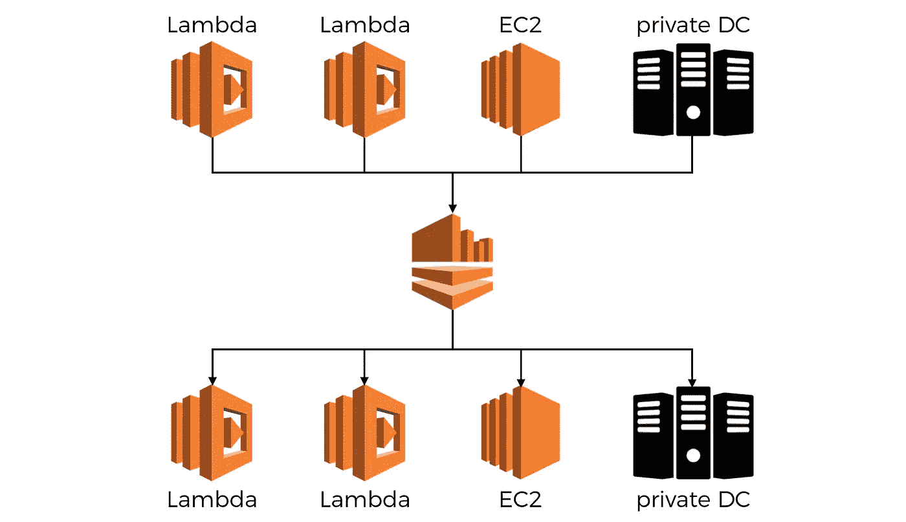
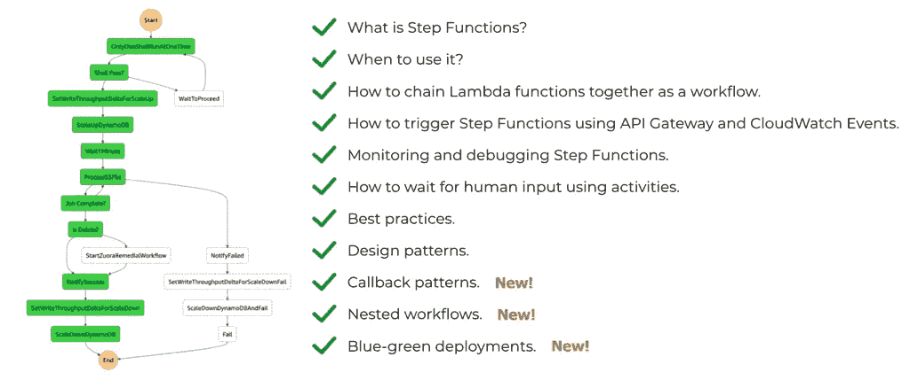
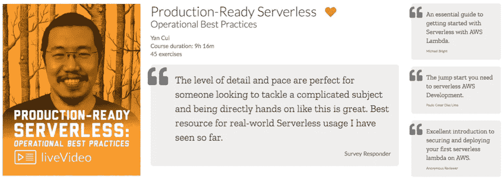

# AWS Lambda——如何最好地管理共享代码和共享基础设施

> 原文：<https://medium.com/hackernoon/aws-lambda-how-best-to-manage-shared-code-and-shared-infrastructure-827bed395eb7>

在[上一篇文章](https://hackernoon.com/aws-lambda-should-you-have-few-monolithic-functions-or-many-single-purposed-functions-8c3872d4338f)中，我讨论了在迁移到无服务器模式时遵循*单一责任原则* (SRP)的利弊。

Twitter 和 Medium 上同时出现的一个问题是*“你如何处理共享代码？”*。每当我在用户组或会议上谈论 AWS Lambda 时，这都是一个常见问题，旁边还有*“如何处理明显不属于任何特定服务的共享基础设施？”*

所以下面是我对这两个问题的想法。

再说一次，我并不是想以这种或那种方式说服你，我也不认为有一个“正确的”答案对每个人都适用。这只是我大声说出来，并与你分享我的内部思维过程，并希望让你对你自己的架构提出同样的问题。

和以往一样，如果你不同意我的评估或者发现我的想法有缺陷，请通过下面的评论区告诉我。

当你用所有这些小 Lambda 函数构建你的系统时，毫无疑问会有你想要在你的 Lambda 函数之间共享和重用的业务逻辑或实用程序代码。

当你有一组高度内聚的函数并被组织到同一个 repo 中时——就像我们在 Yubl 应用程序中创建的用于实现[时间线特性的函数——那么共享代码就很容易，你只需通过 repo 中的一个模块就可以做到。](https://youtu.be/pptsgV4bKv8?t=485)

The functions in this diagram form a cohesive unit that work together to implement a feature.

但是，要在跨服务边界的函数之间更普遍地共享代码，可以通过共享库来实现，也许可以作为私有 NPM 包发布，这样它们只对您的团队可用。

或者，您可以通过将业务逻辑封装到服务中来共享它们，在选择使用哪种方法时，您应该考虑几个因素。

The serverless architecture that powered Yubl.

# 共享图书馆与服务

## **能见度**

当你依赖一个共享库时，这种依赖是显式声明的，在 Node.js 的情况下，这种依赖是在`package.json`中声明的。

当你依赖于一个服务时，这种依赖性通常根本没有被声明，可能只有通过日志记录才能发现，也可能通过使用 *AWS X-Ray* 服务进行明确的跟踪尝试才能发现。

## 部署

在部署这些共享代码的更新时，使用共享库，您可以发布一个新版本，但您仍然需要依赖共享库的使用者来更新。

而对于服务，作为服务的所有者，您有权决定何时部署更新，您甚至可以使用 canary deployment 或 feature flags 之类的技术，以可控和安全的方式推出更新。

## 版本控制

对于库，根据用户的升级和部署时间表，您将同时拥有多个活动版本(如上所述)。事实上，真的没有办法完全避免它，即使尽最大努力协调更新，也会有一段时间同时有多个版本活动。

有了服务，您就有了更多的控制权，您可以选择同时运行多个版本。这可以通过 canary 部署来完成，或者通过将 API 的版本放在 URL 中来并行运行多个版本，就像人们经常做的那样。

有多种方法来版本化一个 API，但是我没有发现任何一种是令人满意的。Sebastien Lambla 在这个话题上做了一个[式的精彩演讲](https://serialseb.com/speaker/versions-are-evil/)，讲述了其中的几种方法以及为什么它们都不好，所以如果你想了解更多关于 API 版本控制的危险，可以看看他的演讲。

## 向后兼容性

有了共享库，您可以使用[语义版本化](https://semver.org/)来传达更新的向后兼容性——其中主要版本更新意味着重大变化。如果您在您的版本中遵循语义版本化，那么可以用一种受控的、良好沟通的方式打破向后兼容性。

大多数包管理器[支持语义版本](https://docs.npmjs.com/getting-started/semantic-versioning)，允许用户决定自动更新是否应该增加到下一个主要版本或次要版本。

对于一项服务，如果你推出一个突破性的改变，那么它将打破任何依赖于你的服务的人。这就是它再次与版本化联系起来的地方，正如我已经说过的，没有一种常用的方法让我感到满意。在过去，我和我的团队进行过多次这样的讨论，他们总是以“总是保持向后兼容性”作为一般规则的决定而结束，除非环境要求我们必须打破规则，做一些特殊的事情。

## 隔离

对于一个共享库，你通常会暴露出比你需要的更多的内容，尤其是在内部使用的时候。即使您已经仔细考虑了什么应该是库的公共 API 的一部分，消费者也总有办法通过反射来获取这些内部 API。

有了服务，你会更加考虑通过服务的公共 API 公开什么。您必须这样做，因为您通过服务的公共 API 共享的任何东西都是一个显式的设计决策，需要付出努力。

该服务的内部工作方式对消费者也是隐藏的，消费者没有直接(且容易)的方法来访问它们，因此我们共享代码的消费者意外依赖内部实现细节的风险较小。这里可能发生的最糟糕的事情是，如果你的 API 的消费者开始依赖那些(意外泄露的)实现细节作为特性…

## 失败

当一个库失败时，你的代码也失败了，这通常很明显，你可以得到出错的堆栈跟踪。

对于一个服务，它可能会失败，或者可能只是在您停止等待响应之前没有及时响应。作为一名消费者，你通常无法区分服务中断和速度缓慢。当这种情况发生时，如果您尝试执行的操作会修改状态，并且该操作**不是等幂**，重试也会变得棘手。

部分故障也很难处理，通常需要像 [Saga 模式](https://read.acloud.guru/how-the-saga-pattern-manages-failures-with-aws-lambda-and-step-functions-bc8f7129f900)这样的复杂模式，以便回滚已经在事务中引入的状态更改。

## 潜伏

最后，这可能是最明显的，调用服务会引入网络延迟，这明显高于调用库中的方法或函数。

# 管理共享基础架构

我经常遇到的另一个问题是*“如何管理共享的 AWS 资源，比如 DynamoDB 表和 Kinesis 流？”*。

如果你使用的是`Serverless`框架，那么你可以直接在你的`serverless.yml`文件中管理它们，并把它们作为额外的 *CloudFormation* 资源添加进来，如下所示。

这实际上是我在视频课程[生产就绪无服务器](https://bit.ly/production-ready-serverless)中采用的方法，但这是因为我带领学生构建的演示应用程序是一个具有良好定义的开始和结束状态的项目。

但是当你在构建一个会随着时间不断发展的产品时，在这样的项目中起作用的东西就不一定起作用了。在构建产品的背景下，这种方法存在一些问题。

## `"sls remove"` 可以删除用户数据

由于这些资源被绑定到`Serverless`(框架)项目的 *CloudFormation* 堆栈，如果您决定使用`sls remove`命令删除这些功能，那么您也将删除这些资源，以及这些资源中的任何用户数据。

即使你没有故意运行`sls remove`来反对生产，一想到有人可能有一天会不小心这么做就够令人担忧的了。

如果发生这种情况，失去功能是一回事，经历系统停机是另一回事，失去所有生产用户数据和功能，并可能发现自己处于无法轻松恢复的境地…

您可以——也应该——锁定 IAM 权限，这样开发人员就不会在生产中意外删除这些资源，这大大减少了这些意外。

您还应该利用 DynamoDB 提供的新的[备份功能](https://aws.amazon.com/dynamodb/backup-restore/)。

对于 Kinesis 流，您应该使用 Kinesis Firehose 在 S3 备份源事件。这样，您甚至不必自己编写任何备份代码！

但是，即使有所有可用的备份选项，我仍然对将这些存储用户数据的资源与使用它们的计算层(即 Lambda 函数)的创建和删除联系起来感到不安。

## 所有权往往不明确

在`serverless.yml`中管理共享基础设施的第二个问题是，当这些资源的所有权不明确时，您该怎么办？

由于是*共享*资源，并不总是清楚哪个项目应该负责管理其`serverless.yml`中的这些资源。

例如，Kinesis 流可以消耗来自 Lambda 函数的事件，运行在 EC2 或您自己的数据中心的应用程序。由于它使用轮询模型，您可以使用 Lambda 函数处理 Kinesis 事件，或者在 EC2 和您自己的数据中心上运行消费者应用程序。

它们(Kinesis streams)作为一种方式存在，让你通知其他人在你的系统中发生的事件，现代分布式系统的设计是异构的，以允许更大的灵活性和在不同情况下选择正确权衡的能力。

即使没有多生产者和多消费者 Kinesis 流的复杂情况，基本问题*“消费者还是生产者应该拥有流”*通常足以阻止我们，因为这里似乎没有(至少对我来说没有)明显的赢家。

## 单独管理共享的 AWS 资源

我见过的一个更好的方法——也是我自己采用的——是在一个单独的存储库中管理这些共享的 AWS 资源，根据团队中可用的专业知识，使用 *Terraform* 或 *CloudFormation* 模板。

这似乎是许多公司在他们的无服务器架构成熟到共享基础设施开始出现时采用的方法。

但是，就其本身而言，它甚至可能不是一种好的方式，因为它会给你的工作流程带来其他问题。

比如说。如果这些共享的资源由一个单独的基础设施团队管理，那么它会在您的开发和基础设施团队之间产生瓶颈和摩擦。

也就是说，出于我提到的原因，相比之下，我仍然认为这比用你的`serverless.yml`管理那些共享的 AWS 资源要好。

如果你知道管理共享基础设施的其他方法，请在评论中告诉我，或者你可以通过 twitter 与我联系。

嗨，我的名字是崔琰。我是一个 [**AWS 无服务器英雄**](https://aws.amazon.com/developer/community/heroes/yan-cui/?source=post_page---------------------------) 和 [**量产无服务器**](https://bit.ly/production-ready-serverless?source=post_page---------------------------) 的作者。

您是否正在为无服务器而苦恼，或者需要最佳实践方面的指导？您希望有人审查您的架构并帮助您避免代价高昂的错误吗？别担心，我是来帮忙的。 [**说吧！**](https://theburningmonk.com/hire-me/)

如果你喜欢这篇文章，为什么不跟随我并获得更多呢？

我也很感激你对帕特里翁的支持。作为回报，你可以通过私人 Slack 频道和 1-2-1 辅导从我这里获得直接帮助。

查看我的新课程，[**AWS 步骤功能完整指南**](https://theburningmonk.thinkific.com/courses/complete-guide-to-aws-step-functions?source=post_page---------------------------) 。

在本课程中，我们将介绍有效使用 AWS Step Functions 服务所需了解的一切。包括基本概念、HTTP 和事件触发器、活动、设计模式和最佳实践。

点击获取您的副本[。](https://theburningmonk.thinkific.com/courses/complete-guide-to-aws-step-functions?source=post_page---------------------------)

来了解 AWS Lambda: CI/CD 的操作性**最佳实践**、本地测试&调试功能、日志记录、监控、分布式跟踪、canary 部署、配置管理、认证&授权、VPC、安全性、错误处理等等。

代码 **ytcui** 还可以获得**票面价格 6 折**。

点击获取您的副本[。](https://bit.ly/production-ready-serverless)