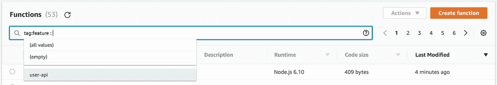
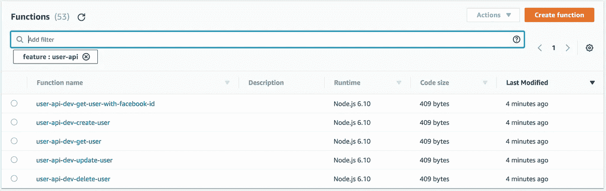
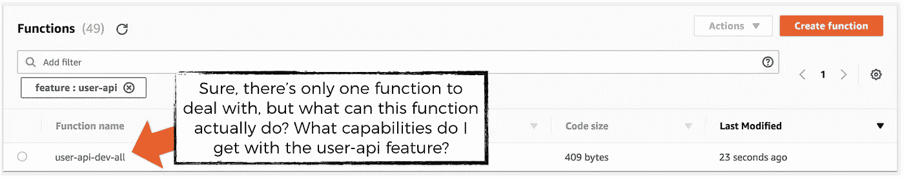
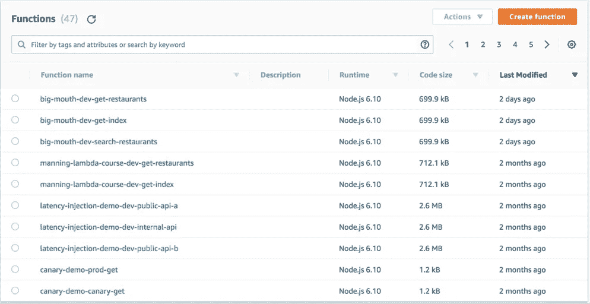
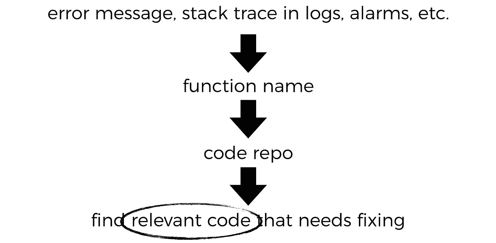
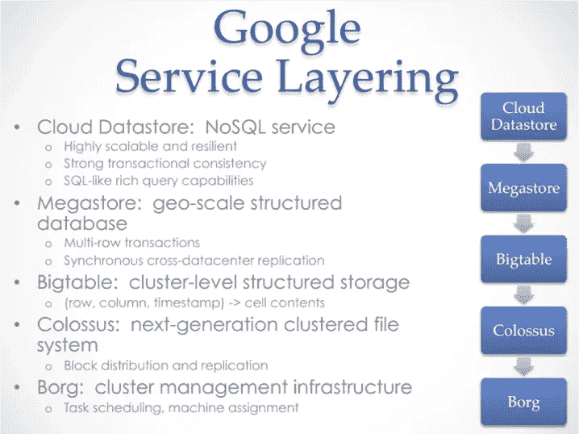
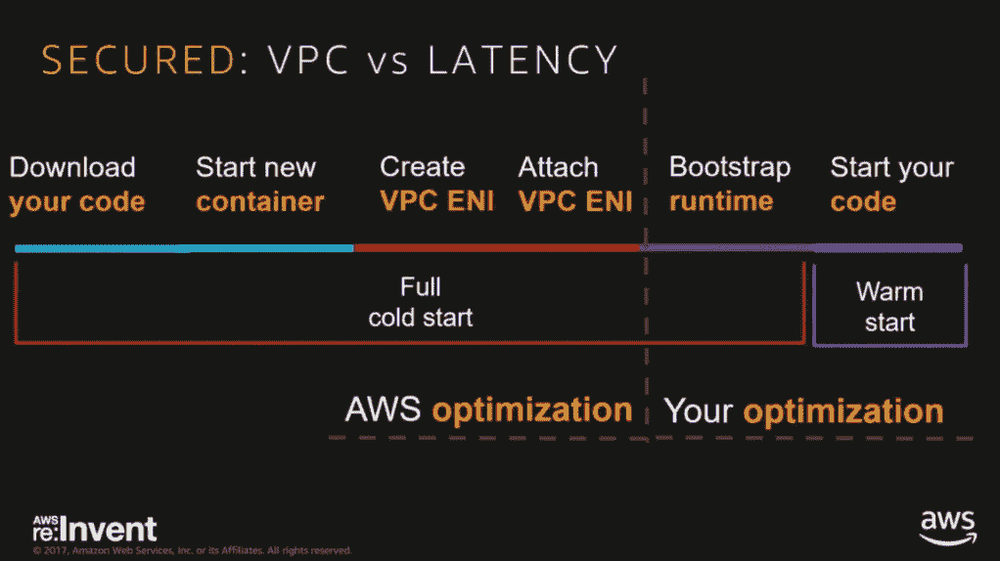

# AWS Lambda——应该有几个单一的函数还是许多单一用途的函数？

> 原文：<https://medium.com/hackernoon/aws-lambda-should-you-have-few-monolithic-functions-or-many-single-purposed-functions-8c3872d4338f>

一个有趣的时刻(38:50)发生在蒂姆·布雷在 re:invent 2017 的会议期间( [SRV306](https://www.youtube.com/watch?v=sMaqd5J69Ns) ),当他问观众我们是否应该有许多简单、单一目的的功能，或者更少的单片功能时，房间几乎分成了两半。

在坚实的原则，尤其是单一责任原则(SRP)下长大，这一刻挑战了我的信念，即在无服务器世界中遵循 SRP 是显而易见的。

这促使我们对双方的观点进行了更仔细的研究。

*充分披露，我在这场辩论中有失偏颇。如果你发现我的思维有缺陷，或者只是不同意我的观点，请在评论中指出来。*

**2018 年 1 月 28 日更新:**正如[documentation](https://medium.com/u/9115bfdd0f81#tags) on how to add tags.



The Lambda management console also gives you a handy dropdown list of the available values when you try to search by a tag.

如果你对你要找的东西有一个粗略的想法，那么功能的数量不会成为你发现那里有什么的障碍。

另一方面，user-api 的功能对于单一用途的函数来说是显而易见的，我可以从相关的函数中看出我有基本的 CRUD 功能，因为每个功能都有相应的函数。



I can see what capabilities I have as part of the suite of functions that make up the user-api feature.

然而，对于一个单一的函数来说，这并不是显而易见的，我必须自己查看代码，或者咨询函数的作者，对我来说，这很难被发现。



正因为如此，我将根据可发现性来标记整体方法。


拥有更多的功能，意味着如果你只是想探索有哪些功能，而不是寻找任何特定的功能，你可以浏览更多的页面。



虽然，根据我的经验，由于无服务器框架实施的命名约定，所有的函数都很好地通过名字前缀聚集在一起，但是实际上，看到每组函数能做什么比不得不*猜测*一个单一函数内部发生了什么更好。

但是，我想当你有成千上万的功能时，滚动浏览所有的内容是一件痛苦的事情。因此，我将把单一用途的函数稍微降低一点。我认为在这种复杂程度下，即使你通过在每个函数中加入更多的功能来减少函数的数量，你仍然会因为看一眼就不知道这些单块函数的真正功能而遭受更多的痛苦。


# 排除故障

就调试而言，这里的相关问题是，函数越少，是否越容易快速识别和定位调试问题所需的代码。

根据我的经验，从日志中的 HTTP 错误或错误堆栈跟踪到相关函数的痕迹，无论函数做一件事还是许多不同的事，repo 都是一样的。



不同的是，你如何在回购协议中找到你正在调查的问题的相关代码。

一个整体功能有更多的分支，通常做更多的事情，可以理解需要更多的认知努力来理解和遵循与手头问题相关的代码。

为此，我也会稍微降低单片函数的价值。


# 缩放比例

关于微服务的早期论点之一是，它使扩展变得更容易，但事实并非如此——如果你知道如何扩展系统，那么你可以像扩展微服务一样轻松地扩展一个整体。

我这么说是因为我曾经为拥有 100 万日活跃用户的游戏构建了完整的后端系统。Supercell 是我现在的雇主 T1 的母公司，也是最卖座游戏如 T2 部落冲突 T3 和 T4 皇家冲突 T5 的创造者，他们的游戏有超过 1 亿的每日活跃用户，他们的游戏后台系统也是独一无二的。


相反，我们从亚马逊、网飞和谷歌等科技巨头那里学到的是，面向服务的架构风格更容易在不同的维度——我们的工程团队——进行扩展。

这种架构风格允许我们围绕特性和功能在系统内创建边界。这样做还允许我们的工程团队扩展他们构建的复杂性，因为他们可以更容易地在其他人之前已经创建的工作之上进行构建。

以谷歌的[云数据仓库](https://cloud.google.com/datastore/docs/concepts/overview)为例，从事这项服务的工程师们能够通过建立在许多服务层之上来生产高度复杂的服务，每一层都提供强大的抽象层。



[http://bit.ly/2CQx3C4](http://bit.ly/2CQx3C4)

这些服务边界给了我们更大的分工，这允许更多的工程师在系统上工作，给他们相对独立的工作区域。这样，它们就不会经常因为合并冲突、集成问题等等而相互绊倒。

迈克尔·尼加德最近也写了一篇很好的文章，解释了界限和隔离的好处，它如何帮助减少共享心智模型的开销。

> “如果你有一个很高的一致性惩罚和太多的人，那么团队作为一个整体移动得更慢…这是关于**减少** **共享心智模型**的开销。”迈克尔·尼加德

拥有许多单一用途的功能也许是这种任务划分的顶峰，当你转向单一功能时，你会失去一些东西。尽管在实践中，你可能不会最终让这么多的开发人员在同一个项目上工作，以至于你感到痛苦，除非你真的把他们和那些单一的功能打包在一起！

此外，将一个函数限制为只做一件事也有助于限制函数的复杂程度。为了让事情变得更复杂，你可以通过其他方式将这些简单的函数组合在一起，比如用 AWS *步骤函数*。

再一次，我要把单体函数记下来，因为它们失去了一些分工，并且提高了函数的复杂度上限。


**2018 年 9 月 2 日更新:**鉴于一些人问及单芯片与单用途功能背景下的冷启动，我有以下想法。

正如 [Kostas Bariotis](https://medium.com/u/3aacb5d290d2?source=post_page-----8c3872d4338f--------------------------------) 所问:

> 单体函数也有被频繁使用的好处，因此它们不太可能处于冷状态，而不经常使用的单一用途函数可能总是处于冷状态，你不这样认为吗？

这似乎是一个公平的假设，但冷启动的实际行为是一个更微妙的讨论，可能会根据请求的速率产生截然不同的结果。查看我的另一篇文章[更详细地探讨了这种行为。](https://hackernoon.com/im-afraid-you-re-thinking-about-aws-lambda-cold-starts-all-wrong-7d907f278a4f)

## 整合成整体功能的效果(对所经历的冷启动次数而言)随着负载而迅速减弱

为了简单起见，让我们考虑*“当你上升到 X req/s 时，你将经历的冷启动次数”*。假设:

*   上升是逐渐的，所以没有大的峰值(这会触发更多的冷启动)
*   每个请求的持续时间很短，比如说 100 毫秒

在小范围内，假设每个端点 1 个请求/秒，总共 10 个端点(即 **1 个单片功能**对 **10 个专用功能**)，我们总共会有 10 个请求/秒。考虑到 100ms 的执行时间，这刚好在一个并发功能能够处理的范围内。

要达到每个端点 1 个请求/秒，您将经历:

*   单片:1 个冷启动
*   单一用途:10 次冷启动

随着负载的增加，每个端点达到 100 req/s，这相当于总共 1000 req/s。要处理这一负载，您需要至少 100 个单片功能的并发执行(每个 req 100 毫秒，因此每个并发执行的吞吐量为 10 req/s，因此并发执行数= 1000 / 10 = 100)。要达到这一并发级别，您将经历:

*   单片:100 次冷启动

此时，每个端点 100 个请求/秒=每个单一目的函数的 10 个并发执行。为了达到这种并发水平，您还将经历:

*   单一目的:10 个并发执行* 10 个功能= 100 次冷启动

因此，**单片功能并不能帮助你减少冷启动次数，即使是在中等负荷下**。

此外，当负载较低时，您可以通过预热您的功能来做一些简单的事情来减轻冷启动(如[其他帖子](https://hackernoon.com/im-afraid-you-re-thinking-about-aws-lambda-cold-starts-all-wrong-7d907f278a4f)中所述)。你甚至可以使用[无服务器插件预热](https://github.com/FidelLimited/serverless-plugin-warmup)来帮你做这件事，它甚至提供了在部署后进行预热运行的选项。

然而，当您有适度的并发时，这种实践就不再有效了。在这一点上，单片功能将导致与单一用途功能一样多的冷启动。

## 整合到单片功能中会增加初始化时间，从而延长冷启动的持续时间

通过将更多的“动作”打包到一个函数中，我们还增加了在该函数的冷启动期间需要初始化的模块的数量，因此结果是很可能经历**更长的冷启动**(基本上，在冷启动的`Bootstrap runtime`阶段(见下文),在导出的处理函数之外的任何东西都被初始化。



from Ajay Nair’s talk at re:invent 2017 — [https://www.youtube.com/watch?v=oQFORsso2go](https://www.youtube.com/watch?v=oQFORsso2go)

想象一下，在我在这篇文章中用来说明这一点的虚构的`user-api`的单片版本中，我们的处理程序模块需要`require`所有端点使用的所有依赖项。

```
const depA = require('lodash');
const depB = require('facebook-node-sdk');
const depC = require('aws-sdk');
...
```

而在`user-api`的专用版本中，只有`get-user-by-facebook-id`端点的处理函数需要在冷启动期间产生初始化`facebook-node-sdk`依赖的额外开销。

您还必须考虑同一个项目中的任何其他模块，以及它们的依赖项，以及在这些模块初始化期间将运行的任何代码，等等。

## 优化冷启动的错误位置

因此，与人们的直觉相反，除了基本预热已经可以实现的以外，单片功能不会为冷启动提供任何好处，并且很可能延长冷启动的持续时间。

因为冷启动对你的影响[取决于语言、内存和你在代码中做了多少初始化](https://read.acloud.guru/does-coding-language-memory-or-package-size-affect-cold-starts-of-aws-lambda-a15e26d12c76)。我认为，如果你担心冷启动，那么你最好切换到另一种语言(即 Go、Node.js 或 Python ),并努力优化你的代码，这样冷启动时间会更短。

此外，请记住，这是 AWS 和其他提供商正在积极努力的事情，我怀疑这种情况将在未来通过该平台得到极大的改善。

总而言之，我认为改变部署单元(一个大功能对许多小功能)不是解决冷启动的正确方法。

# 结论

如您所见，**基于对我来说很重要的****标准，拥有许多单一用途的函数显然是更好的选择。**

**像其他人一样，我天生就有一套由我的经历形成的倾向和偏见，这很可能并不反映你的倾向和偏见。我不是要求你同意我的观点，而是简单地欣赏解决对你和你的组织重要的事情的过程，以及如何着手找到适合你的方法。**

**然而，如果你不同意我的想法和我为我的选择标准提出的论点——可发现性、调试和扩展团队以及系统的复杂性——那么请通过评论让我知道。**

****

**嗨，我的名字是**崔琰**。我是一个 [**AWS 无服务器英雄**](https://aws.amazon.com/developer/community/heroes/yan-cui/) 和 [**量产无服务器**](https://bit.ly/production-ready-serverless) 的作者。我已经在 AWS 中运行了近 10 年的大规模生产工作负载，我是一名架构师或首席工程师，涉足从银行、电子商务、体育流媒体到移动游戏等多个行业。我目前是一名专注于 AWS 和无服务器的独立顾问。**

**你可以通过[邮箱](mailto:theburningmonk.com)、 [Twitter](https://twitter.com/theburningmonk) 和 [LinkedIn](https://www.linkedin.com/in/theburningmonk/) 联系我。**

**查看我的新课程，[**AWS 步骤功能完整指南**](https://theburningmonk.thinkific.com/courses/complete-guide-to-aws-step-functions) 。**

**在本课程中，我们将介绍有效使用 AWS Step Functions 服务所需了解的一切。包括基本概念、HTTP 和事件触发器、活动、设计模式和最佳实践。**

**在这里拿到你的副本。**

****

**来了解 AWS Lambda: CI/CD 的操作性**最佳实践**，本地测试&调试功能、日志记录、监控、分布式跟踪、canary 部署、配置管理、认证&授权、VPC、安全性、错误处理等等。**

**还可以用代码 **ytcui** 获得**票面价格 6 折**。**

**点击获取您的副本[。](https://bit.ly/production-ready-serverless)**