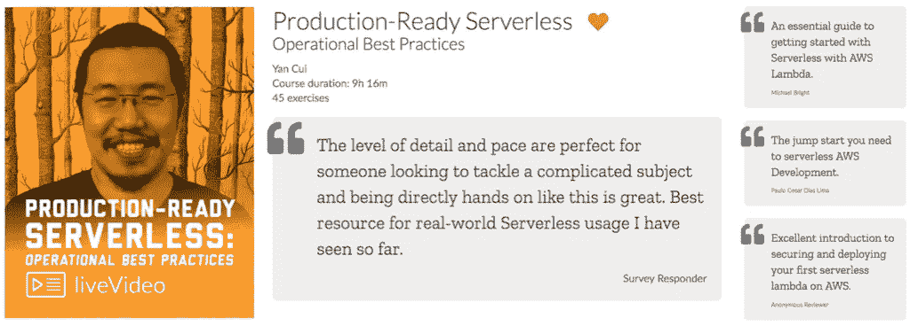

# AWS Lambda —使用调用上下文来更好地处理缓慢的 HTTP 响应

> 原文：<https://medium.com/hackernoon/aws-lambda-use-the-invocation-context-to-better-handle-slow-http-responses-16fbfecfa4e9>

## 语境。`getRemainingTimeInMillis() gives you a flexible way to timeout requests on the client-side based on the amount of invocation time left rather than some arbitrarily hardcoded value.`

使用 API Gateway 和 Lambda，您被迫在服务器端使用相对较短的超时:

*   **API 网关在所有集成点上都有一个 30 秒的最大超时**
*   对于 AWS Lambda 函数，无服务器框架使用默认值 6s

然而，由于您对 Lambda 函数的冷启动时间的影响有限，并且无法控制 API Gateway 引入的延迟开销，因此您从调用函数中体验到的面向客户端的实际延迟很难预测。


[https://docs.aws.amazon.com/AmazonCloudWatch/latest/monitoring/api-gateway-metrics-dimensions.html](https://docs.aws.amazon.com/AmazonCloudWatch/latest/monitoring/api-gateway-metrics-dimensions.html)

为了防止缓慢的 HTTP 响应导致调用函数超时(从而影响我们提供的用户体验)，我们应该确保在调用函数超时之前停止等待响应。

> “超时策略的目标是给 HTTP 请求**最大的成功机会**，前提是这样做不会导致调用函数本身出错”——me

大多数时候，我看到人们使用固定的(硬编码或通过配置指定的)超时值，这通常很难决定:

*   太短了，你不会给请求*成功的最好机会*，例如，在调用中还有 5s，但是我们已经将超时设置为 3s
*   太长的时间会有让请求超时调用函数的风险，例如，调用还剩 5 秒，但我们已经将超时设置为 6 秒

选择正确超时值的挑战变得更加复杂，因为我们经常在函数调用期间执行不止一个 HTTP 请求——例如，从 DynamoDB 读取，与一些内部 API 对话，然后将更改保存到 DynamoDB，相当于一次调用中总共 3 个 HTTP 请求。

让我们来看看选择超时值的两种常见方法，以及它们达不到我们的目标的情况。


requests are not given the best chance to succeed


requests are allowed too much time to execute and caused the function to timeout.

相反，我们应该**根据剩余的调用时间量**设置请求超时，同时考虑执行任何恢复步骤所需的时间——例如，在响应正文中返回一个有意义的错误和应用程序特定的错误代码，或者返回一个回退结果。

通过调用函数的`context`对象，您可以很容易地发现当前调用还剩多少时间。


[https://docs.aws.amazon.com/lambda/latest/dg/nodejs-prog-model-context.html](https://docs.aws.amazon.com/lambda/latest/dg/nodejs-prog-model-context.html)

例如，如果一个函数的`timeout`是 6s，但是当你发出 HTTP 请求时，你已经进入调用 1s 了(也许你必须先做一些昂贵的计算)，如果我们为恢复预留 500ms，那么我们还有 4.5s 来等待 HTTP 响应。

通过这种方法，我们可以两全其美:

*   根据我们剩余的实际调用时间，允许请求有最大的成功机会；和
*   防止响应缓慢导致功能超时，这为我们提供了执行恢复操作的机会


requests are given the best chance to succeed, without being restricted by an arbitrarily determined timeout.


slow responses are timed out before they cause the calling function to time out

但是，在这些请求超时之后，您打算做什么呢？既然您不能完成您需要执行的任何操作，您不是仍然必须用 HTTP 错误来响应吗？

恢复措施至少应包括:

*   尽可能多地记录超时事件，包括所有相关的[关联 id](https://hackernoon.com/capture-and-forward-correlation-ids-through-different-lambda-event-sources-220c227c65f5)
*   跟踪`serviceX.timedout`的定制指标，以便对其进行监控，并在情况升级时提醒团队
*   在响应正文中返回一个应用程序错误代码(见下面的例子)，以及请求 ID，这样面向用户的客户端应用程序可以显示一条用户友好的消息，如*“哎呀，看起来这个特性目前不可用，请稍后再试。如果这是紧急情况，请联系我们在 xxx@domain.com，并引用请求 ID f19a7dca。谢谢合作:-)"*

```
{
  "errorCode": 10021,
  "requestId": "f19a7dca",
  "message": "service X timed out"
}
```

在*某些* *情况下*，你还可以使用 fallbacks 更优雅地恢复。

例如，网飞的 [Hystrix](https://github.com/Netflix/Hystrix) 库通过它大量使用的*命令*模式支持几种风格的后退。事实上，如果你还没有看过它的维基页面，那么我强烈建议你去通读一下，那里有大量有用的信息和想法。


至少，每个命令都允许您指定一个回退操作。


您也可以通过各自的`getFallback`方法链接命令，将回退链接在一起。


举个例子，

1.  在`CommandA`内部执行 DynamoDB 读取
2.  在`getFallback`方法中，执行`CommandB`，这将返回一个先前缓存的响应(如果可用的话)
3.  如果没有缓存的响应，那么`CommandB`将失败，并触发它自己的`getFallback`方法
4.  执行`CommandC`，返回一个存根响应

无论如何，看看 *Hystrix* 吧，如果你还没有看的话，大部分嵌入到 *Hystrix* 中的模式可以很容易地在我们的无服务器应用程序中采用，以帮助它们更好地适应失败——这是我正在积极探索的一个独立系列，关于[将混沌工程的原理应用到无服务器](https://hackernoon.com/how-can-we-apply-the-principles-of-chaos-engineering-to-aws-lambda-80f87e3237e2)。

顺便说一句，正如 Danilo 在评论中提到的，在编写递归函数时，你也可以使用`context.getRemainingTimeInMillis()`来决定何时做更多的工作而不是 recurse。在这篇[文章](https://hackernoon.com/write-recursive-aws-lambda-functions-the-right-way-4a4b5ae633b6)中，你可以读到更多关于这方面的内容以及其他编写递归 Lambda 函数的技巧。


嗨，我的名字是**崔琰**。我是一个 [**AWS 无服务器英雄**](https://aws.amazon.com/developer/community/heroes/yan-cui/) 和 [**量产无服务器**](https://bit.ly/production-ready-serverless) 的作者。我已经在 AWS 中运行了近 10 年的大规模生产工作负载，我是一名架构师或首席工程师，涉足从银行、电子商务、体育流媒体到移动游戏等多个行业。我目前是一名专注于 AWS 和无服务器的独立顾问。

你可以通过[邮箱](mailto:theburningmonk.com)、[推特](https://twitter.com/theburningmonk)和 [LinkedIn](https://www.linkedin.com/in/theburningmonk/) 联系我。

查看我的新课程，[**AWS 步骤功能完整指南**](https://theburningmonk.thinkific.com/courses/complete-guide-to-aws-step-functions) 。

在本课程中，我们将介绍有效使用 AWS Step Functions 服务所需了解的一切。包括基本概念、HTTP 和事件触发器、活动、设计模式和最佳实践。

点击获取您的副本[。](https://theburningmonk.thinkific.com/courses/complete-guide-to-aws-step-functions)



来了解 AWS Lambda: CI/CD 的操作性**最佳实践**、本地测试&调试功能、日志记录、监控、分布式跟踪、canary 部署、配置管理、认证&授权、VPC、安全性、错误处理等等。

代码 **ytcui** 还可以获得**票面价格 6 折**。

点击获取您的副本[。](https://bit.ly/production-ready-serverless)