# AWS OpenVPN 访问服务器

> 原文：<https://medium.com/hackernoon/aws-openvpn-access-server-c9edaece035a>

能够以安全的方式直接访问 **AWS** 资源非常有用。为此，您可以:

*   设置与 **AWS 直连**的专用连接
*   使用**网络设备**
*   使用**软件定义的专用网络**，如 **OpenVPN**

在这篇文章中，我将带你了解如何在 AWS 上创建一个 **OpenVPN** 服务器，从任何地方的任何设备安全地连接到你的 VPC、私有网络资源和应用程序。

首先，登录您的 **AWS 管理控制台**并从**OpenVPN Access Server AWS market place**产品中启动一个 **EC2 实例**:

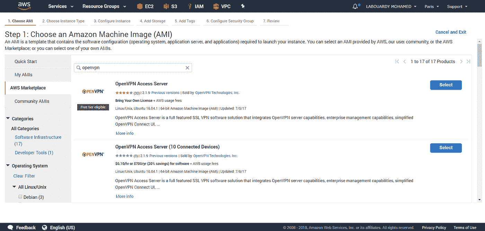

出于演示目的，选择 *t2.micro:*

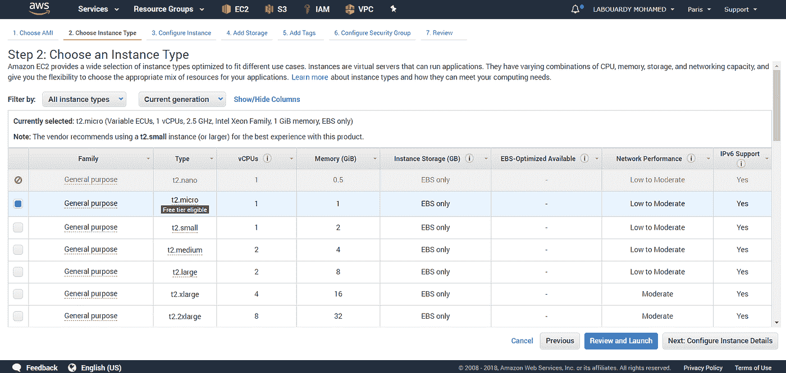

使用除“**启用终止保护**之外的默认设置，因为我们不希望我们的 **VPN** 被意外终止:

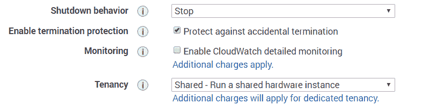

分配一个新的**安全组**，如下所示:

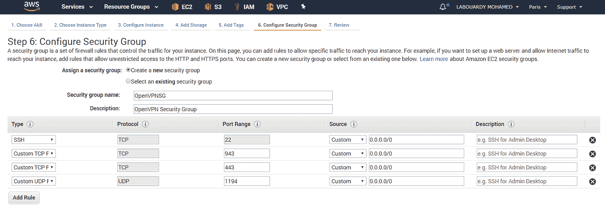

*   **TCP — 22** :远程访问实例。
*   **TCP — 443** : HTTPS，这是用户用来登录 VPN 服务器并检索他们的密钥和安装信息的接口。
*   **TCP — 943** : OpenVPN 管理 Web Dashboard。
*   **UDP — 1194** : OpenVPN UDP 端口。

为了确保我们的 VPN 实例公共 IP 地址在停止后不会改变，为其分配一个**弹性 IP** :

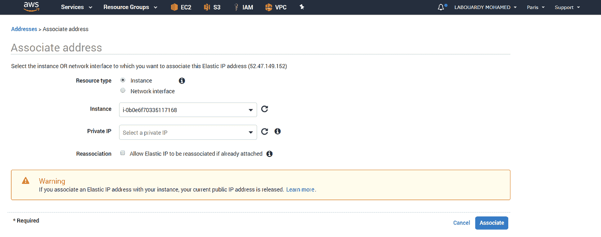

为了简单起见，我在 **Route 53** 中添加了一个 **A** 记录，它指向实例**弹性 IP** :

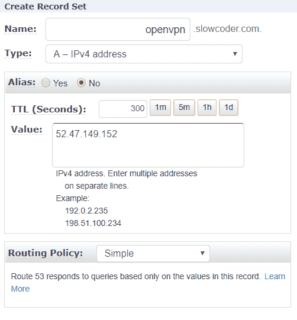

一旦 **AMI** 成功启动，您将需要使用 **DNS** 记录通过 **SSH** 连接到服务器:

> 宋承宪[openvpnas@openvpn.slowcoder.com](mailto:openvpnas@openvpn.slowcoder.com)-I/path/to/key . PEM

首次连接时，系统会提示您设置 OpenVPN 服务器:

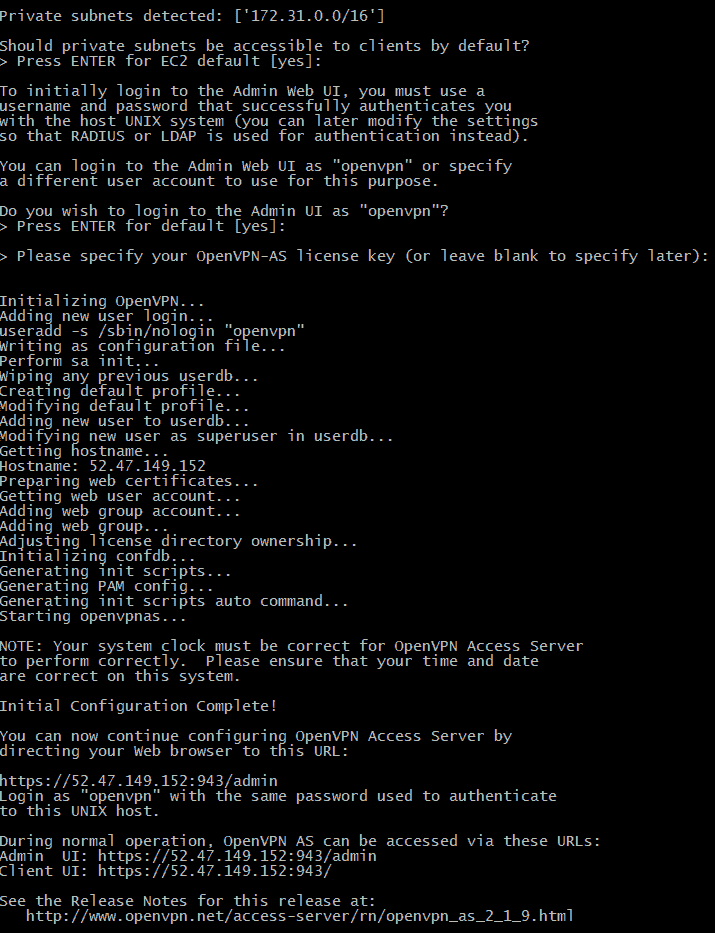

为 *openvpn* 管理员用户设置新密码:

> sudo passwd openvpn

将浏览器指向[https://openvpn.slowcoder.com](https://openvpn.slowcoder.com/)，并使用 *openvpn* 凭证登录

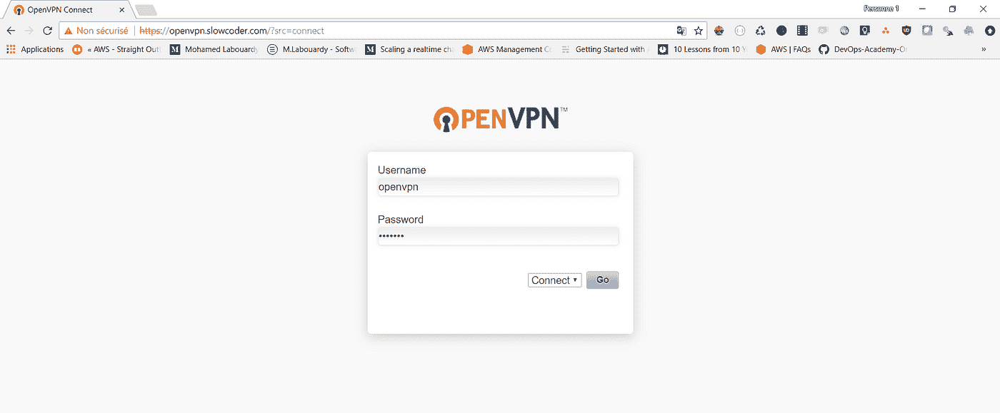

下载 **OpenVPN Connect 客户端**，安装完成后，点击**导入**，然后点击**从服务器**:

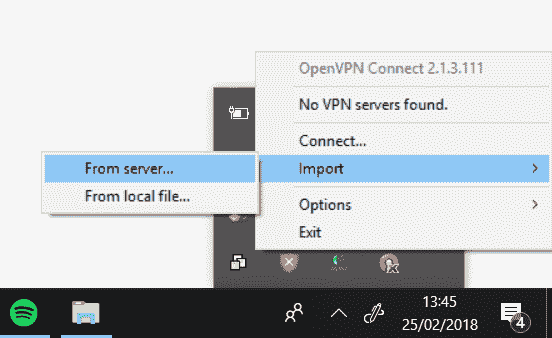

然后，键入 **OpenVN DNS** 名称:

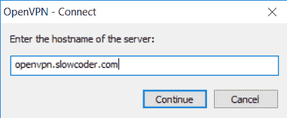

输入您的 *openvpn* 作为用户名，输入与之前相同的密码，点击**连接**:

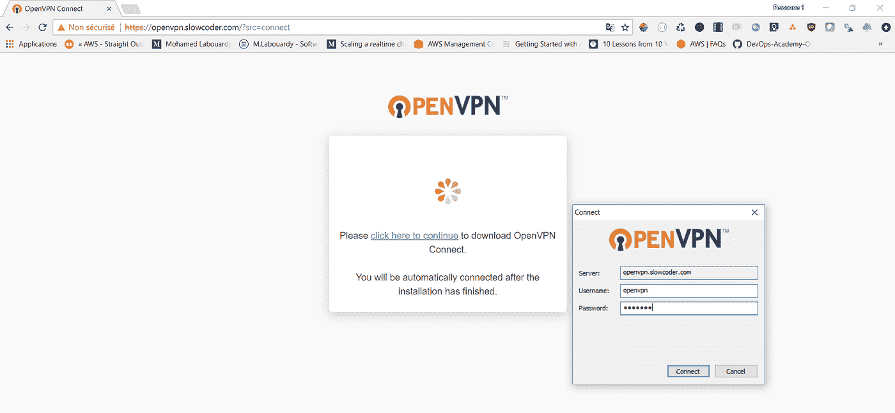

连接后，您应该会看到一个绿色的复选标记:

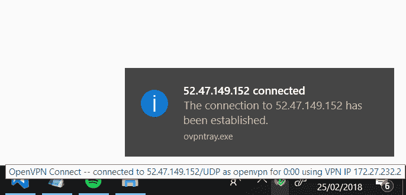

要验证客户端是否已连接，请在[https://openvpn.slowcoder.com/admin](https://openvpn.slowcoder.com/admin)上登录 **OpenVPN 管理仪表板**:

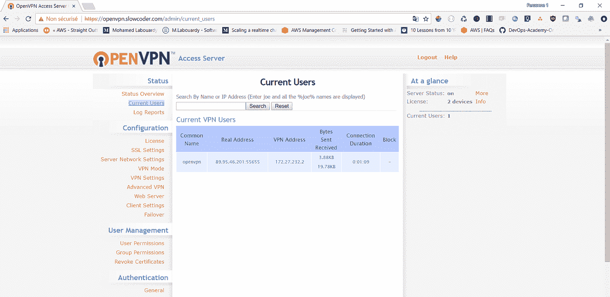

最后，在专用子网中创建一个简单的 web 服务器实例，以验证 VPN 正在工作:

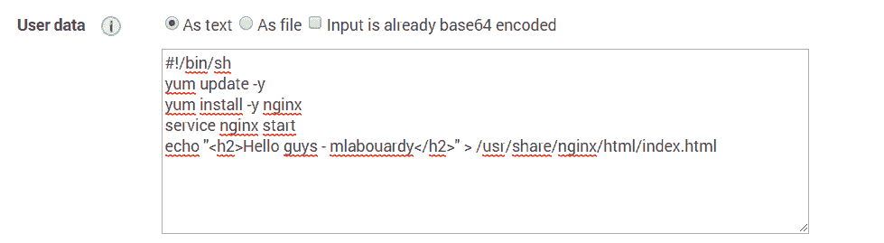

如果您将浏览器指向 web 服务器私有地址，您应该会看到一个简单的 HTML 页面:

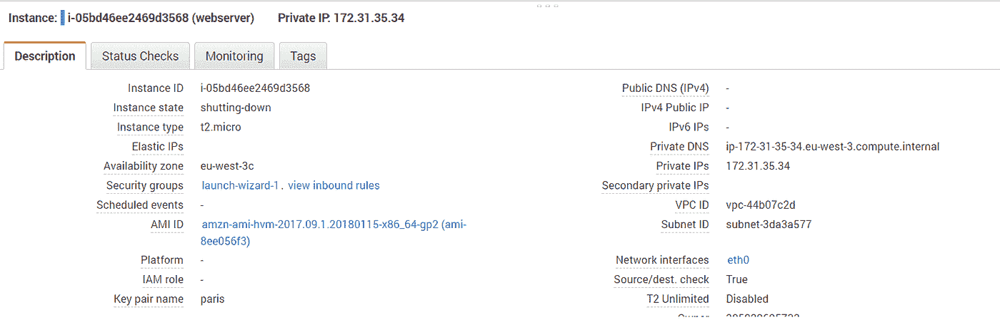