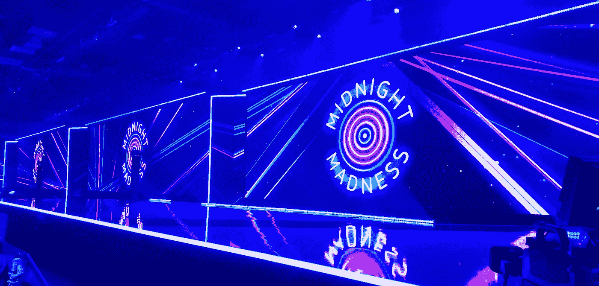
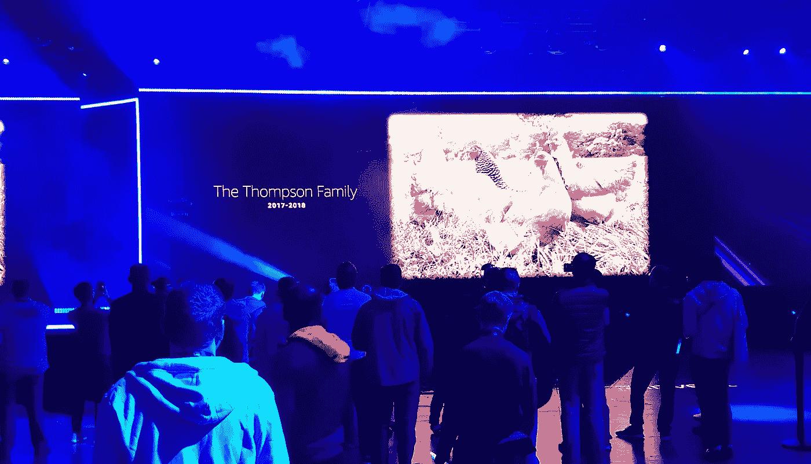

# AWS re:Invent——午夜疯狂推出 Robomaker

> 原文：<https://medium.com/hackernoon/aws-re-invent-midnight-madness-launches-robomaker-8a1fda4f85e1>

AWS re:Invent 和亚马逊以一场令人印象深刻的午夜派对拉开了派对/会议的序幕。不是你正常的聚会；许多成年人在吃鸡翅，一个纪念所说的鸡的视频，荧光棒和空气鼓的吉尼斯世界纪录，爆米花，无限畅饮(正常)，启动发布会和 AWS 产品发布会。

# 启动发射；希伯

start up 公司的首席技术官/联合创始人 Maarten Engel en[Hiber](https://hiber.global/)出席了发布新产品的活动，这是一种使用迷你卫星在全球范围内交流物联网设备的新方式。超聪明的想法，低成本，你可以订购自己的[物联网套件](https://hiberband.myshopify.com/products/the-hiberkit%C2%AE-for-developers?variant=5417202450467\)来玩。观察这如何在全球范围内打开新的思路将会很有趣。

# 新的 AWS 产品上市；机器人制造商

机器人是未来，无法逃避。开始制造机器人是很难的，看起来你必须是个天才。亚马逊已经开始了与[机器人制造商](https://aws.amazon.com/robomaker/)解决问题的旅程。你可以模拟你的机器人将如何在亚马逊建立的 AWS 环境中工作，例如客厅或零售店。改变参数并并行重新运行数千次模拟，这在现实世界中需要几天时间(并且花费很大)。

Launch of Robomaker

这是令人兴奋的，毫无疑问，这将为更多的创业公司快速、轻松、廉价地成立铺平道路。但是正如有人在我旁边提到的，在《午夜疯狂》中似乎没有人对此感到兴奋。是的，这对一些人来说是令人兴奋的，但活动中的人群似乎并不认同该产品。AWS re:Invent 在几年内可能会有一个机器人飞来飞去略有不同的出席。

# 吉尼斯世界记录

为了增加乐趣，一些世界纪录被尝试；

*   最大的空鼓组合
*   大多数人同时点燃荧光棒
*   最大的吃鸡翅比赛

# 别忘了鸡…

这个有点奇怪，但是在鸡翅比赛进行的时候，有一整个视频都是关于鸡的。从这里拿走你想要的…

