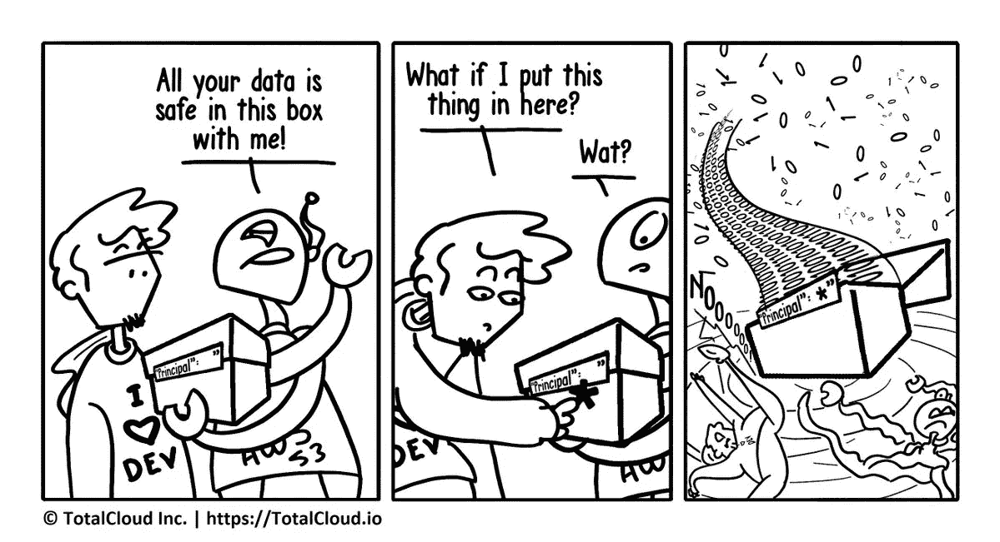

# AWS S3 存储桶策略出错

> 原文：<https://medium.com/hackernoon/aws-s3-bucket-policy-gone-wrong-e9f0321c97ab>

> 一个“好奇的开发人员”试图玩弄 AWS S3 水桶政策。
> 
> *法定警告:好奇心害死人。工作时千万不要尝试这种特技。像美国五角大楼这样的大组织已经因此而面临批评。

策略代码中的“主体”元素指定允许或拒绝访问驻留在 AWS S3 存储桶中的资源的用户、帐户、服务或其他实体。世界各地已经报道了几起 S3 桶如何导致数据泄露的案例。在大多数情况下，这颗“星星”是罪魁祸首。

有关更多信息，请访问 IAM 用户指南中的 AWS 的[负责人](http://docs.aws.amazon.com/IAM/latest/UserGuide/reference_policies_elements.html#Principal)页面。要了解更多关于如何将亚马逊 S3 桶访问限制到特定 IAM 角色的信息，请点击[此处](https://aws.amazon.com/blogs/security/how-to-restrict-amazon-s3-bucket-access-to-a-specific-iam-role/)。

与我们分享你的经历。

别忘了在 twitter [@totalcloudio](https://twitter.com/totalcloudio) 上关注我们的漫画。

*原载于 2018 年 3 月 20 日*[*blog . total cloud . io*](https://blog.totalcloud.io/aws-s3-bucket-policy-gone-wrong/)*。*