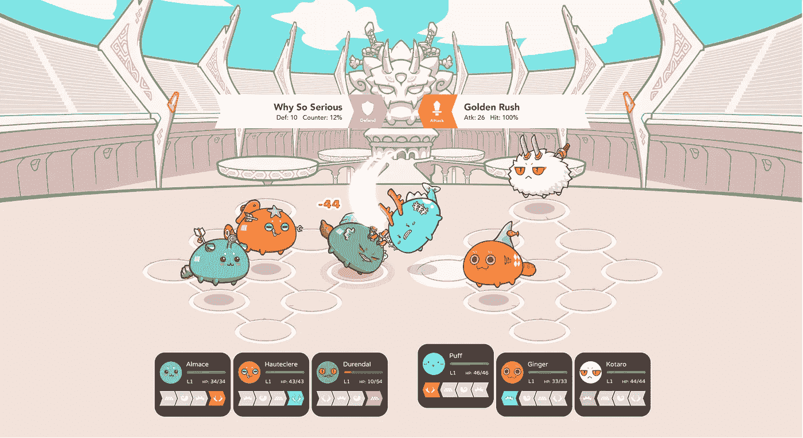

# Axie Infinity 战斗和织机网络

> 原文：<https://medium.com/hackernoon/axie-infinity-battling-and-the-loom-network-7dfcdc7ec7c7>

作者亚历山大·拉森，Axie Infinity 的首席运营官

如果你还没听说过我们， [Axie Infinity](https://axieinfinity.com/) 是一款围绕**收集**、**饲养**、**繁殖**、**与被称为 Axie 的**美丽宠物战斗的游戏，所有权在以太坊**区块链。**

我们密切关注 Loom Network 已经有一段时间了，我们非常高兴地宣布，我们将使用他们的技术使 Axie Infinity 成为一种更具沉浸感的游戏体验！

# 他们改变的时代

开发一款游戏的同时还必须应对以太坊区块链的约束，这一点远不理想。游戏玩家习惯于闪电般的快速响应，所以当你告诉他们必须等待 15 秒以上才能完成交易时，他们已经迈出了第一步。一旦你提到交易费，在你说分散化之前，大多数玩家会转向下一个游戏。

> 我们认为使用共享 DPoS 侧链是目前 dApps 游戏的最佳解决方案。

# [输入僵尸链](/loom-network/announcing-zombiechain-an-eos-like-dpos-sidechain-for-ethereum-dapps-e0eba6c244da)

Listen up!

ZombieChain 是一个使用 Loom SDK 创建的 DPoS dAppChain。这是一个第二层的区块链，它使用以太坊区块链作为它的基础层。这意味着玩家可以在没有以太坊区块链的限制下与 Axies 战斗。一旦战斗开始，轴将被转移到僵尸链，战斗逻辑将在那里发生。战斗结束后，这些轴将被传送回以太坊区块链，并带有关于谁赢了谁输了的信息。

Enter the fray in the Axie Infinity Arena. Coming soon.

如前所述，ZombieChain 是一个 DPoS 侧链，一旦上线，它将依赖于由 Loom 网络提供的节点。当 Axie Infinity 越来越受欢迎时，我们可能会创建自己的 dAppChain (AxieChain？)并在全球范围内寻找奖励节点验证者的方法。使用现有的第二层区块链对我们来说简化了很多事情，这意味着我们可以专注于创建一个伟大的游戏，而不用太担心缩放。

我们真的很兴奋能够关注僵尸链的进展，并与织机网络合作，为您带来互动的战斗。以下是我们选择织机网络的一些主要原因:

*   与 Loom 网络团队的良好关系将使快速解决潜在问题变得更加容易
*   亚秒阻塞时间
*   本地可靠性支持
*   [等离子现金支持收入](/loom-network/practical-plasma-volume-i-gaming-9cfd3f971734)(如果你担心安全性并依赖僵尸链共识算法，请阅读此文)
*   通过 dpo 进行验证者选举和下注
*   **面向博彩的**

# 想了解更多关于 dAppChains 和 Loom Network 的信息？

*   [Loom SDK 项目:Axie Infinity——在区块链上收集、繁殖和战斗幻想宠物！](/loom-network/loom-sdk-projects-axie-infinity-collect-breed-and-battle-fantasy-pets-on-the-blockchain-22e6fd11b410)
*   [实用等离子游戏](/loom-network/practical-plasma-volume-i-gaming-9cfd3f971734)
*   [所有你需要了解的关于织机网络的信息都集中在一个地方](/loom-network/everything-you-need-to-know-about-loom-network-all-in-one-place-updated-regularly-64742bd839fe)
*   d [AppChains:通过侧链扩展以太坊 dApps】](/loom-network/dappchains-scaling-ethereum-dapps-through-sidechains-f99e51fff447)
*   [以太坊上的百万用户 dApps:特定应用侧链介绍](/loom-network/million-user-dapps-on-ethereum-an-introduction-to-application-specific-sidechains-c0fdc288c5e5)

*如需了解更多信息，请加入我们 Discord 的讨论或在 Twitter 上关注我们。也记得喜欢这个内容就鼓掌分享。*

axie Infinity:[https://axieinfinity.com](https://axieinfinity.com)
不和:[https://discord.gg/68DeTqc](https://discord.gg/68DeTqc)
推特:[https://twitter.com/AxieInfinity](https://twitter.com/AxieInfinity)
脸书:[https://www.facebook.com/AxieInfinity](https://www.facebook.com/AxieInfinity)
insta gram:[https://www.instagram.com/axieinfinity](https://www.instagram.com/axieinfinity/)
Reddit:[https://www.reddit.com/r/AxieInfinity/](https://www.reddit.com/r/AxieInfinity/)
电报:[https://t.me/axieinfinity](https://t.me/axieinfinity)