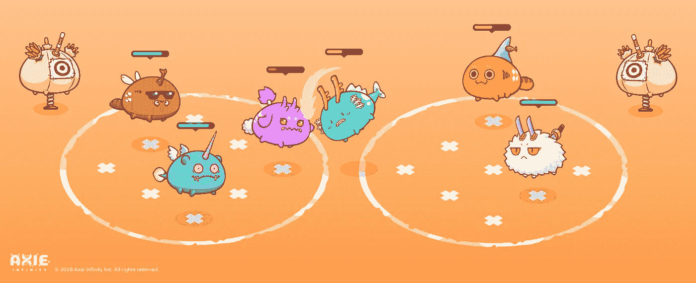
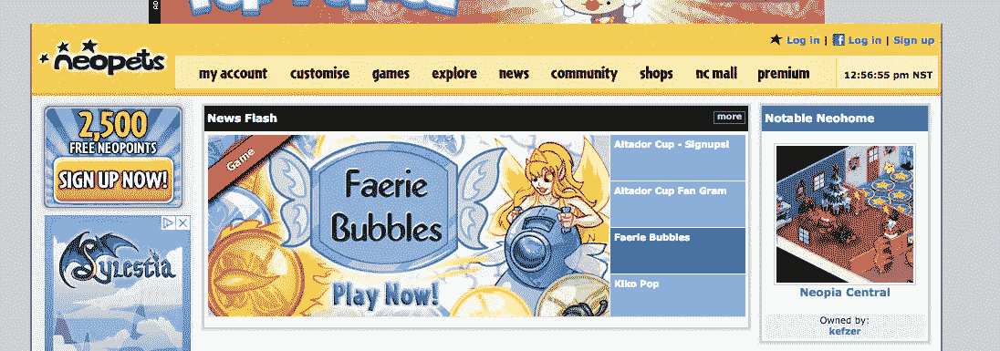
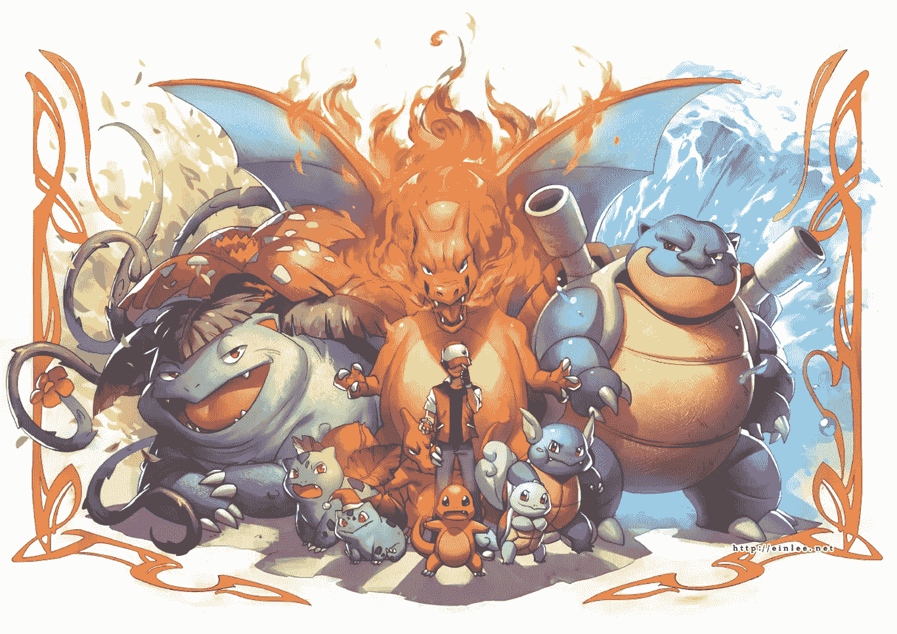
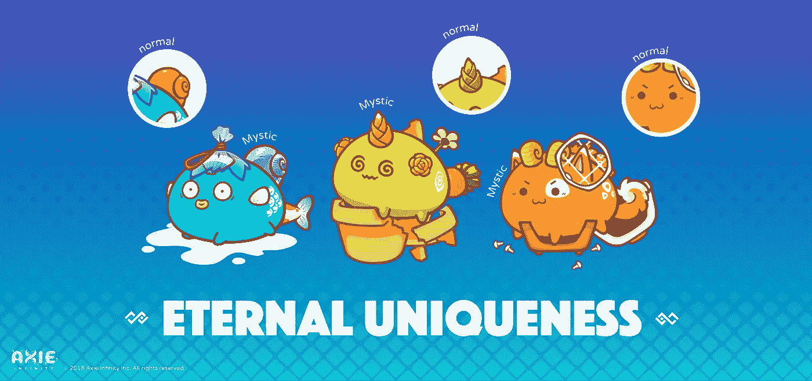
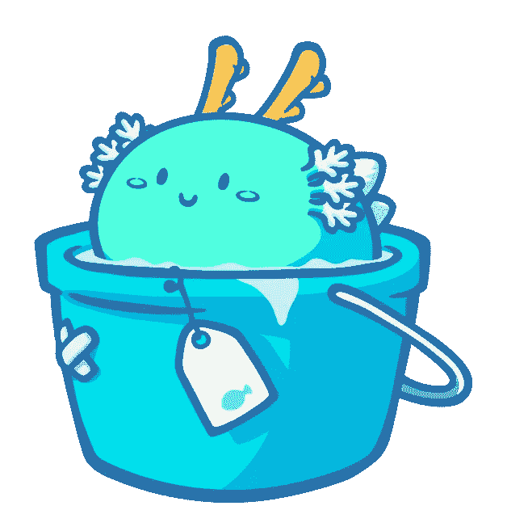

# Axie Infinity:数字时代的宠物

> 原文：<https://medium.com/hackernoon/axie-infinity-pets-for-the-digital-age-68f370f0ee2d>

在文明兴起之前，人类就与动物有着特殊的联系。像狗这样的宠物可以提供陪伴和保护，甚至可以增强和它们一起长大的婴儿的免疫系统。新石器时代的狩猎采集者有时会和他们的狗葬在一起，这表明一种明显具有情感意义的联系。然而，最近的城市化趋势和全球人口老龄化对传统的宠物饲养方式提出了挑战。

拥有宠物有几个问题，增加了千禧一代和 z 世代的准入门槛。

1.  **时间承诺**

随着全球竞争的加剧，年轻人拥有宠物的时间越来越少。宠物一定要喂，一定要看，一定要锻炼，一定要爱！对于许多年轻的都市人来说，拥有一只宠物是一段越来越遥不可及的艰难旅程。

**2。空间**

诸如狗之类的宠物需要空间来四处走动和锻炼。在许多年轻人居住的城市和市区，空间显然相当有限。

**3。假期**

在过去，度假和旅行是贵族们的奢侈品。然而，在现代社会，旅行变得更加容易。宠物可以成为阻止人们旅行的锚。许多年轻人最终把他们的宠物给了他们的父母，这最终限制了他们的父母在退休后探索世界的能力(特别是如果他们不信任像我父母这样的宠物保姆的话！).

解决办法？数码宠物！

过去 20 年的技术进步已经证明了“人造宠物”概念的正确性。我将提到的 3 个例子是 Paro、机器小海豹、Neopets 和 Pokemon！

然而，这些都有一个缺陷，阻止他们成为传统宠物所有权的适当替代品。

**帕罗**

机器人海豹 Paro 已经被用于为养老院的老年人提供陪伴:“我们知道宠物治疗对身体、心理和社会都有帮助，Paro 也为无法照顾活宠物的人做同样的事情，”Paro 的工程师 Takanori Shibata 说。

Paro 在 2009 年甚至被美国列为医疗器械！

尽管 Paro 取得了成功，但每个 Paro 都是相同的，这限制了对这些设备“真正拥有”的感觉。

**尼奥宠物**

NeoPets 是一款在互联网早期允许玩家收集和玩数字“宠物”迷你游戏的游戏。今天人们仍然玩尼奥宠物！然而，快速浏览一下他们的网站就会发现，NeoPets 是早期互联网时代的遗迹。前端看起来自 2000 年初以来就没有更新过。Neopets 的兴衰说明了集中化的问题。产品背后的原始开发团队继续前进，然而对网站的控制仍然是集中的，阻止了社区为他们自己建立一个新的、更新的体验。

**口袋妖怪**

口袋妖怪席卷了全世界，并且仍然被世界各地的游戏玩家通过许多媒介来享受！口袋妖怪训练师可以捕捉，收集和战斗他们的口袋妖怪，数百万人在过去的 20 年里享受了这种体验。然而，口袋妖怪的真正所有权从来都不可能实现——玩家仍然受开发商/游戏创作者的支配，并且在行使财产权方面受到限制。例如，尽管 Pokemon Go 最初激增，但在我们看来，由于缺乏交易/销售 Pokemon 的流动性市场以及缺乏令人满意/有竞争力的 PVP 系统，该游戏逐渐衰落。如果游戏在区块链上，足智多谋的开发者可能会将所有权数据转移到一个实际上很有趣的应用程序中！

**Axie Infinity！**

我们相信 Axie Infinity 解决了这些数字宠物所有权先驱中存在的固有缺陷。

1.  **独特性和不透明的数字稀缺性**

每个 Axie 都是一个 ERC 721 令牌，带有存储在以太坊区块链上的遗传密码。因为有这么多可能的基因组合，而且每个 Axie 都有自己唯一的序列号记录在区块链上，所以每个 Axie 都是唯一的！它们与一模一样的机器人帕罗海豹相去甚远！

**2。分散数据存储**

因为 Axie Infinity 的所有基因数据都存储在区块链上，所以我们的 playerbase 不太可能像 NeoPet 社区那样被抛弃！即使我们的开发者永远抹去了他们的记忆，足智多谋的社区成员也可以使用开源基因数据，将游戏转移到一个新的前端！

**3。易于交换**

因为 Axie Infinity 的所有市场交易都记录在以太坊区块链上，玩家之间的交易可以顺利进行，不需要双方的信任！再也不用在公共场所遇到陌生的脖圈进行游戏资产交换了！

此外，根据这一“逻辑”，我们相信 Axie Infinity 是宠物所有权的下一步，原因很简单:它们很可爱！人们喜欢可爱的东西，没必要为你分解。

看看帕夫，第一个被创造出来的 Axie！

不欢而散见！

Axie Infinity 团队

如需了解更多信息，请加入我们 Discord 的讨论或在 Twitter 上关注我们。

axie Infinity:[https://axieinfinity.com](https://axieinfinity.com)
不和:[https://discord.gg/68DeTqc](https://discord.gg/68DeTqc)
推特:[https://twitter.com/AxieInfinity](https://twitter.com/AxieInfinity)
脸书:[https://www.facebook.com/AxieInfinity](https://www.facebook.com/AxieInfinity)
insta gram:[https://www.instagram.com/axieinfinity](https://www.instagram.com/axieinfinity/)
Reddit:[https://www.reddit.com/r/AxieInfinity/](https://www.reddit.com/r/AxieInfinity/)
电报:[https://t.me/axieinfinity](https://t.me/axieinfinity)