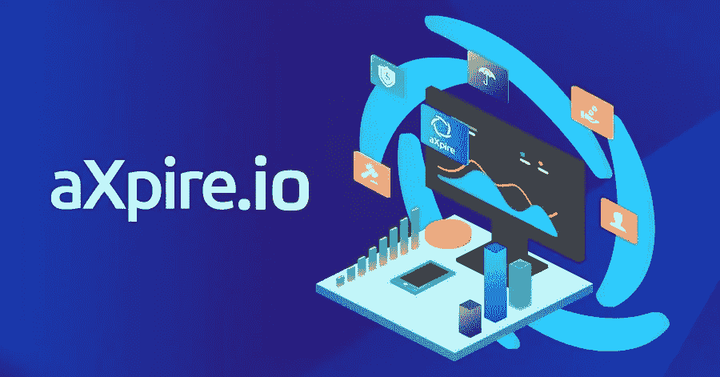

# aXpire(AXPR)——使用区块链技术的对冲基金

> 原文：<https://medium.com/hackernoon/axpire-axpr-hedge-funds-using-blockchain-technology-82b8ec777d4f>

## 高效、节约成本且易于使用；有什么不喜欢的？

## aXpire 的 [Resolvr 软件](https://axpire.com/resolvr/)为基金管理者和资产管理者提供了未来支出管理的途径。

Resolvr 的区块链和人工智能 **-** 解决方案比以前提供的任何支出管理解决方案都更有效，可以大幅降低用户的成本和时间。这些好处，除其他外，使其没有痛苦，并激励大型金融机构使用这些平台。

## 有了 Resolvr，aXpire 的客户每天都在使用区块链技术，他们不需要知道背后的任何复杂性。

自从 1 月份出售 aXpire 代币以及随后的熊市以来，aXpire 一直没有得到我认为它应该得到的关注。随着真实业务的真实使用，[即将推出的美国消费者新闻与商业频道功能](https://twitter.com/aXpire_official/status/1029118559803334662)等等，aXpire 应该会脱颖而出。

> **免责声明:我是 aXpire 的顾问，因此我对这个项目的看法自然会有偏见。**

## 在本文中，我将涵盖以下几点:

*   什么是 aXpire 和 AXPR？
*   价值 240 亿美元的 AUM 对冲基金客户
*   什么是 Resolvr？
*   什么是 MatchBX？

# 什么是 aXpire 和 AXPR？

[aXpire 最初是从](https://blog.usejournal.com/lsgs-spend-management-spinoff-axpire-dfbe767e96cc) [LSG](https://www.lsg.com/US/index.html) 分离出来的，这是一家总部位于美国的 InsurTech/RegTech SaaS 公司，拥有与财富 500 强公司合作的良好记录——耐克、英特尔、IBM、可口可乐、NFL 等等——为他们提供软件解决方案。

## aXpire 在区块链领域独树一帜，原因很明显:拥有真正的产品、真正的客户和持续的收入。

这不是一家做白日梦的初创公司，而是一家致力于改善和推进其产品线以造福当前和未来客户的老牌公司。

凭借两个核心产品— [MatchBX](https://matchbx.io/) 和 Resolvr — aXpire 已经准备好为大量用户提供服务，所有这些用户都将 ***需要*** 使用 AXPR 令牌从这两个产品购买服务/功能，无论他们是 MatchBX 上的自由职业者还是 Resolvr 上的资产经理/基金管理员(将在下面解释这两个产品)。

aXpire 的 token 在 aXpire token 发售期间发售，从 2018 年 1 月 8 日持续到 12 日， [**在短短 89 小时内达到 2000 万美元的 token 发售硬上限，**](https://blog.usejournal.com/reflections-on-a-token-sale-3e8036fb4a61) [在 Roger Ver](/@aXpire/roger-ver-ceo-of-bitcoin-com-is-joining-axpire-as-its-chief-blockchain-advisor-941123ff704a) 等人的支持下，代币的核心功能在于它是 aXpire 软件/平台上唯一的交易工具，需要支付功能成本和平台费用。令牌的一个有趣的方面在于它的 burn 功能，这是一种功能成本和平台费用被烧掉而不是被 aXpire 团队收入囊中的模式。

# 价值 240 亿美元的 AUM 对冲基金客户

aXpire 和 Resolvr 最初是为了应对一项挑战，或者更确切地说是一项软件服务需求而开发的，它是由 NDA 的前十大对冲基金创建的。由于目前的产品无法满足他们的需求，这家对冲基金开始寻找新的解决方案。aXpire 奋起直追，击败了众多竞争对手，包括最知名的支出管理软件提供商。

## 在获得开发合同后，Resolvr 应运而生，现在被用来管理他们管理的 240 亿美元资产的支出。

# 什么是 Resolvr？

Resolvr 是一个支出管理软件解决方案，允许基金管理员和资产经理实时、全面地了解他们整个业务的支出情况。 [**通过从整个支出管理流程中去除人工步骤**](/@aXpire/back-office-brilliance-6daabd74309d) **，消除错误，实现利润最大化。**通过 Resolvr，用户可以委托审核发票，利用人工智能功能优化支出，并受益于部门间简化的沟通。所有这些都在一个 Resolvr 平台中完成，而不是分散在电子表格、pdf 和电子邮件中。aXpire 的区块链技术能够跨所有部门跟踪和查看所有支出，并提供不可更改的审计线索。这种透明度的增加对任何 Resolvr 用户都非常有益，例如在审计时。

**简而言之，Resolvr 将所有与支出相关的内容汇集到一个访问和控制点(跨部门),从而提高效率，让员工腾出时间处理其他任务，最终为企业用户节省大量资金。**

**试试这里的非 DLT 解析器演示:**https://axpire.com/resolvr/resolvr-demo.html

*支持 DLT 的 Resolvr 版本将需要 AXPR 来实现其功能，并将烧毁 AXPR，将于 2018 年第三季度上线。*

# 什么是 MatchBX？

MatchBX(读作“Matchbox”)是一个 P2P 任务/工作市场，它通过集成到 Resolvr 中的 [RFP 门户](https://www.alpha-week.com/why-institutional-investors-are-turning-blockchain-solutions-investment-manager-rfps)，以及在 [MatchBX.io](https://matchbx.io/) 推出的主要前端市场，将自由职业者与私人和企业联系起来。MatchBX 将自由职业者与那些希望使用他们服务的人联系起来。例如，设计师可以提供设计公司的标志，或者翻译可以提供翻译服务。**任何符合 MatchBX 指导方针的任务/工作都可以在平台上进行，以交换 AXPR 令牌作为支付。**

*match bx 平台 MVP 将于 2018 年第三季度上线，需要 AXPR 从一开始就发挥作用。*

> [**aXpire 白皮书**](https://drive.google.com/file/d/1OQ8-6A0BXj3xEJkNmxwpe0Lg8XvVehMr/view?usp=sharing)**|**[**aXpire 常见问题解答**](https://goo.gl/JMjzuW)**|**[**aXpire 网站**](https://www.axpire.io/)