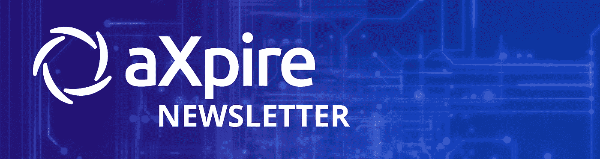
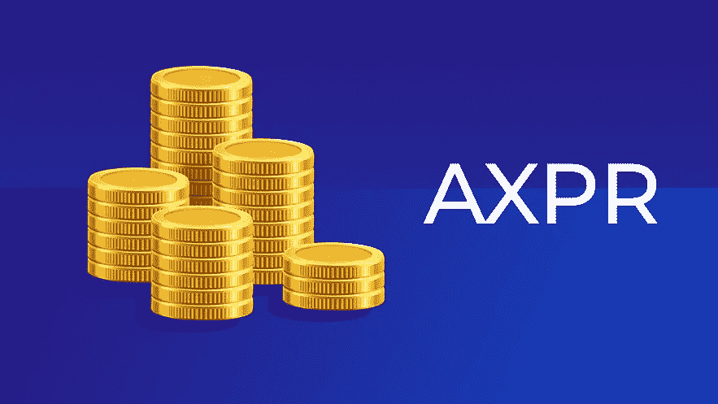
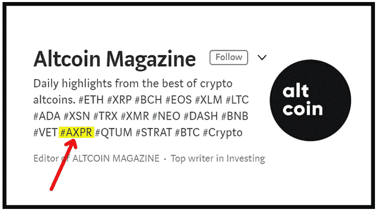
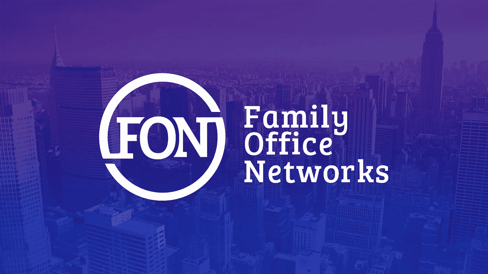
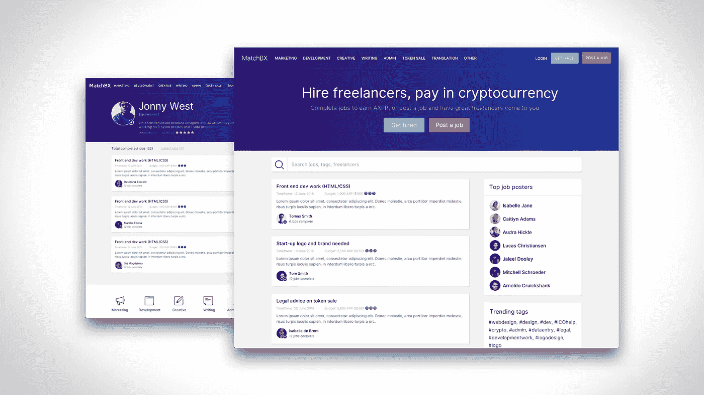
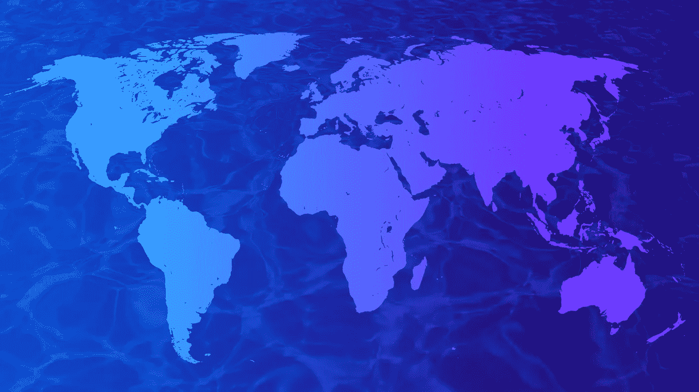

# 这是上个月的时事通讯，请点击这里阅读十月的

> 原文：<https://medium.com/hackernoon/axpire-newsletter-august-2018-6a800ae81459>

aXpire 简讯(2018 年 9 月):我们有许多进展要与社区分享，包括我们最近在 aXpire 的纽约办公室拍摄的**美国消费者新闻与商业频道**与特德·丹森的进步。不仅如此，aXpire 还与金融科技社区的许多行业领袖进行了对话和合作，包括美国最大的 [**家族办公室网络**](https://familyofficenetworks.com/) 的首席执行官 Andrew Schneider，他代表着 8 万亿美元的 AUM。

aXpire 一直在世界各地传播区块链的好处，并与投资者、客户和合作伙伴建立关系。该团队曾到过韩国首尔的 Beyond Blocks、美国纽约的 Consensus 和开曼群岛，以协助区块链监管。

让我们深入了解一下我们最近的一些进展…

# 代币交换

这个月，AXP 令牌被一个新的和改进的 AXPR 令牌合同所取代。

这是一对一的交换，以确保我们不断向我们的 AXPR 持有者提供最好的服务。我们希望在 MatchBX 之前发布这个升级的令牌，以确保我们融入了与该应用程序相关的最新网络安全和功能。这种变化将发生在我们所有的交易所。请记住，AXP 代币现在已经失效，不再使用。

# 承认

aXpire 在 Medium 的 altcoin 杂志中被评为核心 Altcoin，以表彰该公司未来的发展前景和现有的成功。我们将与该杂志密切合作，提供对我们公司的深入了解，以及为什么我们将成为*B2B 标志。*

# 与家族办公室网络的伙伴关系

Family Office Networks 和 aXpire 宣布合作，将为 FON 全球网络内的家族办公室提供区块链金融解决方案技术和集中 IT 服务。

Family Office Networks 首席执行官 Andrew Schneider 表示:“我们对 aXpire 最新的区块链金融科技创新印象深刻，并相信这一新的合作伙伴关系将为我们的家庭以及银行、对冲基金、私募股权公司和其他公司带来更多价值。”。

“与 Family Office Networks 快速发展的团队密切合作，提供增值的区块链技术和集中式金融科技解决方案，这是一个令人兴奋的时刻。本质上，我们通过 IT 支出提高了工作效率。aXpire 首席执行官加里·R·马卡姆说:“我们的目标是通过发现最好的区块链技术，将更多的美元重新投入到家族理财室投资者的手中。”。

# MatchBX

MatchBX 等候名单在[www . com 直播。MatchBX.io](http://www.matchbx.io) 。立即注册，并获得分层免费 AXP 奖励，以及进入 MatchBX 的 MVP，即将于 9 月！

# 建立全球联系

在 aXpire 的新业务发展主管和布道者 Darin Milman 的大力帮助下，aXpire 参加了许多行业会议，以建立关系。以纽波特的家族办公室和私人财富管理论坛为例，在那里，aXpire 能够建立关系，促成我们的家族办公室网络合作伙伴关系。

在赤道附近，首席执行官加里·马卡姆一直在与开曼群岛政府合作，讨论政策并鼓励金融科技企业采用 aXpire 的产品。

敬请关注我们的下一期时事通讯！

关注我们的[电报频道](https://t.me/AxpireOfficial),了解 aXpire 社区的最新动态。

在 axpire.com[了解更多信息](https://axpire.com/resolvr/)