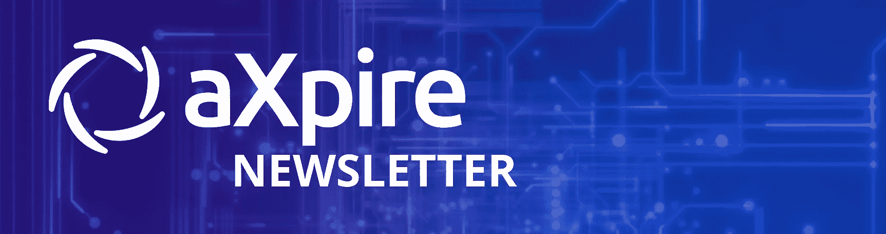
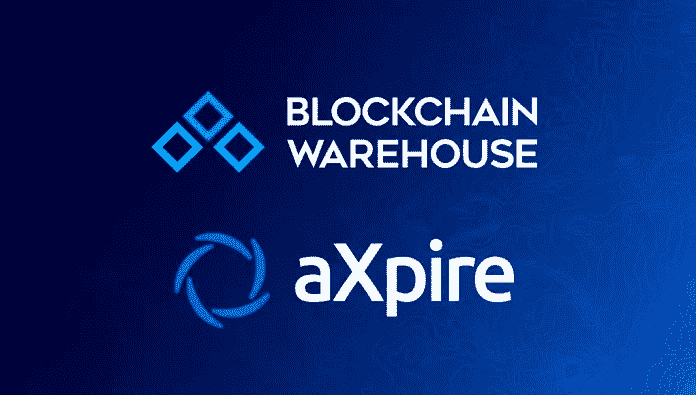
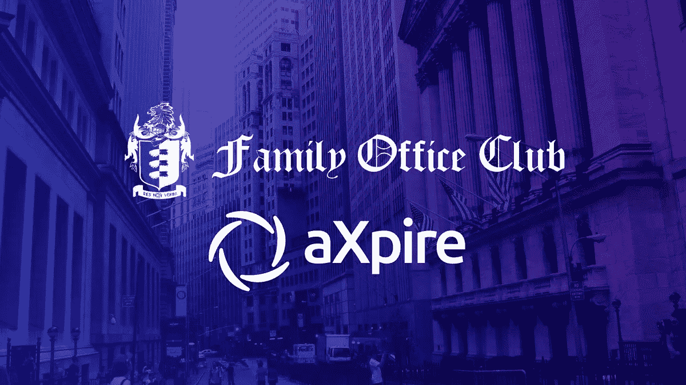
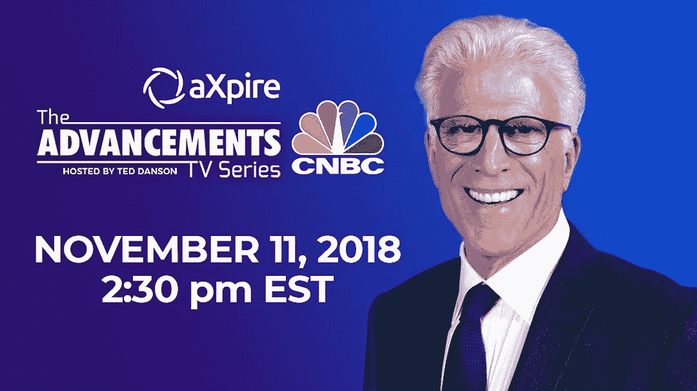
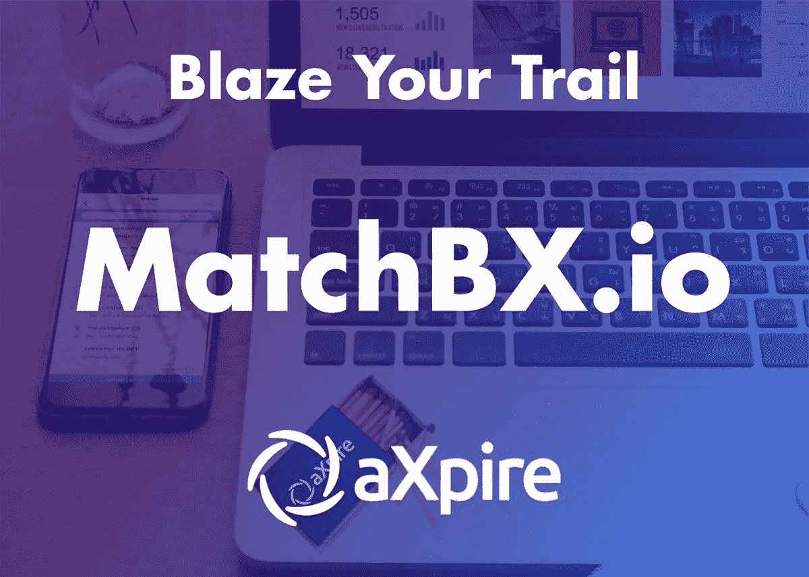
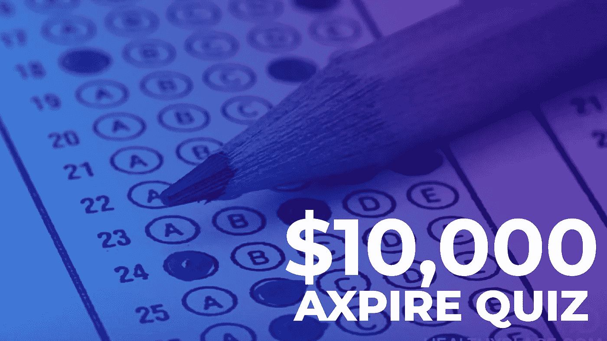
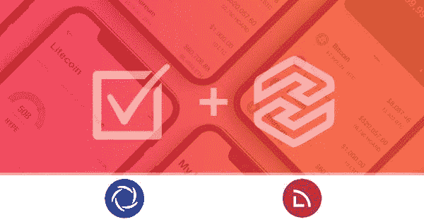
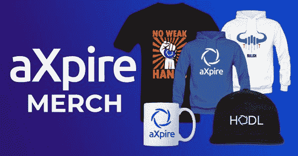

# aXpire 简讯(2018 年 11 月)

> 原文：<https://medium.com/hackernoon/axpire-newsletter-november-2018-e58937b00dd2>

# aXpire 简讯(2018 年 11 月)

欢迎来到 aXpire 每月简讯的第三期！

aXpire 社区整整一个月，有很多新闻要分享。

我们很高兴通过对 BlockchainWarehouse (BCW) 的**收购，我们的团队和顾问得以壮大，更多的更新即将到来，但还有很多很多要讨论！**

让我们直接进入最近的发展…

find out more at [www.axpire.io](http://www.axpire.io)

昨天，10 月 31 日，aXpire 宣布收购区块链加速器和领先的代币销售产品开发商 BlockchainWarehouse (BCW)。aXpire 进行了此次收购，以增强其内部区块链人才的实力，并为其技术套件增加一种新产品。通过收购，aXpire 将获得 BCW 的人才和加密网关，允许通过我们的网络应用程序直接购买 AXPR，降低新客户的准入门槛。

随着 BlockchainWarehouse 的收购，我们很高兴欢迎 BCW 的合作伙伴加入 aXpire！这包括:Bitcoin.com，DACC，坎伯兰，路易斯布里斯博伊斯，前线，巨齿鲨，和 Factblock。我们将在未来几天为社区提供更多关于 aXpire 将通过此次交易获得的所有联系的信息。

此外，作为一个总的主题，我们希望贪婪，而更广泛的市场是恐惧的，我们绝对相信，在幕后，区块链行业正在全面展开。

find out more at www.axpire.io

在机构/家族理财室新闻中，aXpire 很高兴地宣布家族理财室俱乐部加入其首选合作伙伴网络。连续 11 年来，家族理财室俱乐部已有 1500 家注册家族理财室成为会员，每年投资 450 亿美元。加入这个俱乐部让我们能接触到他们所有的成员和活动。

对于我们的家族办公室和更广泛的机构合作伙伴， **aXpire 正在制作一份针对机构的时事通讯**，我们希望您会喜欢，它将在家族办公室网络的本地时事通讯中开始它的生命。

这是初稿，由埃里克·沃尔赫斯(变形)、理查德·哈特(连续创业家)和卢·肯纳(神秘预言师)主演:

 [## aXpire 家族办公室区块链简讯

### 加密和区块链行业最近引起了世界的关注，去年…

bit.ly](https://bit.ly/2ETkwQr) 

如果你想在这份简讯中提交一篇文章，我们会记下你的名字，请将你的文章发送到 info@axpire.com 的**，主题为:aXpire 家族办公室简讯**。

find out more at [www.axpire.io](http://www.axpire.io)

请留意 aXpire 于美国东部时间 2018 年 11 月 11 日下午 2:30 在美国消费者新闻与商业频道的亮相。这个角色是特德·丹森进步的电视连续剧的一部分，aXpire 参加了试镜，并击败了其他五家区块链公司。看看 AdvancementsTV 的最新一集，由区块链主演，这里:[http://advancementstv.com/segments/](http://advancementstv.com/segments/)

find out more at [www.matchbx.io](http://www.matchbx.io)

自推出以来，MatchBX 已有约 30 万 AXPR 转手，以换取在线服务。我们为这个社区感到自豪，并鼓励小组中的人分享它，并开始使用它来鼓励使用 AXPR 和相关的 6%费用燃烧。我们创建 MatchBX 是为了确保 Resolvr 之外的任何东西都能看到 AXPR 的使用，到目前为止一切顺利。

我们希望为这款产品引入新的功能，为最终的发布打下坚实的基础。更多新闻来了！

find out more at www.axpire.io

我们让大约 4，000 名参与者完成了紧张刺激的测验。只有勇敢的 1%毫发无损地通过了挑战，我们将很快宣布获胜者。我们也有相当多的建议要整理，并将对任何有价值的想法给予肯定。

[https://blog.hoardinvest.com/fourth-round-hoardvote-winners/](https://blog.hoardinvest.com/fourth-round-hoardvote-winners/)

AXPR 是仅有的两家被选中在新的 Hodge 交易所上市的公司之一，该交易所将于本季度推出。

AXPR 和 aXpire 团队被选中(击败了一些著名的项目，包括:Tron、Ripple 和 Verge)，因为他们“坚定地与囤积愿景保持一致，并最初专注于比特币和以太坊。”

我们对社区的努力感到无比自豪，一旦我们正式开始交易，我们将通知该团体。

[www.axpiremerch.com](http://www.axpiremerch.com)

aXpire 推出了第一家官方商品商店！我们想要一种方式，直接向那些在线和线下寻找摇滚 aXpire 的人提供商品。作为商店中每一件商品的测试者，我们自豪地说所有商品都完全符合“罐头”上的描述，证明物有所值。

请在 11 月份继续关注我们的下一期月度时事通讯！

**值得注意的提及:**

*   米兰·阿明加入 aXpire 担任首席营销官
*   Reza Jafrey 作为营销顾问加入 aXpire
*   aXpire 发布旗下基金技术解决方案概述:[https://medium . com/@ ax pire/ax pire-fund-technology-ecosystem-cf 0a 36 a 43977](/@aXpire/axpire-fund-technology-ecosystem-cf0a36a43977)
*   aXpire 发布其令牌 AXPR 的概述:[https://medium . com/@ ax pire/what-is-ax pire-and-the-AXPR-token-7a 366 c 15622d](/@aXpire/what-is-axpire-and-the-axpr-token-7a366c15622d)
*   ICObench 在 https://info.binance.co/en/rate/detail/1646 的币安资讯上发布了其对 AXPR 的评级报告:

关注我们的[电报频道](https://t.me/AxpireOfficial)，了解 aXpire 社区的最新动态。

在 axpire.com[了解更多信息](https://axpire.com/resolvr/)