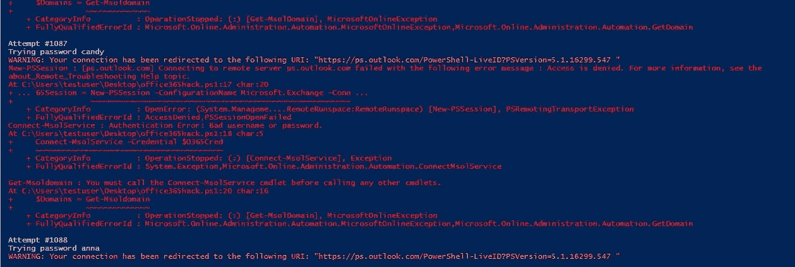
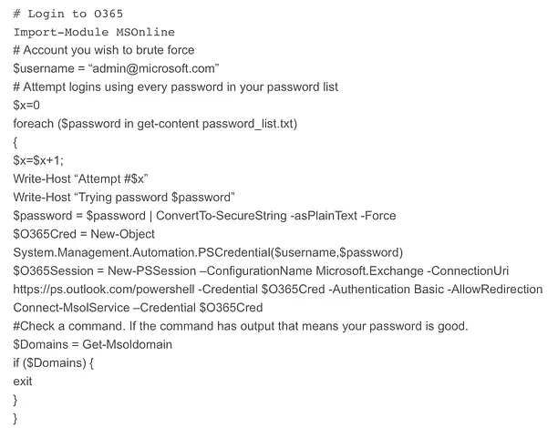
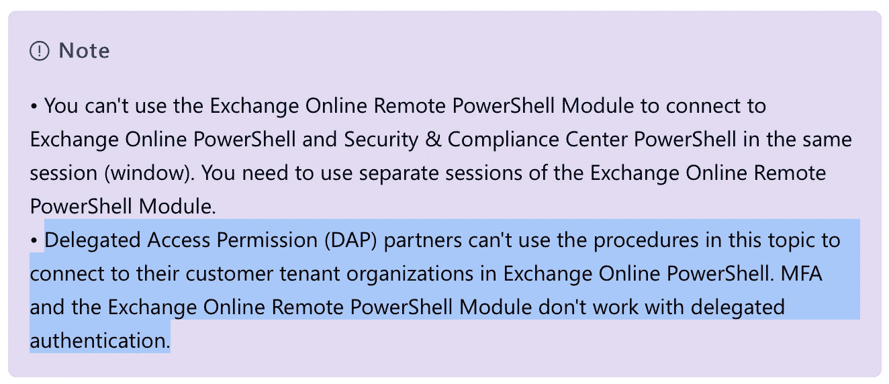
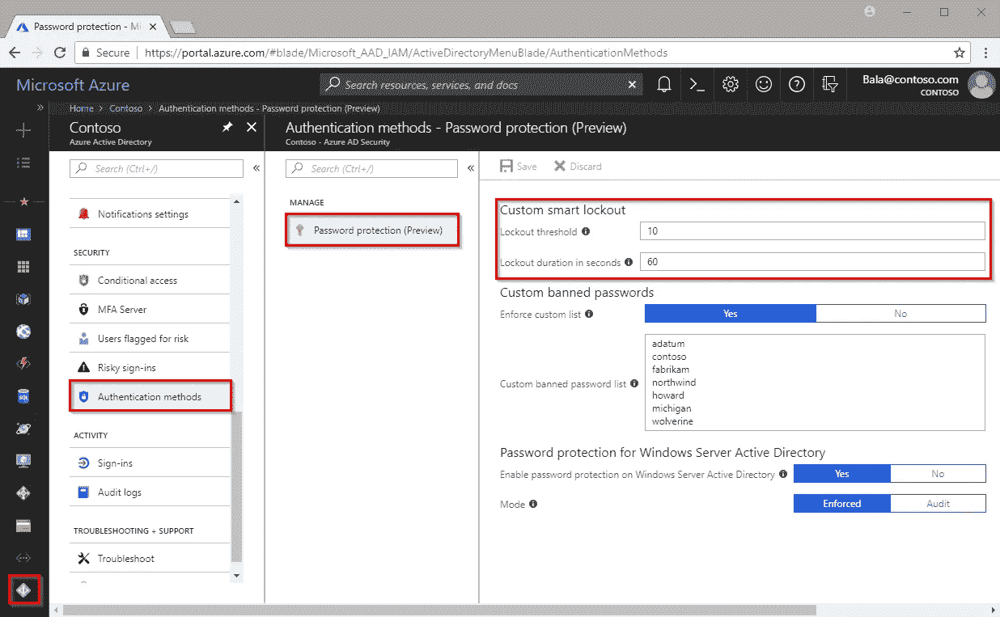
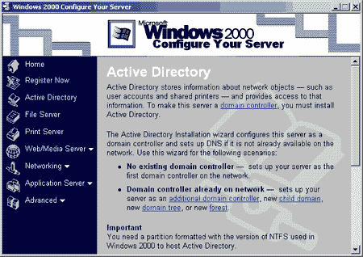
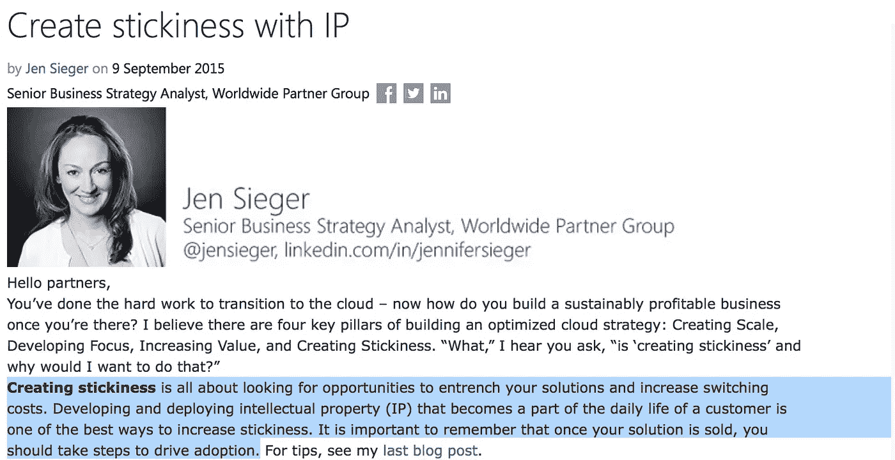
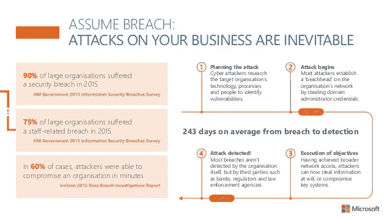

# Azure AD 如何容易受到暴力攻击和拒绝服务攻击

> 原文：<https://medium.com/hackernoon/azure-brute-farce-17e27dc05f85>

Source: [https://www.microsoft.com/en-us/microsoft-365/blog/2017/11/13/how-organizations-are-connecting-their-on-premises-identities-to-azure-ad/](https://www.microsoft.com/en-us/microsoft-365/blog/2017/11/13/how-organizations-are-connecting-their-on-premises-identities-to-azure-ad/)

Azure AD 是 Azure、Office 365 和企业移动性等微软云解决方案事实上的把关者。作为云生态系统不可或缺的一部分，它每年为全球约 1280 万个组织、9.5 亿多用户和 90%的财富 500 强公司提供服务。鉴于这样一份简历，人们可能会认为 Azure Active Directory 是安全的，但真的是这样吗？

尽管微软自己宣称“[承担违约](https://blogs.msdn.microsoft.com/azuresecurity/tag/assume-breach/)”是他们安全战略的[指导原则](https://www.microsoft.com/en-us/trustcenter/security/default.aspx)，但如果你在一周前告诉我 Azure 或 Office 365 容易受到基本攻击，不能被认为是安全的，那么我可能会笑得把你赶出房间。但是，当我们的一个客户最近的几个 Office 365 邮箱受到简单的暴力攻击时，我别无选择，只能质疑 Azure AD 的整体完整性，而不是将违规归咎于仅仅利用它的服务，我发现这并不令人放心。

在谷歌上简单的“ [Office 365 暴力破解](http://bfy.tw/KuoJ)”搜索后，甚至没有写一行代码，我发现我参加聚会迟到了，Office 365 [是](https://cssi.us/office-365-brute-force-powershell/) [的确是](https://duo.com/decipher/evasive-brute-force-attacks-target-office-365-accounts) [易受](https://www.skyhighnetworks.com/cloud-security-blog/skyhigh-discovers-a-targeted-brute-force-attack-on-enterprise-customers/)暴力破解[和](https://en.wikipedia.org/wiki/Brute-force_attack)[密码喷雾](https://resources.infosecinstitute.com/password-spraying/)通过[远程 Powershell](https://docs.microsoft.com/en-us/powershell/exchange/exchange-online/connect-to-exchange-online-powershell/connect-to-exchange-online-powershell?view=exchange-ps) (RPS)攻击。我们还发现，这些漏洞正被广泛利用，但在事后检测起来却异常困难。Skyhigh Networks 将这种攻击命名为“敲门”,甚至估计在任何给定的时间内，多达 50%的租户正在被主动攻击。更糟糕的是，似乎没有办法在 Azure AD 中纠正这一点，而不会使自己暴露于拒绝服务攻击。

Source: [https://cssi.us/office-365-brute-force-powershell/](https://cssi.us/office-365-brute-force-powershell/)

事实上，这种攻击如此普遍，以至于根据马克·罗素维奇的说法，它是微软云租户安全的最大威胁之一，这也是微软建议其客户为所有用户启用多因素身份验证(MFA)并实施仅适用于 E5 订阅级别或更高级别的高级[威胁情报的几个原因之一；基本上要求公司给微软更多的钱来保护他们自己的解决方案。但 MFA 也不能阻止黑客破解密码或保护企业免受 DOS 攻击，也不能帮助那些不知道其必要性的人，因为目前许多租户都不知道。](https://docs.microsoft.com/en-us/office365/securitycompliance/office-365-ti)

Source: [https://docs.microsoft.com/en-us/powershell/exchange/exchange-online/connect-to-exchange-online-powershell/mfa-connect-to-exchange-online-powershell?view=exchange-ps](https://docs.microsoft.com/en-us/powershell/exchange/exchange-online/connect-to-exchange-online-powershell/mfa-connect-to-exchange-online-powershell?view=exchange-ps)

此外，由于 RPS 不支持延迟认证(DAP)和 MFA，由顾问、托管服务和支持提供商组成的合作伙伴[也不能](https://docs.microsoft.com/en-us/powershell/exchange/exchange-online/connect-to-exchange-online-powershell/mfa-connect-to-exchange-online-powershell?view=exchange-ps)使用他们的合作伙伴证书通过 RPS 连接到他们客户的租户，以进行高级管理和脚本编写。尽管他们可以通过带有 MFA 的基于浏览器的管理中心轻松管理他们的客户端，但他们通常不得不求助于在 Office 365 tenant 本身内创建管理帐户，但其他人这样做只是为了方便访问管理控制台或当他们不是记录中的合作伙伴时。这些帐户正是这些攻击的目标，而管理员通常并不知道，德勤的违规就是这种情况的一个完美例子。

不幸的是，这些帐户通常被剥夺了 MFA 安全性，以使它们对于在为提供支持服务的各种公司工作的大量支持和操作人员来说更加方便和可访问，并且它们很少在公司退出时过期或改变。在 Office 365 中默认情况下，除了容易被破解和破坏之外，密码到期策略还被进一步设置为 [730 天到期，并进一步禁用](https://docs.microsoft.com/en-us/office365/admin/manage/set-password-expiration-policy?view=o365-worldwide)，从而使帐户容易受到长期破坏。不用说，他们已经为攻击做好了准备，正是这种情况使得黑客能够对德勤的 Exchange Online 租户进行完整的管理访问长达 6 个多月。

更复杂的是，这个问题的自然解决方案使租户容易受到 DOS 攻击，因为它能够在 Azure AD 强加的固定时间内锁定用户的帐户；但这仍处于预览阶段。例如，默认情况下 [Azure AD 智能锁定](https://docs.microsoft.com/en-us/azure/active-directory/authentication/howto-password-smart-lockout)(预览阶段)，仍处于预览阶段，被配置为允许 10 次密码尝试，然后对帐户进行 60 秒的锁定，给予攻击者每个帐户/每天 14，400 次尝试的理论限制。您可以将阈值降低到 5 分钟，将持续时间增加到 5 分钟来防止违规，将尝试次数减少到每天 1，440 次，但这可能会在用户的帐户受到暴力攻击和密码喷雾攻击时造成停机。

Source: [https://cssi.us/office-365-brute-force-powershell/](https://cssi.us/office-365-brute-force-powershell/)

然而，CSSI 的泰勒·鲁斯克也指出，微软似乎没有抑制或限制通过 RPS 进行的认证尝试。如图所示，Tyler 能够在没有添加逻辑的情况下超过 Azure AD Smart Lockout Preview 中列出的每天 14，400 的理论限制，如果他让它运行 24 小时或 est，则每天移动 48，000。超过 365 天的 17，520，000 次尝试。然而，通过[后台作业](https://mcpmag.com/articles/2018/04/18/background-jobs-in-powershell.aspx) ( [启动作业](https://docs.microsoft.com/en-us/powershell/module/microsoft.powershell.core/start-job?view=powershell-6) cmdlet)，有明显的方法可以进一步优化这些工作，即本质上异步而不是同步运行攻击，同时优化自定义锁定限制、最大尝试次数和最小检测次数。由于显而易见的原因，密码喷雾攻击的可能性是无穷无尽的。不过，公平地说，在我看来，泰勒和 CSSI 不需要利用这样的措施来验证他们的担忧。

如果他们的锁定功能起作用，如果你能以上述方式减少威胁面，你将不得不与持续时间的倒计时做斗争。它是不可变的，这意味着用户必须等待它过期，以便使帐户再次可访问。目前无法通过管理方式加速解锁。因此，它可以很容易地导致故意拒绝服务的最终用户，如果他们或无意的拒绝服务，而运行的可能性暴露了攻击；那是它真正开始工作的时候。很明显，防范入侵优先于停机，但是变得容易遭受 DOS 攻击并不是一个安慰奖。

禁用密码和 MFA 都不能抵御 DOS 或暴力攻击，只能抵御漏洞本身。事实上，当暴力破解受 MFA 保护的帐户时，MFA 质询本身可以被视为对有效破解的用户名和/或密码的确认。反过来，他们可以开始在可能不受 MFA 保护的其他地方尝试这些凭据，因为用户和管理员都倾向于在多个目录中尽可能保持它们的相似性，以便于记忆。至于这是否适用于他的雇主和他们的合作伙伴，我将听从微软的 Ned Pyle。

总结到目前为止，你可以通过 RPS 暴力破解 Azure AD 中的账户。针对这一点的显而易见的解决方案，例如 MFA、定制的密码阻止和高级威胁情报，要么无效、不充分、受付费限制，和/或产生显著更多的开销来抵消这些漏洞。此外，这些解决方案经常被懒惰的管理员、顾问和托管服务提供商所忽视，许多人可能完全没有意识到这种威胁；甚至可能导致他们自己的违约。德勤已经证明，这甚至可以打击他们中的佼佼者。

尽管所有这些看起来可能令人不快，但重要的是要记住，广告从来就不是面向公众的，恰恰相反。实际上，从设计上来说，它天生就容易受到暴力攻击、密码喷溅和 DOS 攻击。AD 总是被设计为与各种其他对抗措施一起实施，以保持其完整性。这包括但当然不限于依赖物理安全措施，如受控进入，并将访问域的能力限制在那些成功通过物理安全措施的人；VPN 用户显然是个例外。这不是什么新鲜事。

也就是说，AD 从来都不是 IT 基础设施安全的唯一来源，它从根本上依赖于其他安全措施才能有效。因此，当其他先发制人的方法失败或不存在时，AD 变得更加脆弱。简而言之，当单独依赖 Azure AD 来实现 IT 安全时，这种违规应该是意料之中的，遗憾的是，这适用于任何具有默认安全设置的 Office 365 租户。然而，理解它的局限性有助于我们阐明强化 Azure AD 的方法，并同样缓解这些问题。

这几乎是不言而喻的，但修补这些漏洞所必需的措施目前对利用这些服务的公司来说都不是免费的。即使微软解决了这个问题，谁能说其他同样简单和尴尬的东西没有藏在角落里或者已经被使用了呢？也就是说，避免使用有 20 年历史的安全系统支持的产品似乎是一个可行的解决方案，可以从一开始就避免这个问题。

Source: [https://www.microsoft.com/en-us/microsoft-365/blog/2017/11/13/how-organizations-are-connecting-their-on-premises-identities-to-azure-ad/](https://www.microsoft.com/en-us/microsoft-365/blog/2017/11/13/how-organizations-are-connecting-their-on-premises-identities-to-azure-ad/)

首先，我真的认为微软有责任确保他们的云账户基线配置不会不必要地暴露他们的租户。当然，我们可以指责无知的用户和懒惰的管理员，但我不认为这是公平的，因为这个漏洞的范围基本上占 AzureAD 用户群的 46%(密码哈希同步+仅云= 46%)。目前还不知道有多少人启用了 MFA，对于那些易受其攻击的人、主动受到攻击的人和/或已经被攻击的人来说，MFA 的范围最终也是一个未知数。但作为微软 Exchange Online 的前三级支持工程师，我可以确认，大量个人和中小型企业完全依赖 Azure AD，而没有进一步的反制措施，他们占了 Office 365 用户群的相当大一部分。也就是说，告诉付钱给你的客户保护他们的邮箱或者[禁用基本认证](https://blogs.technet.microsoft.com/exchange/2018/10/17/disabling-basic-authentication-in-exchange-online-public-preview-now-available/)来解决这个问题并不能解决问题。

Presentation to Partners…

微软[已经明确承认了](https://blogs.technet.microsoft.com/wbaer/2018/03/26/office-365-attack-simulator-and-mitigating-common-attacks-part-1/)这个问题，但是他们并没有像其他云服务那样加强租户抵御此类攻击的能力，而是提供了仅适用于他们高层计划的解决方案，以便利用这个问题，而不是修复它。尽管从现在开始迁移成本很高，或者他们喜欢称之为[粘性](https://blogs.partner.microsoft.com/mpn/create-stickiness-with-ip/)，但随着时间的推移，他们的产品只会变得管理成本更高、更脆弱、更难迁移。这是任何遗留解决方案的弊病。

微软减轻此类攻击的一个简单方法是更新他们的 RPS 模块以支持 DAP，并为管理员等开发其他创造性的途径，以高效、安全地管理其客户的租户。至少在为所有租户级别实施适当的解决方案之前，他们还应该将其威胁情报和高级定制服务扩展到所有许可证级别，这些服务仅提供给高成本的高级许可证订户。

作为一个直接的缓解措施，微软可以简单地交换身份验证的顺序。在您的手机上进行两步验证之前，他们不需要密码，而是需要通过 authenticator 应用程序或第三方 MFA 应用程序(如 Duo)进行手机验证，作为初始验证方式。通过推迟他们在 Azure AD 中的密码作为第二步而不是第一步，他们可以缓冲目前薄弱的密码安全性，并赢得时间来实施一个适当的解决方案。但是，这仅适用于启用并使用 MFA 的用户和租户。

正如 Active Directory 似乎为其他昂贵的辅助解决方案创造了必要性一样，微软似乎已经建立了 AzureAD 来为他们碰巧提供的更昂贵的解决方案创造进一步的必要性。除此之外，如果他们有自己的方式，他们启用 MFA 的解决方案还需要雇主为所有员工购买电话和移动计划进行两步验证，这可能比他们的任何计划每年都要花费更多。与适当的 MFA 解决方案和/或本地或托管 ADFS 解决方案(如果不存在)相关的成本也是如此，因为它们使解决方案整体变得非常复杂，同时也增加了相关的拥有成本。随着复杂性的增加，稳定性下降，而成本飙升。这就是为什么我建议完全避开他们的解决方案。

Source: [https://blogs.partner.microsoft.com/mpn/create-stickiness-with-ip/](https://blogs.partner.microsoft.com/mpn/create-stickiness-with-ip/)

但是，如果一家公司被微软的产品所困，而迁移又遥不可及，那么还有其他选择。公司可以实施的一个解决方案是 [ADFS](https://en.m.wikipedia.org/wiki/Active_Directory_Federation_Services) ，它将验证尝试推迟到您自己的本地域控制器，而不是 Azure AD，同时立即通过本地 Active Directory 对密码策略进行更精细的控制，并在网络层提供尽可能多的保护。仅从许可的角度来看，所有这些都是非常昂贵的，更不用说硬件、网络基础设施和实施所需的劳动力了，更不用说维护人员了。除非以高度可用的方式实现，否则这将为云解决方案带来单点故障，通常是内部故障。

他们也可以实施 MFA 解决方案，但仍然存在额外的暴露和漏洞，可能需要进一步考虑。但如前所述，这也增加了成本，MFA 可能无法完全保护帐户。为了记住密码，用户倾向于跨多个平台手动同步他们的密码，但不是所有的平台都有相同的保护，MFA 或其他。与 ADFS 类似，当 MFA 服务降级时，对您的邮箱和其他应用程序的访问受到限制，这也成为单点故障，正如今天 Azures [MFA 宕机](https://www.onmsft.com/news/azure-active-directory-hit-by-multi-factor-authentication-issue-microsoft-is-working-on-a-fix)所示。因此，如果您选择 MFA 解决方案，请选择第三方 MFA 提供商。

虽然 dirsync 的存在对于抵御暴力攻击几乎无能为力，但强制实施强密码策略(包括本地定制的禁用密码列表)可以在云中进行镜像。拥有 dirsync 的客户已经购买了本地 Active Directory 的这一功能，只需将其镜像到同步到 Azure AD forest 的帐户中。虽然这不能防止暴力、密码喷溅或拒绝服务攻击，但它绝对可以加固帐户，防止长期违规。

我想他们也可以打电话给支持部门投诉这个问题，看看他们是否会解决这个问题，但是你可能会遇到一些没有这方面经验的难以理解的人。或者，如果你有足够的财力成为高级会员，他们甚至可以找一个技术客户经理，或者甚至可能找一个有半个屁股的人来代表你。当你这么做的时候，也许你可以将你的 [E3 计划升级为 E5](https://products.office.com/en-us/business/compare-more-office-365-for-business-plans) 计划，每月花费几乎是你的 E3 的两倍，仅仅是为了支付微软补偿它自己的漏洞。

总之，建立在 Azure AD 上的微软服务以及利用它们的企业很容易受到暴力和密码喷雾攻击，任何有能力在 RPS 中运行脚本的人都可以进行这种攻击。此外，没有足够的手段来强化这些服务，而不招致重大的财务负担和支付更多的微软服务。只要管理员能够广泛使用通过 RPS 访问租户的能力，所有这些都可能是事实，这也是为什么您最终会像微软一样明智地假设违反了微软云解决方案。实体绝对可以缓解这些漏洞，但 Office 365 和 Azure 将不再作为真正的云解决方案，同时在此过程中产生更多的开销成本。尽管考虑到所有的事情，似乎没有办法在不产生大量成本的情况下强化 Azure AD 或 Azure 或 Office 365 等服务，除了前面提到的引入进一步的复杂性、故障点和对云架构的内部依赖性。

默认情况下，Azure AD 更多的是一个安全问题，而不是云。这并不是说 Azure 不能变得安全，但它是以牺牲云的弹性为代价的。尽管他们建议其他人承担违约责任，但微软似乎从 Office 365 和 Azure advertisements 中忽略了这一事实，这种不一致表明这种立场更多地是一种逃避，而不是一种可行的安全策略。微软似乎没有强化 Active Directory 和 Azure AD 固有的漏洞(这使得它们容易受到书中一些最古老的技巧的影响)，而是试图利用它们，同时将那些没有意识到的人暴露在难以忘怀的风险中。

