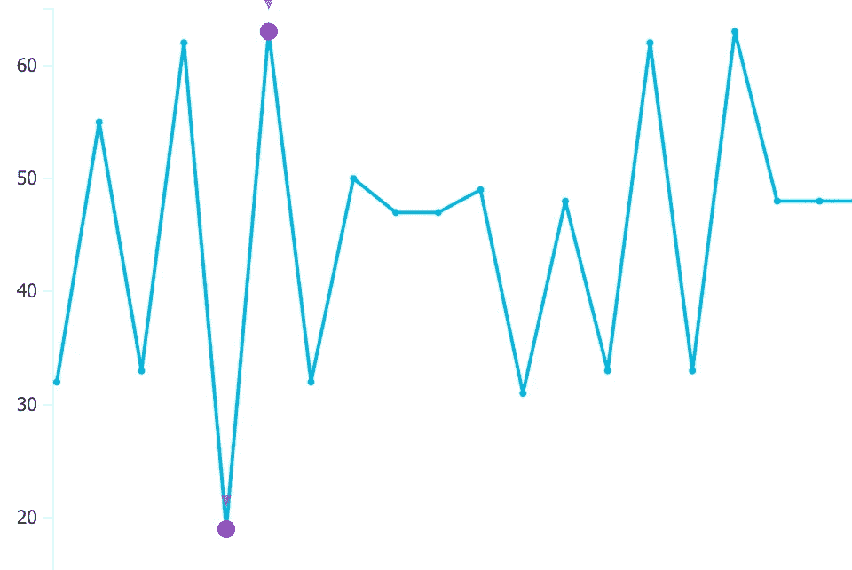
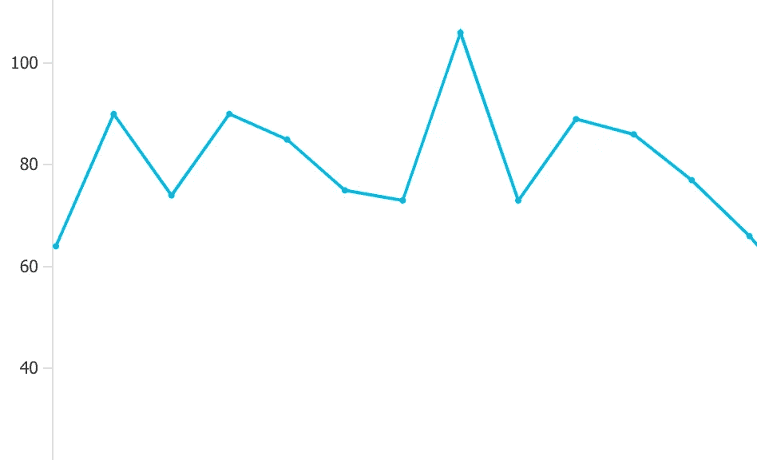

# Azure 函数:在队列和事件中心之间选择

> 原文：<https://medium.com/hackernoon/azure-functions-choosing-between-queues-and-event-hubs-dac4157eee1c>

## 性能和吞吐量考虑事项

我一周大概有两次这样的对话。有人决定在即将到来的项目中利用无服务器的 Azure 功能的优势，但是当开始设计架构时，出现了一个问题:

"我们应该使用 Azure 事件中心、队列还是事件网格？"

老实说，这是一个很好的问题——也是一个有后果的问题。每种消息传递技术都有自己的一套行为，会影响您的解决方案。在以前的博客中，我花了一些时间[解释事件网格](/@jeffhollan/why-event-grid-is-a-game-changer-for-serverless-8979870a65d1)、[事件中心排序保证](/@jeffhollan/in-order-event-processing-with-azure-functions-bb661eb55428)，如何[在队列/主题中有排序保证](https://dev.to/azure/ordered-queue-processing-in-azure-functions-4h6c)，以及如何保持[事件中心流流程弹性](https://hackernoon.com/reliable-event-processing-in-azure-functions-37054dc2d0fc)。在这篇博客中，我特别想解决另一个重要方面:可变工作负载的吞吐量。上周我面对的情况是这样的:

> *我们有一个解决方案，可以处理成千上万条记录。有些记录只需要几毫秒就可以处理，而其他记录可能需要几分钟。现在，我们正在通过事件中心将消息推送到各个功能，并注意到在处理所有消息时出现了一些明显的延迟。*

这里的问题很微妙，但是如果你理解每个触发器的行为，问题就简单了。如果你有一堆任务需要完成，你可能需要一个队列。这不是一个完美的规则，但通常情况下，队列可能会有您正在寻找的行为。事实上，这篇博客将展示选择错误的消息传递管道会导致处理时间的数量级差异**。**让我们来看看几个原因。

# 每项任务规模的可变性

如果您看一下上面客户提出的问题，有一个关键因素让我知道在这里排队可能是最好的。

> *“…有些记录只需几毫秒即可处理，而其他记录可能需要几分钟。”*

如果我有一个需要调整大小的图像队列，100kb 的图像会比 100mb 的全景图像更快地调整大小。最大的问题是:“我的处理管道如何响应一个长任务？”这有点像在高速公路上开车。道路上的事故对单车道道路的影响要比五车道道路大得多，对无服务器管道也是如此。

## 任务时间可变性下的事件中心行为

Azure Event Hubs 关心两件事，并且在这两件事上做得很好:排序和吞吐量。它可以非常快速地接收和发送大量的消息，并保持这些消息的顺序。我们的团队之前发布过 Azure Event Hubs 如何让我们在 Azure 函数中每秒处理 [100k 条消息。我可以在每次](https://blogs.msdn.microsoft.com/appserviceteam/2017/09/19/processing-100000-events-per-second-on-azure-functions/)*[函数](https://hackernoon.com/tagged/function)执行中消耗一批多达 200 条消息，这是一个很大的原因。但是排序和吞吐量这两个核心问题也可能互相妨碍。*

**>如果你还不熟悉事件中心是如何保持秩序的，也许值得* [*阅读这篇关于先*](/@jeffhollan/in-order-event-processing-with-azure-functions-bb661eb55428) *订购然后再回来的博客。**

*想象一下，我有一系列的事件都在同一个事件中心分区中。比方说，我的 Azure 函数从那个分区将一批 50 个事件拉入到一个函数中。消息 1–9 在几毫秒内处理完毕，但消息 10 需要几分钟才能处理完毕。事件 11–50 会发生什么？他们被卡住了。事件中心关心排序，所以消息 10 需要在消息 11 开始之前完成。想象一下这样一个场景，您正在接收的事件是股票市场事件——您非常关心“买入”事件发生在“卖出”事件之前，因此您会很高兴它保持不变。但是如果您的场景不关心排序怎么办？如果在我们等待消息 10 完成时，事件 11–50，甚至 51–1，000 可能正在运行，那该怎么办？在这种情况下，事件中心的行为会大大降低您的性能。**在当前批次以及该批次中的每个事件完成之前，事件中心不会处理分区中的下一批次。**所以一个不好的事件就能耽误整个分区。*

## *任务时间可变的队列行为*

*排队呢？标准队列不太关心排序([启用会话的队列关心](https://dev.to/azure/ordered-queue-processing-in-azure-functions-4h6c))。队列更关心的是确保每条消息都得到处理，并且得到完全的处理。走进任何一座政府大楼，您通常会看到分布式队列处理在运行。你有一行人需要完成一些事情，还有几桌员工需要帮助(希望不止一个😄).虽然有些员工的请求可能需要几分钟，但其他员工会在他们有空的时候继续抓住下一个人。一个冗长的请求不会阻止所有工作的继续。队列触发器将是相同的。无论你的应用程序有哪一个实例可以承担更多的工作，它都会抢占下一个任务。没有任务依赖于该队列中另一个任务的完成。*

## *服务总线队列和存储队列*

*似乎在事件中心、事件网格和队列之间做出决定还不够困难，在存储队列和服务总线队列之间还有一个子决定。我不会在这里深入探讨这个问题。有一个[的详细文档](https://docs.microsoft.com/en-us/azure/service-bus-messaging/service-bus-azure-and-service-bus-queues-compared-contrasted)将展示这些巨大的差异。简而言之，Service Bus 是一个企业级的消息代理，具有一些强大的功能，如会话、托管死信队列和自定义策略。存储队列是超级简单、超级轻量级的队列，是您的存储帐户的一部分。我经常坚持使用存储队列，因为我的 Azure 函数已经有了一个存储帐户，但是如果你需要更多的事务性和企业级(或主题)，Service Bus 绝对是你想要的。*

# *Azure 功能和可变工作负载*

*为了说明不同工作负载的行为差异，我进行了一些测试。这是实验。*

*我在 Azure 事件中心、Azure 服务总线队列和 Azure 存储队列中放置了 1000 条相同的消息。这些信息的 90%只需要一秒钟就可以处理，但是 10%(分散在各处)需要十秒钟。我有三个[几乎相同的 JavaScript 函数](https://github.com/jeffhollan/functions-javascript-queue-vs-event)，我将开始处理这些消息。问题是:哪一个处理速度最快？*

## *实验结果:活动中心*

*鉴于上述解释，这并不奇怪，但事件中心处理所有 1，000 条消息的时间大约是队列的 8 倍。发生了什么事？当队列功能应用程序完成时，它实际上处理了大约 90%的消息，但最后 10%有一个非常长的尾巴。结果是一个实例不走运，分配给它的分区中有大约 40 个十秒钟的任务。在进入下一组事件之前，它一直在等待长任务完成，下一组事件可能包含另一个 10 秒钟的任务。最后 10%的强制顺序处理是重要的。*

## *实验结果:存储队列和服务总线队列*

*就本实验的总处理时间而言，存储队列和服务总线队列非常接近(在几秒钟之内)。不过，我想在这里指出一个微妙的区别。在无服务器的幕后，有实例或工作节点(你甚至可以称之为…服务器)在处理你的工作。当我们为您处理横向扩展时，Azure Functions 让您能够一次在一个节点上处理多个消息。这实际上在很多情况下非常有用，因为您可以获得更好的连接池、缓存共享和资源利用率。对于服务总线队列和存储队列，函数运行时将下载一批消息，并在应用程序的每个运行实例上并行处理它们。两种队列触发器的默认并发都是 16 条消息。在我的例子中，我的函数在短期测试中扩展到许多实例，所以我的总并发数高于 16 条消息，但是每个实例处理 16 条消息。*

*这很重要，因为存储和服务总线队列处理批处理的方式略有不同。最大的区别在于:“在检索下一条消息或下一批消息之前，必须处理多少条消息。”*

*对于 Azure 存储队列，有一个“新的批处理阈值”,在检索下一批之前必须越过该阈值。默认情况下，这是批处理大小的一半，即 8。这意味着主机将获取 16 条消息，并开始同时处理它们。一旦该批中剩下< = 8 条消息，主机将获取下一组 16 条消息并开始处理(直到待完成计数再次< = 8 条消息)。在我的例子中，因为只有 10%的消息很慢，所以通常可以信任这个阈值来保持较高的实例并发性。但是您仍然可以在 Application Insights analytics 中看到批量阈值的小爆发。急剧的跳跃与处理批次的大小以及何时取回新的批次相关。*

**

*Messages processed on a single instance grouped by 5 seconds*

*Azure 服务总线队列依靠服务总线 SDK 提供的`MessageHandler`来拉取新消息。消息处理程序有一个最大并发性选项(对于函数，默认设置为 16)，可以根据需要自动获取更多消息。在我的实验中，您可以看到并发处理消息的速度更加平稳。如果一条慢速消息阻碍了 16 个并发执行中的一个，处理程序仍然可以在另外 15 个并发执行中循环消息。*

**

*Same chart as above, but much smoother rate of messages being processed*

*因此，正如所料，当您的问题集是“我有一堆需要以任意顺序执行的可变任务”时，两种风格的队列表现得更好*

# *事件网格呢？*

*为什么不包括事件网格？事件网格的吞吐量行为与其他选项有很大的不同。事件网格是基于**推**(通过 HTTPS)的，这些是**拉**。如果我得到 1000 个事件网格事件，我的函数就会被 1000 个并发 HTTPS 请求所触发。他们必须尽可能快地扩展、排队并处理它们。我认为既然事件网格不能保证排序，那么它的性能会更接近队列。也就是说，对于这个客户来说，他们特别需要考虑一下*下游*系统的吞吐量，所以他们希望能够灵活地以更加一致的点击方式获取这些消息，而这是 Event Grid 所不能提供的(无论是否需要更多，他们都会戳这个函数)。*

*关于事件网格，我要做的另一件事是，它是用来处理事件的，而不是消息。关于这种区别的细节[请查看本文档](https://docs.microsoft.com/en-us/azure/event-grid/compare-messaging-services)。*

*希望这个实验有助于澄清消息传递选项不是一刀切的。每一种都有自己的优先顺序和优势，在创建无服务器架构时理解每一种都很重要。*

## *脚注*

1.  *队列*可能*关心顺序，但是对于分布式计算，[这最好通过会话来实现，以获得更好的吞吐量和分布](https://dev.to/azure/ordered-queue-processing-in-azure-functions-4h6c)。*
2.  *见上文脚注 1😅*