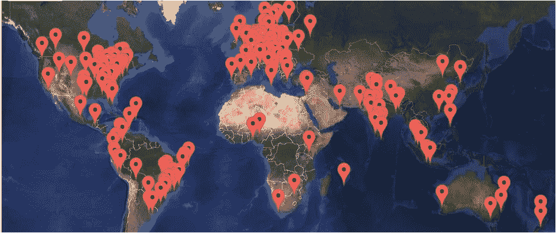

# Azure 要来镇上了！☁️

> 原文：<https://medium.com/hackernoon/azures-coming-to-town-%EF%B8%8F-217d1bae1d73>

## ICYMI 四月有一个你不想错过的活动！

有时候，你会惊讶于一个社区所能取得的成就！

其中一个时刻是当你看到 Magnus、Alan、Maarten、Mike、Mike、Martin、Wesley 和全球数百人在 4 月 21 日第六次成功时！

## 全球 Azure 训练营 2018

我说的是全球 Azure Bootcamp，一个关于微软 Azure 和云计算的社区驱动活动！

所以如果你去 global.azurebootcamp.net，你很可能会在附近找到一家。
写这篇文章时，全球有 213 个地方计划在一天内一起参加全球全天活动！

我正在[哥德堡](https://www.meetup.com/DOUGH-DevOps-Usergroup-Gothenburg/events/243736955/)组织当地的活动，我真的很高兴今年有这么多来自当地社区的兴趣！事实上，我们不得不出去买更多的椅子:)
这是我组织的第二次活动，我不知道这是否是因为人们在周六花自己的时间来学习——但气氛与其他技术活动非常不同。

## 附近没有全球活动？

所以你在[global.azurebootcamp.net](https://global.azurebootcamp.net/)附近找不到当地的活动？为什么不自己安排一个呢！仔细阅读关于如何创建自己的活动的常见问题解答。事件需要确认的日期是 4 月 10 日，所以还有时间！

无论是参加还是组织——希望你能在 4 月 21 日加入我们！❤️