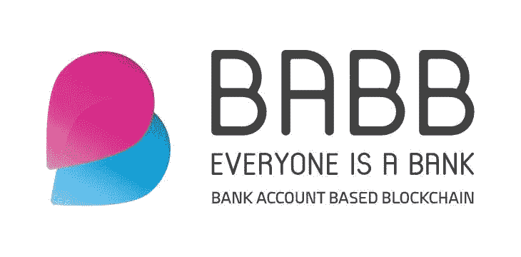
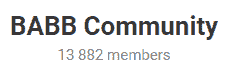

# BABB:基于区块链的银行账户，我们是自己的银行

> 原文：<https://medium.com/hackernoon/babb-bank-account-based-blockchain-we-are-our-own-banks-180aaf7453fb>

# 什么是 BABB？

BABB 公司自称是微观经济的世界银行，代表基于银行账户的区块链。这是 ERC 20 令牌以太网上的一个分散式银行系统。他们的愿景是通过改善社区的财政支持来增加全球范围内的业务，改善生活条件，并对国家和全球经济产生整体影响。他们计划通过使用生物识别技术和区块链向全世界提供受英国监管的点对点金融服务来实现这些目标。

# 关于巴布的有用的 DYOR 信息:

**研究日期:**2018 年 5 月 21 日

【https://coinmarketcap.com/currencies/babb/】CoinMarketCap 网址:

**网页:**[https://getbabb.com](https://getbabb.com)

**硬币名称:** BABB (BAX)

**总供应量:**500 亿

**循环供应量:**2095001 万

市值:50，156，628 美元

**预 Ico 价格:** 0.00090000

Ico 价格:1 BAX = 0.002394 美元

**通过 ICO 筹集的代币/资金:**ICO 上市前 10，000，000 美元/大规模销售期间 19，300，000 美元

时区: UTC-01:00

**白皮书:**[https://resources . get babb . com/whites/en/babb-White Paper . pdf](https://resources.getbabb.com/whitepapers/en/babb-whitepaper.pdf)

**令牌类型:** ERC20

# **潜在客户:**

BABB 瞄准了目前约 20 亿人的“无银行”世界市场，代表着一个价值 3800 亿美元的未开发行业。这些国家主要由低人均收入、不稳定的教育、不稳定的卫生部门和持续的政治冲突组成。在一个联系日益紧密的世界中，30%的世界人口仍然与全球经济脱节。

# **细分:**

该系统由三个主要部分组成:移动银行应用程序、社交 KYC 和黑卡。首先，用户只需下载智能手机应用，通过 KYC 验证身份，BABB 就会将他们与传统银行服务连接起来，有效地融入经济世界体系。一旦建立了帐户，用户就可以访问点对点金融服务，如个人支付、贷款、贸易、发行数字货币、为企业筹集资金以及其他功能。用户还将收到黑卡，作为与他们的数字资产的物理连接。让我们更详细地了解一下每一项。

# **移动应用:**

一切都将通过 BABB 移动应用程序来完成。这将允许终端用户从世界任何地方完全控制他们的钱，只要他们有互联网连接，包括 SEPA 和 IBAN。

# **社交 KYC:**

这个项目相信信任，并利用“社会 KYC”战略。任何通过验证文档完全符合 KYC 标准的用户都可以邀请其他用户加入该平台。这种方法只需要有效的身份证件，如护照，不需要英国地址或信用记录。收集密码短语和生物特征数据以确保身份。这种流畅的互动将允许大规模无缝采用 BABB。

# **黑卡:**

使用这种支付卡，您可以通过 QR 码或 NFC(近场通信)与您的 BABB 银行账户直接联系。它可以作为朋友和家人的借记卡或预付卡。由于是 QR(快速响应)码，它没有芯片，因此不需要 Visa 或 Mastercard。除了您的代码之外，没有其他个人数据可以降低安全风险。这张卡只是你银行存取的硬件版本。

# **央行整合:**

值得一提的一个细节是，BAPP 不仅为个人服务，也为中央银行服务。几个商业银行已经暗示了他们开始采用区块链的意图，并且似乎确信将使用中央银行数字货币(CBDC)。这种集成潜力将作为进一步的令牌效用。BAPP 为银行提供了基础设施，让它们可以搭载自己的系统，并允许推出 CBDC。BAPP 将合并银行和个人，这是一个巨大的市场。

# **技术规格:**

BABB 的技术方面是设计在一个联合的区块链上，也就是中央化。他们将拥有由公司管理的节点，这些节点运行在智能合同上。菲亚特存放在 BABB 银行储备中，用 BAX 表示。由于私钥总是单独保存在用户设备上，因此隐私被保持为最高优先级。此外，它们利用数据加密和密码哈希以及生物识别，如面部和声音识别。

# **用例与服务:**

BABB 提供许多灵活的服务。另一个好处是赚外快。这是由作为银行的用户利用 BAX 来完成的。这包括:

1.  点对点现金允许通过与其他用户或代理合作进行提款和存款。在该应用程序上，不同货币的兑换非常简单。
2.  使用智能合同可以获得具有明确定义的条款和利率的点对点借贷，从而简化服务。
3.  三种点对点筹款方式:**私人**，仅限邀请；**个人**赠送给亲朋好友；而 **Public** 则是面向全球的募捐，允许直接的积极影响，如救灾和社区基础设施项目以及个人项目。
4.  BABB 使用 BAX 代币的优点是不需要货币兑换。
5.  零中间商。
6.  最后，一个巨大的好处是创建了一个工资服务，使公司能够轻松地自动化员工的工资流程。

除了所有这些功能之外，还有来自 FCA 的完全授权支付机构(API)认证。他们目前还在申请银行牌照，这将有巨大的最终结果的潜力。

虽然 BABB 只是在它的婴儿期，代币使用的能力是广泛的，因此肯定是一种需求很高的货币。最后，还将有 50%的用于支付平台使用费的代币被烧掉。这将一直持续到流通中的代币总量达到当前总量的 20%。剩余代币将在平台储备中冻结，因此对市场价格的影响可以忽略不计。

# **社交媒体信息:**

***脸书***

网址:https://www . Facebook . com/get babb/

喜欢人数:8492 人喜欢 8，855 名追随者

过去 7 天有多少帖子/更新:9 条最新更新

***推特***

网址:https://twitter.com/getbabb

追随者:8 900 名追随者

过去 7 天有多少条推文/转发:2 条最近的推文/转发

***电报***

网址:[https://t.me/babb_official](https://t.me/babb_official)

用户:13 882 名成员

***电报管理员***

用户名:@CryptoTeddy

用户名:@阿尼 _BABB

用户名:@CryptoTeddy

用户名:@Mig_AmaZix

**Reddit**

网址:https://www . Reddit . com/r/get babb/

读者:1181 名读者

**Youtube**

网址:https://www . YouTube . com/channel/ucqtkzd 7 sfzbaugz 7 vdf HV 4 q/featured

订户:1564 名订户

***中等***

网址:https://medium.com/@BABB

关注者:2K 关注者

过去 7 天内有多少次更新:1 次最近更新

***领英***

网址:【https://www.linkedin.com/company/babb 

追随者:859 名追随者

过去 7 天有多少更新:-

***多余的***

如果你发现更多的社交媒体平台或聊天或其他链接，请放在这里。

**员工/团队信息:**

姓名:拉什德·阿威罗伊

头衔:创始人/首席执行官

简历:拉什德是 BABB 的创始人兼首席执行官，他领导着一个由行业资深人士组成的多元化团队，将他的愿景变为现实。他是金融普惠专家，拥有格林威治大学小额信贷和金融普惠硕士学位。在此之前，他就读于洛桑理工学院，并于 2006 年被授予 IT 科学学位。Rushd 在英国管理了一家非常成功的授权支付机构(API)——Wowpaymobi。

LinkedIn:https://www . LinkedIn . com/in/rushd-averro % C3 % ABs/

姓名:豪尔赫·佩雷拉

职位:首席技术官

简历:Jorge 是技术专家和连续企业家，在为本地和全球市场开发各种领域的技术项目方面拥有丰富的经验。他在 2008 年创建了世界级的 web 应用开发公司 Seegno，并一直担任顾问。

2014 年初，Jorge 加入了 adopt，作为 CTO，他负责整个技术堆栈的设计和架构，以及其产品的 UI 和 UX。自那以后，Jorge 一直专注于金融科技，开发与加密货币、分布式分类账、监管合规、KYC/反洗钱、欺诈预防、风险缓释、交易、对冲、银行集成以及其他与金融科技平台和应用相关的领域相关的产品和技术。

2017 年底，Jorge 创立了 FintechServer，帮助金融科技公司更快更安全地将产品推向市场，并联合创立了金融科技初创公司 Wayfex 和 LoyalChain。

LinkedIn:https://www . LinkedIn . com/in/jorger Pereira/

额外链接:-

姓名:亚当·海姆斯

标题:首席运营官

简历:亚当负责 BABB 的日常运营。他拥有剑桥大学(佳奇商学院)的金融硕士学位，加入 BABB 之前，他曾在美银美林(Bank of America Merrill Lynch)和 10 亿美元的全球宏观对冲基金(QCM)从事出色的交易。他热衷于金融包容性和提高微观经济中的市场效率。

LinkedIn:https://www . LinkedIn . com/in/Adam-haeems-8a 457813/

姓名:保罗·约翰逊

头衔:首席信息官

简历:保罗是一位技术福音传播者，曾在奥尔德摩尔银行、劳埃德银行和 GMAC 金融服务公司担任首席信息官和首席运营官职位。除了在银行和支付领域的管理经验之外，Paul 还是一家外国银行董事会的独立非执行董事，并且曾在皇家海军服役。他也喜欢运动和与妻子和六个孩子一起旅行。

LinkedIn:https://www . LinkedIn . com/in/Paul-Johnson-719 a0b 6

姓名:迪安·瑞法特

职位:研究主管

生物:迪恩的目标是在英国推出 BABB，然后渗透到中东和北非地区的市场。他在埃及中央银行担任银行检查员时积累了银行监管和经济风险缓解方面的经验。后来，他成为了一名独立研究员，并获得了伦敦政治经济学院的“哲学和公共政策”硕士学位。

LinkedIn:https://www . LinkedIn . com/in/nour-El-dean-refa at-a 58944136/

姓名:阿尼·亚历山大

职位:营销主管

Bio : Ani 是专门从事品牌架构的营销专业人士，拥有银行、电信、媒体机构和慈善机构的经验。她喜欢通过讲故事、新媒体内容和社交媒体从零开始建立、推出和发展品牌。不工作的时候，她写小说，录播客。

LinkedIn:https://www . LinkedIn . com/in/ani Alexander/

姓名:安娜贝尔·梅勒

职位:通信主管

生物:安娜贝尔塑造了 BABB 的内容和通信，以确保该公司在所有渠道传递清晰，独特和鼓舞人心的信息。安娜贝尔已经帮助各种成功的面向消费者的金融科技初创公司，包括 Chip 和肉豆蔻，迅速发展并创建了一个参与式社区。

LinkedIn:https://www . LinkedIn . com/in/Annie-mellor-26104 ab1/

姓名:伦纳德·西利格

职务:东北董事

Bio : Leonard 正在支持 BABB 在面向市场和运营流程方面实施最佳实践。他有 20 年的银行工作经验，包括在技术领域，以及帮助领导私营和上市公司。伦纳德最近辞去了 APC 技术集团(APC Technology Group PLC)董事长和在伦敦另类投资市场(AIM)上市的安全软件公司 Defenx PLC 董事会成员的职务。

姓名:路易斯·弗拉加

职位:首席产品经理

Bio : Fraga 是 Seegno 的金融科技产品主管，负责 BABB 的产品管理。在他 16 年的职业生涯中，Luís 担任过项目经理、产品负责人和创意总监，在电信、零售、银行、金融科技、娱乐、音乐流媒体、游戏、安全和时尚等多个领域定义了端到端体验。他合作过的一些大客户包括微软、芝麻工作室、Bungie、沃达丰，他还参与了欧洲的研究项目。

Fraga 曾在 MobiComp、微软、iMobileMagic、Smith Micro 工作，并在飞利浦研究院实习。

LinkedIn:https://www . LinkedIn . com/in/Lu % C3 % ADs-fraga-543728 B3/

姓名:路易斯·奥利维拉

职位:创意总监

简历:路易斯是 Seegno 的创意总监，负责 BABB 的创意、网页和移动设计。他是一位屡获殊荣、痴迷、经验丰富的创意总监，也是艺术总监、设计师、经理和领导者。凭借 16 年的设计和技术经验，他有机会与微软、千禧 BCP、Active Bank 和宜家等公司合作。

路易斯是一个朋友、爱人、音乐家和运动员，无论做什么都倾注了他的精力和激情，从不害怕付出额外的努力来完成任务。

LinkedIn:https://www . LinkedIn . com/in/luisoliveira/

姓名:努诺·罗查

职位:工程主管

简历:努诺是 Seegno 的工程主管，领导着 FintechServer 和 BABB 的工程团队。他本质上是一个领导者，是一个在前端和后端技术方面都有多年经验的 fullstack 开发人员，在过去几年里，他与区块链技术公司的合作越来越多。

在过去的几年里，Nuno 参与了多个项目，如 VRI 直接、支持、Wayfex、忠诚链、金融技术服务器，以及用于 PSD2 银行基础设施的软件。

LinkedIn:https://www . LinkedIn . com/in/nunorafaelrocha

姓名:若昂·贡萨尔维斯

职位:高级软件工程师

简介:joo 是 Seegno 的高级工程师，也是 BABB 开发团队的一员。他的重点是构建软件，在区块链和遗留系统之间架起一座桥梁，尤其是 KYC 和数据处理。

在过去的几年里，joo 参与了多个项目，如 adoption、Wayfex、LoyalChain、FintechServer 以及 PSD2 银行基础设施软件。

LinkedIn:https://www . LinkedIn . com/in/Joao-feio-goncalves/

姓名:李经纬

头衔:研究员

简介:经纬是 BABB 的一名研究员，他热衷于理解区块链如何颠覆银行业的未来。在英格兰银行工作了一年后，经纬通过分析国际银行的监管审批组合，对中央银行框架建立了坚实的理解。没有工作的时候，经纬正在帝国理工学院攻读金融硕士学位

LinkedIn:https://www . LinkedIn . com/in/jingweili 93/

姓名:迈·阿卜杜勒·阿齐兹

职位:中东沟通经理

简历:麦是 BABB 的阿拉伯语内容作家。在搬到伦敦之前，她在开罗做记者，给 BBC 记者辅导阿拉伯语，并为他们关注中东的工作提供翻译。此外，她还通过兰卡斯特大学担任英国文化委员会的研究助理，提供翻译服务。

LinkedIn:https://www . LinkedIn . com/in/mai-Abdel Aziz-637283126/

姓名:大卫·迪瓦娅

标题:内容创建者

简历:David 是一名摄影师、导演和内容创作者，拥有超过五年的工作经验。他曾在欧洲最大的技术加速器 Level 39 实习，协助内容策略和股票素材创作。大卫也是英国最受欢迎的商业播客 Fintech Insider 的录制和编辑团队成员。

LinkedIn:https://www . LinkedIn . com/in/dvddevia/

**公司地址:**英国伦敦 E14 5AB 加拿大广场金丝雀码头一期 39 层