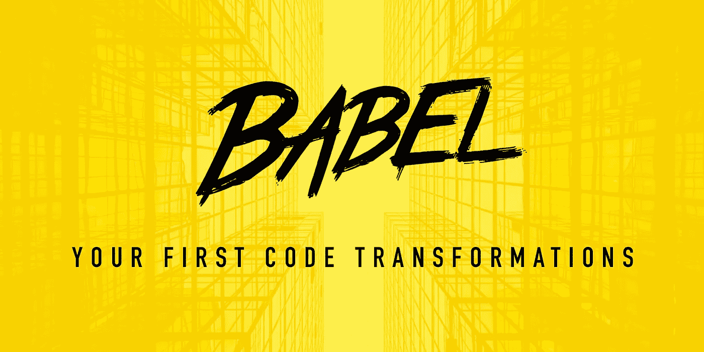
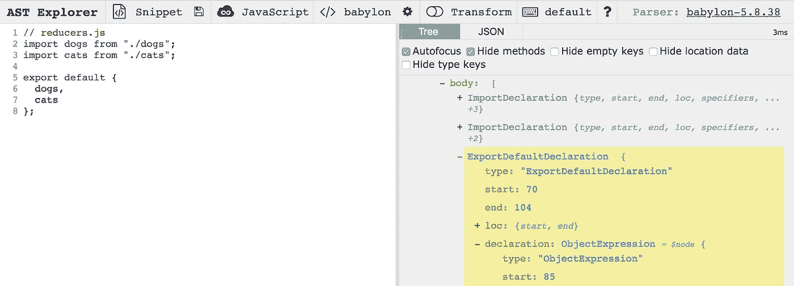

# 巴别塔:你的第一次代码转换

> 原文：<https://medium.com/hackernoon/babel-your-first-code-transformations-2d1a9a2f3bc4>



在本教程中，我们将使用 Babel 对一些源代码进行一些基本的转换。许多人觉得转换代码的想法很可怕，难以接近，但是利用 AST(抽象语法树)的力量和 Babel 提供给我们的一套工具，大部分繁重的工作已经为我们完成了。

**注意**:文章中的例子将包括特定于`react`、`redux`和`react-redux`的代码，但是熟悉这些库对于本教程来说并不是必需的。

# AST 浏览器

有一个名为 [AST explorer](https://astexplorer.net/) 的网站，我们可以将代码粘贴到其中，并获得多种格式的 AST 表示。这个网站将有助于快速查看 AST 格式的代码，并且有助于确定我们需要定位哪些节点。

# **基本插入**

下面，我们有一个文件`reducers.js`，其中有几个导入和一个默认的导出。

对于我们的第一个转换，让我们为`reducers.js`添加一个新的导入和导出。我们再加`mice`。为此，我们需要:

1.  将代码解析为 AST 格式。
2.  遍历 AST，找到与我们要添加的节点相邻的节点。
3.  插入新节点。
4.  从我们的 AST 生成新代码。

以下是我们实现这一目标的方法:

我们来分析一下。首先，我们在代码上调用解析器，解析器将代码从字符串转换成 AST。

```
const ast = parser(file, {sourceType: 'module'});
```

> 注意，由于我们使用的是 ES6 模块，我们需要用`{sourceType: ‘module’}`让解析器知道。

接下来，我们使用`traverse`找到我们的相关节点。我们怎么知道我们需要`ExportDefaultDeclaration`和`ObjectExpression`？这就是 AST 探险家派上用场的地方。下面，我们将代码粘贴在左边的面板上，在右边，我们可以看到代码的 AST 表示。



我们有 2 个`ImportDeclaration`，所以`traverse`将帮助我们迭代它们，并将最后一个保存到一个名为`lastImport`的变量中。然后我们使用`insertAfter`在最后一个导入之后插入新的导入。

```
// this file is made up of snippets from transform.jslet lastImport;traverse(ast, {
  ImportDeclaration(path) {
  lastImport = path;
}const importCode = `import ${reducerName} from './${reducerName}'`;
lastImport.insertAfter(parser(importCode, {sourceType: 'module'}));
```

为了给默认导出的对象添加一个属性，我们将使用`traverse`来迭代`ObjectExpression`的。我们只期望有一个，所以我们将使用`properties = path.parent.declaration.properties`来保存它的属性。然后，我们可以将新的`mice`标识符推入`properties`数组。

```
// this file is made up of snippets from transform.jstraverse(ast, {
  ObjectExpression(path) {
    properties = path.parent.declaration.properties
  }
})const id = t.identifier(REDUCER_NAME)
properties.push(t.objectProperty(id, id, false, true))
```

> 你可能想知道`t.objectProperty(id, id, false, true)`是什么？好问题。由于`mice`本身没有足够的上下文，我们不能像上一个例子那样在一串代码上调用`parser`。Babel 会将其解析为`Identifier`而不是`Property`，导致重新生成代码时出现问题。为了解决这个问题，我们使用`@babel/types`包来帮助解析器理解我们添加到 AST 中的内容。

现在我们已经更新了我们的 AST，我们可以在它上面调用`generate`。这将把代码从 AST 转换回字符串格式。我们在字符串上运行得更好，最终得到如下代码:

# 在函数中包装变量

接下来，我们将学习如何使用`replaceWith`在高阶组件中包装标识符。

本质上，我们想从:

```
export default Sports;
```

收件人:

```
const mapStateToProps = ({ volleyball, soccer }) => ({
  volleyball,
  soccer
});export default connect(mapStateToProps)(Sports);
```

这包括两个步骤。

1.  获取默认导出的名称(标识符)。
2.  用其自身的包装版本和`mapStateToProps`函数替换它。

这是我们将要操作的文件:

这是转换它的代码:

首先要注意的是，由于我们这次解析 JSX，我们需要让解析器知道:

```
const ast = parser(file, {sourceType: 'module', plugins: ['jsx']});
```

这次我们使用`traverse`来迭代 AST 并找到`ExportDefaultDeclaration`。一旦我们找到它，我们就存储被导出的变量的名字。

```
const declarationName = exportDefaultPath.node.declaration.name;
```

由于我们知道导出变量的名称，现在我们可以用新代码替换整个默认导出:

```
exportDefaultPath.replaceWith(
  // new code...
)
```

转换完 AST 后，我们可以在上面运行`generate`和`prettier`，并将文件写入磁盘。我们最终会得到:

# 总结

学习如何操作 AST 将为您打开许多新的可能性。使用 AST，您可以编写:

*   林挺插件
*   巴别塔插件
*   代码模块

我希望这篇教程能帮助你探索 AST 的世界！