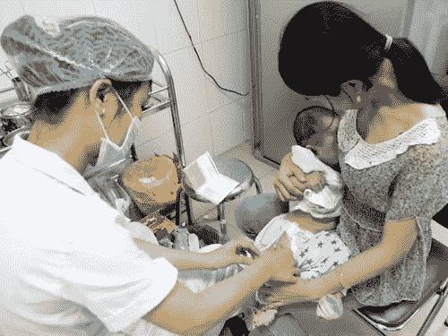
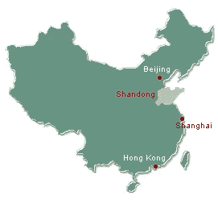
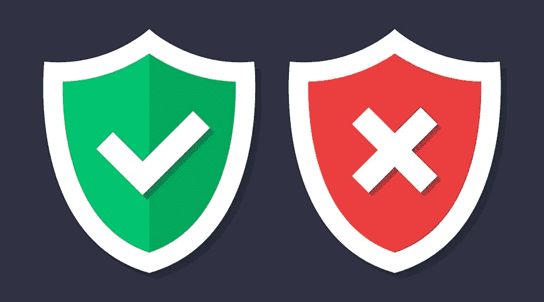

# 婴儿、供应链和区块链

> 原文：<https://medium.com/hackernoon/babies-supply-chains-blockchains-c36edea5c469>

An infant being administered a Vaccine

那是 7 月 20 日的一个星期五晚上&芷若世界轰然倒塌。她的朋友提醒她注意一篇在微博上如火如荼传播的文章。她的朋友打电话给她的手机，让她马上查看文章，以确保她立即阅读了这篇文章。她没有透露更多细节。

当她打开链接时，她的心沉了下去。她读每个单词时变得越来越麻木。“求你了！”她不停地喃喃自语。不是我的孩子！求你了。“不！”当她回忆起过去一周生活中的恐惧时。

# 2018 年 7 月 20 日，中国疫苗制造商长生生物科技因生产 252，000 支缺陷婴儿疫苗而被罚款。

她开始疯狂地搜索女儿的病历。当她检索自己的档案并交叉查询百白破疫苗序列号和微博上的批号时，她发现她的婴儿接种了有缺陷的百白破疫苗。她给丈夫打了电话，因为他在上海工作，坐火车需要 5 个小时，所以只能在周末陪他们。他赶回家中，向芷若&他的女儿发誓要对公司采取行动。

在中国山东省，愤怒是所有父母的压倒一切的情绪。

愤怒在中国社交媒体上蔓延，监管机构和政府试图控制中国最大的疫苗制造商之一生产和销售有缺陷的婴儿疫苗的信息的影响。中国总理和国家主席都公开表示，他们不会容忍这种事情发生，违反安全标准的人将受到惩罚。

社交媒体上的一些帖子似乎被删除了。

根据香港大学新闻与媒体研究中心(news and Media Studies Centre at the University of Hong Kong)的一个项目，在周日和周一，中文“疫苗”一词是最受限制的词之一。

负责这个名为“微博观察”的项目的助理教授傅景华也表示，与丑闻相关的帖子被屏蔽的频率在周日达到峰值。他说，在被监控的 12 万个账户中，平均每发布 1 万条帖子，就有 63 条被屏蔽。

## 然而，截至 7 月 23 日，标签#长生疫苗案#已经被浏览了超过 4.7 亿次。

长生生物科技由中国亿万富翁高所有。上周，在深市上市的长盛股份下跌了 10%，达到了允许下跌的最大幅度*。周一，该公司股票暂停交易。自上周该案件公开后，该公司股价已下跌 40%。*

**

*山东是一个沿海省份&正好位于北京和上海之间。从 20 世纪 70 年代开始席卷中国的现代化，对包括山东在内的沿海省份的现代化起到了很好的作用。生活水平迅速提高。奢侈品、现代电器和小工具出现了。西方的生活方式适应了中国文化，创造了一种新的生活方式。但是不合标准的做法很普遍。这适用于制造业和服务业。*

*中国的疫苗接种系统是一场噩梦。它受到了腐败、人员短缺、监管/执行不力的影响。据长生生物科技所在的吉林省美国食品药品监督管理局称，该公司向山东省疾病预防控制中心出售了约 25.26 万支不合格的百白破疫苗。山东省疾病预防控制中心是一个拥有约 1 亿人口的省份的公共卫生部门。这些药物是给年仅三个月大的儿童服用的。*

*令许多家长和社会震惊的是，这并不是此类事件的第一例。*

*2016 年 3 月，[在同一省份发生的类似事件](http://www.chinadaily.com.cn/china/2016-03/23/content_24029310.htm)导致 37 人被捕。*

*2017 年 11 月，长生生物科技&另一家公司的 2 批百白破疫苗不符合国家标准。官方监督机构报告说，尽管疫苗在免疫接种时无效，但使用它们不会对人类健康造成危险。*

*2018 年 7 月 15 日，官方监管机构的突击检查导致发现了与缺陷疫苗相关的伪造数据。制造商的执照立即被吊销。该公司第二天召回了有缺陷的疫苗。几天后罚款被宣布&这件事在社交媒体上不胫而走。*

# *制造业和消费者信托*

**

*TO TRUST or NOT ?*

*作为消费者，信任建立在标准、法规、执行、质量控制、[供应链](https://hackernoon.com/tagged/supply-chain)、品牌声誉&反馈系统的相互交织的框架内*

*在任何行业或服务的早期，监管机构在建立从制造到消费的可靠性方面发挥着指导作用。作为一个关键的支持功能，供应链作为流程的一部分被自动调节。质量检查建立在供应链的几个点上，以测试与标准的差异。不合格的样品被剔除。根据产品的严重性，这可能意味着整个批次被召回。例如，乘用车刹车或安全气囊导致大规模召回。*

*在建立消费者信任的最初几天，这种情况并不少见。但随着反馈循环、监管和更严格的质量控制，召回频率会随着时间的推移而降低，消费者的信任度会随着时间的推移而提高。*

*在这种情况下，尽管存在一些检查和平衡，质量控制被绕过&记录是伪造的。公众信任被滥用了。*

*如果有一种机制可以做到以下几点会怎么样？*

1.  *确保记录防篡改*
2.  *确保记录随时开放供公众查阅*
3.  *按需显示审计结果*
4.  *从疫苗的生产、储存、测试、包装、运输到注射，跟踪和记录疫苗？*
5.  *跟踪并记录储存条件的任何变化(理想温度，远离强烈阳光等)*
6.  *记录并向任何有互联网连接的人显示所有测试结果以及测试机构的证书*

*当我们实施利用物联网数据的[区块链](https://hackernoon.com/tagged/blockchain)解决方案时，这是可能的。中国的这场灾难本可以避免。如果有区块链解决方案来记录&跟踪供应链，伪造记录是不可能的*

*区块链是目前供应链可用的更好的技术解决方案之一*

# *区块链融入供应链的案例*

*尽管区块链最初是为了金融交易，但各种各样的企业都在利用区块链账本进行创新，因为它可以用来记录信息，跟踪和验证几乎任何有价值的交易。*

*根据产品的不同，供应链可能跨越数十甚至数百个阶段、多个地理位置、大量发票和付款、涉及多个个人和公司，并且从头到尾持续数月/数年时间。*

*由于每笔交易都是在一个数据块上捕获和记录的，并且跨越分布在许多节点上的多个分类账副本，因此它是高度透明的，任何有互联网接入的人都可以轻松访问。*

*它也是高度安全的，因为每个块都链接到它之前和之后的块。由于每个节点都有从第一个块到最近一个块的整个区块链的副本，**在数据被写入块后，发生任何篡改的可能性极小。***

*区块链没有一个中央权威，尽管某些许可类型的区块链有一些传统轮辐式设计的元素。*

*供应链，即使是复杂的供应链，也像鸭子喜欢水一样喜欢区块链。*

*沃尔玛利用区块链来跟踪其从中国采购的猪肉。区块链记录了每块肉的来源、加工、储存、温度和保质期*

*[block verify . io](http://www.blockverify.io)&[ever ledger . io](https://diamonds.everledger.io)有钻石供应链的区块链解决方案。然而，[德比尔斯](https://www.debeersgroup.com/en/news/company-news/company-news/de-beers-group-progresses-development-of-first-blockchain-initia.html)在实施区块链解决方案以确保血腥钻石不在其价值链中交易方面引人注目。*

*都乐、雀巢、联合利华、Driscoll's、金州食品、Kroger、Wegmans 都在利用区块链作为其易腐产品供应链。*

> *区块链被吹捧为伪造者最可怕的噩梦*

*公共健康和安全是永远不能也不应该妥协的两个概念。区块链允许可追踪性、托管证明和透明度作为其核心属性。*

***供应链中的影响区域***

*   ***记录**资产的数量和转移，如单位、箱子、集装箱等。—当它们在供应链中移动时*
*   ***跟踪**采购订单、变更单、收据、提单、装箱单、发票、装运通知、库存数据或其他与贸易相关的文件。追踪也可以在国际边境海关进行*
*   ***分配**或验证实物产品的认证或某些属性；例如确定一种咖啡是有机的还是公平交易的*
*   ***将**实物链接到序列号、条形码、RFID 等数字标签、底盘号、车辆识别号(VIN)等。*
*   ***与供应商和销售商共享**关于产品制造过程、装配、交付和维护的信息*

*回到这篇文章的核心故事，如果有一个基于区块链的解决方案，长生生物科技会发现伪造其记录是不可能的。当然，过去无法挽回，但未来的道路仍牢牢掌握在我们手中。我们有责任关心我们的下一代&区块链可以帮助我们实现这一目标。*

*如果你想知道区块链的最佳用例是什么，没有比在供应链中使用区块链来改善公共健康和安全更好的了*